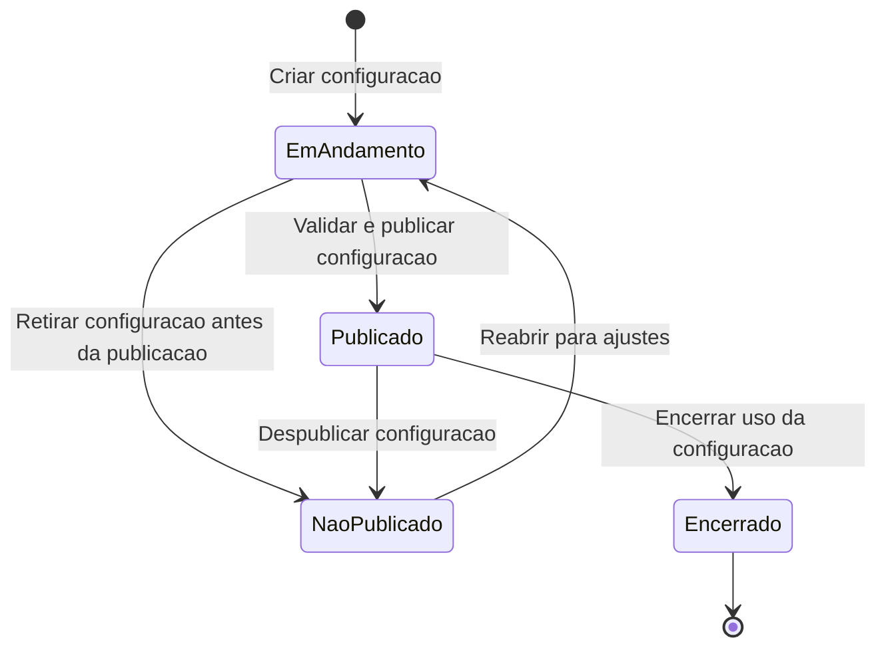
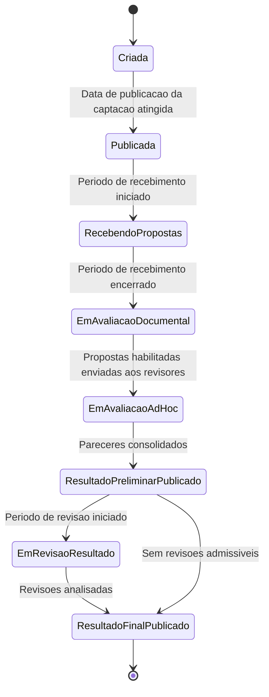

# Modelo Comportamental

Dominio e regras de negocio: ver [README.md](README.md)

## Ciclo de Vida da Configuracao de Captacao

## Ciclo de Vida da Instancia de Captacao

## Observacoes

- A instancia de captacao termina no M011 quando o resultado final e publicado.
- Propostas aprovadas no resultado final ficam disponiveis para o M022 - Contratacao e Outorga.
- A iniciativa somente passa ao M003 apos contratacao/outorga formalizada no M022.
