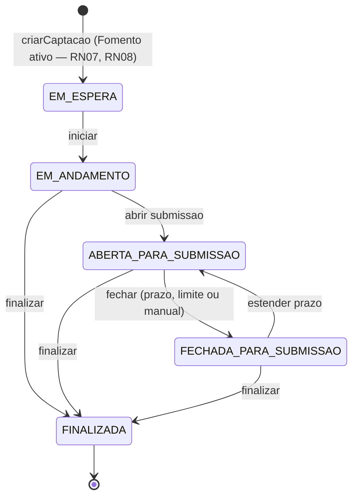

# Modelo Comportamental — Configuracao de Captacao

Contexto: [README.md](README.md) | Estrutural: [modelo-estrutural.md](modelo-estrutural/modelo-estrutural.md)

---

O M011 tem dois ciclos de vida: o **Fomento** (instrumento base) e a **Captacao** (processo seletivo originado de um Fomento ativo). Estados e regras consolidados de [Estados do Fomento / Estados da Captacao](README.md#estados-do-fomento) e das Regras de Negocio.

## Ciclo de Vida: Fomento

```mermaid
stateDiagram-v2
    [*] --> EM_ELABORACAO : criar

    EM_ELABORACAO --> EM_ELABORACAO : alterar / adicionar aporte
    EM_ELABORACAO --> PUBLICADO : publicar (RN02, RN03; RN04 se DEMANDA_INDUZIDA)

    PUBLICADO --> EM_ANDAMENTO : ativar para captacoes
    EM_ANDAMENTO --> EM_ANDAMENTO : alterar / aporte aditivo (com auditoria, RN05)

    PUBLICADO --> INTERROMPIDO : suspenderFomento (RN06)
    EM_ANDAMENTO --> INTERROMPIDO : suspenderFomento (RN06)
    INTERROMPIDO --> EM_ANDAMENTO : prosseguirFomento (RN06)

    EM_ELABORACAO --> CANCELADO : cancelar
    PUBLICADO --> CANCELADO : cancelar
    EM_ANDAMENTO --> CANCELADO : cancelar
    INTERROMPIDO --> CANCELADO : cancelar

    EM_ANDAMENTO --> CONCLUIDO : concluir() ou dataFim ultrapassada

    CANCELADO --> [*]
    CONCLUIDO --> [*]
```

| Estado | Descricao |
|--------|-----------|
| **EM_ELABORACAO** | Fomento em configuracao. Permite salvar, alterar e adicionar aportes. |
| **PUBLICADO** | Fomento publicado e apto ao ciclo operacional. |
| **EM_ANDAMENTO** | Subestado operacional do Fomento publicado enquanto ativo para captacoes. Permite alteracoes e aportes aditivos com auditoria. |
| **INTERROMPIDO** | Suspenso temporariamente por `suspenderFomento()`. Retomavel por `prosseguirFomento()`. |
| **CANCELADO** | Terminal por cancelamento administrativo. |
| **CONCLUIDO** | Terminal por `concluir()` ou ultrapassagem de `dataFim`. |

> Somente Fomento `PUBLICADO` ou `EM_ANDAMENTO` pode originar novas Captacoes (RN07). Fomento pode ser alterado enquanto nao terminal, preservando auditoria quando houver captacoes vinculadas (RN05).

---

## Ciclo de Vida: Captacao

| Estado | Descricao |
|--------|-----------|
| **EM_ESPERA** | Criada por `criarCaptacao()` e aguardando inicio operacional. |
| **EM_ANDAMENTO** | Iniciada por `iniciar()`; aguardando abertura de submissao ou execucao de etapas internas. |
| **ABERTA_PARA_SUBMISSAO** | Aberta para cadastro/submissao de projetos. |
| **FECHADA_PARA_SUBMISSAO** | Submissao fechada por prazo, limite ou acionamento manual. Pode voltar para `ABERTA_PARA_SUBMISSAO` por extensao. |
| **FINALIZADA** | Terminal. Nao permite novas submissoes, extensoes ou etapas operacionais. |

> Toda Captacao referencia exatamente um Fomento ativo, com `dataInicio`/`dataFim` dentro da vigencia do Fomento (RN08), e possui ao menos uma EtapaCaptacao baseada em EtapaFomento (RN09).

---

## Fronteiras

- **Estrutura** (classes/atributos): [modelo-estrutural consolidado](modelo-estrutural/modelo-estrutural.md) e partes [P1](modelo-estrutural/modelo-estrutural-p1-fomento.md) / [P2](modelo-estrutural/modelo-estrutural-p2-configuracao-selecao.md) / [P3](modelo-estrutural/modelo-estrutural-p3-selecao-projetos.md).
- **Rotas de transicao de estado**: [contrato-api.md](contrato-api.md).
- **Processos**: [process/](process/process.md).
