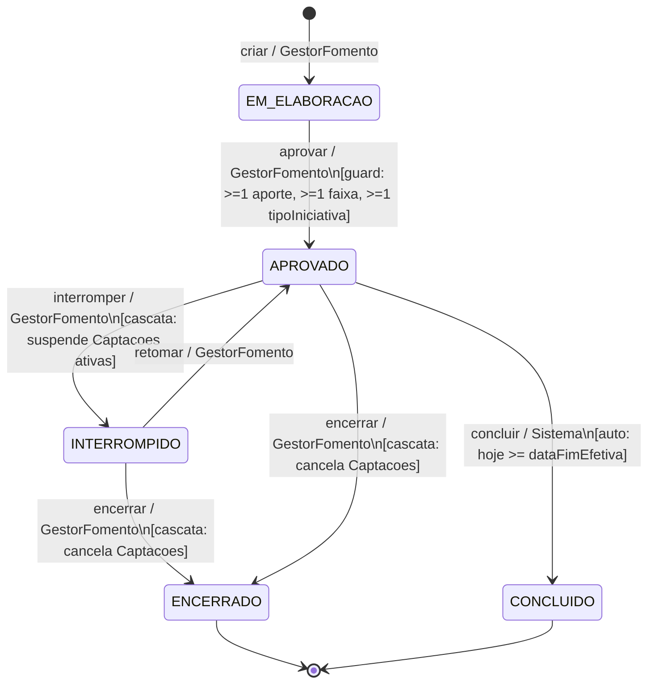
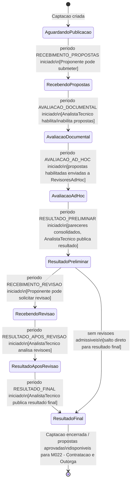

# Modelo Comportamental

Dominio e regras de negocio: ver [README.md](README.md)

## Ciclo de Vida do Fomento

Ator principal: GestorFomento. Transicao para CONCLUIDO e automatica pelo Sistema.

## Ciclo de Vida da Configuracao de Captacao

Atores: AnalistaTecnico (configurar/publicar/despublicar/reabrir/encerrar), GestorFAPES (pausar/retomar/cancelar), Sistema (expirar).

```mermaid
stateDiagram-v2
    [*] --> EM_ANDAMENTO : criar / AnalistaTecnico

    EM_ANDAMENTO --> PUBLICADO : publicar / AnalistaTecnico\n[guard: Fomento APROVADO, 8 periodos no cronograma,\nedital vinculado, formularios configurados]

    PUBLICADO --> NAO_PUBLICADO : despublicar / AnalistaTecnico\n[guard: sem propostas em periodo de\nrecebimento ativo]

    NAO_PUBLICADO --> EM_ANDAMENTO : reabrir / AnalistaTecnico

    PUBLICADO --> PAUSADO : pausar / GestorFAPES\n[guard: justificativa obrigatoria]

    PAUSADO --> PUBLICADO : retomar / GestorFAPES\n[guard: todos os periodos futuros com\ndataFim >= hoje; Sistema bloqueia se expirado]

    PUBLICADO --> ENCERRADO : encerrar / AnalistaTecnico\n[resultado final publicado manualmente]

    PUBLICADO --> ENCERRADO : expirar / Sistema\n[auto: RESULTADO_FINAL.dataFim atingido\nsem publicacao manual]

    PUBLICADO --> ENCERRADO : cancelar / GestorFAPES\n[cancelamento administrativo com justificativa]

    PAUSADO --> ENCERRADO : cancelar / GestorFAPES\n[cancelamento administrativo com justificativa]

    ENCERRADO --> [*]
```

**Observacoes da maquina de Captacao:**

- O estado PAUSADO bloqueia todas as operacoes de selecao (AX-M011-032).
- `retomar` e bloqueado pelo Sistema enquanto qualquer periodo futuro tiver `dataFim < hoje` (AX-M011-033).
- Ha tres modos de encerramento: `encerrar` (manual, apos resultado final), `expirar` (automatico) e `cancelar` (administrativo) — AX-M011-034.
- `publicar` exige exatamente 8 TipoPeriodo no cronograma (AX-M011-001).
- O Fomento referenciado deve estar no estado APROVADO (AX-M011-012).

## Sequencia Obrigatoria dos Periodos do Cronograma

O cronograma da Captacao deve conter exatamente 8 periodos na seguinte ordem (AX-M011-001):

```mermaid
stateDiagram-v2
    direction LR
    [*] --> PUBLICACAO_CAPTACAO
    PUBLICACAO_CAPTACAO --> RECEBIMENTO_PROPOSTAS
    RECEBIMENTO_PROPOSTAS --> AVALIACAO_DOCUMENTAL
    AVALIACAO_DOCUMENTAL --> AVALIACAO_AD_HOC
    AVALIACAO_AD_HOC --> RESULTADO_PRELIMINAR
    RESULTADO_PRELIMINAR --> RECEBIMENTO_REVISAO
    RECEBIMENTO_REVISAO --> RESULTADO_APOS_REVISAO
    RESULTADO_APOS_REVISAO --> RESULTADO_FINAL
    RESULTADO_FINAL --> [*]
```

Adiamento de um periodo desloca automaticamente todos os periodos subsequentes pelo mesmo numero de dias (AX-M011-007). O historico de adiamentos e registrado em `AdiamentoPeriodoCronograma`.

## Fluxo de Selecao dos Projetos (visao de instancia)

Este fluxo ocorre dentro de uma Captacao PUBLICADA e e conduzido pelo AnalistaTecnico. Nao representa estados da entidade Captacao — representa o avanco pelas etapas do cronograma.

## Observacoes Gerais

- Propostas aprovadas no resultado final ficam disponiveis para o M022 - Contratacao e Outorga.
- A iniciativa somente passa ao M003 apos contratacao/outorga formalizada no M022.
- Alteracoes de cronograma por adiamento nao criam novo estado da Captacao; elas registram historico em `AdiamentoPeriodoCronograma` e deslocam o periodo alterado e todos os posteriores pelo mesmo numero de dias (AX-M011-007).
- Quando o proponente for empresa ou instituicao, a proposta deve identificar uma pessoa fisica representante vinculada ao cadastro corporativo do M008. Documentos institucionais recorrentes devem ser reaproveitados do cadastro quando validos.
- `tipoCaptacao=DEMANDA_INDUZIDA` exige que `tipoOutorgado` corresponda ao tipo do `outorgadoDestinatario` (AX-M011-031).
