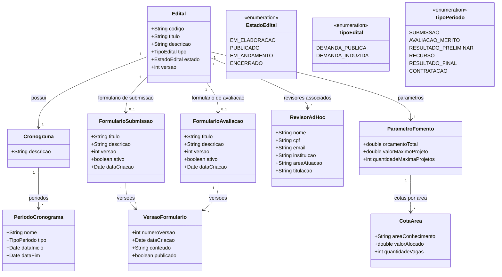

# Modelo Estrutural

Dominio e regras de negocio: ver [README.md](README.md)

### Diagrama de Classes

## Dicionario de Dados

| Classe | Atributo | Definicao | Obrig. | Tipo | Dominio | Tamanho | Unico |
|--------|----------|-----------|--------|------|---------|---------|-------|
| **Edital** | codigo | Codigo de identificacao do edital | Gerado | String | Ex: EDT-2026-001 | | Sim |
| | titulo | Titulo do edital | Sim | String | | 300 | |
| | descricao | Descricao detalhada do objeto do edital | Sim | String | | 5000 | |
| | tipo | Tipo do edital (demanda publica ou induzida) | Sim | TipoEdital | Ver enumeracao | | |
| | estado | Estado atual do edital no ciclo de vida | Gerado | EstadoEdital | Ver enumeracao | | |
| | versao | Numero da versao do edital (incrementado a cada retificacao) | Gerado | Int | Ex: 1, 2, 3 | | |
| **Cronograma** | descricao | Descricao geral do cronograma | Sim | String | | 500 | |
| **PeriodoCronograma** | nome | Nome descritivo do periodo | Sim | String | Ex: Periodo de Submissao | 200 | |
| | tipo | Tipo do periodo no fluxo do edital | Sim | TipoPeriodo | Ver enumeracao | | |
| | dataInicio | Data de inicio do periodo | Sim | Date | | | |
| | dataFim | Data de fim do periodo | Sim | Date | | | |
| **FormularioSubmissao** | titulo | Titulo do formulario | Sim | String | | 200 | |
| | descricao | Descricao do proposito do formulario | Sim | String | | 1000 | |
| | versao | Numero da versao ativa | Gerado | Int | | | |
| | ativo | Indica se o formulario esta ativo no edital | Sim | Boolean | true/false | | |
| | dataCriacao | Data de criacao do formulario | Gerado | Date | | | |
| **FormularioAvaliacao** | titulo | Titulo do formulario de avaliacao | Sim | String | | 200 | |
| | descricao | Descricao do proposito do formulario | Sim | String | | 1000 | |
| | versao | Numero da versao ativa | Gerado | Int | | | |
| | ativo | Indica se o formulario esta ativo no edital | Sim | Boolean | true/false | | |
| | dataCriacao | Data de criacao do formulario | Gerado | Date | | | |
| **VersaoFormulario** | numeroVersao | Numero sequencial da versao | Gerado | Int | Ex: 1, 2, 3 | | |
| | dataCriacao | Data de criacao da versao | Gerado | Date | | | |
| | conteudo | Definicao dos campos e estrutura do formulario | Sim | String | JSON com campos | | |
| | publicado | Indica se a versao foi publicada (nao editavel) | Sim | Boolean | true/false | | |
| **RevisorAdHoc** | nome | Nome completo do revisor | Sim | String | | 200 | |
| | cpf | CPF do revisor | Sim | String | Ex: 123.456.789-00 | 14 | Sim |
| | email | E-mail de contato do revisor | Sim | String | | 200 | |
| | instituicao | Instituicao de vinculo do revisor | Sim | String | | 200 | |
| | areaAtuacao | Area de conhecimento do revisor | Sim | String | | 200 | |
| | titulacao | Titulacao academica do revisor | Sim | String | Ex: Doutor, Mestre | 100 | |
| **ParametroFomento** | orcamentoTotal | Orcamento total do edital | Sim | Double | Ex: 5000000.00 | | |
| | valorMaximoProjeto | Valor maximo por projeto | Sim | Double | | | |
| | quantidadeMaximaProjetos | Numero maximo de projetos financiaveis | Sim | Int | | | |
| **CotaArea** | areaConhecimento | Nome da area de conhecimento | Sim | String | Ex: Ciencias Exatas | 200 | |
| | valorAlocado | Valor alocado para a area | Sim | Double | | | |
| | quantidadeVagas | Numero de vagas disponiveis para a area | Sim | Int | | | |

## Notas de Implementacao

**Tipagem:**
- Atributos simples usam tipos da linguagem (int, Date, String, Double, Boolean)
- Conjuntos de valores bem definidos usam enums (EstadoEdital, TipoEdital, TipoPeriodo)

**Navegabilidade:**
- Cardinalidade 1: atributo do tipo da classe destino (ex: Edital.cronograma: Cronograma)
- Cardinalidade N: atributo lista do tipo da classe destino (ex: Cronograma.periodos: List&lt;PeriodoCronograma&gt;)
