# Modelo Estrutural

Dominio e regras de negocio: ver [README.md](README.md)

### Diagrama de Classes

```mermaid
classDiagram
    direction TB

    class Captacao {
        +String codigo
        +String titulo
        +String linkEdital
        +TipoCaptacao tipoCaptacao
        +EstadoConfiguracaoCaptacao estadoConfiguracao
    }

    class Programa {
        <<fora do escopo - M010>>
    }

    class Parceria {
        <<fora do escopo - M010>>
    }

    class AreaTecnica {
        <<fora do escopo - M008>>
        +String nome
    }

    class InstituicaoDestinataria {
        <<fora do escopo - M008>>
        +String nome
    }

    class TipoIniciativa {
        <<fora do escopo - M003>>
        +String nome
    }

    class PessoaFisica {
        <<fora do escopo - M008>>
        +String cpf
        +String nome
        +String email
    }

    class CronogramaCaptacao {
        +String descricao
    }

    class PeriodoCronograma {
        +String nome
        +TipoPeriodo tipo
        +Date dataInicio
        +Date dataFim
    }

    class TipoPeriodo {
        <<enumeration>>
        PUBLICACAO_CAPTACAO
        RECEBIMENTO_PROPOSTAS
        AVALIACAO_DOCUMENTAL
        AVALIACAO_AD_HOC
        RESULTADO_PRELIMINAR
        RECEBIMENTO_REVISAO
        RESULTADO_APOS_REVISAO
        RESULTADO_FINAL
    }

    class TipoCaptacao {
        <<enumeration>>
        CHAMADA_PUBLICA
        DEMANDA_INDUZIDA
    }

    class EstadoConfiguracaoCaptacao {
        <<enumeration>>
        EM_ANDAMENTO
        PUBLICADO
        NAO_PUBLICADO
        ENCERRADO
    }

    class FormularioSubmissaoRef {
        <<fora do escopo - M021>>
    }

    class FormularioAvaliacaoRef {
        <<fora do escopo - M021>>
    }

    class FormularioRevisaoRef {
        <<fora do escopo - M021>>
    }

    class RevisorAdHoc {
        +Date dataInclusao
        +String areaAtuacao
        +String titulacao
    }

    class RubricaFinanceira {
        <<fora do escopo - M008>>
        +String codigo
        +String descricao
    }

    class RubricaPermitida {
        +boolean permiteSubrubricas
        +boolean obrigatoria
        +String observacao
    }

    class VersaoNivel {
        <<fora do escopo - M001>>
        +double valor
    }

    class BolsaPermitida {
        +int quantidadeCotas
        +int maximoBolsistas
        +boolean obrigatoria
        +String observacao
    }

    class ParametroFomento {
        +double orcamentoTotal
        +double valorMaximoProjeto
        +int quantidadeMaximaProjetos
        +double valorParceria
    }

    class CotaArea {
        +String areaConhecimento
        +double valorAlocado
        +int quantidadeVagas
    }

    Captacao "1" --> "1" CronogramaCaptacao : configurado por
    Captacao "1" --> "0..1" Programa : vinculado a programa
    Captacao "1" --> "0..1" Parceria : vinculada a parceria
    Captacao "1" --> "1" AreaTecnica : area responsavel
    Captacao "1" --> "0..1" InstituicaoDestinataria : demanda induzida
    Captacao "1" --> "1..*" TipoIniciativa : tipos aceitos
    Captacao "1" --> "1" FormularioSubmissaoRef : formulario de submissao
    Captacao "1" --> "1" FormularioAvaliacaoRef : formulario de avaliacao
    Captacao "1" --> "1" FormularioRevisaoRef : formulario de revisao
    Captacao "1" --> "1" ParametroFomento : parametros
    Captacao "1" --> "1..*" RevisorAdHoc : pool de revisores
    Captacao "1" --> "*" RubricaPermitida : rubricas permitidas
    Captacao "1" --> "*" BolsaPermitida : versoes de bolsas permitidas
    RevisorAdHoc "*" --> "1" PessoaFisica : pessoa
    RubricaPermitida "*" --> "1" RubricaFinanceira : rubrica
    RubricaPermitida "0..1" --> "*" RubricaPermitida : subrubricas permitidas
    BolsaPermitida "*" --> "1" VersaoNivel : versao de nivel
    CronogramaCaptacao "1" --> "8" PeriodoCronograma : fases obrigatorias
    ParametroFomento "1" --> "*" CotaArea : cotas por area
```

## Dicionario de Dados

| Classe | Atributo | Definicao | Obrig. | Tipo | Dominio | Tamanho | Unico |
|--------|----------|-----------|--------|------|---------|---------|-------|
| **Captacao** | codigo | Codigo da captacao | Gerado | String | | | Sim |
| | titulo | Titulo da captacao | Sim | String | | 200 | |
| | linkEdital | Link ou referencia ao documento do edital | Sim | String | | | |
| | tipoCaptacao | Tipo da captacao | Sim | TipoCaptacao | CHAMADA_PUBLICA, DEMANDA_INDUZIDA | | |
| | estadoConfiguracao | Status da configuracao da captacao | Sim | EstadoConfiguracaoCaptacao | EM_ANDAMENTO, PUBLICADO, NAO_PUBLICADO, ENCERRADO | | |
| **AreaTecnica** | nome | Area tecnica responsavel pela gestao das iniciativas captadas | Sim | String | | 200 | |
| **InstituicaoDestinataria** | nome | Instituicao para a qual uma demanda induzida e direcionada | Cond. | String | Obrigatoria para DEMANDA_INDUZIDA | 200 | |
| **TipoIniciativa** | nome | Tipo de iniciativa aceito pela captacao | Sim | String | | 200 | |
| **PessoaFisica** | cpf | CPF da pessoa no cadastro corporativo | Sim | String | Gerenciado pelo M008 | 11 | Sim |
| | nome | Nome completo da pessoa | Sim | String | Gerenciado pelo M008 | 300 | |
| | email | Email de contato da pessoa | Sim | String | Gerenciado pelo M008 | 200 | |
| **CronogramaCaptacao** | descricao | Descricao geral do cronograma da captacao | Sim | String | | 500 | |
| **PeriodoCronograma** | nome | Nome descritivo da fase | Sim | String | Ex: Periodo de Recebimento de Propostas | 200 | |
| | tipo | Tipo da fase no fluxo da captacao | Sim | TipoPeriodo | Ver enumeracao | | |
| | dataInicio | Data de inicio do periodo | Sim | Date | | | |
| | dataFim | Data de fim do periodo | Sim | Date | | | |
| **FormularioSubmissaoRef** | formularioId | Identificador do formulario no M021 | Sim | String | | | |
| | versaoFormularioId | Identificador da versao publicada selecionada no M021 | Sim | String | | | |
| **FormularioAvaliacaoRef** | formularioId | Identificador do formulario no M021 | Sim | String | | | |
| | versaoFormularioId | Identificador da versao publicada selecionada no M021 | Sim | String | | | |
| **FormularioRevisaoRef** | formularioId | Identificador do formulario no M021 | Sim | String | | | |
| | versaoFormularioId | Identificador da versao publicada selecionada no M021 | Sim | String | | | |
| **RevisorAdHoc** | pessoa (relacao) | Pessoa fisica que assume o papel de revisor ad hoc na captacao | Sim | FK → PessoaFisica | Via M008 | | |
| | dataInclusao | Data em que a pessoa foi incluida no pool de revisores da captacao | Gerado | Date | | | |
| | areaAtuacao | Area de conhecimento considerada para distribuicao das propostas | Sim | String | | 200 | |
| | titulacao | Titulacao academica do revisor | Sim | String | Ex: Doutor, Mestre | 100 | |
| **RubricaFinanceira** | codigo | Codigo da rubrica no cadastro corporativo | Sim | String | M008 | 20 | Sim |
| | descricao | Descricao da rubrica | Sim | String | M008 | 300 | |
| **RubricaPermitida** | rubrica (relacao) | Rubrica financeira autorizada ou orientadora para propostas da captacao | Sim | FK → RubricaFinanceira | Via M008 | | |
| | permiteSubrubricas | Indica se a rubrica pode possuir subrubricas permitidas na captacao | Sim | Boolean | true/false | | |
| | obrigatoria | Indica se a proposta deve usar esta rubrica quando informar orcamento | Sim | Boolean | true/false | | |
| | observacao | Orientacao de uso da rubrica na captacao | Nao | String | | 500 | |
| | rubricaPai (relacao) | Rubrica permitida pai quando o registro representar uma subrubrica | Cond. | FK → RubricaPermitida | Nulo para rubrica raiz | | |
| **VersaoNivel** | valor | Valor monetario vigente para o nivel de bolsa selecionado | Sim | Double | M001 | | |
| **BolsaPermitida** | versaoNivel (relacao) | Versao do nivel de bolsa permitida na captacao | Sim | FK → VersaoNivel | Via M001 | | |
| | quantidadeCotas | Quantidade de cotas disponiveis para a versao de nivel na captacao | Sim | Int | >= 0 | | |
| | maximoBolsistas | Quantidade maxima de bolsistas que podem usar essa versao de nivel na captacao | Sim | Int | >= 0 | | |
| | obrigatoria | Indica se a proposta deve usar esta bolsa quando informar orcamento de bolsas | Sim | Boolean | true/false | | |
| | observacao | Orientacao de uso da versao de bolsa na captacao | Nao | String | | 500 | |
| **ParametroFomento** | orcamentoTotal | Orcamento total da captacao | Sim | Double | Ex: 5000000.00 | | |
| | valorMaximoProjeto | Valor maximo por projeto | Sim | Double | | | |
| | quantidadeMaximaProjetos | Numero maximo de projetos financiaveis | Sim | Int | | | |
| | valorParceria | Valor da parceria destinado a captacao, quando houver | Nao | Double | | | |
| **CotaArea** | areaConhecimento | Nome da area de conhecimento | Sim | String | Ex: Ciencias Exatas | 200 | |
| | valorAlocado | Valor alocado para a area | Sim | Double | | | |
| | quantidadeVagas | Numero de vagas disponiveis para a area | Sim | Int | | | |

## Notas de Implementacao

**Entidades externas:**
- Captacao: gerenciada por M011 ate a publicacao do resultado final. O M022 consome propostas aprovadas para contratacao/outorga.
- M003: recebe a iniciativa apos contratacao/outorga no M022.
- Programa e Parceria: gerenciados por M010 (Planejamento e Estrategia). Podem ser associados a captacao durante a configuracao.
- Formularios: gerenciados por M021 (Gestao de Formularios). O M011 referencia apenas `formularioId` e `versaoFormularioId` publicados para submissao, avaliacao ad hoc e revisao de resultado.
- PessoaFisica: gerenciada por M008 (Cadastros Corporativos). O M011 usa `RevisorAdHoc` como papel operacional assumido por uma `PessoaFisica` dentro do pool de uma captacao.
- RubricaFinanceira: gerenciada por M008 (Cadastros Corporativos). O M011 seleciona rubricas e subrubricas permitidas para orientar o orcamento das propostas; a execucao orcamentaria fica nos modulos posteriores do ciclo da iniciativa.
- VersaoNivel: gerenciada por M001 (Modalidade Bolsa). O M011 seleciona quais versoes de niveis de bolsa podem ser usadas na captacao e define limites operacionais, como cotas e maximo de bolsistas.

**Navegabilidade:**
- Cardinalidade 1: atributo do tipo da classe destino (ex: Captacao.cronograma: CronogramaCaptacao)
- Cardinalidade N: atributo lista do tipo da classe destino (ex: CronogramaCaptacao.periodos: List<PeriodoCronograma>)
