# Modelo Estrutural

Dominio e regras de negocio: ver [README.md](README.md)

### Diagrama de Classes

```mermaid
classDiagram
    direction TB

    class Fomento {
        +String codigo
        +String titulo
        +String descricao
        +EstadoFomento estado
        +Date dataInicio
        +Date dataFim
    }

    class EstadoFomento {
        <<enumeration>>
        EM_ELABORACAO
        APROVADO
        INTERROMPIDO
        ENCERRADO
        CONCLUIDO
    }

    class AporteFomento {
        +TipoOrigemAporte origemTipo
        +double valorAportado
        +Date dataAporte
        +bool isAditivo
        +String justificativa
    }

    class TipoOrigemAporte {
        <<enumeration>>
        PROGRAMA
        PARCERIA
        RECURSO_INTERNO
    }

    class Faixa {
        +String nome
        +String descricao
    }

    class RubricaPermitidaFaixa {
        +double percentualMinimo
        +double percentualMaximo
        +String restricoes
        +String observacao
    }

    class BolsaPermitidaFaixa {
        +int quantidadeMinimaCotas
        +int minimoBolsistas
        +String observacao
    }

    class ResultadoEsperadoFomento {
        +TipoResultado tipo
        +String descricao
        +String indicador
    }

    class TipoResultado {
        <<enumeration>>
        PRODUTO
        SERVICO
        PROCESSO
    }

    class RemanejamentoFaixas {
        +double valor
        +String justificativa
        +Date dataRegistro
        +double valorOrigemAnterior
        +double valorDestinoAnterior
    }

    class MatrizConfiguracaoProjeto {
        +ObrigatoriedadeBloco equipe
        +ObrigatoriedadeBloco resultados
        +ObrigatoriedadeBloco riscos
        +ObrigatoriedadeBloco cronogramaProj
        +ObrigatoriedadeBloco orcamento
        +ObrigatoriedadeBloco objetivos
        +ObrigatoriedadeBloco beneficios
    }

    class ObrigatoriedadeBloco {
        <<enumeration>>
        EXIGIDO
        DISPENSADO
    }

    class Captacao {
        +String codigo
        +String titulo
        +String descricao
        +TipoCaptacao tipoCaptacao
        +TipoOutorgado tipoOutorgado
        +EstadoConfiguracaoCaptacao estadoConfiguracao
    }

    class TipoOutorgado {
        <<enumeration>>
        PESSOA_FISICA
        PESSOA_JURIDICA
    }

    class Edital {
        <<fora do escopo - M011>>
        +String referencia
    }

    class Programa {
        <<fora do escopo - M010>>
    }

    class Parceria {
        <<fora do escopo - M010>>
    }

    class EixoEstrategico {
        <<fora do escopo - M010>>
    }

    class AreaTecnica {
        <<fora do escopo - M008>>
        +String nome
    }

    class OutorgadoDestinatario {
        <<fora do escopo - M008>>
        +String cpf
        +String nome
    }

    class TipoProjeto {
        <<fora do escopo - M003>>
        +String nome
    }

    class CategoriaProjeto {
        +String nome
        +String descricao
        +boolean selecionavelNoCadastro
    }

    class PessoaFisica {
        <<fora do escopo - M008>>
        +String cpf
        +String nome
        +String email
    }

    class CronogramaCaptacao {
        +String descricao
    }

    class PeriodoCronograma {
        +String nome
        +TipoPeriodo tipo
        +Date dataInicio
        +Date dataFim
    }

    class AdiamentoPeriodoCronograma {
        +int dias
        +String justificativa
        +Date dataRegistro
        +Date dataInicioOriginal
        +Date dataFimOriginal
        +Date dataInicioNova
        +Date dataFimNova
    }

    class TipoPeriodo {
        <<enumeration>>
        PUBLICACAO_CAPTACAO
        RECEBIMENTO_PROPOSTAS
        AVALIACAO_DOCUMENTAL
        AVALIACAO_AD_HOC
        RESULTADO_PRELIMINAR
        RECEBIMENTO_REVISAO
        RESULTADO_APOS_REVISAO
        RESULTADO_FINAL
    }

    class TipoCaptacao {
        <<enumeration>>
        CHAMADA_PUBLICA
        DEMANDA_INDUZIDA
    }

    class EstadoConfiguracaoCaptacao {
        <<enumeration>>
        EM_ANDAMENTO
        PUBLICADO
        NAO_PUBLICADO
        PAUSADO
        ENCERRADO
        CANCELADO
    }

    class FormularioSubmissaoRef {
        <<fora do escopo - M021>>
    }

    class FormularioAvaliacaoRef {
        <<fora do escopo - M021>>
    }

    class FormularioRevisaoRef {
        <<fora do escopo - M021>>
    }

    class FormularioAnexoRef {
        <<fora do escopo - M021>>
    }

    class RegraSubmissao {
        +boolean permiteMultiplasPropostas
        +boolean permiteParticiparEmOutraProposta
        +boolean permiteAcumularBolsa
        +boolean submissaoRestritaAEscolhidos
    }

    class ProponenteEscolhido {
        +TipoProponenteEscolhido tipo
    }

    class TipoProponenteEscolhido {
        <<enumeration>>
        INSTITUICAO
        PESSOA
    }

    class RequisitoProponente {
        +TipoDirecionamentoProposta direcionamento
        +boolean permiteParceriaInstituicoes
        +boolean exigeVinculoEmpregaticio
        +boolean exigeGestorInstitucional
    }

    class TipoDirecionamentoProposta {
        <<enumeration>>
        ABERTA
        INSTITUICAO
        TIPO_INSTITUICAO
    }

    class Instituicao {
        <<fora do escopo - M008>>
        +String nome
        +String cnpj
    }

    class TipoInstituicao {
        <<fora do escopo - M008>>
        +String nome
    }

    class NivelAcademico {
        <<fora do escopo - M008>>
        +String nome
    }

    class RegraAvaliacao {
        +boolean exigeAvaliacaoAdHoc
        +int quantidadeMinimaRevisores
    }

    class PrestacaoExigida {
        +boolean exigePrestacaoTecnica
        +boolean exigePrestacaoFinanceira
    }

    class DocumentoExigido {
        +String nome
        +String descricao
        +boolean obrigatorio
        +boolean reutilizarCadastroCorporativo
        +boolean exigirNovoEnvioSeVencido
    }

    class FormatoArquivo {
        +String extensao
    }

    class RevisorAdHoc {
        +Date dataInclusao
        +String areaAtuacao
        +String titulacao
    }

    class Rubrica {
        <<fora do escopo - M008>>
        +String codigo
        +String nome
        +String descricao
    }

    class VersaoNivel {
        <<fora do escopo - M001>>
        +double valor
    }

    class ContaContabil {
        <<fora do escopo - M016>>
    }

    %% Fomento aggregate
    Fomento "1" --> "1" EixoEstrategico : eixo estrategico
    Fomento "1" --> "1" AreaTecnica : area tecnica
    Fomento "1" --> "1..*" AporteFomento : aportes
    Fomento "1" --> "1..*" Faixa : faixas
    Fomento "1" --> "*" ResultadoEsperadoFomento : resultados esperados
    Fomento "1" --> "*" RemanejamentoFaixas : remanejamentos
    Fomento "*" --> "1" TipoProjeto : tipos de projeto
    AporteFomento "*" --> "0..1" Programa : origem programa
    AporteFomento "*" --> "0..1" Parceria : origem parceria
    AporteFomento "*" --> "0..1" ContaContabil : recurso interno
    Faixa "1" --> "*" RubricaPermitidaFaixa : rubricas permitidas
    Faixa "1" --> "*" BolsaPermitidaFaixa : bolsas permitidas
    RubricaPermitidaFaixa "*" --> "1" Rubrica : rubrica
    RubricaPermitidaFaixa "0..1" --> "*" RubricaPermitidaFaixa : subrubricas
    BolsaPermitidaFaixa "*" --> "1" VersaoNivel : versao de nivel
    RemanejamentoFaixas "*" --> "1" Faixa : faixaOrigem
    RemanejamentoFaixas "*" --> "1" Faixa : faixaDestino

    %% Captacao aggregate
    Captacao "1" --> "1" Fomento : fomento
    Captacao "1" --> "1..*" Faixa : faixas selecionadas
    Captacao "1" --> "1" AreaTecnica : area tecnica
    Captacao "1" --> "0..1" OutorgadoDestinatario : demanda induzida
    Captacao "1" --> "1..*" TipoProjeto : tipos de projeto
    Captacao "1" --> "1..*" CategoriaProjeto : categorias aceitas
    Captacao "1" --> "1" Edital : edital
    Captacao "1" --> "1" CronogramaCaptacao : cronograma
    Captacao "1" --> "1" RegraSubmissao : regras de submissao
    Captacao "1" --> "*" ProponenteEscolhido : proponentes escolhidos
    Captacao "1" --> "1" RequisitoProponente : requisitos do proponente
    Captacao "1" --> "1" RegraAvaliacao : regras de avaliacao
    Captacao "1" --> "1" PrestacaoExigida : prestacoes exigidas
    Captacao "1" --> "1..*" RevisorAdHoc : pool de revisores
    Captacao "1" --> "*" DocumentoExigido : documentos exigidos
    Captacao "1" --> "1" FormularioSubmissaoRef : formulario de submissao
    Captacao "1" --> "1" FormularioAvaliacaoRef : formulario de avaliacao
    Captacao "1" --> "1" FormularioRevisaoRef : formulario de revisao
    Captacao "1" --> "0..1" FormularioAnexoRef : formulario de anexos
    Captacao "1" --> "1" MatrizConfiguracaoProjeto : matriz de configuracao

    RequisitoProponente "0..1" --> "1" Instituicao : instituicao direcionada
    RequisitoProponente "0..1" --> "1" TipoInstituicao : tipo de instituicao
    RequisitoProponente "0..1" --> "1" NivelAcademico : nivel minimo
    ProponenteEscolhido "*" --> "0..1" Instituicao : instituicao autorizada
    ProponenteEscolhido "*" --> "0..1" PessoaFisica : pessoa autorizada
    DocumentoExigido "*" --> "*" FormatoArquivo : formatos permitidos
    RevisorAdHoc "*" --> "1" PessoaFisica : pessoa
    CronogramaCaptacao "1" --> "8" PeriodoCronograma : fases obrigatorias
    PeriodoCronograma "1" --> "*" AdiamentoPeriodoCronograma : historico de adiamentos
```

## Dicionario de Dados

| Classe | Atributo | Definicao | Obrig. | Tipo | Dominio | Tamanho | Unico |
|--------|----------|-----------|--------|------|---------|---------|-------|
| **Fomento** | codigo | Codigo do fomento | Gerado | String | | | Sim |
| | titulo | Titulo do fomento | Sim | String | | 200 | |
| | descricao | Descricao do fomento | Nao | String | | 1000 | |
| | estado | Estado do fomento | Sim | EstadoFomento | EM_ELABORACAO, APROVADO, INTERROMPIDO, ENCERRADO, CONCLUIDO | | |
| | dataInicio | Data de inicio da vigencia do fomento | Sim | Date | | | |
| | dataFim | Data de fim da vigencia do fomento | Sim | Date | | | |
| | eixoEstrategico (relacao) | Eixo estrategico ao qual o fomento esta vinculado | Sim | FK -> EixoEstrategico | Via M010 | | |
| | areaTecnica (relacao) | Area tecnica responsavel pelo fomento | Sim | FK -> AreaTecnica | Via M008 | | |
| **AporteFomento** | origemTipo | Tipo da origem que aporta recurso no fomento | Sim | TipoOrigemAporte | PROGRAMA, PARCERIA, RECURSO_INTERNO | | |
| | valorAportado | Valor financeiro aportado pela origem no fomento | Sim | Double | > 0 | | |
| | dataAporte | Data em que o aporte financeiro foi registrado para o fomento | Sim | Date | | | |
| | isAditivo | Indica se o aporte e aditivo em relacao ao aporte original da mesma origem | Sim | Boolean | true/false | | |
| | justificativa | Motivo do aporte, obrigatorio quando isAditivo=true ou origemTipo=RECURSO_INTERNO | Cond. | String | | 500 | |
| | programa (relacao) | Programa que aporta recurso, quando origemTipo for PROGRAMA | Cond. | FK -> Programa | Via M010. Obrigatorio somente para origemTipo PROGRAMA | | |
| | parceria (relacao) | Parceria que aporta recurso, quando origemTipo for PARCERIA | Cond. | FK -> Parceria | Via M010. Obrigatorio somente para origemTipo PARCERIA | | |
| | contaContabil (relacao) | Conta contabil interna da FAPES usada como origem quando origemTipo for RECURSO_INTERNO | Cond. | FK -> ContaContabil | Via M016. Obrigatorio somente para origemTipo RECURSO_INTERNO | | |
| **Faixa** | nome | Nome da faixa do fomento | Sim | String | | 200 | |
| | descricao | Descricao da finalidade ou recorte da faixa | Nao | String | | 500 | |
| **RubricaPermitidaFaixa** | rubrica (relacao) | Rubrica autorizada ou orientadora para propostas da faixa | Sim | FK -> Rubrica | Via M008 | | |
| | percentualMinimo | Percentual minimo permitido para a rubrica na faixa | Nao | Double | 0 a 100 | | |
| | percentualMaximo | Percentual maximo permitido para a rubrica na faixa | Nao | Double | 0 a 100; >= percentualMinimo quando ambos informados | | |
| | restricoes | Exclusoes ou restricoes especificas para esta rubrica | Nao | String | | 1000 | |
| | observacao | Orientacao de uso da rubrica na faixa | Nao | String | | 500 | |
| | rubricaPai (relacao) | Rubrica permitida pai quando o registro representar uma subrubrica; nulo para rubrica raiz | Cond. | FK -> RubricaPermitidaFaixa | Nulo para rubrica raiz | | |
| **BolsaPermitidaFaixa** | faixa (relacao) | Faixa na qual a bolsa e permitida | Sim | FK -> Faixa | | | |
| | versaoNivel (relacao) | Versao do nivel de bolsa permitida na faixa | Sim | FK -> VersaoNivel | Via M001 | | |
| | quantidadeMinimaCotas | Quantidade minima de cotas exigida para a versao de nivel na faixa | Sim | Int | >= 0 | | |
| | minimoBolsistas | Quantidade minima de bolsistas exigida para essa versao de nivel na faixa | Sim | Int | >= 0 | | |
| | observacao | Orientacao de uso da versao de bolsa na faixa | Nao | String | | 500 | |
| **ResultadoEsperadoFomento** | tipo | Tipo do resultado esperado | Sim | TipoResultado | PRODUTO, SERVICO, PROCESSO | | |
| | descricao | Descricao do resultado esperado | Sim | String | | 500 | |
| | indicador | Indicador de medicao do resultado | Nao | String | | 300 | |
| **RemanejamentoFaixas** | faixaOrigem (relacao) | Faixa de origem do remanejamento | Sim | FK -> Faixa | | | |
| | faixaDestino (relacao) | Faixa de destino do remanejamento | Sim | FK -> Faixa | | | |
| | valor | Valor remanejado entre as faixas | Sim | Double | > 0 | | |
| | justificativa | Motivo do remanejamento | Sim | String | | 500 | |
| | dataRegistro | Data de registro do remanejamento | Gerado | Date | | | |
| | valorOrigemAnterior | Valor da faixa de origem antes do remanejamento | Gerado | Double | | | |
| | valorDestinoAnterior | Valor da faixa de destino antes do remanejamento | Gerado | Double | | | |
| **MatrizConfiguracaoProjeto** | equipe | Obrigatoriedade do bloco de equipe na proposta | Sim | ObrigatoriedadeBloco | EXIGIDO, DISPENSADO | | |
| | resultados | Obrigatoriedade do bloco de resultados na proposta | Sim | ObrigatoriedadeBloco | EXIGIDO, DISPENSADO | | |
| | riscos | Obrigatoriedade do bloco de riscos na proposta | Sim | ObrigatoriedadeBloco | EXIGIDO, DISPENSADO | | |
| | cronogramaProj | Obrigatoriedade do bloco de cronograma do projeto na proposta | Sim | ObrigatoriedadeBloco | EXIGIDO, DISPENSADO | | |
| | orcamento | Obrigatoriedade do bloco de orcamento na proposta | Sim | ObrigatoriedadeBloco | EXIGIDO, DISPENSADO | | |
| | objetivos | Obrigatoriedade do bloco de objetivos na proposta | Sim | ObrigatoriedadeBloco | EXIGIDO, DISPENSADO | | |
| | beneficios | Obrigatoriedade do bloco de beneficios na proposta | Sim | ObrigatoriedadeBloco | EXIGIDO, DISPENSADO | | |
| **Captacao** | codigo | Codigo da captacao | Gerado | String | | | Sim |
| | titulo | Titulo da captacao | Sim | String | | 200 | |
| | descricao | Descricao resumida do objetivo e escopo da captacao | Nao | String | | 1000 | |
| | tipoCaptacao | Tipo da captacao | Sim | TipoCaptacao | CHAMADA_PUBLICA, DEMANDA_INDUZIDA | | |
| | tipoOutorgado | Tipo do outorgado da captacao | Sim | TipoOutorgado | PESSOA_FISICA, PESSOA_JURIDICA | | |
| | estadoConfiguracao | Status da configuracao da captacao | Sim | EstadoConfiguracaoCaptacao | EM_ANDAMENTO, PUBLICADO, NAO_PUBLICADO, PAUSADO, ENCERRADO, CANCELADO | | |
| | fomento (relacao) | Fomento ao qual a captacao esta vinculada; deve estar no estado APROVADO | Sim | FK -> Fomento | Fomento.estado = APROVADO | | |
| | faixasSelecionadas (relacao) | Faixas do fomento selecionadas para esta captacao | Sim | List<FK -> Faixa> | >= 1. Cada faixa deve pertencer ao Fomento vinculado | | |
| | areaTecnica (relacao) | Area tecnica responsavel pela captacao | Sim | FK -> AreaTecnica | Via M008 | | |
| | edital (relacao) | Edital publicado vinculado a captacao | Sim | FK -> Edital | | | |
| | outorgadoDestinatario (relacao) | Destinatario da demanda induzida | Cond. | FK -> OutorgadoDestinatario | Via M008. Obrigatorio para tipoCaptacao = DEMANDA_INDUZIDA | | |
| **AreaTecnica** | nome | Area tecnica responsavel pela gestao dos projetos captados | Sim | String | | 200 | |
| **OutorgadoDestinatario** | cpf | CPF da pessoa para a qual uma demanda induzida e direcionada | Cond. | String | Obrigatorio para DEMANDA_INDUZIDA | 11 | |
| | nome | Nome da pessoa para a qual uma demanda induzida e direcionada | Cond. | String | Obrigatorio para DEMANDA_INDUZIDA | 300 | |
| **TipoProjeto** | nome | Tipo de projeto aceito pela captacao | Sim | String | | 200 | |
| **CategoriaProjeto** | nome | Categoria de projeto aceita pela captacao | Sim | String | Ex: Pesquisa, Inovacao, Extensao, Difusao, Capacitacao | 200 | Sim |
| | descricao | Descricao da categoria | Nao | String | | 500 | |
| | selecionavelNoCadastro | Indica se a categoria esta disponivel para selecao multipla no cadastro da captacao | Sim | Boolean | true/false | | |
| **PessoaFisica** | cpf | CPF da pessoa no cadastro corporativo | Sim | String | Gerenciado pelo M008 | 11 | Sim |
| | nome | Nome completo da pessoa | Sim | String | Gerenciado pelo M008 | 300 | |
| | email | Email de contato da pessoa | Sim | String | Gerenciado pelo M008 | 200 | |
| **CronogramaCaptacao** | descricao | Descricao geral do cronograma da captacao | Sim | String | | 500 | |
| **PeriodoCronograma** | nome | Nome descritivo da fase | Sim | String | Ex: Periodo de Recebimento de Propostas | 200 | |
| | tipo | Tipo da fase no fluxo da captacao | Sim | TipoPeriodo | Ver enumeracao | | |
| | dataInicio | Data de inicio do periodo | Sim | Date | | | |
| | dataFim | Data de fim do periodo | Sim | Date | | | |
| **AdiamentoPeriodoCronograma** | dias | Quantidade de dias acrescida a etapa e as etapas posteriores | Sim | Int | > 0 | | |
| | justificativa | Motivo informado para o adiamento da etapa | Sim | String | | 500 | |
| | dataRegistro | Data em que o adiamento foi registrado | Gerado | Date | | | |
| | dataInicioOriginal | Data inicial da etapa antes do adiamento | Sim | Date | | | |
| | dataFimOriginal | Data final da etapa antes do adiamento | Sim | Date | | | |
| | dataInicioNova | Data inicial da etapa apos o adiamento | Sim | Date | | | |
| | dataFimNova | Data final da etapa apos o adiamento | Sim | Date | | | |
| **FormularioSubmissaoRef** | formularioId | Identificador do formulario no M021 | Sim | String | | | |
| | versaoFormularioId | Identificador da versao publicada selecionada no M021 | Sim | String | | | |
| **FormularioAvaliacaoRef** | formularioId | Identificador do formulario no M021 | Sim | String | | | |
| | versaoFormularioId | Identificador da versao publicada selecionada no M021 | Sim | String | | | |
| **FormularioRevisaoRef** | formularioId | Identificador do formulario no M021 | Sim | String | | | |
| | versaoFormularioId | Identificador da versao publicada selecionada no M021 | Sim | String | | | |
| **FormularioAnexoRef** | formularioId | Identificador do formulario de anexos no M021 | Nao | String | | | |
| | versaoFormularioId | Identificador da versao publicada selecionada no M021 | Nao | String | | | |
| **RegraSubmissao** | permiteMultiplasPropostas | Indica se o proponente pode enviar mais de uma proposta | Sim | Boolean | true/false | | |
| | permiteParticiparEmOutraProposta | Indica se o coordenador/proponente pode participar de outra proposta da mesma captacao | Sim | Boolean | true/false | | |
| | permiteAcumularBolsa | Indica se o coordenador/proponente pode acumular bolsa ativa em outro projeto | Sim | Boolean | true/false | | |
| | submissaoRestritaAEscolhidos | Indica se apenas pessoas previamente escolhidas podem submeter proposta | Sim | Boolean | true/false | | |
| **ProponenteEscolhido** | tipo | Tipo de proponente escolhido para submissao restrita | Sim | TipoProponenteEscolhido | INSTITUICAO, PESSOA | | |
| | instituicao (relacao) | Instituicao autorizada a submeter quando tipo for INSTITUICAO | Cond. | FK -> Instituicao | Via M008 | | |
| | pessoa (relacao) | Pessoa fisica autorizada a submeter quando tipo for PESSOA | Cond. | FK -> PessoaFisica | Via M008 | | |
| **RequisitoProponente** | direcionamento | Define se a proposta e aberta, direcionada a instituicao ou a tipo de instituicao | Sim | TipoDirecionamentoProposta | ABERTA, INSTITUICAO, TIPO_INSTITUICAO | | |
| | permiteParceriaInstituicoes | Indica se a proposta pode envolver mais de uma instituicao | Sim | Boolean | true/false | | |
| | exigeVinculoEmpregaticio | Indica se o proponente deve possuir vinculo empregaticio ativo | Sim | Boolean | true/false | | |
| | exigeGestorInstitucional | Indica se a proposta deve informar gestor institucional | Sim | Boolean | true/false | | |
| | instituicao (relacao) | Instituicao permitida quando o direcionamento for INSTITUICAO | Cond. | FK -> Instituicao | Via M008 | | |
| | tipoInstituicao (relacao) | Tipo de instituicao permitido quando o direcionamento for TIPO_INSTITUICAO | Cond. | FK -> TipoInstituicao | Via M008 | | |
| | nivelAcademicoMinimo (relacao) | Nivel academico minimo exigido do proponente/coordenador | Nao | FK -> NivelAcademico | Via M008 | | |
| **RegraAvaliacao** | exigeAvaliacaoAdHoc | Indica se a captacao exige avaliacao ad hoc | Sim | Boolean | true/false | | |
| | quantidadeMinimaRevisores | Quantidade minima de revisores ad hoc por proposta | Sim | Int | >= 0 | | |
| **PrestacaoExigida** | exigePrestacaoTecnica | Indica se os projetos gerados exigirao prestacao tecnica | Sim | Boolean | true/false | | |
| | exigePrestacaoFinanceira | Indica se os projetos gerados exigirao prestacao financeira | Sim | Boolean | true/false | | |
| **DocumentoExigido** | nome | Nome do documento exigido do proponente | Sim | String | | 200 | |
| | descricao | Descricao ou orientacao de envio do documento | Nao | String | | 500 | |
| | obrigatorio | Indica se o documento e obrigatorio na submissao | Sim | Boolean | true/false | | |
| | reutilizarCadastroCorporativo | Indica se o documento deve ser reaproveitado do cadastro corporativo quando existir e estiver valido | Sim | Boolean | true/false | | |
| | exigirNovoEnvioSeVencido | Indica se o proponente deve reenviar o documento quando o cadastro corporativo possuir documento vencido ou invalido | Sim | Boolean | true/false | | |
| **FormatoArquivo** | extensao | Extensao de arquivo permitida para o documento | Sim | String | Ex: PDF, DOCX, XLSX | 20 | |
| **RevisorAdHoc** | pessoa (relacao) | Pessoa fisica que assume o papel de revisor ad hoc na captacao; na interface e localizada por CPF ou nome | Sim | FK -> PessoaFisica | Via M008 | | |
| | dataInclusao | Data em que a pessoa foi incluida no pool de revisores da captacao | Gerado | Date | | | |
| | areaAtuacao | Area de conhecimento considerada para distribuicao das propostas | Sim | String | | 200 | |
| | titulacao | Titulacao academica do revisor | Sim | String | Ex: Doutor, Mestre | 100 | |
| **Rubrica** | codigo | Codigo da rubrica no cadastro corporativo | Sim | String | M008 | 40 | Sim |
| | nome | Nome da rubrica | Sim | String | M008 | 150 | |
| | descricao | Descricao da rubrica | Nao | String | M008 | 500 | |
| **VersaoNivel** | valor | Valor monetario vigente para o nivel de bolsa selecionado | Sim | Double | M001 | | |

## Notas de Implementacao

**Entidades externas:**
- Fomento: entidade raiz do processo de fomento, gerenciada pelo GestorFomento. A Captacao e subordinada a um Fomento no estado APROVADO.
- Captacao: gerenciada por M011 ate a publicacao do resultado final. O M022 consome propostas aprovadas para contratacao/outorga.
- M003: recebe o projeto apos contratacao/outorga no M022.
- Programa e Parceria: gerenciados por M010 (Planejamento e Estrategia). No M011, aparecem como origem de `AporteFomento`, ou seja, aportam financeiramente para o fomento.
- ContaContabil: gerenciada por M016 (Contabilidade e Financeiro). No M011, aparece como origem quando `AporteFomento.origemTipo = RECURSO_INTERNO`.
- AporteFomento: cada registro deve possuir exatamente uma origem. Quando `origemTipo = PROGRAMA`, apenas a relacao com `Programa` deve ser preenchida; quando `origemTipo = PARCERIA`, apenas a relacao com `Parceria` deve ser preenchida; quando `origemTipo = RECURSO_INTERNO`, apenas a relacao com `ContaContabil` deve ser preenchida. `dataAporte` registra a data do aporte, `isAditivo` indica se o aporte complementa um aporte original da mesma origem e `justificativa` registra o motivo do aporte aditivo ou do uso de recurso interno. O total financeiro do fomento e calculado pela soma dos aportes e nao deve ser informado manualmente.
- Faixa: representa um recorte de configuracao do fomento. Rubricas e bolsas sao configuradas por faixa.
- RubricaPermitidaFaixa: as rubricas permitidas sao configuradas por faixa. Quando uma rubrica possuir subrubricas, a interface deve permitir selecionar uma ou mais subrubricas vinculadas a ela. Rubricas raiz tem `rubricaPai=null`.
- BolsaPermitidaFaixa: configurada diretamente na faixa quando houver bolsas permitidas para os projetos daquela faixa.
- RemanejamentoFaixas: permite realocar valor entre faixas do mesmo fomento. Os valores anteriores de origem e destino sao capturados automaticamente.
- MatrizConfiguracaoProjeto: define a obrigatoriedade de cada bloco estrutural da proposta (equipe, resultados, riscos, cronograma do projeto, orcamento, objetivos, beneficios).
- Proponente pessoa juridica: quando uma empresa ou instituicao submeter proposta, deve haver uma pessoa fisica representante vinculada a ela no cadastro corporativo do M008. Documentos recorrentes da pessoa juridica devem preferencialmente ser mantidos no cadastro do proponente. O M011 referencia a exigencia documental da captacao e evita duplicar documentos que ja estejam vigentes no cadastro corporativo.
- CronogramaCaptacao: cada `PeriodoCronograma` representa um card operacional do cronograma. A configuracao deve possuir exatamente um card para cada um dos 8 `TipoPeriodo` antes da publicacao da captacao. Na edicao, uma etapa pode ser adiada mediante justificativa; o adiamento deve ser registrado em `AdiamentoPeriodoCronograma` e as etapas posteriores devem ser deslocadas pela mesma quantidade de dias.
- ProponenteEscolhido: usado somente quando `RegraSubmissao.submissaoRestritaAEscolhidos = true`. Cada registro deve apontar para exatamente uma `Instituicao` ou uma `PessoaFisica`, conforme o tipo selecionado.
- Formularios: gerenciados por M021 (Gestao de Formularios). O M011 referencia apenas `formularioId` e `versaoFormularioId` publicados para submissao, avaliacao ad hoc e revisao de resultado.
- CategoriaProjeto: a captacao deve permitir selecao multipla de categorias. Cada categoria marcada no cadastro gera uma associacao da captacao com a categoria correspondente.
- PessoaFisica e NivelAcademico: gerenciados por M008 (Cadastros Corporativos). O M011 usa `RevisorAdHoc` como papel operacional assumido por uma `PessoaFisica`, localizada por CPF ou nome na tela de cadastro; `OutorgadoDestinatario` indica a pessoa destinataria de uma demanda induzida; `NivelAcademico` representa requisito minimo do proponente.
- Instituicao e TipoInstituicao: gerenciados por M008. A captacao pode aceitar propostas abertas, direcionadas a uma instituicao especifica ou direcionadas a um tipo de instituicao.
- Rubrica: gerenciada por M008 (Cadastros Corporativos). O M011 seleciona rubricas e subrubricas permitidas por faixa de investimento para orientar o orcamento das propostas. A execucao orcamentaria fica nos modulos posteriores do ciclo do projeto.
- VersaoNivel: gerenciada por M001 (Modalidade Bolsa). O M011 seleciona quais versoes de niveis de bolsa podem ser usadas por faixa e define limites operacionais, como cotas e maximo de bolsistas.
- DocumentoExigido: gerenciado como item reutilizavel de configuracao, mas associado a captacao para definir documentos exigidos do proponente, formatos permitidos, obrigatoriedade e regra de reaproveitamento do cadastro corporativo.
- Duvida em aberto: validar se todo comprovante deve ser `DocumentoExigido` ou se parte deles deve ser derivada de `RequisitoProponente` como evidencia documental de um requisito.

**Navegabilidade:**
- Cardinalidade 1: atributo do tipo da classe destino (ex: Captacao.cronograma: CronogramaCaptacao)
- Cardinalidade N: atributo lista do tipo da classe destino (ex: CronogramaCaptacao.periodos: List<PeriodoCronograma>)
