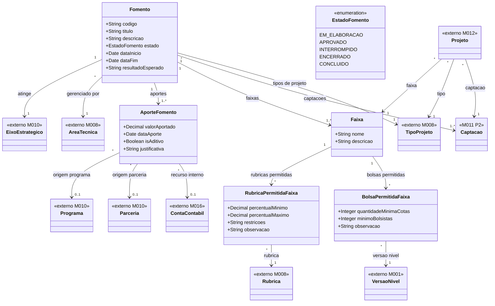

# Modelo Estrutural — P1 Fomento

Contexto: [README.md](../README.md) | Modelo consolidado: [modelo-estrutural.md](modelo-estrutural.md) | Por processo: [P2](modelo-estrutural-p2-configuracao-selecao.md) | [P3](modelo-estrutural-p3-selecao-projetos.md)

---

## P1 - Fomento

---

## Dicionario de Dados

| Classe | Atributo | Definicao | Obrig. | Tipo | Dominio | Tamanho | Unico |
|--------|----------|-----------|--------|------|---------|---------|-------|
| **Fomento** | codigo | Codigo do fomento | Gerado | String | | | Sim |
| | titulo | Titulo do fomento | Sim | String | | 200 | |
| | descricao | Descricao do fomento | Nao | String | | 1000 | |
| | estado | Estado do fomento | Sim | EstadoFomento | EM_ELABORACAO, APROVADO, INTERROMPIDO, ENCERRADO, CONCLUIDO | | |
| | dataInicio | Data de inicio da vigencia do fomento | Sim | Date | | | |
| | dataFim | Data de fim da vigencia do fomento | Sim | Date | | | |
| | resultadoEsperado | Descricao livre dos resultados esperados dos projetos financiados | Nao | String | | 1000 | |
| | eixoEstrategico (relacao) | Eixo estrategico ao qual o fomento esta vinculado | Sim | FK → EixoEstrategico | Via M010 | | |
| | areaTecnica (relacao) | Area tecnica responsavel pelo fomento | Sim | FK → AreaTecnica | Via M008 | | |
| **AporteFomento** | valorAportado | Valor financeiro aportado | Sim | Double | > 0 | | |
| | dataAporte | Data do registro do aporte | Sim | Date | | | |
| | isAditivo | Indica se e aporte adicional ao original da mesma origem | Sim | Boolean | true/false | | |
| | justificativa | Motivo do aporte; obrigatorio quando isAditivo=true ou origemTipo=RECURSO_INTERNO | Cond. | String | | 500 | |
| | programa (relacao) | Programa de origem quando origemTipo=PROGRAMA | Cond. | FK → Programa | Via M010 | | |
| | parceria (relacao) | Parceria de origem quando origemTipo=PARCERIA | Cond. | FK → Parceria | Via M010 | | |
| | contaContabil (relacao) | Conta contabil interna quando origemTipo=RECURSO_INTERNO | Cond. | FK → ContaContabil | Via M016 | | |
| **Faixa** | nome | Nome da faixa | Sim | String | | 200 | |
| | descricao | Descricao da finalidade ou recorte da faixa | Nao | String | | 500 | |
| **RubricaPermitidaFaixa** | rubrica (relacao) | Rubrica autorizada para propostas da faixa | Sim | FK → Rubrica | Via M008 | | |
| | percentualMinimo | Percentual minimo permitido para a rubrica na faixa | Nao | Double | 0 a 100 | | |
| | percentualMaximo | Percentual maximo permitido; deve ser >= percentualMinimo quando ambos informados | Nao | Double | 0 a 100 | | |
| | restricoes | Exclusoes ou restricoes especificas | Nao | String | | 1000 | |
| | observacao | Orientacao de uso da rubrica na faixa | Nao | String | | 500 | |
| | rubricaPai (relacao) | Rubrica pai quando representar subrubrica; nulo para rubrica raiz | Cond. | FK → RubricaPermitidaFaixa | | | |
| **BolsaPermitidaFaixa** | versaoNivel (relacao) | Versao do nivel de bolsa permitida na faixa | Sim | FK → VersaoNivel | Via M001 | | |
| | quantidadeMinimaCotas | Quantidade minima de cotas exigida | Sim | Int | >= 0 | | |
| | minimoBolsistas | Quantidade minima de bolsistas exigida | Sim | Int | >= 0 | | |
| | observacao | Orientacao de uso da versao de bolsa na faixa | Nao | String | | 500 | |

---

## Regras de Negocio

### Fomento

| ID | Responsavel | Regra |
|----|-------------|-------|
| RN-F01 | GestorFomento | Todo Fomento deve possuir ao menos um aporte financeiro originado de Programa, Parceria ou recurso interno. |
| RN-F02 | GestorFomento | Todo Fomento deve estar vinculado a exatamente um eixo estrategico do M010. |
| RN-F03 | GestorFomento | Todo Fomento deve possuir ao menos uma faixa antes de ser aprovado. |
| RN-F05 | GestorFomento | Cada aporte deve indicar exatamente uma origem, possuir valor > 0, data do aporte e justificativa quando aplicavel. |
| RN-F06 | GestorFomento | O total financeiro do Fomento e calculado pela soma dos aportes; nao ha total manual. |
| RN-F07 | GestorFomento | Todo Fomento deve possuir ao menos um tipo de projeto aceito. |
| RN-F08 | Sistema | O TipoProjeto de um Projeto captado deve estar na lista de tipos permitidos do Fomento vinculado. |
| RN-F09 | AnalistaTecnico | Rubricas e subrubricas sao configuradas por faixa. |
| RN-F10 | AnalistaTecnico | Quando a rubrica Bolsa estiver permitida em uma faixa, devem ser configuradas as modalidades e niveis de bolsa permitidos. |
| RN-F11 | AnalistaTecnico | BolsaPermitidaFaixa so pode ser configurada em faixa que permite rubrica do tipo Bolsa. |
| RN-F12 | AnalistaTecnico | RubricaPermitidaFaixa com rubrica DOACI: o percentualMaximo, quando informado, nao pode superar a tabela normativa aplicavel. |
| RN-F13 | GestorFomento | Somente Fomento com estado APROVADO pode ser referenciado por nova Captacao. |
| RN-F14 | GestorFomento | Fomento APROVADO pode ser interrompido com justificativa; Captacoes e projetos vinculados sao suspensos em cascata. |
| RN-F15 | GestorFomento | Fomento INTERROMPIDO pode ser retomado; Captacoes e projetos retomam o estado anterior. |
| RN-F16 | GestorFomento | Fomento APROVADO ou INTERROMPIDO pode ser encerrado com justificativa; Captacoes e projetos vinculados sao cancelados em cascata. |
| RN-F17 | Sistema | Fomento transita automaticamente para CONCLUIDO quando dataFim e atingida. Nenhuma nova Captacao pode ser criada a partir de Fomento CONCLUIDO. |
| RN-F18 | Sistema | Nenhuma data do cronograma de uma Captacao pode ser anterior a `Fomento.dataInicio` nem posterior a `Fomento.dataFim`. |

### Aportes Adicionais

| ID | Responsavel | Regra |
|----|-------------|-------|
| RN-A01 | GestorFomento | Aporte aditivo so pode ser registrado em Fomento com estado APROVADO. |
| RN-A02 | GestorFomento | Aporte aditivo deve possuir valor > 0, data do aporte e justificativa. |
| RN-A03 | GestorFomento | Quando a origem for RECURSO_INTERNO, o aporte deve referenciar uma ContaContabil interna da FAPES. |
| RN-A04 | Sistema | O total financeiro do Fomento e recalculado pela soma de todos os AporteFomento, incluindo os com isAditivo=true. |

## Historico de Alteracoes

| Commit | Data | Autor | Descricao |
|--------|------|-------|-----------|
| `de606b0` | 2026-05-31 | Paulo Sergio Santos Junior | Adiciona dicionario de dados e regras de negocio ao modelo P1 Fomento |
| `23d82e4` | 2026-05-31 | Paulo Sergio Santos Junior | Reorganizacao dos modelos estruturais em pasta modelo-estrutural/ |
