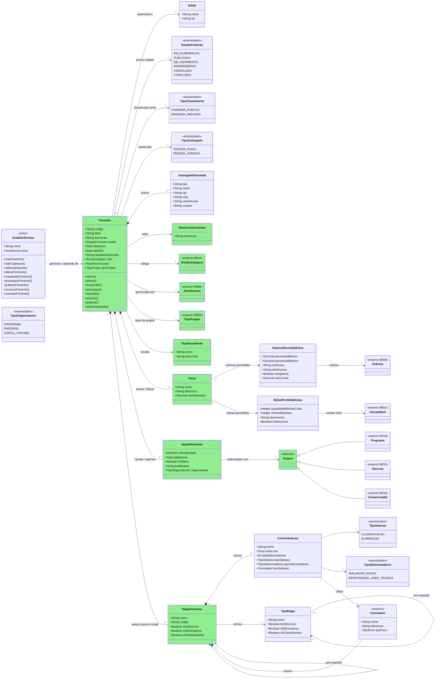
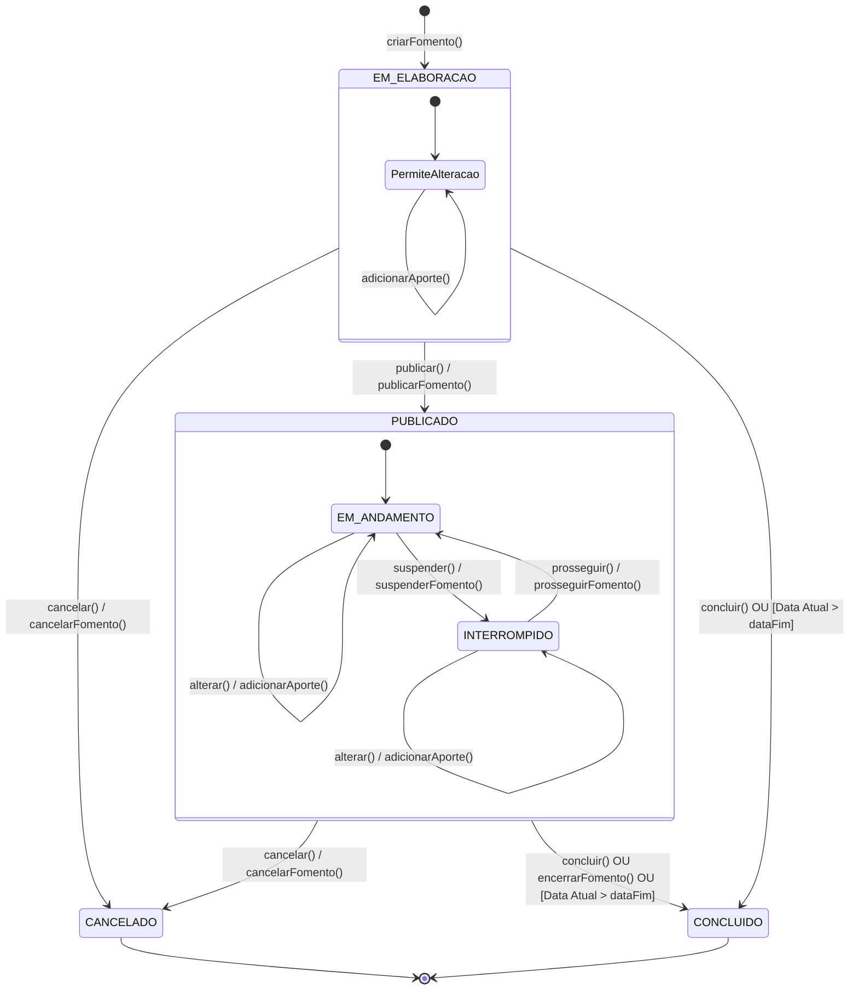
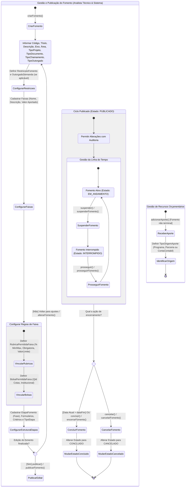

# Modelo Estrutural — P1 Fomento

Contexto: [README.md](../README.md) | Modelo consolidado: [modelo-estrutural.md](modelo-estrutural.md) | Por processo: [P2](modelo-estrutural-p2-configuracao-selecao.md) | [P3](modelo-estrutural-p3-selecao-projetos.md)

---

## P1 - Fomento

OBS: Classes em verde fazem parte do V1!

### Estados Fomento

### Glossario de Estados

| Nome | Definicao |
|------|-----------|
| EM_ELABORACAO | Estado inicial do Fomento, usado enquanto dados, aportes, faixas, documentos, etapas, formularios e criterios ainda estao sendo configurados. |
| PermiteAlteracao | Subestado interno de EM_ELABORACAO que explicita que o Fomento pode receber `salvar()`, `alterar()` e `adicionarAporte()` enquanto esta em configuracao. Nao e valor de `EstadoFomento`. |
| PUBLICADO | Macroestado que indica que o Fomento foi publicado por `publicar()` ou `publicarFomento()` e entrou no ciclo operacional. |
| EM_ANDAMENTO | Subestado operacional de PUBLICADO em que o Fomento esta ativo para captacoes, permitindo alteracoes e aportes com auditoria. |
| INTERROMPIDO | Subestado operacional de PUBLICADO em que o Fomento foi suspenso temporariamente por `suspender()` ou `suspenderFomento()`, podendo voltar a EM_ANDAMENTO por `prosseguir()` ou `prosseguirFomento()`. |
| CANCELADO | Estado terminal decorrente de `cancelar()` ou `cancelarFomento()`. Bloqueia novas captacoes vinculadas ao Fomento. |
| CONCLUIDO | Estado terminal decorrente de `concluir()`, `encerrarFomento()` ou ultrapassagem de `dataFim`. Bloqueia novas captacoes vinculadas ao Fomento. |

### Fluxo de Eventos Fomento

---

## Glossario de Classes

| Nome | Definicao | Exemplos |
|------|-----------|----------|
| AnalistaTecnico | Ator responsavel por criar, alterar, publicar, suspender, prosseguir, concluir e cancelar Fomentos, alem de registrar aportes. | Analista da area de inovacao publicando um fomento; analista registrando aporte aditivo. |
| Fomento | Agregado principal do P1 que define vigencia, regras financeiras, faixas, rubricas, bolsas, documentos, etapas e criterios que poderao orientar Captacoes. | Fomento Inovacao Capixaba 2026; Fomento Pesquisa Aplicada em Saude. |
| Edital | Documento ou link associado ao Fomento no modelo atual para registrar a referencia normativa da chamada. | Edital FAPES 01/2026; URL do edital publicado. |
| EstadoFomento | Enumeracao que representa o ciclo de vida e o subestado operacional do Fomento. | `EM_ELABORACAO`; `PUBLICADO`; `INTERROMPIDO`; `CONCLUIDO`. |
| TipoChamamento | Enumeracao que indica se o Fomento sera aberto ao publico ou direcionado a destinatario especifico. | `CHAMADA_PUBLICA`; `DEMANDA_INDUZIDA`. |
| TipoOutorgado | Enumeracao que indica se o outorgado esperado e pessoa fisica ou pessoa juridica. | `PESSOA_FISICA`; `PESSOA_JURIDICA`. |
| OutorgadoDemanda | Dados do destinatario especifico quando o Fomento for de demanda induzida. | CPF e nome de pesquisador convidado; CNPJ, razao social e contato de uma instituicao. |
| RestricoesFomento | Restricoes aplicaveis ao Fomento, ao publico habilitado ou ao uso dos recursos. | Restricao a pesquisadores doutores; restricao a instituicoes capixabas. |
| Faixa | Recorte financeiro do Fomento que organiza valores e regras permitidas para um grupo de projetos. | Faixa A ate R$ 100 mil; Faixa Empresas; Faixa Jovem Pesquisador. |
| AporteFomento | Registro financeiro que compoe o total do Fomento e identifica valor, data, origem e eventual natureza aditiva. | Aporte de R$ 500 mil de Programa; aporte aditivo de R$ 100 mil de ContaContabil. |
| TipoOrigemAporte | Enumeracao que classifica a origem orcamentaria do aporte. | `PROGRAMA`; `PARCERIA`; `CONTA_CONTABIL`. |
| RubricaPermitidaFaixa | Regra de uso de uma Rubrica dentro de uma Faixa, incluindo limites, obrigatoriedade, restricoes e observacoes. | Equipamentos com limite de R$ 30 mil; Diarias com percentual maximo de 10%. |
| BolsaPermitidaFaixa | Configuracao das bolsas permitidas em uma Faixa quando a rubrica Bolsa estiver habilitada. | 2 cotas de mestrado; bolsa institucional de doutorado. |
| TipoDocumento | Tipo de documento aceito ou exigido para orientar projetos ou captacoes derivados do Fomento. | Plano de trabalho; comprovante institucional; declaracao de anuencia. |
| EtapaFomento | Etapa base do ciclo de avaliacao ou selecao definida no Fomento e reutilizada por Captacoes. | Habilitacao documental; avaliacao ad hoc; resultado preliminar. |
| CriterioSelecao | Criterio aplicado em uma EtapaFomento para classificar ou eliminar propostas. | Nota minima 70; avaliacao por dois revisores; criterio eliminatorio documental. |
| TipoSelecao | Enumeracao que indica a natureza do criterio de selecao. | `CLASSIFICACAO`; `ELIMINACAO`. |
| TipoSelecionadores | Enumeracao que indica o perfil responsavel pela avaliacao do criterio. | `AVALIADOR_ADHOC`; `RESPONSAVEL_AREA_TECNICA`. |
| Formulario | Referencia externa a formulario usado na etapa ou no criterio de selecao. | Formulario de avaliacao ad hoc; formulario de recurso; formulario de habilitacao. |
| TipoEtapa | Tipo padronizado usado para parametrizar EtapaFomento e seus atributos principais. | Etapa classificatoria com recurso; etapa eliminatoria sem recurso. |
| Origem | Abstracao da origem financeira concreta de um AporteFomento. | Origem Programa; Origem Parceria; Origem ContaContabil. |
| Programa | Entidade externa do M010 que pode financiar aportes do Fomento. | Programa de Inovacao; Programa de Pesquisa Aplicada. |
| Parceria | Entidade externa do M010 que pode financiar aportes do Fomento por meio de acordo institucional. | Parceria FAPES-FINEP; parceria com prefeitura. |
| ContaContabil | Entidade externa do M016 usada quando o aporte vem de recurso interno da FAPES. | Conta de investimento interno; fundo contabil de pesquisa. |
| EixoEstrategico | Entidade externa do M010 que indica o eixo de planejamento ao qual o Fomento contribui. | Saude; Economia Verde; Transformacao Digital. |
| AreaTecnica | Entidade externa do M008 responsavel pela gestao tecnica do Fomento. | Gerencia de Pesquisa; Area de Inovacao. |
| TipoProjeto | Entidade externa do M008 que classifica os tipos de projeto aceitos pelo Fomento. | Pesquisa cientifica; desenvolvimento tecnologico; inovacao. |
| Rubrica | Entidade externa do M008 que representa categoria orcamentaria usada nas faixas. | Material permanente; servicos de terceiros; bolsa. |
| VersaoNivel | Entidade externa do M001 que identifica a versao vigente de um nivel de bolsa. | Mestrado v2026; Doutorado v2026; Iniciacao cientifica v2026. |

---

## Dicionario de Dados

| Classe | Atributo | Definicao | Obrig. | Tipo | Dominio | Tamanho | Unico |
|--------|----------|-----------|--------|------|---------|---------|-------|
| **Fomento** | codigo | Codigo do fomento | Gerado | String | | | Sim |
| | titulo | Titulo do fomento | Sim | String | | 200 | |
| | descricao | Descricao do fomento | Nao | String | | 1000 | |
| | estado | Estado do fomento | Sim | EstadoFomento | EM_ELABORACAO, PUBLICADO, EM_ANDAMENTO, INTERROMPIDO, CANCELADO, CONCLUIDO | | |
| | dataInicio | Data de inicio da vigencia do fomento | Sim | Date | | | |
| | dataFim | Data de fim da vigencia do fomento | Sim | Date | | | |
| | resultadoEsperado | Descricao livre dos resultados esperados dos projetos financiados | Nao | String | | 1000 | |
| | tipoChamamento (relacao) | Tipo de chamamento do fomento | Sim | FK -> TipoChamamento | CHAMADA_PUBLICA, DEMANDA_INDUZIDA | | |
| | tipoOutorgado (relacao) | Tipo de outorgado aceito pelo fomento | Sim | FK -> TipoOutorgado | PESSOA_FISICA, PESSOA_JURIDICA | | |
| | edital (relacao) | Edital associado ao fomento no modelo atual | Sim | FK -> Edital | | | |
| | eixoEstrategico (relacao) | Eixo estrategico ao qual o fomento esta vinculado | Sim | FK → EixoEstrategico | Via M010 | | |
| | areaTecnica (relacao) | Area tecnica responsavel pelo fomento | Sim | FK → AreaTecnica | Via M008 | | |
| | tipoProjeto (relacao) | Tipo de projeto aceito pelo fomento | Sim | FK → TipoProjeto | Via M008 | | |
| | tipoDocumento (relacao) | Tipo de documento que o fomento aceita ou exige dos projetos/captacoes derivados | Nao | FK → TipoDocumento | | | |
| **EstadoFomento** | valor | Estado ou subestado operacional do fomento | Sim | Enum | EM_ELABORACAO, PUBLICADO, EM_ANDAMENTO, INTERROMPIDO, CANCELADO, CONCLUIDO | | |
| **TipoChamamento** | valor | Modalidade de chamamento usada pelo fomento | Sim | Enum | CHAMADA_PUBLICA, DEMANDA_INDUZIDA | | |
| **TipoOutorgado** | valor | Tipo de outorgado aceito ou destinatario | Sim | Enum | PESSOA_FISICA, PESSOA_JURIDICA | | |
| **Edital** | nome | Nome ou identificacao do edital associado ao fomento | Sim | String | | 200 | |
| | url | Endereco externo do edital publicado ou minuta validada | Sim | String | URL valida | 500 | |
| **OutorgadoDemanda** | tipo | Tipo do outorgado destinatario | Sim | TipoOutorgado | PESSOA_FISICA, PESSOA_JURIDICA | | |
| | nome | Nome da pessoa fisica quando o outorgado for PF | Cond. | String | Obrigatorio para PF | 200 | |
| | cpf | CPF da pessoa fisica quando o outorgado for PF | Cond. | String | CPF valido | 14 | |
| | cnpj | CNPJ da pessoa juridica quando o outorgado for PJ | Cond. | String | CNPJ valido | 18 | |
| | razaoSocial | Razao social quando o outorgado for PJ | Cond. | String | Obrigatorio para PJ | 200 | |
| | contato | Contato de pessoa fisica responsavel quando o outorgado for PJ | Cond. | String | Obrigatorio para PJ | 200 | |
| **RestricoesFomento** | descricao | Restricao aplicada ao fomento ou ao publico apto | Sim | String | | 1000 | |
| **TipoDocumento** | nome | Nome do tipo de documento aceito ou exigido no fomento | Sim | String | | 200 | Sim |
| | descricao | Descricao do uso esperado do tipo de documento | Nao | String | | 500 | |
| **AporteFomento** | valorAportado | Valor financeiro aportado | Sim | Decimal | > 0 | | |
| | dataAporte | Data do registro do aporte | Sim | Date | | | |
| | isAditivo | Indica se o aporte complementa aportes ja registrados | Sim | Boolean | true/false | | |
| | justificativa | Motivo do aporte; obrigatorio quando isAditivo=true | Cond. | String | | 500 | |
| | origemAporte | Tipo da origem orcamentaria do aporte | Sim | TipoOrigemAporte | PROGRAMA, PARCERIA, CONTA_CONTABIL | | |
| | origem (relacao) | Origem unica do aporte, especializada em Programa, Parceria ou ContaContabil | Sim | FK -> Origem | Programa/Parceria via M010; ContaContabil via M016 | | |
| **TipoOrigemAporte** | valor | Tipo concreto da origem orcamentaria do aporte | Sim | Enum | PROGRAMA, PARCERIA, CONTA_CONTABIL | | |
| **Faixa** | nome | Nome da faixa | Sim | String | | 200 | |
| | descricao | Descricao da finalidade ou recorte da faixa | Nao | String | | 500 | |
| | valorAportado | Valor financeiro destinado aos projetos da faixa | Sim | Decimal | >= 0 | | |
| **RubricaPermitidaFaixa** | rubrica (relacao) | Rubrica autorizada para propostas da faixa | Sim | FK → Rubrica | Via M008 | | |
| | percentualMinimo | Percentual minimo permitido para a rubrica na faixa | Nao | Double | 0 a 100 | | |
| | percentualMaximo | Percentual maximo permitido; deve ser >= percentualMinimo quando ambos informados | Nao | Double | 0 a 100 | | |
| | restricoes | Exclusoes ou restricoes especificas | Nao | String | | 1000 | |
| | observacao | Orientacao de uso da rubrica na faixa | Nao | String | | 500 | |
| | obrigatoria | Indica se a rubrica e obrigatoria no orcamento da proposta | Sim | Boolean | true/false | | |
| | valorLimite | Valor maximo permitido para a rubrica na faixa | Nao | Decimal | >= 0 | | |
| **BolsaPermitidaFaixa** | versaoNivel (relacao) | Versao do nivel de bolsa permitida na faixa | Sim | FK → VersaoNivel | Via M001 | | |
| | quantidadeMinimaCotas | Quantidade minima de cotas exigida | Sim | Int | >= 0 | | |
| | minimoBolsistas | Quantidade minima de bolsistas exigida | Sim | Int | >= 0 | | |
| | observacao | Orientacao de uso da versao de bolsa na faixa | Nao | String | | 500 | |
| | institucional | Indica se a bolsa esta vinculada a regra institucional da faixa | Sim | Boolean | true/false | | |
| **EtapaFomento** | nome | Nome da etapa do ciclo de avaliacao ou selecao do fomento | Sim | String | | 200 | |
| | codigo | Codigo funcional da etapa dentro do fomento | Sim | String | Unico no Fomento | 80 | Sim dentro do Fomento |
| | temRecurso | Indica se a etapa permite recurso administrativo | Sim | Boolean | true/false | | |
| | ehEliminatoria | Indica se a etapa pode eliminar projetos ou propostas | Sim | Boolean | true/false | | |
| | ehClassificatoria | Indica se a etapa contribui para classificacao final | Sim | Boolean | true/false | | |
| | tipoEtapa (relacao) | Tipo padronizado que parametriza a etapa | Sim | FK -> TipoEtapa | | | |
| | preRequisito (relacao) | Etapa que deve ser concluida antes desta etapa | Nao | FK -> EtapaFomento | Mesmo Fomento | | |
| | formulario (relacao) | Formulario externo usado ou apresentado na etapa | Nao | FK -> Formulario | Formulario externo publicado | | |
| **TipoEtapa** | nome | Nome do tipo padronizado de etapa | Sim | String | | 200 | Sim |
| | temRecurso | Padrao que indica se etapas deste tipo permitem recurso | Sim | Boolean | true/false | | |
| | ehEliminatoria | Padrao que indica se etapas deste tipo eliminam projetos ou propostas | Sim | Boolean | true/false | | |
| | ehClassificatoria | Padrao que indica se etapas deste tipo classificam projetos ou propostas | Sim | Boolean | true/false | | |
| | preRequisito (relacao) | Tipo de etapa que deve anteceder este tipo | Nao | FK -> TipoEtapa | | | |
| **CriterioSelecao** | nome | Nome do criterio usado na etapa | Sim | String | | 200 | |
| | notaCorte | Nota minima exigida quando o criterio for eliminatorio ou classificatorio | Nao | Float | >= 0 | | |
| | qteSelecionadores | Quantidade de selecionadores exigida para aplicar o criterio | Sim | Int | >= 1 | | |
| | tipoSelecao | Natureza do criterio de selecao | Sim | TipoSelecao | CLASSIFICACAO, ELIMINACAO | | |
| | tipoSelecionadores | Perfil responsavel pela avaliacao do criterio | Sim | TipoSelecionadores | AVALIADOR_ADHOC, RESPONSAVEL_AREA_TECNICA | | |
| | formSelecao (relacao) | Formulario externo usado para registrar a avaliacao do criterio | Sim | FK → Formulario | Formulario externo publicado | | |
| **Formulario** | nome | Nome do formulario externo referenciado pela etapa ou criterio | Sim | String | | 200 | |
| | descricao | Descricao do formulario externo | Nao | String | | 500 | |
| | tipoForm | Tipo do formulario externo | Sim | TipoForm | Dominio do modulo proprietario | | |
| **Origem** | tipo | Tipo concreto da origem orcamentaria do aporte | Sim | Enum | PROGRAMA, PARCERIA, CONTA_CONTABIL | | |

---

## Regras de Negocio

### Fomento

| ID | Responsavel | Regra |
|----|-------------|-------|
| RN-F01 | AnalistaTecnico | Todo Fomento deve possuir codigo, titulo, vigencia (`dataInicio` e `dataFim`), eixo estrategico, area tecnica, tipo de chamamento e tipo de outorgado. |
| RN-F02 | AnalistaTecnico | `Fomento.dataFim` deve ser posterior ou igual a `Fomento.dataInicio`. |
| RN-F03 | AnalistaTecnico | Todo Fomento deve possuir ao menos um aporte financeiro originado de Programa, Parceria ou ContaContabil antes de ser publicado. |
| RN-F04 | AnalistaTecnico | Todo Fomento deve possuir ao menos uma faixa antes de ser publicado. |
| RN-F05 | AnalistaTecnico | Todo Fomento deve possuir ao menos um TipoProjeto aceito antes de ser publicado. |
| RN-F06 | AnalistaTecnico | Todo Fomento deve possuir um Edital associado antes de ser publicado, conforme o modelo estrutural atual. |
| RN-F07 | AnalistaTecnico | Quando `tipoChamamento=DEMANDA_INDUZIDA`, o Fomento deve possuir exatamente um OutorgadoDemanda. |
| RN-F08 | Sistema | Quando houver OutorgadoDemanda, o tipo informado deve coincidir com `Fomento.tipoOutorgado`; se for PJ, deve haver contato de pessoa fisica. |
| RN-F09 | AnalistaTecnico | Cada aporte deve indicar exatamente uma origem, possuir valor maior que zero, data do aporte e justificativa quando `isAditivo=true`. |
| RN-F10 | Sistema | O total financeiro do Fomento e calculado pela soma dos `AporteFomento.valorAportado`; nao ha total financeiro manual. |
| RN-F11 | AnalistaTecnico | Dados, faixas, aportes, documentos, formularios, criterios e etapas do Fomento podem ser alterados a qualquer momento enquanto o Fomento existir, preservando historico/auditoria quando houver captacoes vinculadas. |
| RN-F12 | Sistema | O Fomento inicia em EM_ELABORACAO e transita para PUBLICADO por `publicar()` ou `publicarFomento()` quando as configuracoes obrigatorias estiverem completas. |
| RN-F13 | Sistema | Somente Fomento PUBLICADO ou EM_ANDAMENTO pode originar novas Captacoes; Fomento INTERROMPIDO, CANCELADO ou CONCLUIDO nao pode originar novas Captacoes. |
| RN-F14 | AnalistaTecnico | `suspender()` ou `suspenderFomento()` suspende temporariamente um Fomento PUBLICADO ou EM_ANDAMENTO, transicionando-o para INTERROMPIDO. |
| RN-F15 | AnalistaTecnico | `prosseguir()` ou `prosseguirFomento()` retoma um Fomento INTERROMPIDO, devolvendo-o ao ciclo operacional PUBLICADO/EM_ANDAMENTO. |
| RN-F16 | Sistema | Fomento transita para CONCLUIDO por `concluir()` ou automaticamente quando `dataFim` for ultrapassada; nenhuma nova Captacao pode ser criada a partir de Fomento CONCLUIDO. |
| RN-F17 | AnalistaTecnico | Fomento EM_ELABORACAO, PUBLICADO, EM_ANDAMENTO ou INTERROMPIDO pode ser cancelado por `cancelar()` ou `cancelarFomento()`, transicionando para CANCELADO. |
| RN-F18 | Sistema | Nenhuma data do cronograma de uma Captacao pode ser anterior a `Fomento.dataInicio` nem posterior a `Fomento.dataFim`. |
| RN-F19 | Sistema | O TipoProjeto de um Projeto captado deve estar na lista de tipos permitidos do Fomento vinculado. |
| RN-F20 | AnalistaTecnico | Rubricas e subrubricas sao configuradas por Faixa. |
| RN-F21 | AnalistaTecnico | Quando a rubrica Bolsa estiver permitida em uma Faixa, devem ser configuradas as BolsasPermitidasFaixa com versao de nivel, cotas e quantidade minima de bolsistas. |
| RN-F22 | Sistema | BolsaPermitidaFaixa so pode ser configurada em Faixa que permite rubrica do tipo Bolsa. |
| RN-F23 | AnalistaTecnico | RubricaPermitidaFaixa pode definir percentual minimo, percentual maximo, valor limite, obrigatoriedade, restricoes e observacao. |
| RN-F24 | Sistema | `percentualMaximo`, quando informado, deve ser maior ou igual a `percentualMinimo` e nao pode superar limites normativos aplicaveis. |
| RN-F25 | AnalistaTecnico | Todo Fomento deve possuir ao menos uma EtapaFomento inicial, identificada por nao possuir pre-requisito. |
| RN-F26 | Sistema | Pre-requisitos entre EtapaFomento devem pertencer ao mesmo Fomento e nao podem formar ciclo. |
| RN-F27 | Sistema | As flags de EtapaFomento (`temRecurso`, `ehEliminatoria`, `ehClassificatoria`) devem ser coerentes com o TipoEtapa selecionado. |
| RN-F28 | AnalistaTecnico | EtapaFomento pode possuir zero ou mais criterios; quando possuir CriterioSelecao, cada criterio deve informar tipo de selecao, perfil de selecionadores, quantidade de selecionadores e formulario de selecao. |
| RN-F29 | AnalistaTecnico | CriterioSelecao do tipo ELIMINACAO deve possuir `notaCorte` quando a eliminacao depender de pontuacao. |
| RN-F30 | Sistema | CriterioSelecao com `tipoSelecionadores=AVALIADOR_ADHOC` deve exigir `qteSelecionadores >= 1`. |
| RN-F31 | Sistema | Formularios referenciados por EtapaFomento ou CriterioSelecao pertencem ao modulo proprietario externo e devem estar publicados/ativos no momento da publicacao do Fomento. |
| RN-F32 | AnalistaTecnico | Um Fomento pode possuir varios TipoDocumento para orientar os documentos aceitos ou exigidos nos projetos/captacoes derivados. |
| RN-F33 | Sistema | Captacoes criadas a partir do Fomento devem referenciar somente TipoProjeto, TipoDocumento, Faixa, EtapaFomento, rubricas e bolsas configurados no proprio Fomento. |

### Aportes Adicionais

| ID | Responsavel | Regra |
|----|-------------|-------|
| RN-A01 | AnalistaTecnico | Aporte aditivo pode ser registrado em Fomento nao terminal, inclusive apos publicacao, desde que possua `isAditivo=true`. |
| RN-A02 | AnalistaTecnico | Aporte aditivo deve possuir valor > 0, data do aporte e justificativa. |
| RN-A03 | AnalistaTecnico | Quando a origem representar recurso interno, o aporte deve referenciar uma ContaContabil interna da FAPES. |
| RN-A04 | Sistema | O total financeiro do Fomento e recalculado pela soma de todos os AporteFomento, incluindo os com isAditivo=true. |

## Historico de Alteracoes

| Commit | Data | Autor | Descricao |
|--------|------|-------|-----------|
| `pendente` | 2026-06-24 | Rodrigo Calhau | Adiciona glossarios de classes e de estados ao modelo P1 Fomento |
| `de606b0` | 2026-05-31 | Paulo Sergio Santos Junior | Adiciona dicionario de dados e regras de negocio ao modelo P1 Fomento |
| `23d82e4` | 2026-05-31 | Paulo Sergio Santos Junior | Reorganizacao dos modelos estruturais em pasta modelo-estrutural/ |
