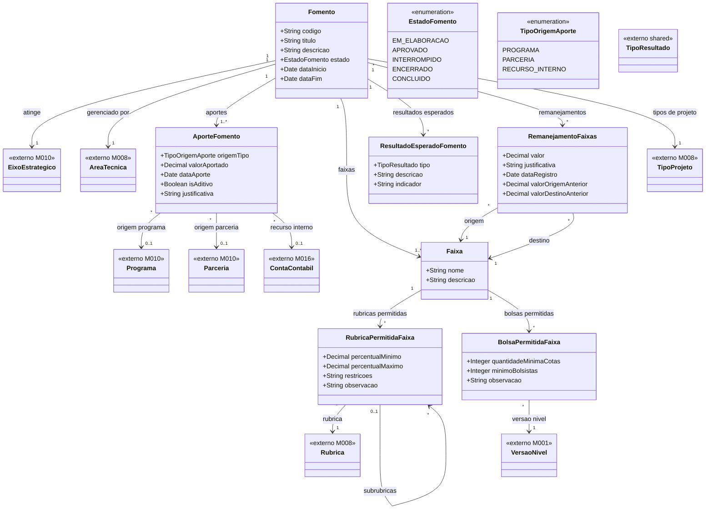

# Modelo Estrutural — P1 Fomento

Contexto: [README.md](../README.md) | Modelo consolidado: [modelo-estrutural.md](modelo-estrutural.md) | Por processo: [P2](modelo-estrutural-p2-configuracao-selecao.md) | [P3](modelo-estrutural-p3-selecao-projetos.md)

---

## P1 - Fomento

---

