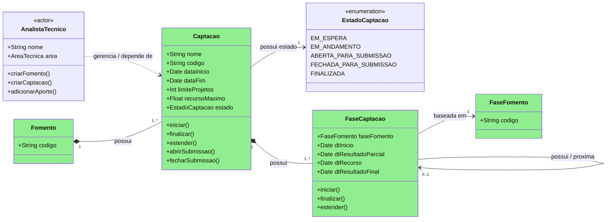
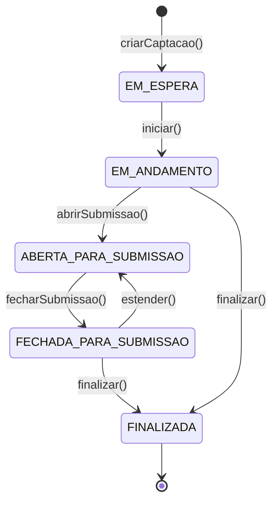
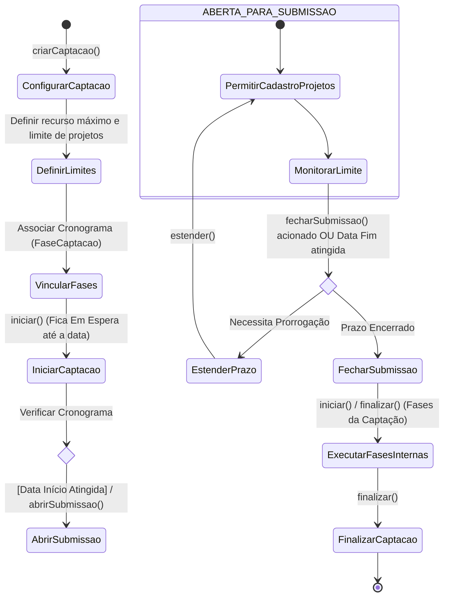

# Modelo Estrutural — P2 Configuracao da Captação

Contexto: [README.md](../README.md) | Modelo consolidado: [modelo-estrutural.md](modelo-estrutural.md) | Por processo: [P1](modelo-estrutural-p1-fomento.md) | [P3](modelo-estrutural-p3-selecao-projetos.md)

---

## P2 - Configuracao da Captação

OBS: Classes me verde fazem parte do V1!

### Estados da Captação

### Fluxo Captação

---

## Dicionario de Dados

| Classe | Atributo | Definicao | Obrig. | Tipo | Dominio | Tamanho | Unico |
|--------|----------|-----------|--------|------|---------|---------|-------|
| **Captacao** | codigo | Codigo da captacao | Gerado | String | | | Sim |
| | nome | Nome da captacao | Sim | String | | 200 | |
| | dataInicio | Data prevista para inicio operacional da captacao | Sim | Date | Deve estar dentro da vigencia do Fomento | | |
| | dataFim | Data prevista para termino operacional da captacao | Sim | Date | Deve ser posterior ou igual a dataInicio e estar dentro da vigencia do Fomento | | |
| | limiteProjetos | Quantidade maxima de projetos que podem ser cadastrados/submetidos na captacao | Nao | Int | > 0 quando informado | | |
| | recursoMaximo | Valor maximo de recurso alocado para a captacao | Nao | Float | >= 0 quando informado; nao pode exceder recurso disponivel do Fomento | | |
| | estado | Estado da captacao | Sim | EstadoCaptacao | EM_ESPERA, EM_ANDAMENTO, ABERTA_PARA_SUBMISSAO, FECHADA_PARA_SUBMISSAO, FINALIZADA | | |
| | fomento (relacao) | Fomento que origina e governa as fases base da captacao | Sim | FK → Fomento | Fomento.estado = APROVADO ou VIGENTE | | |
| **EstadoCaptacao** | valor | Estado operacional da captacao | Sim | Enum | EM_ESPERA, EM_ANDAMENTO, ABERTA_PARA_SUBMISSAO, FECHADA_PARA_SUBMISSAO, FINALIZADA | | |
| **FaseCaptacao** | faseFomento (relacao) | Fase do Fomento usada como modelo da fase da captacao | Sim | FK → FaseFomento | Deve pertencer ao Fomento da Captacao | | |
| | dtInicio | Data de inicio da fase na captacao | Sim | Date | Deve estar entre Captacao.dataInicio e Captacao.dataFim | | |
| | dtResultadoParcial | Data prevista para divulgacao de resultado parcial da fase | Cond. | Date | Obrigatoria quando a fase gerar resultado parcial | | |
| | dtRecurso | Data prevista para abertura de recurso da fase | Cond. | Date | Obrigatoria quando a fase permitir recurso | | |
| | dtResultadoFinal | Data prevista para divulgacao de resultado final da fase | Cond. | Date | Obrigatoria quando a fase gerar resultado final | | |
| | proxima (relacao) | Proxima fase da captacao na cadeia operacional | Nao | FK → FaseCaptacao | Mesma Captacao; nao pode formar ciclo | | |
| **FaseFomento** | codigo | Codigo da fase base definida no Fomento | Sim | String | Herdado do P1 Fomento | 80 | |

---

## Regras de Negocio

| ID | Responsavel | Regra |
|----|-------------|-------|
| RN-CS01 | AnalistaTecnico | A Captacao deve referenciar exatamente um Fomento com estado APROVADO ou VIGENTE. |
| RN-CS02 | AnalistaTecnico | `Captacao.dataInicio` e `Captacao.dataFim` devem estar dentro da vigencia do Fomento referenciado. |
| RN-CS03 | AnalistaTecnico | `Captacao.dataFim` deve ser posterior ou igual a `Captacao.dataInicio`. |
| RN-CS04 | AnalistaTecnico | Toda Captacao deve possuir ao menos uma FaseCaptacao vinculada antes de ser iniciada. |
| RN-CS05 | AnalistaTecnico | Toda FaseCaptacao deve ser baseada em uma FaseFomento pertencente ao Fomento da Captacao. |
| RN-CS06 | Sistema | A cadeia `FaseCaptacao.proxima` deve pertencer a mesma Captacao e nao pode formar ciclo. |
| RN-CS07 | Sistema | A Captacao e criada em EM_ESPERA por `criarCaptacao()`. |
| RN-CS08 | AnalistaTecnico | A Captacao so pode transitar de EM_ESPERA para EM_ANDAMENTO por `iniciar()` quando possuir nome, vigencia, Fomento e fases configuradas. |
| RN-CS09 | Sistema | A abertura de submissao so pode ocorrer em EM_ANDAMENTO quando a data de inicio aplicavel for atingida. |
| RN-CS10 | Sistema | `abrirSubmissao()` transiciona a Captacao de EM_ANDAMENTO para ABERTA_PARA_SUBMISSAO. |
| RN-CS11 | Sistema | Enquanto a Captacao estiver ABERTA_PARA_SUBMISSAO, o cadastro/submissao de projetos fica permitido ate o limite de projetos ou ate o fechamento do periodo. |
| RN-CS12 | Sistema | `fecharSubmissao()` transiciona a Captacao de ABERTA_PARA_SUBMISSAO para FECHADA_PARA_SUBMISSAO quando o prazo de submissao terminar ou o fechamento for acionado. |
| RN-CS13 | AnalistaTecnico | `estender()` so pode ser aplicado em FECHADA_PARA_SUBMISSAO para reabrir submissao com nova data aplicavel e historico da prorrogacao. |
| RN-CS14 | AnalistaTecnico | A Captacao pode ser finalizada a partir de EM_ANDAMENTO quando nao houver abertura de submissao prevista, ou a partir de FECHADA_PARA_SUBMISSAO apos execucao das fases internas. |
| RN-CS15 | Sistema | FINALIZADA e estado terminal; nenhuma nova submissao, extensao ou fase operacional pode ser iniciada. |
| RN-CS16 | Sistema | `limiteProjetos`, quando informado, bloqueia novas submissões ao atingir a quantidade maxima configurada. |
| RN-CS17 | Sistema | `recursoMaximo`, quando informado, nao pode exceder o recurso disponivel do Fomento para a Captacao. |
| RN-CS18 | Sistema | As datas `dtResultadoParcial`, `dtRecurso` e `dtResultadoFinal` de FaseCaptacao devem respeitar a ordem operacional definida pela FaseFomento e permanecer dentro da vigencia da Captacao. |
| RN-CS19 | Sistema | FaseCaptacao com recurso permitido pela FaseFomento deve possuir `dtRecurso`; fases sem recurso nao devem abrir periodo de recurso. |
| RN-CS20 | Sistema | O diagrama P2 usa `EstadoCaptacao` operacional (`EM_ESPERA`, `EM_ANDAMENTO`, `ABERTA_PARA_SUBMISSAO`, `FECHADA_PARA_SUBMISSAO`, `FINALIZADA`), que diverge do estado consolidado de configuracao documentado em README/modelo-comportamental (`EM_ANDAMENTO`, `PUBLICADO`, `NAO_PUBLICADO`, `PAUSADO`, `ENCERRADO`, `CANCELADO`). Antes de atualizar contrato/API, os dois vocabulários devem ser conciliados ou explicitamente separados. |

---

## Historico de Alteracoes

| Commit | Data | Autor | Descricao |
|--------|------|-------|-----------|
| `cdc84dd` | 2026-05-31 | Paulo Sergio Santos Junior | Simplificacao e sincronizacao completa do modelo P2 com a ontologia |
| `db4a22b` | 2026-05-31 | Paulo Sergio Santos Junior | Adiciona dicionario de dados e regras ao modelo P2 |
| `23d82e4` | 2026-05-31 | Paulo Sergio Santos Junior | Reorganizacao dos modelos estruturais em pasta modelo-estrutural/ |
