# Modelo Estrutural — P2 Configuracao da Selecao

Contexto: [README.md](../README.md) | Modelo consolidado: [modelo-estrutural.md](modelo-estrutural.md) | Por processo: [P1](modelo-estrutural-p1-fomento.md) | [P3](modelo-estrutural-p3-selecao-projetos.md)

---

## P2 - Configuracao da Selecao

```mermaid
classDiagram
    direction TB

    class Captacao {
        +String codigo
        +String titulo
        +String descricao
        +TipoCaptacao tipoCaptacao
        +TipoOutorgado tipoOutorgado
        +EstadoConfiguracaoCaptacao estadoConfiguracao
    }

    class Edital {
        +String titulo
        +String descricao
        +String link
        +String nomeArquivo
        +String urlArquivo
        +String versao
    }

    class OutorgadoDestinatario {
        +TipoOutorgado tipo
        +String cpf
        +String nome
        +String cnpj
        +String razaoSocial
    }

    class CategoriaProjeto {
        +String nome
        +String descricao
        +Boolean selecionavelNoCadastro
    }

    class CronogramaCaptacao {
        +String descricao
    }

    class PeriodoCronograma {
        +String nome
        +TipoPeriodo tipo
        +Date dataInicio
        +Date dataFim
    }

    class AdiamentoPeriodoCronograma {
        +Integer dias
        +String justificativa
        +Date dataRegistro
        +Date dataInicioOriginal
        +Date dataFimOriginal
        +Date dataInicioNova
        +Date dataFimNova
    }

    class RegraSubmissao {
        +Boolean permiteMultiplasPropostas
        +Boolean permiteParticiparEmOutraProposta
        +Boolean permiteAcumularBolsa
        +Boolean submissaoRestritaAEscolhidos
        +Boolean exigeAprovacaoInstitucional
    }

    class ProponenteEscolhido {
        +TipoProponenteEscolhido tipo
    }

    class RequisitoProponente {
        +TipoDirecionamentoProposta direcionamento
        +Boolean permiteParceriaInstituicoes
        +Boolean exigeVinculoEmpregaticio
        +Boolean exigeGestorInstitucional
    }

    class RegraAvaliacao {
        +Boolean exigeAvaliacaoAdHoc
        +Integer quantidadeMinimaRevisores
    }

    class PrestacaoExigida {
        +Boolean exigePrestacaoTecnica
        +Boolean exigePrestacaoFinanceira
    }

    class RevisorAdHoc {
        +Date dataInclusao
        +String areaAtuacao
        +String titulacao
    }

    class DocumentoExigido {
        +String nome
        +String descricao
        +Boolean obrigatorio
        +Boolean reutilizarCadastroCorporativo
        +Boolean exigirNovoEnvioSeVencido
    }

    class FormatoArquivo {
        +String extensao
    }

    class MatrizConfiguracaoProjeto {
        +ObrigatoriedadeBloco equipe
        +ObrigatoriedadeBloco resultados
        +ObrigatoriedadeBloco riscos
        +ObrigatoriedadeBloco cronogramaProj
        +ObrigatoriedadeBloco orcamento
        +ObrigatoriedadeBloco objetivos
        +ObrigatoriedadeBloco beneficios
    }

    class FormularioSubmissaoRef {
        +String formularioId
        +String versaoFormularioId
    }

    class FormularioAvaliacaoRef {
        +String formularioId
        +String versaoFormularioId
    }

    class FormularioRevisaoRef {
        +String formularioId
        +String versaoFormularioId
    }

    class FormularioAnexoRef {
        +String formularioId
        +String versaoFormularioId
    }

    class TipoCaptacao {
        <<enumeration>>
        CHAMADA_PUBLICA
        DEMANDA_INDUZIDA
    }

    class TipoOutorgado {
        <<enumeration>>
        PESSOA_FISICA
        PESSOA_JURIDICA
    }

    class EstadoConfiguracaoCaptacao {
        <<enumeration>>
        EM_ANDAMENTO
        PUBLICADO
        NAO_PUBLICADO
        PAUSADO
        ENCERRADO
        CANCELADO
    }

    class TipoPeriodo {
        <<enumeration>>
        PUBLICACAO_CAPTACAO
        RECEBIMENTO_PROPOSTAS
        AVALIACAO_DOCUMENTAL
        AVALIACAO_AD_HOC
        RESULTADO_PRELIMINAR
        RECEBIMENTO_REVISAO
        RESULTADO_APOS_REVISAO
        RESULTADO_FINAL
    }

    class TipoProponenteEscolhido {
        <<enumeration>>
        INSTITUICAO
        PESSOA
    }

    class TipoDirecionamentoProposta {
        <<enumeration>>
        ABERTA
        INSTITUICAO
        TIPO_INSTITUICAO
    }

    class ObrigatoriedadeBloco {
        <<enumeration>>
        EXIGIDO
        DISPENSADO
    }

    class Fomento {
        <<P1>>
    }

    class Faixa {
        <<P1>>
    }

    class TipoProjeto {
        <<externo M008>>
    }

    class AreaTecnica {
        <<externo M008>>
    }

    class Instituicao {
        <<externo M008>>
    }

    class TipoInstituicao {
        <<externo M008>>
    }

    class NivelAcademico {
        <<externo M008>>
    }

    class PessoaFisica {
        <<externo shared.people>>
    }

    Captacao "*" --> "1" Fomento : baseada em
    Captacao "1" --> "1..*" Faixa : ativa faixas
    Captacao "1" --> "1" AreaTecnica : area tecnica
    Captacao "1" --> "1" Edital : edital
    Captacao "1" --> "0..1" OutorgadoDestinatario : destinatario
    Captacao "1" --> "1..*" TipoProjeto : tipos aceitos
    Captacao "1" --> "1..*" CategoriaProjeto : categorias
    Captacao "1" --> "1" CronogramaCaptacao : cronograma
    Captacao "1" --> "1" RegraSubmissao : regra submissao
    Captacao "1" --> "*" ProponenteEscolhido : proponentes escolhidos
    Captacao "1" --> "1" RequisitoProponente : requisito
    Captacao "1" --> "1" RegraAvaliacao : regra avaliacao
    Captacao "1" --> "1" PrestacaoExigida : prestacao
    Captacao "1" --> "1..*" RevisorAdHoc : pool revisores
    Captacao "1" --> "*" DocumentoExigido : documentos
    Captacao "1" --> "1" MatrizConfiguracaoProjeto : matriz
    Captacao "1" --> "1" FormularioSubmissaoRef : submissao
    Captacao "1" --> "1" FormularioAvaliacaoRef : avaliacao
    Captacao "1" --> "1" FormularioRevisaoRef : revisao
    Captacao "1" --> "0..1" FormularioAnexoRef : anexos

    CronogramaCaptacao "1" --> "8" PeriodoCronograma : periodos
    PeriodoCronograma "1" --> "*" AdiamentoPeriodoCronograma : adiamentos
    OutorgadoDestinatario "0..1" --> "1" PessoaFisica : contato PF
    RequisitoProponente "0..1" --> "1" Instituicao : instituicao
    RequisitoProponente "0..1" --> "1" TipoInstituicao : tipo instituicao
    RequisitoProponente "0..1" --> "1" NivelAcademico : nivel minimo
    ProponenteEscolhido "*" --> "0..1" Instituicao : instituicao
    ProponenteEscolhido "*" --> "0..1" PessoaFisica : pessoa
    RevisorAdHoc "*" --> "1" PessoaFisica : pessoa
    DocumentoExigido "*" --> "*" FormatoArquivo : formatos
```

---

