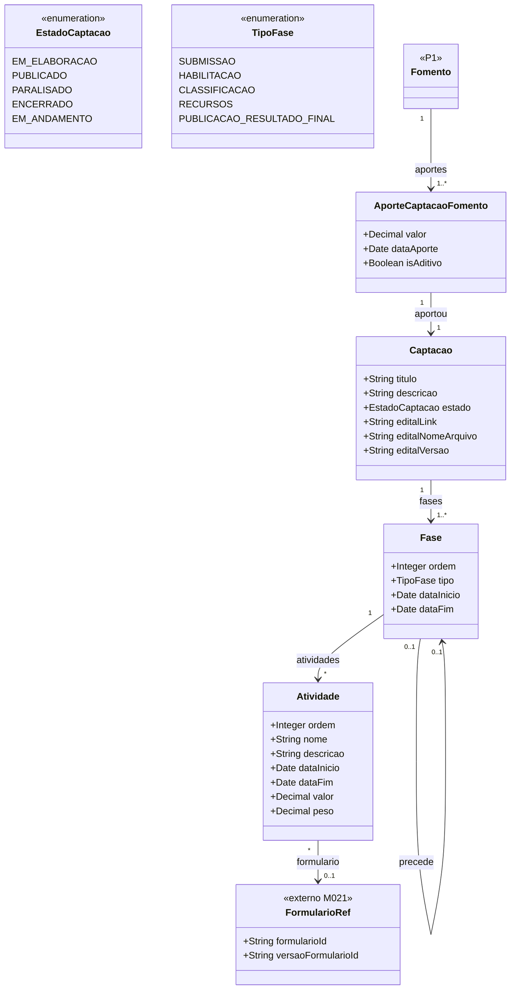

# Modelo Estrutural — P2 Configuracao da Selecao

Contexto: [README.md](../README.md) | Modelo consolidado: [modelo-estrutural.md](modelo-estrutural.md) | Por processo: [P1](modelo-estrutural-p1-fomento.md) | [P3](modelo-estrutural-p3-selecao-projetos.md)

---

## P2 - Configuracao da Selecao

---

## Dicionario de Dados

| Classe | Atributo | Definicao | Obrig. | Tipo | Dominio | Tamanho | Unico |
|--------|----------|-----------|--------|------|---------|---------|-------|
| **Captacao** | codigo | Codigo da captacao | Gerado | String | | | Sim |
| | titulo | Titulo da captacao | Sim | String | | 200 | |
| | descricao | Descricao resumida do objetivo e escopo | Nao | String | | 1000 | |
| | tipoCaptacao | Tipo da captacao | Sim | TipoCaptacao | CHAMADA_PUBLICA, DEMANDA_INDUZIDA | | |
| | tipoOutorgado | Tipo do outorgado | Sim | TipoOutorgado | PESSOA_FISICA, PESSOA_JURIDICA | | |
| | estado | Estado da captacao | Sim | EstadoCaptacao | EM_ELABORACAO, PUBLICADO, PARALISADO, ENCERRADO | | |
| | exigePrestacaoTecnica | Indica se projetos gerados exigirao prestacao tecnica | Sim | Boolean | true/false | | |
| | exigePrestacaoFinanceira | Indica se projetos gerados exigirao prestacao financeira | Sim | Boolean | true/false | | |
| | fomento (relacao) | Fomento base; deve estar APROVADO | Sim | FK → Fomento | Fomento.estado = APROVADO | | |
| | editalLink | URL externa do edital | Cond. | String | Ao menos editalLink ou editalNomeArquivo obrigatorio antes da publicacao | 500 | |
| | editalNomeArquivo | Nome do arquivo do edital anexado | Cond. | String | | 300 | |
| | editalVersao | Versao do edital; incrementada a cada retificacao | Sim | String | | 50 | |

---

## Regras de Negocio

| ID | Responsavel | Regra |
|----|-------------|-------|
| RN-CS01 | AnalistaTecnico | A Captacao deve referenciar um Fomento com estado APROVADO. |
| RN-CS02 | AnalistaTecnico | A Captacao deve ter tipo CHAMADA_PUBLICA ou DEMANDA_INDUZIDA. |
| RN-CS07 | AnalistaTecnico | O edital deve conter ao menos um link externo ou arquivo anexado antes da publicacao. |
| RN-CS14 | AnalistaTecnico | A Captacao so pode ser publicada quando toda a configuracao obrigatoria estiver preenchida. |
| RN-CS15 | AnalistaTecnico | A Captacao so pode ser despublicada quando nenhuma proposta estiver submetida no periodo ativo. |
| RN-CS16 | AnalistaTecnico | O tipo do outorgado deve ser definido em qualquer tipo de chamamento. |
| RN-CS18 | AnalistaTecnico | O edital pode ser retificado informando nova versao. O historico de versoes deve ser preservado. |
| RN-CS19 | Sistema | O valor de cada Atividade e usado no calculo geral da selecao do projeto; a soma ponderada dos valores das atividades avaliadas determina a pontuacao final do projeto na captacao. |

---

## Historico de Alteracoes

| Commit | Data | Autor | Descricao |
|--------|------|-------|-----------|
| `cdc84dd` | 2026-05-31 | Paulo Sergio Santos Junior | Simplificacao e sincronizacao completa do modelo P2 com a ontologia |
| `db4a22b` | 2026-05-31 | Paulo Sergio Santos Junior | Adiciona dicionario de dados e regras ao modelo P2 |
| `23d82e4` | 2026-05-31 | Paulo Sergio Santos Junior | Reorganizacao dos modelos estruturais em pasta modelo-estrutural/ |
