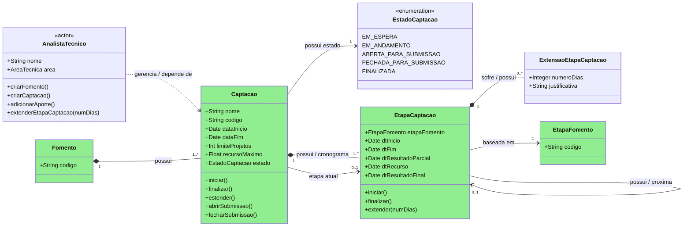
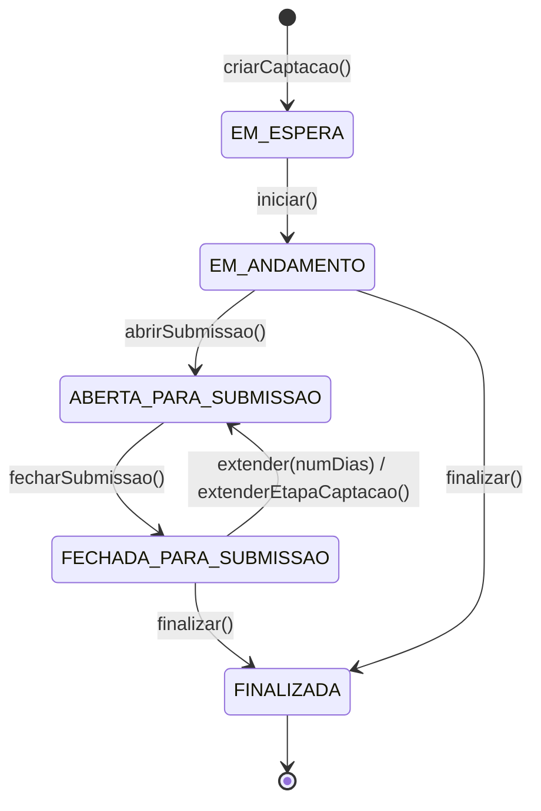
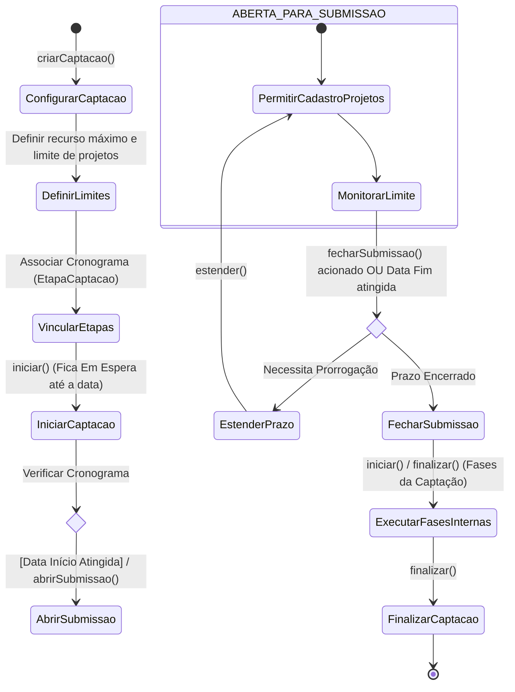

# Modelo Estrutural — P2 Configuracao da Captação

Contexto: [README.md](../README.md) | Modelo consolidado: [modelo-estrutural.md](modelo-estrutural.md) | Por processo: [P1](modelo-estrutural-p1-fomento.md) | [P3](modelo-estrutural-p3-selecao-projetos.md)

---

## P2 - Configuracao da Captação

OBS: Classes me verde fazem parte do V1!

### Estados da Captação

### Glossario de Estados

| Nome | Definicao |
|------|-----------|
| EM_ESPERA | Estado inicial da Captacao criada por `criarCaptacao()`, antes de seu inicio operacional por `iniciar()`. |
| EM_ANDAMENTO | Estado em que a Captacao foi iniciada e aguarda abertura de submissao ou execucao de etapas internas. |
| ABERTA_PARA_SUBMISSAO | Estado em que a Captacao permite cadastro ou submissao de projetos ate o limite configurado ou ate o fechamento do periodo. |
| FECHADA_PARA_SUBMISSAO | Estado em que a submissao foi fechada por prazo, limite ou acionamento manual. Pode voltar para ABERTA_PARA_SUBMISSAO por `extender(numDias)` ou `extenderEtapaCaptacao()`. |
| FINALIZADA | Estado terminal da Captacao, acionado por `finalizar()`, no qual nao podem ser iniciadas novas submissoes, extensoes ou etapas operacionais. |

### Fluxo Captação

---

## Glossario de Classes

| Nome | Definicao | Exemplos |
|------|-----------|----------|
| AnalistaTecnico | Ator responsavel por criar e configurar Captacoes, iniciar o fluxo, abrir e fechar submissao e estender etapas. | Analista criando Captacao de um Fomento ativo; analista estendendo a etapa de submissao por 5 dias. |
| Fomento | Referencia ao Fomento do P1 que origina e governa a Captacao, fornecendo vigencia, etapas base e recursos disponiveis. | Fomento Inovacao Capixaba 2026; Fomento Pesquisa Aplicada em Saude. |
| Captacao | Agregado principal do P2 que representa a configuracao operacional de uma chamada derivada de um Fomento. | Captacao Edital Inovacao 01/2026; Captacao Demanda Induzida Lab X. |
| EstadoCaptacao | Enumeracao que representa o ciclo operacional da Captacao. | `EM_ESPERA`; `ABERTA_PARA_SUBMISSAO`; `FECHADA_PARA_SUBMISSAO`; `FINALIZADA`. |
| EtapaCaptacao | Etapa concreta do cronograma da Captacao, baseada em uma EtapaFomento e com datas proprias. | Submissao de propostas de 01/03 a 31/03; avaliacao documental; resultado final. |
| ExtensaoEtapaCaptacao | Registro da extensao aplicada a uma EtapaCaptacao, com quantidade de dias e justificativa. | Extensao de 7 dias por baixa adesao; extensao de 3 dias por indisponibilidade do sistema. |
| EtapaFomento | Etapa base definida no Fomento e usada como modelo para criar EtapaCaptacao. | Habilitacao documental; avaliacao ad hoc; recurso administrativo. |

---

## Dicionario de Dados

| Classe | Atributo | Definicao | Obrig. | Tipo | Dominio | Tamanho | Unico |
|--------|----------|-----------|--------|------|---------|---------|-------|
| **Captacao** | codigo | Codigo da captacao | Gerado | String | | | Sim |
| | nome | Nome da captacao | Sim | String | | 200 | |
| | dataInicio | Data prevista para inicio operacional da captacao | Sim | Date | Deve estar dentro da vigencia do Fomento | | |
| | dataFim | Data prevista para termino operacional da captacao | Sim | Date | Deve ser posterior ou igual a dataInicio e estar dentro da vigencia do Fomento | | |
| | limiteProjetos | Quantidade maxima de projetos que podem ser cadastrados/submetidos na captacao | Nao | Int | > 0 quando informado | | |
| | recursoMaximo | Valor maximo de recurso alocado para a captacao | Nao | Float | >= 0 quando informado; nao pode exceder recurso disponivel do Fomento | | |
| | estado | Estado da captacao | Sim | EstadoCaptacao | EM_ESPERA, EM_ANDAMENTO, ABERTA_PARA_SUBMISSAO, FECHADA_PARA_SUBMISSAO, FINALIZADA | | |
| | fomento (relacao) | Fomento que origina e governa as etapas base da captacao | Sim | FK -> Fomento | Fomento em estado ativo no P1 | | |
| | etapaAtual (relacao) | EtapaCaptacao atualmente em execucao | Nao | FK -> EtapaCaptacao | Deve pertencer a propria Captacao | | |
| **EstadoCaptacao** | valor | Estado operacional da captacao | Sim | Enum | EM_ESPERA, EM_ANDAMENTO, ABERTA_PARA_SUBMISSAO, FECHADA_PARA_SUBMISSAO, FINALIZADA | | |
| **EtapaCaptacao** | etapaFomento (relacao) | Etapa do Fomento usada como modelo da etapa da captacao | Sim | FK -> EtapaFomento | Deve pertencer ao Fomento da Captacao | | |
| | dtInicio | Data de inicio da etapa na captacao | Sim | Date | Deve estar entre Captacao.dataInicio e Captacao.dataFim | | |
| | dtResultadoParcial | Data prevista para divulgacao de resultado parcial da etapa | Cond. | Date | Obrigatoria quando a etapa gerar resultado parcial | | |
| | dtRecurso | Data prevista para abertura ou limite de recurso da etapa | Cond. | Date | Obrigatoria quando a etapa permitir recurso | | |
| | dtResultadoFinal | Data prevista para divulgacao de resultado final ou encerramento da etapa | Cond. | Date | Obrigatoria quando a etapa gerar resultado final | | |
| | proxima (relacao) | Proxima etapa da captacao na cadeia operacional | Nao | FK -> EtapaCaptacao | Mesma Captacao; nao pode formar ciclo | | |
| **ExtensaoEtapaCaptacao** | numeroDias | Quantidade de dias acrescentados a etapa | Sim | Integer | > 0 | | |
| | justificativa | Justificativa da extensao da etapa | Sim | String | | 1000 | |
| **EtapaFomento** | codigo | Codigo da etapa base definida no Fomento | Sim | String | Herdado do P1 Fomento | 80 | |

---

## Regras de Negocio

| ID | Responsavel | Regra |
|----|-------------|-------|
| RN-CS01 | AnalistaTecnico | A Captacao deve referenciar exatamente um Fomento ativo do P1, apto a originar Captacoes. |
| RN-CS02 | AnalistaTecnico | `Captacao.dataInicio` e `Captacao.dataFim` devem estar dentro da vigencia do Fomento referenciado. |
| RN-CS03 | AnalistaTecnico | `Captacao.dataFim` deve ser posterior ou igual a `Captacao.dataInicio`. |
| RN-CS04 | AnalistaTecnico | Toda Captacao deve possuir ao menos uma EtapaCaptacao vinculada antes de ser iniciada. |
| RN-CS05 | AnalistaTecnico | Toda EtapaCaptacao deve ser baseada em uma EtapaFomento pertencente ao Fomento da Captacao. |
| RN-CS06 | Sistema | A cadeia `EtapaCaptacao.proxima` deve pertencer a mesma Captacao e nao pode formar ciclo. |
| RN-CS07 | Sistema | A Captacao e criada em EM_ESPERA por `criarCaptacao()`. |
| RN-CS08 | AnalistaTecnico | A Captacao so pode transitar de EM_ESPERA para EM_ANDAMENTO por `iniciar()` quando possuir nome, vigencia, Fomento e etapas configuradas. |
| RN-CS09 | Sistema | A abertura de submissao so pode ocorrer em EM_ANDAMENTO quando a data de inicio aplicavel for atingida. |
| RN-CS10 | Sistema | `abrirSubmissao()` transiciona a Captacao de EM_ANDAMENTO para ABERTA_PARA_SUBMISSAO. |
| RN-CS11 | Sistema | Enquanto a Captacao estiver ABERTA_PARA_SUBMISSAO, o cadastro/submissao de projetos fica permitido ate o limite de projetos ou ate o fechamento do periodo. |
| RN-CS12 | Sistema | `fecharSubmissao()` transiciona a Captacao de ABERTA_PARA_SUBMISSAO para FECHADA_PARA_SUBMISSAO quando o prazo de submissao terminar ou o fechamento for acionado. |
| RN-CS13 | AnalistaTecnico | `estender()` so pode ser aplicado em FECHADA_PARA_SUBMISSAO para reabrir submissao com nova data aplicavel e historico da prorrogacao. |
| RN-CS14 | AnalistaTecnico | A Captacao pode ser finalizada a partir de EM_ANDAMENTO quando nao houver abertura de submissao prevista, ou a partir de FECHADA_PARA_SUBMISSAO apos execucao das etapas internas. |
| RN-CS15 | Sistema | FINALIZADA e estado terminal; nenhuma nova submissao, extensao ou etapa operacional pode ser iniciada. |
| RN-CS16 | Sistema | `limiteProjetos`, quando informado, bloqueia novas submissões ao atingir a quantidade maxima configurada. |
| RN-CS17 | Sistema | `recursoMaximo`, quando informado, nao pode exceder o recurso disponivel do Fomento para a Captacao. |
| RN-CS18 | Sistema | As datas `dtInicio`, `dtResultadoParcial`, `dtRecurso` e `dtResultadoFinal` de EtapaCaptacao devem respeitar a ordem operacional definida pela EtapaFomento e permanecer dentro da vigencia da Captacao. |
| RN-CS19 | Sistema | EtapaCaptacao com recurso permitido pela EtapaFomento deve possuir `dtRecurso`; etapas sem recurso nao devem abrir periodo de recurso. |
| RN-CS20 | Sistema | Datas de EtapaCaptacao da mesma Captacao nao podem se sobrepor; a proxima EtapaCaptacao so pode iniciar apos o marco final da etapa anterior. |
| RN-CS21 | AnalistaTecnico | Toda ExtensaoEtapaCaptacao deve possuir `numeroDias > 0` e justificativa. |
| RN-CS22 | Sistema | Ao estender uma EtapaCaptacao, o sistema deve deslocar as etapas posteriores quando necessario para manter a sequencia e impedir sobreposicao de datas. |
| RN-CS23 | Sistema | `etapaAtual`, quando preenchida, deve referenciar uma EtapaCaptacao pertencente a propria Captacao. |

---

## Historico de Alteracoes

| Commit | Data | Autor | Descricao |
|--------|------|-------|-----------|
| `pendente` | 2026-06-24 | Rodrigo Calhau | Adiciona glossarios de classes e de estados ao modelo P2 Configuracao da Captacao |
| `cdc84dd` | 2026-05-31 | Paulo Sergio Santos Junior | Simplificacao e sincronizacao completa do modelo P2 com a ontologia |
| `db4a22b` | 2026-05-31 | Paulo Sergio Santos Junior | Adiciona dicionario de dados e regras ao modelo P2 |
| `23d82e4` | 2026-05-31 | Paulo Sergio Santos Junior | Reorganizacao dos modelos estruturais em pasta modelo-estrutural/ |
