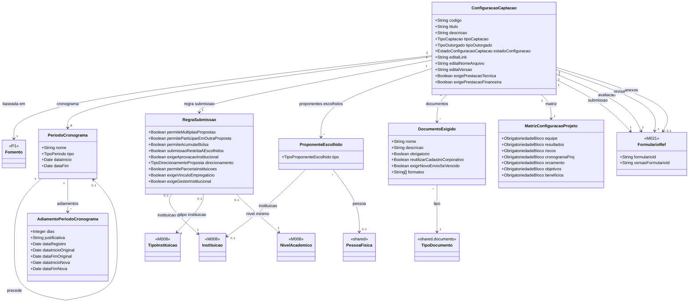

# Modelo Estrutural — P2 Configuracao da Selecao

Contexto: [README.md](../README.md) | Modelo consolidado: [modelo-estrutural.md](modelo-estrutural.md) | Por processo: [P1](modelo-estrutural-p1-fomento.md) | [P3](modelo-estrutural-p3-selecao-projetos.md)

---

## P2 - Configuracao da Selecao

---

## Dicionario de Dados

| Classe | Atributo | Definicao | Obrig. | Tipo | Dominio | Tamanho | Unico |
|--------|----------|-----------|--------|------|---------|---------|-------|
| **ConfiguracaoCaptacao** | codigo | Codigo da captacao | Gerado | String | | | Sim |
| | titulo | Titulo da captacao | Sim | String | | 200 | |
| | descricao | Descricao resumida do objetivo e escopo | Nao | String | | 1000 | |
| | tipoCaptacao | Tipo da captacao | Sim | TipoCaptacao | CHAMADA_PUBLICA, DEMANDA_INDUZIDA | | |
| | tipoOutorgado | Tipo do outorgado | Sim | TipoOutorgado | PESSOA_FISICA, PESSOA_JURIDICA | | |
| | estadoConfiguracao | Estado da configuracao | Sim | EstadoConfiguracaoCaptacao | EM_ANDAMENTO, PUBLICADO, NAO_PUBLICADO, PAUSADO, ENCERRADO, CANCELADO | | |
| | exigePrestacaoTecnica | Indica se projetos gerados exigirao prestacao tecnica | Sim | Boolean | true/false | | |
| | exigePrestacaoFinanceira | Indica se projetos gerados exigirao prestacao financeira | Sim | Boolean | true/false | | |
| | fomento (relacao) | Fomento base; deve estar APROVADO | Sim | FK → Fomento | Fomento.estado = APROVADO | | |
| | faixasSelecionadas (relacao) | Faixas do fomento ativadas nesta captacao | Sim | List<FK → Faixa> | >= 1; pertencentes ao Fomento vinculado | | |
| | editalLink | URL externa do edital | Cond. | String | Ao menos editalLink ou editalNomeArquivo obrigatorio antes da publicacao | 500 | |
| | editalNomeArquivo | Nome do arquivo do edital anexado | Cond. | String | | 300 | |
| | editalVersao | Versao do edital; incrementada a cada retificacao | Sim | String | | 50 | |
| **PeriodoCronograma** | nome | Nome descritivo da fase | Sim | String | | 200 | |
| | proximo (relacao) | Proximo periodo na sequencia do cronograma; nulo para o periodo final | Nao | FK → PeriodoCronograma | | | |
| | tipo | Tipo da fase | Sim | TipoPeriodo | PUBLICACAO_CAPTACAO, RECEBIMENTO_PROPOSTAS, AVALIACAO_DOCUMENTAL, AVALIACAO_AD_HOC, RESULTADO_PRELIMINAR, RECEBIMENTO_REVISAO, RESULTADO_APOS_REVISAO, RESULTADO_FINAL | | |
| | dataInicio | Data de inicio | Sim | Date | | | |
| | dataFim | Data de fim | Sim | Date | | | |
| **AdiamentoPeriodoCronograma** | dias | Dias acrescidos a etapa e posteriores | Sim | Int | > 0 | | |
| | justificativa | Motivo do adiamento | Sim | String | | 500 | |
| | dataRegistro | Data do registro | Gerado | Date | | | |
| | dataInicioOriginal | Data inicial antes do adiamento | Sim | Date | | | |
| | dataFimOriginal | Data final antes do adiamento | Sim | Date | | | |
| | dataInicioNova | Nova data inicial | Sim | Date | | | |
| | dataFimNova | Nova data final | Sim | Date | | | |
| **RegraSubmissao** | permiteMultiplasPropostas | Proponente pode enviar mais de uma proposta | Sim | Boolean | true/false | | |
| | permiteParticiparEmOutraProposta | Coordenador pode participar de outra proposta da mesma captacao | Sim | Boolean | true/false | | |
| | permiteAcumularBolsa | Coordenador pode acumular bolsa ativa em outro projeto | Sim | Boolean | true/false | | |
| | submissaoRestritaAEscolhidos | Apenas proponentes previamente escolhidos podem submeter | Sim | Boolean | true/false | | |
| | exigeAprovacaoInstitucional | Proposta exige assinatura do ResponsavelInstitucional antes da submissao | Sim | Boolean | true/false | | |
| | direcionamento | Define se a proposta e aberta, direcionada a instituicao ou tipo de instituicao | Sim | TipoDirecionamentoProposta | ABERTA, INSTITUICAO, TIPO_INSTITUICAO | | |
| | permiteParceriaInstituicoes | Proposta pode envolver mais de uma instituicao | Sim | Boolean | true/false | | |
| | exigeVinculoEmpregaticio | Proponente deve ter vinculo empregaticio ativo | Sim | Boolean | true/false | | |
| | exigeGestorInstitucional | Proposta deve informar gestor institucional | Sim | Boolean | true/false | | |
| | instituicao (relacao) | Instituicao permitida quando direcionamento=INSTITUICAO | Cond. | FK → Instituicao | Via M008 | | |
| | tipoInstituicao (relacao) | Tipo de instituicao quando direcionamento=TIPO_INSTITUICAO | Cond. | FK → TipoInstituicao | Via M008 | | |
| | nivelAcademicoMinimo (relacao) | Nivel academico minimo exigido do proponente | Nao | FK → NivelAcademico | Via M008 | | |
| **ProponenteEscolhido** | tipo | Tipo de proponente autorizado | Sim | TipoProponenteEscolhido | INSTITUICAO, PESSOA | | |
| | instituicao (relacao) | Instituicao autorizada quando tipo=INSTITUICAO | Cond. | FK → Instituicao | Via M008 | | |
| | pessoa (relacao) | Pessoa autorizada quando tipo=PESSOA | Cond. | FK → PessoaFisica | Via M008 | | |
| **DocumentoExigido** | tipo (relacao) | Tipo do documento exigido; ancora no catalogo compartilhado | Sim | FK → TipoDocumento | Via shared.documents | | |
| | nome | Label especifico do edital; sobrescreve o nome do TipoDocumento quando preenchido | Nao | String | | 200 | |
| | descricao | Orientacao de envio | Nao | String | | 500 | |
| | obrigatorio | Bloqueia submissao quando ausente | Sim | Boolean | true/false | | |
| | reutilizarCadastroCorporativo | Reaproveita documento valido do M008 | Sim | Boolean | true/false | | |
| | exigirNovoEnvioSeVencido | Novo upload quando documento no M008 estiver vencido | Sim | Boolean | true/false | | |
| | formatos | Extensoes de arquivo permitidas | Sim | List<String> | Ex: PDF, DOCX, XLSX | | |
| **MatrizConfiguracaoProjeto** | equipe | Obrigatoriedade do bloco equipe | Sim | ObrigatoriedadeBloco | EXIGIDO, DISPENSADO | | |
| | resultados | Obrigatoriedade do bloco resultados | Sim | ObrigatoriedadeBloco | EXIGIDO, DISPENSADO | | |
| | riscos | Obrigatoriedade do bloco riscos | Sim | ObrigatoriedadeBloco | EXIGIDO, DISPENSADO | | |
| | cronogramaProj | Obrigatoriedade do bloco cronograma do projeto | Sim | ObrigatoriedadeBloco | EXIGIDO, DISPENSADO | | |
| | orcamento | Obrigatoriedade do bloco orcamento | Sim | ObrigatoriedadeBloco | EXIGIDO, DISPENSADO | | |
| | objetivos | Obrigatoriedade do bloco objetivos | Sim | ObrigatoriedadeBloco | EXIGIDO, DISPENSADO | | |
| | beneficios | Obrigatoriedade do bloco beneficios | Sim | ObrigatoriedadeBloco | EXIGIDO, DISPENSADO | | |
| **FormularioRef** | formularioId | Identificador do formulario no M021 | Sim | String | | | |
| | versaoFormularioId | Identificador da versao publicada no M021 | Sim | String | | | |

---

## Regras de Negocio

### Configuracao da Captacao

| ID | Responsavel | Regra |
|----|-------------|-------|
| RN-CS00 | AnalistaTecnico | Rubricas e tipos de projetos sao definidos no Fomento e herdados pela Captacao pelas faixas selecionadas. Nao sao reconfigurados neste processo. |
| RN-CS01 | AnalistaTecnico | A Captacao deve referenciar um Fomento com estado APROVADO. |
| RN-CS02 | AnalistaTecnico | A Captacao deve ter tipo CHAMADA_PUBLICA ou DEMANDA_INDUZIDA. |
| RN-CS03 | AnalistaTecnico | Quando DEMANDA_INDUZIDA, deve ser definido exatamente um ProponenteEscolhido que identifica o destinatario: tipo=PESSOA para PF ou tipo=INSTITUICAO para PJ. |
| RN-CS05 | AnalistaTecnico | A Captacao deve selecionar ao menos uma faixa do Fomento. |
| RN-CS06 | AnalistaTecnico | As faixas selecionadas devem pertencer ao Fomento referenciado. |
| RN-CS07 | AnalistaTecnico | O edital deve conter ao menos um link externo ou arquivo anexado antes da publicacao. |
| RN-CS08 | AnalistaTecnico | O cronograma deve conter as 8 etapas obrigatorias antes da publicacao: PUBLICACAO_CAPTACAO, RECEBIMENTO_PROPOSTAS, AVALIACAO_DOCUMENTAL, AVALIACAO_AD_HOC, RESULTADO_PRELIMINAR, RECEBIMENTO_REVISAO, RESULTADO_APOS_REVISAO e RESULTADO_FINAL. |
| RN-CS09 | AnalistaTecnico | Todas as datas do cronograma devem estar dentro da vigencia do Fomento. |
| RN-CS10 | AnalistaTecnico | Toda Captacao deve selecionar formulario de submissao, avaliacao ad hoc e revisao de resultado no M021. |
| RN-CS11 | AnalistaTecnico | Quando submissao restrita a escolhidos, deve ser selecionada ao menos uma instituicao ou pessoa autorizada. |
| RN-CS14 | AnalistaTecnico | A Captacao so pode ser publicada quando toda a configuracao obrigatoria estiver preenchida. |
| RN-CS15 | AnalistaTecnico | A Captacao so pode ser despublicada quando nenhuma proposta estiver submetida no periodo ativo. |
| RN-CS16 | AnalistaTecnico | O tipo do outorgado deve ser definido em qualquer tipo de chamamento. |
| RN-CS18 | AnalistaTecnico | O edital pode ser retificado informando nova versao. O historico de versoes deve ser preservado. |
| RN-CS19 | AnalistaTecnico | Cada bloco fixo da proposta deve ser configurado como EXIGIDO ou DISPENSADO antes da publicacao. |
| RN-CS20 | Sistema | Blocos configurados como DISPENSADO nao aparecem no formulario de submissao. |
| RN-CS21 | Sistema | Blocos configurados como EXIGIDO sao obrigatorios — proposta nao pode ser submetida sem que estejam preenchidos. |
| RN-CS22 | AnalistaTecnico | O AnalistaTecnico pode exigir documentos adicionais especificos do edital, independentes dos blocos da matriz. |
| RN-CS23 | Sistema | Documentos marcados como obrigatorios bloqueiam a submissao quando ausentes. |
| RN-CS24 | Sistema | Quando reutilizarCadastroCorporativo=true, o sistema verifica documento valido no M008 e o reaproveita. Se vencido e exigirNovoEnvioSeVencido=true, novo upload e solicitado. |
| RN-CS25 | Sistema | Quando exigeAprovacaoInstitucional=true, a assinatura do ResponsavelInstitucional deve ocorrer dentro do periodo de submissao. |
| RN-CS26 | Sistema | Proposta sem assinatura institucional nao pode ser submetida quando exigeAprovacaoInstitucional=true. |
| RN-CS27 | ResponsavelInstitucional | O responsavel assina ou recusa a proposta antes da dataFim do periodo de submissao. Recusa deve ter justificativa. |

### Prorrogacao de Cronograma

| ID | Responsavel | Regra |
|----|-------------|-------|
| RN-PR01 | AnalistaTecnico | Prorrogacao pode ser aplicada a qualquer etapa do cronograma de Captacao com estado PUBLICADO. |
| RN-PR02 | AnalistaTecnico | A quantidade de dias deve ser maior que zero. |
| RN-PR03 | AnalistaTecnico | Justificativa e obrigatoria para toda prorrogacao. |
| RN-PR04 | Sistema | Ao prorrogar uma etapa, todas as etapas com ordem posterior sao deslocadas pelo mesmo numero de dias. |
| RN-PR05 | Sistema | O registro da prorrogacao e imutavel — preserva dataInicioOriginal, dataFimOriginal, dataInicioNova e dataFimNova. |
| RN-PR06 | Sistema | As novas datas nao podem ultrapassar a dataFim do Fomento. Se ultrapassarem, a prorrogacao e bloqueada. |

---

## Historico de Alteracoes

| Commit | Data | Autor | Descricao |
|--------|------|-------|-----------|
| `cdc84dd` | 2026-05-31 | Paulo Sergio Santos Junior | Simplificacao e sincronizacao completa do modelo P2 com a ontologia |
| `db4a22b` | 2026-05-31 | Paulo Sergio Santos Junior | Adiciona dicionario de dados e regras ao modelo P2 |
| `23d82e4` | 2026-05-31 | Paulo Sergio Santos Junior | Reorganizacao dos modelos estruturais em pasta modelo-estrutural/ |
| `a718782` | 2026-05-31 | Paulo Sergio Santos Junior | Renomeia TipoIniciativa para TipoProjeto |
| `6b209d7` | 2026-05-29 | victoriocarvalho | Adicao da classe Fomento e outros ajustes |
