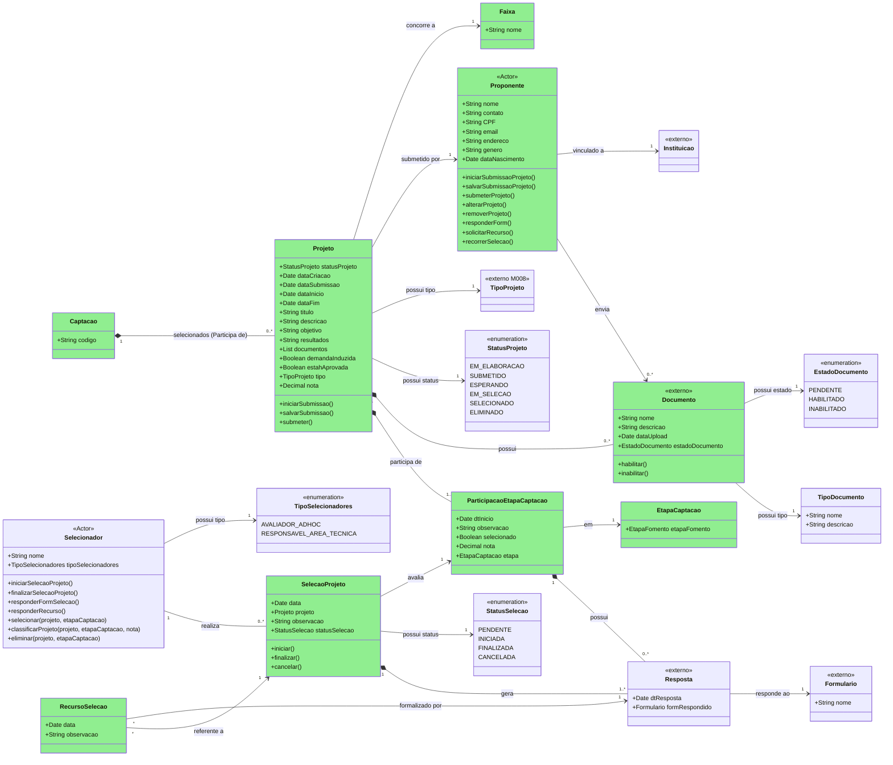
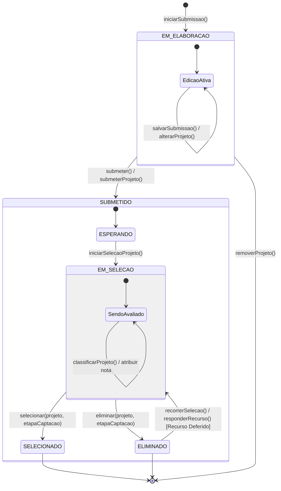
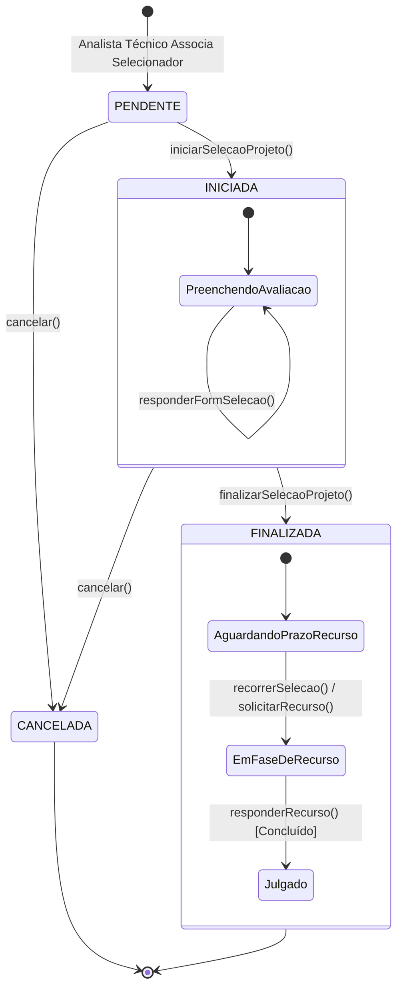
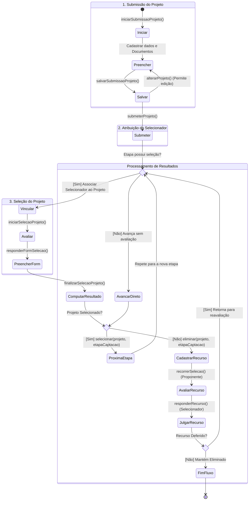

# Modelo Estrutural — P3 Selecao dos Projetos

Contexto: [README.md](../README.md) | Por processo: [P1](modelo-estrutural-p1-fomento.md) | [P2](modelo-estrutural-p2-configuracao-selecao.md)

---

## P3 - Selecao dos Projetos

Este recorte modela os artefatos conceituais da execucao da selecao. A configuracao base vem da
`Captacao` configurada no P2; a contratacao/outorga posterior pertence ao M022.

OBS: Classes em verde fazem parte do V1!

### Glossario de Classes

| Nome | Definicao | Exemplos |
|------|-----------|----------|
| Captacao | Instancia configurada no P2 que executa o processo de recebimento, selecao e resultado dos projetos. | Captacao do Edital Universal 2026; chamada de demanda induzida para uma instituicao especifica. |
| Faixa | Recorte de concorrencia ou financiamento herdado do Fomento, escolhido pelo Projeto na submissao. | Faixa A ate R$ 50.000; Faixa B para projetos multi-institucionais. |
| EtapaCaptacao | Etapa concreta do cronograma da Captacao, baseada em uma EtapaFomento e usada para controlar submissao, avaliacao, recurso ou resultado. | Periodo de submissao; avaliacao documental; avaliacao de merito; resultado final. |
| Formulario | Referencia externa ao formulario usado para coletar respostas de submissao, avaliacao ou recurso. | Formulario de submissao do projeto; formulario de avaliacao ad hoc; formulario de recurso. |
| Instituicao | Organizacao externa vinculada ao Proponente e usada em regras de elegibilidade ou conflito de interesses. | UFES; IFES; startup credenciada. |
| TipoProjeto | Classificacao externa do M008 que identifica o tipo de projeto aceito pela Captacao. | Pesquisa cientifica; desenvolvimento tecnologico; inovacao. |
| TipoDocumento | Tipo documental exigido ou aceito para compor a submissao do Projeto. | Plano de trabalho; curriculo; carta de anuencia institucional. |
| Proponente | Ator responsavel por elaborar, salvar, submeter e eventualmente recorrer da selecao de um Projeto. | Pesquisador responsavel; contato PF de uma PJ em demanda induzida. |
| Projeto | Proposta submetida a uma Captacao, com dados, documentos, faixa, tipo, participacoes em etapas e resultado de selecao. | Projeto de pesquisa em saude publica; projeto de inovacao para laboratorio compartilhado. |
| StatusProjeto | Enumeracao que representa o ciclo do Projeto desde a elaboracao ate a selecao ou eliminacao. | EM_ELABORACAO; EM_SELECAO; SELECIONADO. |
| Documento | Arquivo anexado ao Projeto e analisado conforme o tipo documental exigido. | PDF do plano de trabalho; comprovante de vinculo; declaracao assinada. |
| EstadoDocumento | Enumeracao que indica a situacao da analise documental de um Documento. | PENDENTE; HABILITADO; INABILITADO. |
| ParticipacaoEtapaCaptacao | Registro da passagem de um Projeto por uma EtapaCaptacao, com nota, observacao, respostas e resultado da etapa. | Participacao do projeto na avaliacao documental; participacao na avaliacao de merito. |
| RecursoSelecao | Registro da contestacao apresentada pelo Proponente contra uma SelecaoProjeto finalizada e de sua decisao. | Recurso contra eliminacao documental; recurso contra nota de merito. |
| Resposta | Preenchimento de um Formulario em uma submissao, avaliacao ou recurso. | Respostas do formulario de avaliacao; respostas do formulario de recurso. |
| Selecionador | Ator autorizado a avaliar, classificar, selecionar, eliminar ou responder recurso de um Projeto. | Avaliador ad hoc; responsavel da area tecnica. |
| TipoSelecionadores | Enumeracao que define o perfil do Selecionador no processo de selecao. | AVALIADOR_ADHOC; RESPONSAVEL_AREA_TECNICA. |
| SelecaoProjeto | Avaliacao de uma ParticipacaoEtapaCaptacao realizada por um Selecionador, com estado proprio e respostas associadas. | Avaliacao de merito feita por avaliador ad hoc; avaliacao tecnica de habilitacao. |
| StatusSelecao | Enumeracao que representa o ciclo da avaliacao realizada por um Selecionador. | PENDENTE; INICIADA; FINALIZADA; CANCELADA. |

### Estados de Projeto

#### Glossario de Estados de Projeto

| Nome | Definicao |
|------|-----------|
| EM_ELABORACAO | Estado inicial em que o Proponente pode preencher, salvar, alterar ou remover o Projeto antes da submissao formal. |
| EdicaoAtiva | Subestado interno de EM_ELABORACAO em que os dados e documentos do Projeto permanecem editaveis. |
| SUBMETIDO | Estado composto iniciado apos a submissao formal do Projeto, quando ele passa a participar da Captacao. |
| ESPERANDO | Subestado de SUBMETIDO em que o Projeto aguarda inicio de selecao ou avanco para a etapa aplicavel. |
| EM_SELECAO | Estado em que o Projeto esta sendo avaliado, classificado ou decidido por um Selecionador. |
| SendoAvaliado | Subestado interno de EM_SELECAO em que notas, classificacao ou respostas de avaliacao podem ser registradas. |
| SELECIONADO | Estado terminal em que o Projeto foi aprovado/selecionado ao fim da etapa ou do fluxo aplicavel. |
| ELIMINADO | Estado em que o Projeto foi reprovado ou eliminado; pode retornar a EM_SELECAO quando houver recurso deferido. |

### Estados da Seleção de Projetos

#### Glossario de Estados de SelecaoProjeto

| Nome | Definicao |
|------|-----------|
| PENDENTE | Estado inicial da SelecaoProjeto apos o AnalistaTecnico associar um Selecionador ao Projeto. |
| INICIADA | Estado em que o Selecionador iniciou a avaliacao e pode responder formularios ou registrar analise. |
| PreenchendoAvaliacao | Subestado interno de INICIADA em que o formulario de selecao esta sendo preenchido. |
| FINALIZADA | Estado em que a avaliacao foi concluida e o resultado fica sujeito ao prazo de recurso, quando aplicavel. |
| AguardandoPrazoRecurso | Subestado interno de FINALIZADA em que o sistema aguarda eventual recurso do Proponente dentro da janela configurada. |
| EmFaseDeRecurso | Subestado interno de FINALIZADA em que um recurso foi apresentado e aguarda resposta. |
| Julgado | Subestado interno de FINALIZADA em que o recurso foi respondido e a decisao ficou registrada. |
| CANCELADA | Estado terminal da SelecaoProjeto cancelada antes da conclusao da avaliacao. |

### Fluxo Seleção de Projetos

---

## Dicionario de Dados

| Classe | Atributo | Definicao | Obrig. | Tipo | Dominio | Tamanho | Unico |
|--------|----------|-----------|--------|------|---------|---------|-------|
| **Captacao** | codigo | Codigo da captacao que executa a selecao | Sim | String | Herdado do P2 | 80 | Sim |
| **Captacao** | projetos (relacao) | Projetos vinculados a captacao em execucao | Gerado | List<Projeto> | 0..* projetos selecionados/participantes | | |
| **Faixa** | nome | Nome da faixa do Fomento escolhida pelo Projeto | Sim | String | Herdado do P1 Fomento | 200 | |
| **EtapaCaptacao** | etapaFomento (relacao) | Etapa base do Fomento usada para parametrizar a etapa concreta da Captacao | Sim | FK -> EtapaFomento | Deve pertencer ao Fomento da Captacao | | |
| **Formulario** | nome | Nome do formulario externo respondido na submissao, selecao ou recurso | Sim | String | Modulo proprietario externo | 200 | |
| **Instituicao** | referenciaExterna | Referencia corporativa da instituicao vinculada ao Proponente | Sim | Referencia externa | Cadastro institucional externo | | |
| **TipoProjeto** | referenciaExterna | Tipo de projeto mantido pelo modulo proprietario | Sim | Referencia externa | Deve estar permitido no Fomento vinculado a Captacao | | |
| **TipoDocumento** | nome | Nome do tipo documental solicitado ao Projeto | Sim | String | Configuracao documental do Fomento/Captacao | 200 | |
| | descricao | Descricao ou finalidade do tipo documental | Nao | String | | 500 | |
| **Proponente** | nome | Nome do proponente que submete o Projeto | Sim | String | Via cadastro corporativo/M008 quando aplicavel | 200 | |
| | contato | Telefone ou canal principal de contato do proponente | Nao | String | | 100 | |
| | CPF | CPF do proponente pessoa fisica | Cond. | String | 11 digitos quando pessoa fisica | 11 | Sim |
| | email | Email do proponente | Sim | String | Formato de email valido | 254 | |
| | endereco | Endereco informado no cadastro do proponente | Nao | String | | 500 | |
| | genero | Genero informado pelo proponente, quando coletado | Nao | String | Dominio cadastral externo | 80 | |
| | dataNascimento | Data de nascimento do proponente pessoa fisica | Cond. | Date | Obrigatoria quando exigida pelo cadastro/edital | | |
| | instituicao (relacao) | Instituicao vinculada ao proponente | Sim | FK -> Instituicao | Instituicao habilitada conforme Captacao | | |
| **Projeto** | statusProjeto | Estado do Projeto no ciclo de submissao e selecao | Sim | StatusProjeto | EM_ELABORACAO, SUBMETIDO, ESPERANDO, EM_SELECAO, SELECIONADO, ELIMINADO | | |
| | dataCriacao | Data de inicio da submissao do Projeto | Gerado | Date | | | |
| | dataSubmissao | Data da submissao formal do Projeto | Cond. | Date | Obrigatoria a partir de SUBMETIDO | | |
| | dataInicio | Data de inicio proposta para execucao do Projeto | Cond. | Date | Deve ser anterior ou igual a dataFim quando ambas existirem | | |
| | dataFim | Data de fim proposta para execucao do Projeto | Cond. | Date | Deve ser posterior ou igual a dataInicio quando ambas existirem | | |
| | titulo | Titulo do Projeto submetido | Sim | String | | 250 | |
| | descricao | Descricao geral do Projeto | Sim | String | | 4000 | |
| | objetivo | Objetivo principal do Projeto | Sim | String | | 2000 | |
| | resultados | Resultados esperados ou consolidados do Projeto | Nao | String | | 4000 | |
| | documentos | Documentos anexados ao Projeto | Cond. | List<Documento> | Deve atender aos TipoDocumento exigidos pela Captacao | | |
| | demandaInduzida | Indica se o Projeto pertence a uma Captacao de demanda induzida | Sim | Boolean | true/false | | |
| | estahAprovada | Indica aprovacao final do Projeto no P3 | Gerado | Boolean | true somente apos selecao final sem etapa pendente | | |
| | tipo (relacao) | Tipo do Projeto | Sim | FK -> TipoProjeto | Deve estar permitido pelo Fomento da Captacao | | |
| | nota | Nota consolidada do Projeto na etapa corrente ou resultado final | Cond. | Decimal | >= 0 quando houver avaliacao com nota | | |
| | proponente (relacao) | Proponente responsavel pela submissao | Sim | FK -> Proponente | Pessoa/instituicao autorizada conforme Captacao | | |
| | faixa (relacao) | Faixa do Fomento escolhida para concorrencia | Sim | FK -> Faixa | Deve pertencer ao Fomento da Captacao | | |
| | captacao (relacao) | Captacao na qual o Projeto participa | Sim | FK -> Captacao | Captacao aberta para submissao no P2 | | |
| **StatusProjeto** | valor | Estado de ciclo de vida do Projeto no P3 | Sim | Enum | EM_ELABORACAO, SUBMETIDO, ESPERANDO, EM_SELECAO, SELECIONADO, ELIMINADO | | |
| **Documento** | nome | Nome do documento anexado ao Projeto | Sim | String | | 200 | |
| | descricao | Descricao ou finalidade do documento | Nao | String | | 500 | |
| | dataUpload | Data de envio do documento | Gerado | Date | | | |
| | estadoDocumento | Estado de habilitacao do documento | Sim | EstadoDocumento | PENDENTE, HABILITADO, INABILITADO | | |
| | tipoDocumento (relacao) | Tipo documental atendido pelo anexo | Sim | FK -> TipoDocumento | TipoDocumento exigido/aceito pela Captacao | | |
| **EstadoDocumento** | valor | Estado da analise documental do documento | Sim | Enum | PENDENTE, HABILITADO, INABILITADO | | |
| **ParticipacaoEtapaCaptacao** | dtInicio | Data em que o Projeto iniciou participacao na etapa | Gerado | Date | Deve estar dentro da vigencia da EtapaCaptacao | | |
| | observacao | Observacao consolidada da participacao do Projeto na etapa | Nao | String | | 1000 | |
| | selecionado | Indica se o Projeto foi selecionado/aprovado na etapa | Cond. | Boolean | true/false; preenchido apos avaliacao ou avanco automatico | | |
| | nota | Nota final do Projeto na etapa | Cond. | Decimal | >= 0; obrigatoria quando a etapa possuir criterio com nota | | |
| | etapa (relacao) | Etapa da Captacao em que o Projeto participa | Sim | FK -> EtapaCaptacao | Deve pertencer a Captacao do Projeto | | |
| | respostas (relacao) | Respostas coletadas para a participacao na etapa | Nao | List<Resposta> | Formularios configurados para a etapa | | |
| **Resposta** | dtResposta | Data em que o formulario foi respondido | Gerado | Date | | | |
| | formRespondido (relacao) | Formulario usado na submissao, avaliacao ou recurso | Sim | FK -> Formulario | Formulario externo publicado/ativo | | |
| **Selecionador** | nome | Nome do selecionador responsavel por avaliar uma participacao | Sim | String | Pessoa fisica ou papel funcional autorizado | 200 | |
| | tipoSelecionadores | Tipo do selecionador | Sim | TipoSelecionadores | AVALIADOR_ADHOC, RESPONSAVEL_AREA_TECNICA | | |
| **TipoSelecionadores** | valor | Perfil do selecionador | Sim | Enum | AVALIADOR_ADHOC, RESPONSAVEL_AREA_TECNICA | | |
| **SelecaoProjeto** | data | Data de criacao ou movimentacao da selecao do projeto | Gerado | Date | | | |
| | projeto (relacao) | Projeto avaliado | Sim | FK -> Projeto | Mesmo Projeto da ParticipacaoEtapaCaptacao avaliada | | |
| | observacao | Parecer ou observacao do selecionador | Nao | String | Obrigatoria quando statusSelecao=CANCELADA | 2000 | |
| | statusSelecao | Estado da selecao do projeto | Sim | StatusSelecao | PENDENTE, INICIADA, FINALIZADA, CANCELADA | | |
| | participacaoEtapa (relacao) | Participacao do Projeto na etapa avaliada | Sim | FK -> ParticipacaoEtapaCaptacao | Deve pertencer ao mesmo Projeto avaliado | | |
| | selecionador (relacao) | Selecionador associado a avaliacao | Sim | FK -> Selecionador | Deve possuir tipo compativel com a EtapaFomento/CriterioSelecao | | |
| | respostas (relacao) | Respostas de formulario geradas na selecao | Cond. | List<Resposta> | Obrigatorias quando a etapa/criterio exigir formulario | | |
| **StatusSelecao** | valor | Estado da avaliacao realizada por selecionador | Sim | Enum | PENDENTE, INICIADA, FINALIZADA, CANCELADA | | |
| **RecursoSelecao** | data | Data de solicitacao ou julgamento do recurso | Gerado | Date | | | |
| | observacao | Justificativa, argumento ou decisao do recurso | Sim | String | | 2000 | |
| | resposta (relacao) | Resposta de formulario que formaliza o recurso ou julgamento | Sim | FK -> Resposta | Formulario de recurso/julgamento quando configurado | | |
| | selecaoProjeto (relacao) | Selecao contestada pelo proponente | Sim | FK -> SelecaoProjeto | SelecaoProjeto.statusSelecao = FINALIZADA | | |

---

## Regras de Negocio

### Submissao de Projetos

| ID | Responsavel | Regra |
|----|-------------|-------|
| RN-SP01 | Proponente | O Projeto so pode ser iniciado, salvo ou submetido enquanto a Captacao permitir submissao conforme o estado operacional do P2, especialmente `ABERTA_PARA_SUBMISSAO`, respeitando `limiteProjetos` quando configurado. |
| RN-SP02 | Proponente | Enquanto estiver em `EM_ELABORACAO`, o Projeto pode ser salvo, alterado ou removido pelo Proponente; a remocao encerra o fluxo sem gerar participacao em etapa. |
| RN-SP03 | Proponente | Todo Projeto submetido deve informar exatamente uma Captacao, um Proponente, uma Faixa, um TipoProjeto e os dados obrigatorios definidos pela Captacao. |
| RN-SP04 | Sistema | A Faixa e o TipoProjeto escolhidos pelo Projeto devem pertencer ao Fomento que originou a Captacao. |
| RN-SP05 | Sistema | Quando `demandaInduzida=true`, o Proponente deve corresponder ao outorgado ou contato autorizado definido para a Captacao de demanda induzida. |
| RN-SP06 | Sistema | `dataInicio` e `dataFim` do Projeto, quando informadas, devem formar um periodo coerente, com `dataInicio <= dataFim`. |
| RN-SP07 | Sistema | `submeter()`/`submeterProjeto()` registra `dataSubmissao`, transiciona o Projeto de `EM_ELABORACAO` para `SUBMETIDO` e coloca o Projeto em espera pela primeira etapa aplicavel. |
| RN-SP08 | Sistema | Ao submeter Projeto, o sistema deve gerar a primeira `ParticipacaoEtapaCaptacao` para a primeira `EtapaCaptacao` aplicavel da Captacao. |
| RN-SP09 | Sistema | Documentos exigidos pela Captacao devem ser registrados como `Documento`, associados ao respectivo `TipoDocumento` e iniciar com `estadoDocumento=PENDENTE`. |
| RN-SP10 | Sistema | `Documento` so pode transitar para `HABILITADO` ou `INABILITADO` durante uma etapa de avaliacao documental ou etapa equivalente configurada no Fomento/Captacao. |
| RN-SP11 | AnalistaTecnico | Documento `INABILITADO` deve possuir observacao ou justificativa registrada na `ParticipacaoEtapaCaptacao` ou na `SelecaoProjeto` correspondente. |

### Avaliacao e Resultado

| ID | Responsavel | Regra |
|----|-------------|-------|
| RN-SP12 | Sistema | Toda `ParticipacaoEtapaCaptacao` deve referenciar uma `EtapaCaptacao` pertencente a Captacao do Projeto e iniciar com `dtInicio` dentro da vigencia da etapa. |
| RN-SP13 | Sistema | Se a `EtapaCaptacao` nao exigir selecao, recurso ou eliminacao, o Projeto pode avancar automaticamente com `selecionado=true` na participacao da etapa. |
| RN-SP14 | AnalistaTecnico | Quando a etapa exigir avaliacao, o AnalistaTecnico deve associar um `Selecionador` ao Projeto, gerando `SelecaoProjeto` com `statusSelecao=PENDENTE`. |
| RN-SP15 | Sistema | Cada `SelecaoProjeto` deve avaliar exatamente uma `ParticipacaoEtapaCaptacao`, e o Projeto da selecao deve ser o mesmo Projeto da participacao avaliada. |
| RN-SP16 | Selecionador | Somente o `Selecionador` associado pode iniciar, responder formulario de selecao, classificar, selecionar, eliminar ou finalizar a `SelecaoProjeto`. |
| RN-SP17 | Sistema | `iniciarSelecaoProjeto()` transiciona `SelecaoProjeto` de `PENDENTE` para `INICIADA` e coloca o Projeto em `EM_SELECAO`. |
| RN-SP18 | Sistema | `cancelar()` transiciona `SelecaoProjeto` de `PENDENTE` ou `INICIADA` para `CANCELADA` e exige observacao quando o cancelamento for manual. |
| RN-SP19 | Selecionador | `SelecaoProjeto` `INICIADA` pode receber uma ou mais `Resposta` de formulario de selecao conforme a configuracao da etapa/criterio. |
| RN-SP20 | Selecionador | `finalizarSelecaoProjeto()` so pode transicionar `SelecaoProjeto` de `INICIADA` para `FINALIZADA` quando as respostas obrigatorias e a nota aplicavel estiverem salvas. |
| RN-SP21 | Sistema | Ao finalizar a selecao, a nota e a observacao consolidadas devem atualizar a `ParticipacaoEtapaCaptacao` avaliada e, quando aplicavel, a nota consolidada do Projeto. |
| RN-SP22 | Sistema | Quando a nota final cumprir o criterio de corte da etapa/criterio, `ParticipacaoEtapaCaptacao.selecionado` deve ser `true`; quando nao cumprir, deve ser `false`. |
| RN-SP23 | Sistema | `selecionar(projeto, etapaCaptacao)` marca a participacao da etapa como selecionada; se houver proxima etapa, cria nova `ParticipacaoEtapaCaptacao`, caso contrario transiciona o Projeto para `SELECIONADO` e define `estahAprovada=true`. |
| RN-SP24 | Sistema | `eliminar(projeto, etapaCaptacao)` marca a participacao da etapa como nao selecionada e transiciona o Projeto para `ELIMINADO`, salvo posterior deferimento de recurso. |
| RN-SP25 | Sistema | Um `Selecionador` do tipo `AVALIADOR_ADHOC` nao pode avaliar Projeto vinculado a sua propria instituicao quando essa informacao estiver disponivel. |

### Recurso e Encerramento

| ID | Responsavel | Regra |
|----|-------------|-------|
| RN-SP26 | Proponente | `RecursoSelecao` so pode ser solicitado pelo Proponente do Projeto apos `SelecaoProjeto` `FINALIZADA` e dentro da janela de recurso da `EtapaCaptacao`. |
| RN-SP27 | Sistema | `RecursoSelecao` deve referenciar a `SelecaoProjeto` contestada e a `Resposta` que formaliza a contestacao ou decisao. |
| RN-SP28 | Selecionador | Todo julgamento de recurso deve registrar observacao com a decisao tomada por meio de `responderRecurso()`. |
| RN-SP29 | Sistema | Recurso deferido retorna o Projeto de `ELIMINADO` para `EM_SELECAO`, permite reavaliacao da `SelecaoProjeto` e pode alterar `ParticipacaoEtapaCaptacao.selecionado` para `true`. |
| RN-SP30 | Sistema | Recurso indeferido mantem o resultado anterior da `SelecaoProjeto` e encerra a participacao do Projeto na etapa quando ele estiver eliminado. |
| RN-SP31 | Sistema | O P3 usa `StatusProjeto` para o ciclo do Projeto e `StatusSelecao` para a avaliacao por selecionador; esses estados nao substituem o `EstadoCaptacao` operacional definido no P2. |

---

## Historico de Alteracoes

| Commit | Data | Autor | Descricao |
|--------|------|-------|-----------|
| `76c474f` | 2026-05-31 | Paulo Sergio Santos Junior | RevisorAdHoc modelado como papel de PessoaFisica; DistribuicaoAvaliacao passa a referenciar PessoaFisica diretamente |
| `3373b22` | 2026-05-31 | Paulo Sergio Santos Junior | Adiciona estado NAO_RESPONDEU e campo dataLimiteResposta em DistribuicaoAvaliacao |
| `5e8a6c3` | 2026-05-31 | Paulo Sergio Santos Junior | Modela recusa de avaliacao ad hoc (RECUSADA + justificativa) e distribuicao multipla de revisores |
| `b2caa00` | 2026-05-31 | Paulo Sergio Santos Junior | Atualiza modelo P3: Proposta renomeada para Projeto (externo M008); adiciona datas de submissao e avaliacao; respostasFormulario em AvaliacaoAdHoc |
| `db4a22b` | 2026-05-31 | Paulo Sergio Santos Junior | Adiciona dicionario de dados e regras de negocio ao modelo P3 |
| `23d82e4` | 2026-05-31 | Paulo Sergio Santos Junior | Reorganizacao dos modelos estruturais em pasta modelo-estrutural/ |
