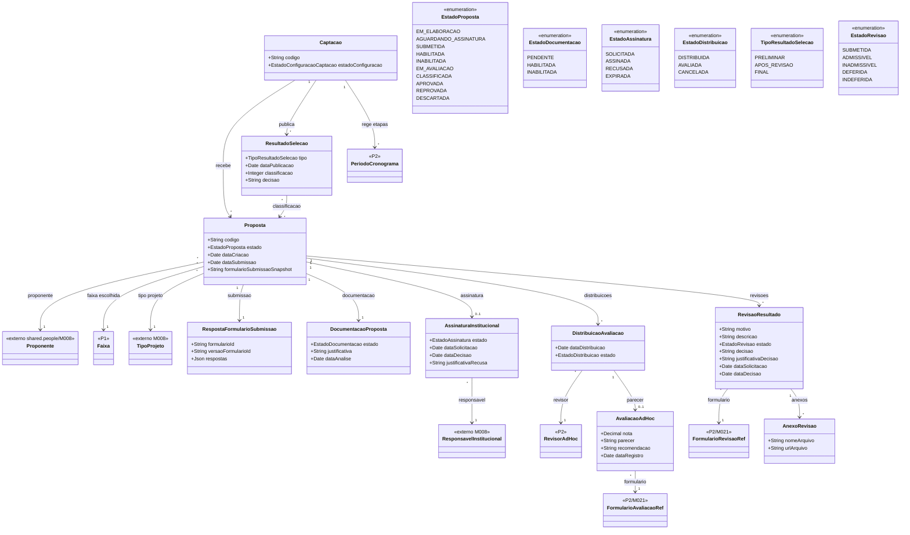

# Modelo Estrutural — P3 Selecao dos Projetos

Contexto: [README.md](../README.md) | Modelo consolidado: [modelo-estrutural.md](modelo-estrutural.md) | Por processo: [P1](modelo-estrutural-p1-fomento.md) | [P2](modelo-estrutural-p2-configuracao-selecao.md)

---

## P3 - Selecao dos Projetos

Este recorte modela os artefatos conceituais da execucao da selecao. A configuracao base vem da
`Captacao` publicada no P2; a contratacao/outorga posterior pertence ao M022.

---

## Dicionario de Dados

| Classe | Atributo | Definicao | Obrig. | Tipo | Dominio | Tamanho | Unico |
|--------|----------|-----------|--------|------|---------|---------|-------|
| **Proposta** | codigo | Codigo da proposta | Gerado | String | | | Sim |
| | estado | Estado atual da proposta | Sim | EstadoProposta | EM_ELABORACAO, AGUARDANDO_ASSINATURA, SUBMETIDA, HABILITADA, INABILITADA, EM_AVALIACAO, CLASSIFICADA, APROVADA, REPROVADA, DESCARTADA | | |
| | dataCriacao | Data de criacao da proposta | Gerado | Date | | | |
| | dataSubmissao | Data de submissao formal da proposta | Cond. | Date | Preenchida apos submissao | | |
| | formularioSubmissaoSnapshot | Snapshot do formulario de submissao no momento do envio | Gerado | String (JSON) | Conteudo do formulario respondido no M021 | | |
| | proponente (relacao) | Pessoa fisica ou juridica que submete a proposta | Sim | FK → Proponente | Via M008 | | |
| | faixa (relacao) | Faixa do fomento escolhida pelo proponente | Sim | FK → Faixa | Deve pertencer ao Fomento da Captacao | | |
| | tipoProjeto (relacao) | Tipo de projeto da proposta | Sim | FK → TipoProjeto | Via M008 | | |
| **RespostaFormularioSubmissao** | formularioId | Identificador do formulario no M021 | Sim | String | | | |
| | versaoFormularioId | Versao do formulario usada na submissao | Sim | String | | | |
| | respostas | Conteudo das respostas em formato estruturado | Sim | Json | Snapshot imutavel apos submissao | | |
| **DocumentacaoProposta** | estado | Estado da analise documental | Sim | EstadoDocumentacao | PENDENTE, HABILITADA, INABILITADA | | |
| | justificativa | Justificativa da inabilitacao | Cond. | String | Obrigatoria quando estado=INABILITADA | 500 | |
| | dataAnalise | Data em que a analise documental foi registrada | Cond. | Date | | | |
| **AssinaturaInstitucional** | estado | Estado da assinatura | Sim | EstadoAssinatura | SOLICITADA, ASSINADA, RECUSADA, EXPIRADA | | |
| | dataSolicitacao | Data em que a assinatura foi solicitada ao responsavel | Gerado | Date | | | |
| | dataDecisao | Data em que o responsavel assinou ou recusou | Cond. | Date | | | |
| | justificativaRecusa | Motivo da recusa informado pelo responsavel | Cond. | String | Obrigatoria quando estado=RECUSADA | 500 | |
| | responsavel (relacao) | Responsavel institucional que deve assinar a proposta | Sim | FK → ResponsavelInstitucional | Via M008 | | |
| **DistribuicaoAvaliacao** | dataDistribuicao | Data em que a proposta foi distribuida ao revisor | Gerado | Date | | | |
| | estado | Estado da distribuicao | Sim | EstadoDistribuicao | DISTRIBUIDA, AVALIADA, CANCELADA | | |
| | revisor (relacao) | Revisor ad hoc que recebeu a proposta | Sim | FK → RevisorAdHoc | Do pool configurado no P2 | | |
| **AvaliacaoAdHoc** | nota | Nota atribuida pelo revisor a proposta | Sim | Decimal | >= 0 | | |
| | parecer | Texto do parecer tecnico do revisor | Sim | String | | 3000 | |
| | recomendacao | Recomendacao do revisor sobre a proposta | Sim | String | Ex: Aprovada, Reprovada, Aprovada com ressalvas | 200 | |
| | dataRegistro | Data do registro da avaliacao | Gerado | Date | | | |
| | distribuicao (relacao) | Distribuicao de avaliacao a qual este parecer pertence | Sim | FK → DistribuicaoAvaliacao | | | |
| **ResultadoSelecao** | tipo | Tipo do resultado publicado | Sim | TipoResultadoSelecao | PRELIMINAR, APOS_REVISAO, FINAL | | |
| | dataPublicacao | Data de publicacao do resultado | Gerado | Date | | | |
| | classificacao | Classificacao da proposta no resultado | Nao | Integer | >= 1; nulo para propostas reprovadas | | |
| | decisao | Decisao final registrada para a proposta neste resultado | Sim | String | Ex: Aprovada, Reprovada, Em lista de espera | 200 | |
| | proposta (relacao) | Proposta avaliada neste resultado | Sim | FK → Proposta | | | |
| **RevisaoResultado** | motivo | Motivo principal da solicitacao de revisao | Sim | String | | 200 | |
| | descricao | Descricao detalhada da contestacao | Sim | String | | 3000 | |
| | estado | Estado do processamento da revisao | Sim | EstadoRevisao | SUBMETIDA, ADMISSIVEL, INADMISSIVEL, DEFERIDA, INDEFERIDA | | |
| | decisao | Decisao final da revisao | Cond. | String | Obrigatoria quando estado=DEFERIDA ou INDEFERIDA | 200 | |
| | justificativaDecisao | Justificativa da decisao sobre a revisao | Cond. | String | | 1000 | |
| | dataSolicitacao | Data de submissao da solicitacao de revisao | Gerado | Date | | | |
| | dataDecisao | Data em que a decisao foi registrada | Cond. | Date | | | |
| **AnexoRevisao** | nomeArquivo | Nome do arquivo anexado a revisao | Sim | String | | 300 | |
| | urlArquivo | URL de acesso ao arquivo | Sim | String | | 500 | |

---

## Regras de Negocio

### Submissao de Propostas

| ID | Responsavel | Regra |
|----|-------------|-------|
| RN-SP01 | AnalistaTecnico | A captacao somente fica visivel para os proponentes a partir da data de publicacao definida no cronograma. |
| RN-SP02 | Proponente | Propostas somente podem ser submetidas entre a data inicial e a data final do periodo de recebimento. |
| RN-SP03 | Proponente | Quando exigeAprovacaoInstitucional=true, a proposta so pode ser submetida apos a assinatura do ResponsavelInstitucional. |
| RN-SP04 | ResponsavelInstitucional | A assinatura institucional deve ocorrer dentro do periodo de submissao. Recusa deve ter justificativa e devolve a proposta ao proponente. |
| RN-SP11 | AnalistaTecnico | Quando tipoCaptacao=DEMANDA_INDUZIDA e outorgado for PJ, a proposta e conduzida pelo contato PF indicado na configuracao. |

### Avaliacao e Resultado

| ID | Responsavel | Regra |
|----|-------------|-------|
| RN-SP05 | AnalistaTecnico | Somente propostas com documentacao habilitada seguem para analise de merito. Inabilitacao requer justificativa. |
| RN-SP06 | RevisorAdHoc | Revisores somente podem registrar pareceres dentro do periodo de analise de merito. |
| RN-SP07 | AnalistaTecnico | O resultado preliminar deve ser publicado antes do inicio do periodo de recursos. |
| RN-SP08 | Proponente | Solicitacoes de revisao somente podem ser enviadas dentro do periodo de recursos. |
| RN-SP09 | AnalistaTecnico | O resultado final somente pode ser publicado apos o encerramento e analise de todas as revisoes admissiveis. |
| RN-SP10 | AnalistaTecnico | A publicacao do resultado final encerra o processo de selecao no M011. |
| RN-SP12 | AnalistaTecnico | Propostas aprovadas ficam disponiveis para consumo pelo M022 apos a publicacao do resultado final. |

### Pausa, Cancelamento e Expiracao

| ID | Responsavel | Regra |
|----|-------------|-------|
| RN-SP13 | GestorFAPES | O processo de selecao pode ser pausado em qualquer ponto apos a publicacao da captacao. A pausa requer justificativa obrigatoria. |
| RN-SP14 | Sistema | Durante a pausa, nenhuma operacao e permitida: proponentes nao podem submeter nem solicitar revisao, revisores nao podem registrar pareceres, e o AnalistaTecnico nao pode avancar etapas. |
| RN-SP15 | Sistema | A retomada e bloqueada enquanto existir periodo futuro nao concluido com dataFim anterior a data de retomada. O GestorFAPES deve registrar AdiamentoPeriodoCronograma para cada periodo expirado antes de acionar a retomada. |
| RN-SP16 | Sistema | Quando RESULTADO_FINAL.dataFim e atingida sem publicacao manual do resultado final, o Sistema encerra a captacao automaticamente. |
| RN-SP17 | GestorFAPES | O GestorFAPES pode cancelar a captacao administrativamente a partir dos estados PUBLICADO ou PAUSADO, com justificativa obrigatoria. Propostas aprovadas nao sao consumidas pelo M022 apos cancelamento. |
