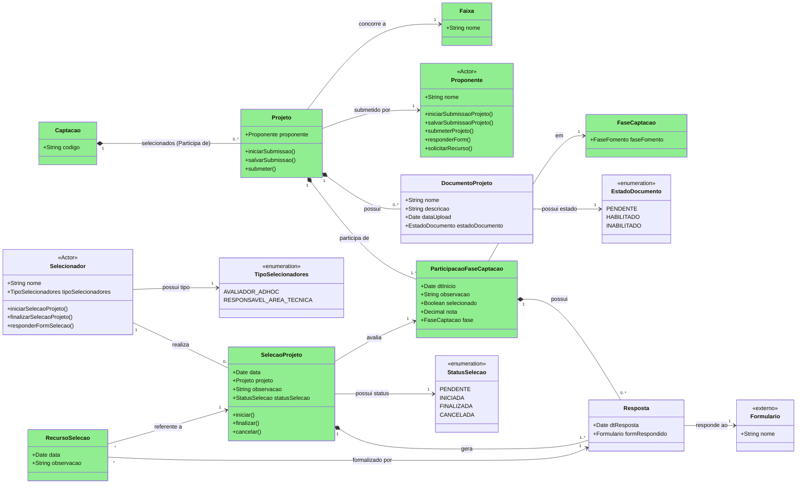
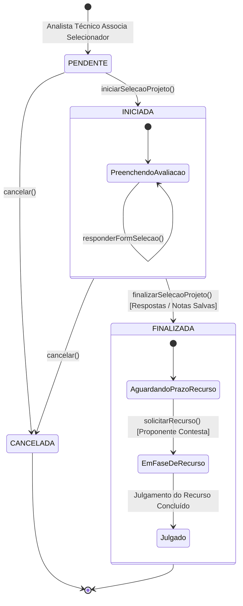

# Modelo Estrutural — P3 Selecao dos Projetos

Contexto: [README.md](../README.md) | Modelo consolidado: [modelo-estrutural.md](modelo-estrutural.md) | Por processo: [P1](modelo-estrutural-p1-fomento.md) | [P2](modelo-estrutural-p2-configuracao-selecao.md)

---

## P3 - Selecao dos Projetos

Este recorte modela os artefatos conceituais da execucao da selecao. A configuracao base vem da
`Captacao` configurada no P2; a contratacao/outorga posterior pertence ao M022.

OBS: Classes me verde fazem parte do V1!

### Estados da Seleção de Projetos

### Fluxo Seleção de Projetos

```mermaid
stateDiagram-v2
    %% ---- RAIA DO PROPONENTE ----
    state "Atividades do Proponente" as BlocoProponente {
        [*] --> IniciarSubmissao : iniciarSubmissaoProjeto()
        IniciarSubmissao --> PreencherDadosProjeto : Cadastrar Projeto
        PreencherDadosProjeto --> EscolherFaixa : Selecionar Faixa do Fomento
        EscolherFaixa --> EnviarDocumentos : Upload de Documentos
        EnviarDocumentos --> ResponderFormularios : responderForm()
        
        state choice_salvamento <<choice>>
        ResponderFormularios --> choice_salvamento
        choice_salvamento --> RascunhoSalvo : salvarSubmissaoProjeto()
        RascunhoSalvo --> PreencherDadosProjeto : Editar posterior
        
        choice_salvamento --> SubmeterProjeto : submeterProjeto()
        SubmeterProjeto --> GerarParticipacaoFase : Gerar ParticipacaoFaseCaptacao
    }

    %% ---- RAIA DO SISTEMA / REGRAS DE GUARDA ----
    state "Regras de Controle da Fase (Sistema)" as SistemaControle {
        state choice_exige_selecao <<choice>>
        GerarParticipacaoFase --> choice_exige_selecao : Fase possui critério de seleção?
        
        %% Se não exigir
        choice_exige_selecao --> AvancarSemAvaliacao : [Não] temRecurso/ehEliminatoria = False
    }

    %% ---- RAIA DO ANALISTA TÉCNICO ----
    state "Atividades do Analista Técnico" as BlocoAnalista {
        %% Se a fase exigir seleção, o analista vincula diretamente o selecionador
        choice_exige_selecao --> VincularSelecionador : [Sim] Fase exige avaliação
        VincularSelecionador --> AssociarProjeto : Associar Selecionador ao Projeto
    }

    %% ---- RAIA DO SELECIONADOR ----
    state "Visualizar Fila (Status: Pendente)" as VisualizarPendentes
    state "Iniciar Avaliação (Status: Iniciada)" as IniciarAvaliacao
    state "Finalizar Avaliação (Status: Finalizada)" as FinalizarAvaliacao

    state "Atividades do Selecionador" as BlocoSelecionador {
        AssociarProjeto --> VisualizarPendentes
        VisualizarPendentes --> IniciarAvaliacao : iniciarSelecaoProjeto()
        IniciarAvaliacao --> AvaliarDocumentos : Verificar DocumentoProjeto
        AvaliarDocumentos --> AnalisarFormularios : Ler respostas do proponente
        AnalisarFormularios --> PreencherFormSelecao : responderFormSelecao()
        PreencherFormSelecao --> FinalizarAvaliacao : finalizarSelecaoProjeto()
    }

    %% ---- RAIA DE RESULTADO E RECURSO ----
    state "Resultado da Fase" as Resultado {
        FinalizarAvaliacao --> ComputarNota : Atribuir nota final e observação
        
        state choice_aprovacao <<choice>>
        ComputarNota --> choice_aprovacao : Nota maior ou igual Nota de Corte?
        
        choice_aprovacao --> MarcarSelecionado : [Sim] selecionado = True
        choice_aprovacao --> MarcarEliminado : [Não] selecionado = False
    }

    state "Fluxo de Contestação" as FluxoRecurso {
        state choice_recurso <<choice>>
        MarcarEliminado --> choice_recurso : Proponente deseja contestar resultado?
        
        choice_recurso --> EntrarComRecurso : [Sim] solicitarRecurso()
        choice_recurso --> FimProcesso : [Não] Aceita eliminacao
        
        EntrarComRecurso --> JulgarRecurso : Analisar contestação
        JulgarRecurso --> AlterarResultado : Recurso Deferido?
        
        state choice_deferido <<choice>>
        AlterarResultado --> choice_deferido
        choice_deferido --> MarcarSelecionado : [Sim] Reverter para Selecionado
        choice_deferido --> FimProcesso : [Não] Manter Eliminado
    }

    %% Conclusão do fluxo sem avaliação
    AvancarSemAvaliacao --> MarcarSelecionado : Projeto avança direto

    MarcarSelecionado --> [*]
    FimProcesso --> [*]

```

---

## Dicionario de Dados

| Classe | Atributo | Definicao | Obrig. | Tipo | Dominio | Tamanho | Unico |
|--------|----------|-----------|--------|------|---------|---------|-------|
| **Captacao** | codigo | Codigo da captacao em execucao | Sim | String | Herdado do P2 | | Sim |
| **Projeto** | proponente (relacao) | Proponente responsavel pela submissao do projeto | Sim | FK → Proponente | Pessoa ou instituicao autorizada conforme regra da Captacao | | |
| | faixa (relacao) | Faixa do Fomento escolhida para concorrencia | Sim | FK → Faixa | Deve pertencer ao Fomento da Captacao | | |
| | captacao (relacao) | Captacao na qual o projeto participa | Sim | FK → Captacao | Captacao em periodo de submissao aberto | | |
| **Proponente** | nome | Nome do proponente que submete o projeto | Sim | String | Via cadastro corporativo/M008 quando aplicavel | 200 | |
| **Faixa** | nome | Nome da faixa do Fomento | Sim | String | Herdado do P1 Fomento | 200 | |
| **DocumentoProjeto** | nome | Nome do documento anexado ao projeto | Sim | String | | 200 | |
| | descricao | Descricao ou finalidade do documento | Nao | String | | 500 | |
| | dataUpload | Data de envio do documento | Gerado | Date | | | |
| | estadoDocumento | Estado de habilitacao do documento | Sim | EstadoDocumento | PENDENTE, HABILITADO, INABILITADO | | |
| **EstadoDocumento** | valor | Estado da analise documental do documento | Sim | Enum | PENDENTE, HABILITADO, INABILITADO | | |
| **ParticipacaoFaseCaptacao** | dtInicio | Data em que o projeto iniciou participacao na fase | Gerado | Date | Deve estar dentro da vigencia da FaseCaptacao | | |
| | observacao | Observacao consolidada da participacao do projeto na fase | Nao | String | | 1000 | |
| | selecionado | Indica se o projeto foi selecionado/aprovado na fase | Cond. | Boolean | true/false; preenchido apos avaliacao ou avanco automatico | | |
| | nota | Nota final do projeto na fase | Cond. | Decimal | >= 0; obrigatoria quando a fase possuir criterio com nota | | |
| | fase (relacao) | Fase da captacao em que o projeto participa | Sim | FK → FaseCaptacao | Deve pertencer a Captacao do Projeto | | |
| **FaseCaptacao** | faseFomento (relacao) | Fase da captacao herdada da configuracao do Fomento | Sim | FK → FaseFomento | Herdado do P2 | | |
| **Resposta** | dtResposta | Data em que o formulario foi respondido | Gerado | Date | | | |
| | formRespondido (relacao) | Formulario usado na submissao, avaliacao ou recurso | Sim | FK → Formulario | Formulario externo publicado/ativo | | |
| **Formulario** | nome | Nome do formulario externo respondido | Sim | String | Modulo proprietario externo | 200 | |
| **Selecionador** | nome | Nome do selecionador responsavel por avaliar uma participacao | Sim | String | Pessoa fisica ou papel funcional autorizado | 200 | |
| | tipoSelecionadores | Tipo do selecionador | Sim | TipoSelecionadores | AVALIADOR_ADHOC, RESPONSAVEL_AREA_TECNICA | | |
| **TipoSelecionadores** | valor | Perfil do selecionador | Sim | Enum | AVALIADOR_ADHOC, RESPONSAVEL_AREA_TECNICA | | |
| **SelecaoProjeto** | data | Data de criacao ou movimentacao da selecao do projeto | Gerado | Date | | | |
| | projeto (relacao) | Projeto avaliado | Sim | FK → Projeto | Mesmo projeto da ParticipacaoFaseCaptacao avaliada | | |
| | observacao | Parecer ou observacao do selecionador | Nao | String | Obrigatoria quando statusSelecao=CANCELADA | 2000 | |
| | statusSelecao | Estado da selecao do projeto | Sim | StatusSelecao | PENDENTE, INICIADA, FINALIZADA, CANCELADA | | |
| | participacaoFase (relacao) | Participacao do projeto na fase avaliada | Sim | FK → ParticipacaoFaseCaptacao | | | |
| | selecionador (relacao) | Selecionador associado a avaliacao | Sim | FK → Selecionador | Deve possuir tipo compatível com a FaseFomento | | |
| **StatusSelecao** | valor | Estado da avaliacao realizada por selecionador | Sim | Enum | PENDENTE, INICIADA, FINALIZADA, CANCELADA | | |
| **RecursoSelecao** | data | Data de solicitacao ou julgamento do recurso | Gerado | Date | | | |
| | observacao | Justificativa, argumento ou decisao do recurso | Sim | String | | 2000 | |
| | resposta (relacao) | Resposta de formulario que formaliza o recurso ou julgamento | Sim | FK → Resposta | Formulario de recurso/julgamento quando configurado | | |
| | selecaoProjeto (relacao) | Selecao contestada pelo proponente | Sim | FK → SelecaoProjeto | SelecaoProjeto.statusSelecao = FINALIZADA | | |

---

## Regras de Negocio

### Submissao de Projetos

| ID | Responsavel | Regra |
|----|-------------|-------|
| RN-SP01 | Proponente | O Projeto so pode ser iniciado e submetido quando a Captacao permitir submissao conforme o estado operacional definido no P2. |
| RN-SP02 | Proponente | Todo Projeto submetido deve indicar exatamente um Proponente e uma Faixa do Fomento vinculada a Captacao. |
| RN-SP03 | Proponente | A Faixa escolhida pelo Projeto deve pertencer ao Fomento que originou a Captacao. |
| RN-SP04 | Proponente | O Proponente pode salvar rascunho da submissao antes de submeter; somente a submissao formal gera ParticipacaoFaseCaptacao. |
| RN-SP05 | Sistema | Ao submeter Projeto, o sistema deve gerar ao menos uma ParticipacaoFaseCaptacao para a primeira fase aplicavel da Captacao. |
| RN-SP06 | Sistema | Documentos exigidos pela Captacao devem ser registrados como DocumentoProjeto e iniciar com estadoDocumento=PENDENTE. |
| RN-SP07 | Sistema | DocumentoProjeto so pode transitar para HABILITADO ou INABILITADO durante fase de avaliacao documental ou fase equivalente configurada. |
| RN-SP08 | AnalistaTecnico | DocumentoProjeto INABILITADO deve possuir observacao ou justificativa registrada na ParticipacaoFaseCaptacao ou na SelecaoProjeto correspondente. |

### Avaliacao e Resultado

| ID | Responsavel | Regra |
|----|-------------|-------|
| RN-SP09 | Sistema | Se a FaseCaptacao nao exigir selecao, recurso ou eliminacao, o Projeto pode avancar automaticamente com `selecionado=true`. |
| RN-SP10 | AnalistaTecnico | Quando a fase exigir avaliacao, o AnalistaTecnico deve associar um Selecionador ao Projeto, gerando SelecaoProjeto com statusSelecao=PENDENTE. |
| RN-SP11 | Sistema | A SelecaoProjeto deve avaliar exatamente uma ParticipacaoFaseCaptacao. |
| RN-SP12 | Selecionador | Somente o Selecionador associado pode iniciar, responder formulario de selecao e finalizar a SelecaoProjeto. |
| RN-SP13 | Sistema | `iniciarSelecaoProjeto()` transiciona SelecaoProjeto de PENDENTE para INICIADA. |
| RN-SP14 | Sistema | `cancelar()` transiciona SelecaoProjeto de PENDENTE ou INICIADA para CANCELADA e exige observacao quando o cancelamento for manual. |
| RN-SP15 | Selecionador | SelecaoProjeto INICIADA pode receber uma ou mais Respostas de formulario de selecao. |
| RN-SP16 | Selecionador | `finalizarSelecaoProjeto()` so pode transicionar SelecaoProjeto de INICIADA para FINALIZADA quando as respostas obrigatorias e a nota aplicavel estiverem salvas. |
| RN-SP17 | Sistema | Ao finalizar a selecao, a nota e a observacao consolidadas devem atualizar a ParticipacaoFaseCaptacao avaliada. |
| RN-SP18 | Sistema | Quando a nota final for maior ou igual a nota de corte da fase/criterio, ParticipacaoFaseCaptacao.selecionado deve ser true; quando for menor, deve ser false. |
| RN-SP19 | Sistema | Projeto eliminado em fase eliminatoria nao deve avancar para a proxima FaseCaptacao, salvo deferimento de RecursoSelecao. |
| RN-SP20 | Sistema | Um Selecionador do tipo AVALIADOR_ADHOC nao pode avaliar Projeto de sua propria instituicao quando essa informacao estiver disponivel. |

### Recurso e Encerramento

| ID | Responsavel | Regra |
|----|-------------|-------|
| RN-SP21 | Proponente | RecursoSelecao so pode ser solicitado pelo Proponente do Projeto apos SelecaoProjeto FINALIZADA e dentro da janela de recurso da FaseCaptacao. |
| RN-SP22 | Sistema | RecursoSelecao deve referenciar a SelecaoProjeto contestada e a Resposta que formaliza a contestacao ou decisao. |
| RN-SP23 | AnalistaTecnico | Todo julgamento de recurso deve registrar observacao com a decisao tomada. |
| RN-SP24 | Sistema | Recurso deferido pode alterar ParticipacaoFaseCaptacao.selecionado para true e permitir avanco do Projeto. |
| RN-SP25 | Sistema | Recurso indeferido mantem o resultado anterior da SelecaoProjeto e encerra a participacao do Projeto na fase quando ele estiver eliminado. |
| RN-SP26 | Sistema | Uma ParticipacaoFaseCaptacao selecionada deve gerar participacao na proxima FaseCaptacao quando houver proxima fase configurada. |
| RN-SP27 | Sistema | O P3 usa `StatusSelecao` para o estado da avaliacao por selecionador; isso nao substitui o `EstadoCaptacao` operacional do P2 nem os estados consolidados de Captacao ainda documentados em README/modelo-comportamental. |

---

## Historico de Alteracoes

| Commit | Data | Autor | Descricao |
|--------|------|-------|-----------|
| `76c474f` | 2026-05-31 | Paulo Sergio Santos Junior | RevisorAdHoc modelado como papel de PessoaFisica; DistribuicaoAvaliacao passa a referenciar PessoaFisica diretamente |
| `3373b22` | 2026-05-31 | Paulo Sergio Santos Junior | Adiciona estado NAO_RESPONDEU e campo dataLimiteResposta em DistribuicaoAvaliacao |
| `5e8a6c3` | 2026-05-31 | Paulo Sergio Santos Junior | Modela recusa de avaliacao ad hoc (RECUSADA + justificativa) e distribuicao multipla de revisores |
| `b2caa00` | 2026-05-31 | Paulo Sergio Santos Junior | Atualiza modelo P3: Proposta renomeada para Projeto (externo M008); adiciona datas de submissao e avaliacao; respostasFormulario em AvaliacaoAdHoc |
| `db4a22b` | 2026-05-31 | Paulo Sergio Santos Junior | Adiciona dicionario de dados e regras de negocio ao modelo P3 |
| `23d82e4` | 2026-05-31 | Paulo Sergio Santos Junior | Reorganizacao dos modelos estruturais em pasta modelo-estrutural/ |
