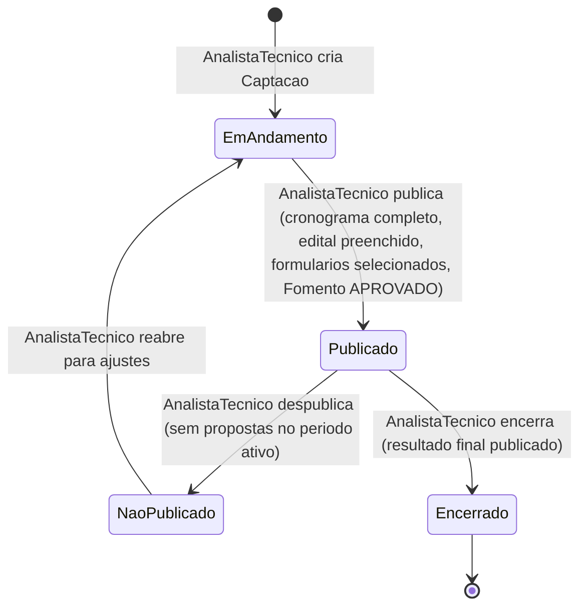

# Processo 2 — Configuracao da Selecao

## Visao Geral

O Processo de Configuracao da Selecao e conduzido pela Area Tecnica (AnalistaTecnico) a partir
de um Fomento aprovado. Neste processo sao definidos: o tipo de chamamento (Chamada Publica ou
Demanda Induzida), o cronograma das etapas de selecao, os formularios, as regras de submissao,
os requisitos do proponente, os revisores ad hoc e a exigencia de prestacao tecnica/financeira.

O resultado e uma `Captacao` com estado `PUBLICADO`, pronta para iniciar o Processo 3 de Selecao
dos Projetos.

---

## Atores

| Ator | Papel no processo |
|------|-------------------|
| AnalistaTecnico | Configura e publica a captacao |
| GestorFAPES | Aprova e pode encerrar a captacao |

---

## Fluxo do Processo

```mermaid
flowchart TD
    A[AnalistaTecnico: Selecionar Fomento aprovado] --> B[AnalistaTecnico: Criar Captacao com titulo e descricao]
    B --> C[AnalistaTecnico: Definir area tecnica responsavel]
    C --> D[AnalistaTecnico: Definir tipo de chamamento]
    D --> E{Tipo de chamamento}
    E -->|CHAMADA_PUBLICA| F[AnalistaTecnico: Informar link do edital]
    E -->|DEMANDA_INDUZIDA| G[AnalistaTecnico: Selecionar outorgado destinatario]
    G --> GA{Tipo do outorgado}
    GA -->|PESSOA_FISICA| GB[AnalistaTecnico: Informar CPF e nome do destinatario]
    GA -->|PESSOA_JURIDICA| GC[AnalistaTecnico: Informar CNPJ, razao social e pessoa fisica de contato]
    GB --> F
    GC --> F
    F --> H[AnalistaTecnico: Definir categorias de iniciativas aceitas]
    H --> I[AnalistaTecnico: Definir tipos de iniciativas aceitos]
    I --> J[AnalistaTecnico: Configurar regras de submissao]
    J --> K{Submissao restrita a escolhidos?}
    K -->|Sim| L[AnalistaTecnico: Selecionar instituicoes ou pessoas autorizadas]
    K -->|Nao| M[AnalistaTecnico: Configurar requisitos do proponente]
    L --> M
    M --> N[AnalistaTecnico: Configurar documentos exigidos do proponente]
    N --> O[AnalistaTecnico: Configurar regras de avaliacao de merito]
    O --> P[AnalistaTecnico: Selecionar pool de revisores ad hoc]
    P --> Q[AnalistaTecnico: Definir quantidade minima de revisores por proposta]
    Q --> R[AnalistaTecnico: Definir exigencia de prestacao tecnica e financeira]
    R --> S[AnalistaTecnico: Selecionar formulario de submissao na base do M021]
    S --> T[AnalistaTecnico: Selecionar formulario de avaliacao ad hoc na base do M021]
    T --> U[AnalistaTecnico: Selecionar formulario de revisao do resultado na base do M021]
    U --> V[AnalistaTecnico: Selecionar formulario de anexos quando aplicavel]
    V --> W[AnalistaTecnico: Configurar cronograma da selecao]
    W --> W1[AnalistaTecnico: Definir data de publicacao da captacao]
    W1 --> W2[AnalistaTecnico: Definir periodo de recebimento das propostas]
    W2 --> W3[AnalistaTecnico: Definir periodo de analise documental]
    W3 --> W4[AnalistaTecnico: Definir periodo de analise de merito]
    W4 --> W5[AnalistaTecnico: Definir data de publicacao do resultado preliminar]
    W5 --> W6[AnalistaTecnico: Definir periodo de recebimento de revisoes]
    W6 --> W7[AnalistaTecnico: Definir data de publicacao do resultado apos revisao]
    W7 --> W8[AnalistaTecnico: Definir data de publicacao do resultado final]
    W8 --> X[AnalistaTecnico: Validar configuracao]
    X --> Y{Configuracao valida?}
    Y -->|Nao| D
    Y -->|Sim| Z[AnalistaTecnico: Publicar Captacao]
    Z --> ZA[Captacao disponivel para o Processo 3 de Selecao]
```

---

## Saida do Processo 2

Captacao publicada contendo:

- referencia ao Fomento aprovado;
- area tecnica responsavel;
- tipo de chamamento: `CHAMADA_PUBLICA` ou `DEMANDA_INDUZIDA`;
- outorgado destinatario (PF ou PJ com contato PF), quando `DEMANDA_INDUZIDA`;
- link do edital;
- categorias e tipos de iniciativa aceitos;
- regras de submissao;
- proponentes autorizados, quando submissao restrita;
- requisitos do proponente com direcionamento (aberto, instituicao ou tipo de instituicao);
- documentos exigidos do proponente com formatos e obrigatoriedade;
- regras de avaliacao de merito (analise ad hoc);
- pool de revisores ad hoc com area de atuacao e titulacao;
- exigencia de prestacao tecnica e/ou financeira;
- formulario de submissao, avaliacao ad hoc, revisao e anexos selecionados no M021;
- cronograma completo com os 8 periodos obrigatorios.

---

## Cronograma da Selecao

O cronograma pertence a configuracao da captacao e orienta a execucao do Processo 3. Nao deve
ser confundido com o cronograma da proposta, que e informado pelo proponente.

| Periodo | Obrigatoriedade | Responsavel pela configuracao |
|---------|-----------------|-------------------------------|
| Data de publicacao da captacao | Obrigatoria | AnalistaTecnico |
| Periodo de recebimento das propostas (data inicial e final) | Obrigatorio | AnalistaTecnico |
| Periodo de analise documental | Obrigatorio | AnalistaTecnico |
| Periodo de analise de merito (ad hoc) | Obrigatorio | AnalistaTecnico |
| Data de publicacao do resultado preliminar | Obrigatoria | AnalistaTecnico |
| Periodo de recebimento de revisoes | Obrigatorio | AnalistaTecnico |
| Data de publicacao do resultado apos revisao | Obrigatoria | AnalistaTecnico |
| Data de publicacao do resultado final | Obrigatoria | AnalistaTecnico |

Qualquer etapa pode ser adiada pelo AnalistaTecnico mediante justificativa. O sistema desloca
automaticamente todas as etapas posteriores pelo mesmo numero de dias e preserva o historico
com datas originais e novas datas.

---

## Estados da Configuracao

---

## Regras de Negocio

| ID | Responsavel | Regra |
|----|-------------|-------|
| RN-CS01 | AnalistaTecnico | A Captacao deve referenciar um Fomento com estado APROVADO. |
| RN-CS02 | AnalistaTecnico | A Captacao deve ter tipo CHAMADA_PUBLICA ou DEMANDA_INDUZIDA. |
| RN-CS03 | AnalistaTecnico | Quando DEMANDA_INDUZIDA, deve ser indicado o outorgado destinatario (PF ou PJ). |
| RN-CS04 | AnalistaTecnico | OutorgadoDestinatario do tipo PESSOA_JURIDICA deve ter uma pessoa fisica de contato informada. |
| RN-CS05 | AnalistaTecnico | A Captacao deve ter link do edital preenchido antes da publicacao. |
| RN-CS06 | AnalistaTecnico | O cronograma deve conter exatamente 8 periodos, um para cada fase obrigatoria, antes da publicacao. |
| RN-CS07 | AnalistaTecnico | Toda Captacao deve selecionar formulario de submissao, de avaliacao ad hoc e de revisao de resultado na base do M021. |
| RN-CS08 | AnalistaTecnico | Quando a submissao for restrita a proponentes escolhidos, deve ser selecionada ao menos uma instituicao ou uma pessoa autorizada. |
| RN-CS09 | AnalistaTecnico | Qualquer etapa do cronograma pode ser adiada mediante justificativa, preservando historico das datas originais. |
| RN-CS10 | AnalistaTecnico | Ao adiar uma etapa, todas as etapas posteriores sao deslocadas pela mesma quantidade de dias. |
| RN-CS11 | AnalistaTecnico | A Captacao so pode ser publicada quando toda a configuracao obrigatoria estiver preenchida. |
| RN-CS12 | AnalistaTecnico | A Captacao so pode ser despublicada quando nenhuma proposta estiver submetida no periodo de recebimento ainda ativo. |

---

## Integracao

| Modulo | Papel |
|--------|-------|
| M011/Fomento | Fornece as faixas de investimento, rubricas, bolsas e eixo estrategico. |
| M008 | Fornece dados de AreaTecnica, Instituicoes, TiposInstituicao, NivelAcademico e PessoaFisica (revisores e contato PJ). |
| M021 | Fornece a base de formularios reutilizaveis e versionados selecionados pela configuracao. |
