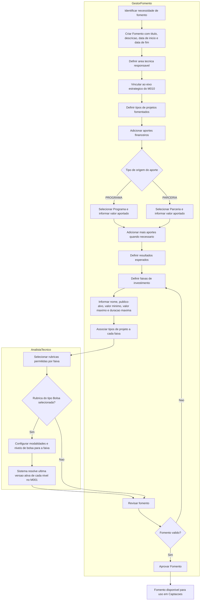
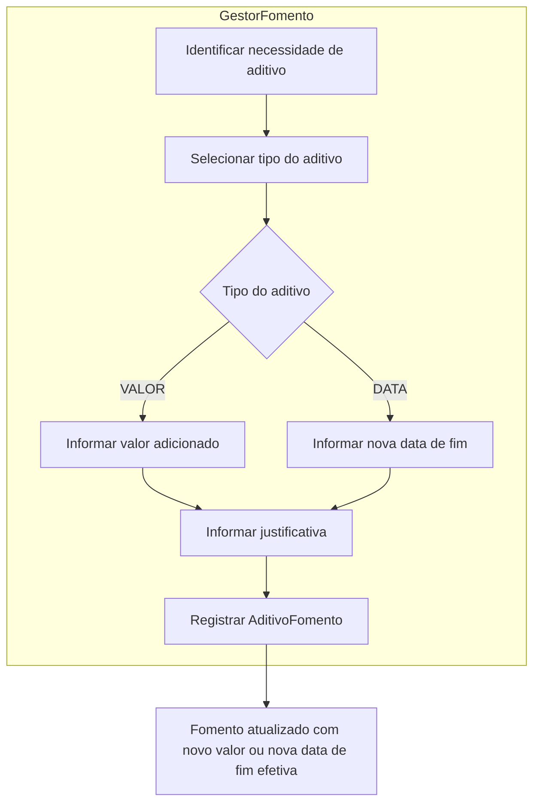
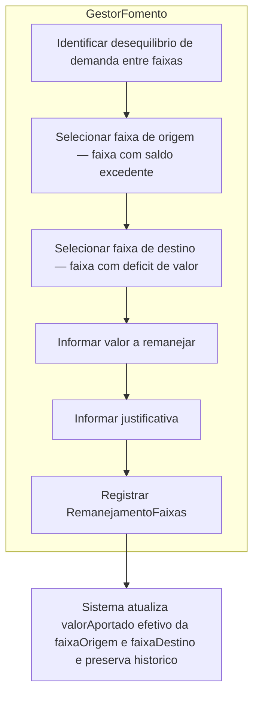
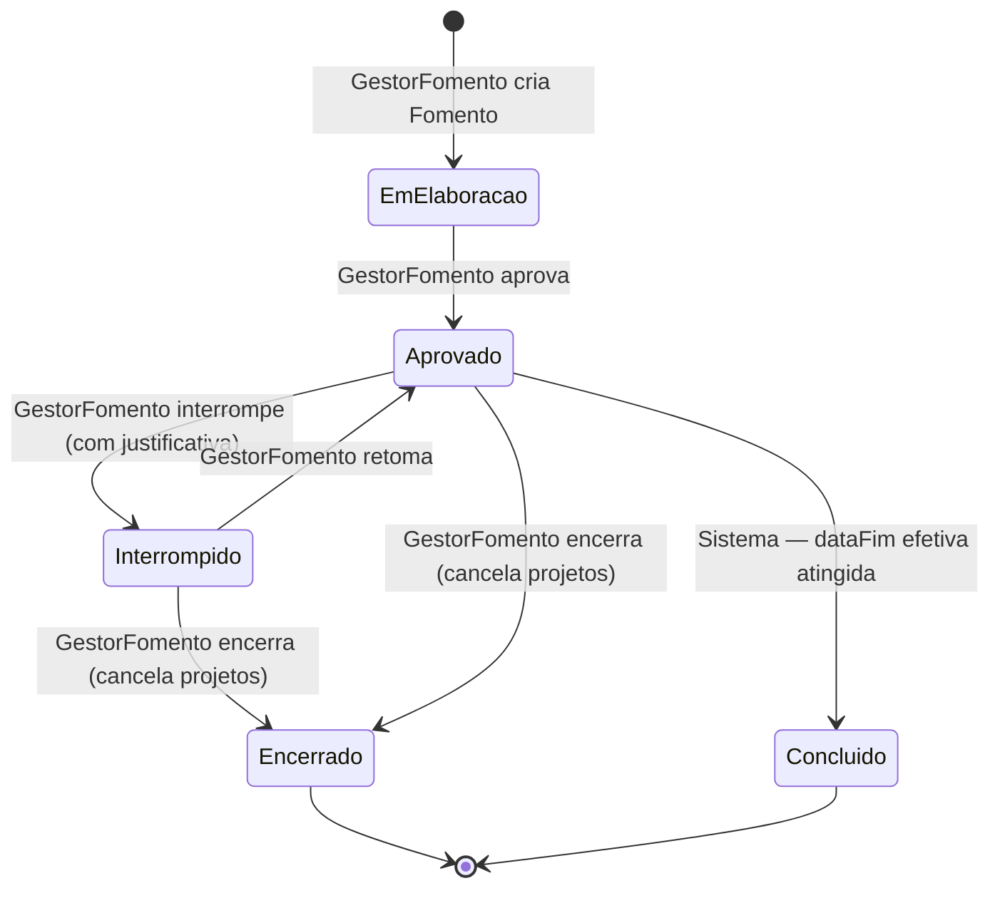

# Processo 1 — Fomento

## Visao Geral

O Processo de Fomento representa o aporte financeiro de um Programa ou Parceria do M010 para
fomentar projetos de um eixo estrategico. Um Fomento define as faixas de investimento (com
valores minimos, maximos e duracao maxima), os publicos-alvo de cada faixa, as rubricas
permitidas por faixa e os resultados esperados (produtos, servicos, processos).

O Fomento e a base financeira e de regras de investimento que uma Captacao (Processo 2) ira
utilizar. Uma Captacao somente pode ser criada a partir de um Fomento com estado `APROVADO`.

---

## Atores

| Ator | Papel no processo |
|------|-------------------|
| GestorFomento | Papel atribuivel a qualquer funcionario da FAPES autorizado a buscar aportes de Programas e Parcerias. Cria, edita, aprova e encerra o Fomento. |
| AnalistaTecnico | Configura os detalhes tecnicos do Fomento: rubricas e bolsas por faixa de investimento. |

---

## Fluxo do Processo

---

## Atividades e Responsaveis

| # | Atividade | Responsavel | Descricao |
|---|-----------|-------------|-----------|
| 1 | Identificar necessidade de fomento | GestorFomento | Identifica necessidade de fomentar projetos em um eixo estrategico e decide iniciar novo Fomento. |
| 2 | Criar Fomento com titulo e descricao | GestorFomento | Registra o Fomento com titulo, descricao do objetivo, data de inicio e data de fim da vigencia. Inicia no estado `EM_ELABORACAO`. |
| 3 | Definir area tecnica responsavel | GestorFomento | Seleciona a Area Tecnica da FAPES responsavel pela gestao deste fomento. |
| 4 | Vincular ao eixo estrategico | GestorFomento | Seleciona o eixo do planejamento estrategico (M010) que o Fomento pretende atingir. |
| 5 | Definir tipos de projetos fomentados | GestorFomento | Seleciona os tipos de projeto que o fomento deseja apoiar (ex: Pesquisa, Inovacao, Extensao, Visita Tecnica). Esse conjunto e a lista master — cada faixa so pode referenciar tipos presentes aqui. |
| 6 | Adicionar aportes financeiros | GestorFomento | Inclui um ou mais aportes com tipo de origem (PROGRAMA ou PARCERIA), referencia ao Programa ou Parceria do M010 e valor aportado. |
| 7 | Definir resultados esperados | GestorFomento | Declara os produtos, servicos ou processos esperados dos projetos financiados. Opcional. |
| 8 | Definir faixas de investimento | GestorFomento / AnalistaTecnico | Cria uma ou mais faixas. Cada faixa e a regua de valor e duracao para um ou mais tipos de projeto especificos. Informa nome, valor minimo, valor maximo, duracao maxima e publico-alvo quando diferenciado. |
| 9 | Associar tipos de projeto a cada faixa | GestorFomento / AnalistaTecnico | Para cada faixa, seleciona quais tipos de projeto ela cobre. Ex: "Pesquisa — Faixa A" cobre apenas Pesquisa; uma faixa pode cobrir mais de um tipo quando os limites de investimento sao iguais. |
| 10 | Selecionar rubricas permitidas por faixa | AnalistaTecnico | Para cada faixa, seleciona do catalogo M008 rubricas e subrubricas autorizadas para o orcamento dos projetos daquela faixa. Define obrigatoriedade, limites de valor ou percentual, comprovantes esperados e restricoes especificas. |
| 11 | Configurar modalidades e niveis de bolsa por faixa | AnalistaTecnico | Quando rubrica do tipo Bolsa selecionada, configura modalidades e niveis com cotas e limite de bolsistas. Sistema resolve automaticamente ultima versao ativa de cada nivel no M001. |
| 12 | Revisar fomento | GestorFomento | Confere vigencia, area tecnica, faixas, tipos associados, aportes e rubricas antes da aprovacao. Retorna para ajustes se necessario. |
| 13 | Aprovar Fomento | GestorFomento | Transita para `APROVADO`. Exige ao menos um aporte, uma faixa, um tipo de projeto e area tecnica definida. Disponivel para uso em Captacoes. |

---

## Saida do Processo 1

Fomento aprovado contendo:

- ao menos um aporte financeiro com origem em Programa ou Parceria do M010;
- eixo estrategico atingido;
- tipos de projeto que o fomento deseja apoiar;
- ao menos uma faixa de investimento com tipos de projeto associados, valor minimo, valor maximo e duracao maxima;
- publico-alvo de cada faixa, quando diferenciado;
- rubricas e subrubricas permitidas por faixa, com limites de valor ou percentual quando aplicavel;
- configuracoes de modalidade e nivel de bolsa por faixa, com a ultima versao ativa resolvida no M001, quando a rubrica Bolsa estiver selecionada;
- resultados esperados (produtos, servicos ou processos), quando aplicavel.

---

## Cronograma Financeiro

| Restricao | Regra |
|-----------|-------|
| Total de aportes | Soma dos `valorAportado` de todos os `AporteFomento` |
| Limite das faixas | `∑FaixaInvestimento.valorAportado ≤ ∑AporteFomento.valorAportado` |
| Aporte individual | Cada aporte deve ser maior que zero |
| Origem exclusiva | Cada aporte referencia exatamente um Programa ou uma Parceria |

---

## Subprocesso: Aditivo de Fomento

Apos aprovacao, o GestorFomento pode aditivar o Fomento para ampliar o valor disponivel (tipo VALOR) ou prorrogar a data de fim (tipo DATA). Cada aditivo e um registro imutavel com historico dos valores anteriores.

| # | Atividade | Responsavel | Descricao |
|---|-----------|-------------|-----------|
| 1 | Identificar necessidade de aditivo | GestorFomento | Identifica que o fomento precisa de ampliacao de valor (tipo VALOR) ou prorrogacao de prazo (tipo DATA). |
| 2 | Selecionar tipo do aditivo | GestorFomento | Define se o aditivo e de VALOR ou DATA. |
| 3 | Informar valor adicionado | GestorFomento | Quando tipo = VALOR, informa o valor financeiro a ser acrescido ao total do fomento. Deve ser maior que zero. |
| 4 | Informar nova data de fim | GestorFomento | Quando tipo = DATA, informa a nova data de fim. Deve ser posterior a data de fim vigente. |
| 5 | Informar justificativa | GestorFomento | Registra o motivo do aditivo. Obrigatorio. |
| 6 | Registrar AditivoFomento | GestorFomento | Confirma o aditivo. Sistema grava registro imutavel com data de registro, valores e datas anteriores para historico. A dataFim efetiva e o valor total efetivo do Fomento sao atualizados automaticamente. |

**Regras do aditivo:**

| ID | Responsavel | Regra |
|----|-------------|-------|
| RN-A01 | GestorFomento | Aditivo so pode ser registrado em Fomento com estado `APROVADO`. |
| RN-A02 | GestorFomento | Nova data de fim deve ser posterior a data de fim vigente do fomento. |
| RN-A03 | GestorFomento | Valor adicionado deve ser maior que zero quando tipo = VALOR. |
| RN-A04 | Sistema | Apos aditivo DATA, a dataFim efetiva do Fomento passa a ser a novaDataFim do aditivo mais recente. Captacoes e projetos vinculados passam a poder usar a nova vigencia. |
| RN-A05 | Sistema | O registro do aditivo e imutavel — preserva dataFimAnterior e valorTotalAnterior para rastreabilidade. |

---

## Subprocesso: Remanejamento de Valores entre Faixas

Apos a selecao dos projetos (Processo 3), o GestorFomento pode remanejar valor aportado entre
faixas do mesmo Fomento. Isso ocorre quando a demanda real de projetos aprovados em uma faixa
supera ou nao atinge o valor originalmente alocado.

Cada remanejamento e um registro imutavel com historico dos valores anteriores de cada faixa.

| # | Atividade | Responsavel | Descricao |
|---|-----------|-------------|-----------|
| 1 | Identificar desequilibrio de demanda | GestorFomento | Apos resultado da selecao, verifica quais faixas tiveram mais ou menos projetos aprovados do que o valor alocado comporta. |
| 2 | Selecionar faixa de origem | GestorFomento | Seleciona a faixa com saldo excedente — valor aportado maior do que a demanda de projetos aprovados. |
| 3 | Selecionar faixa de destino | GestorFomento | Seleciona a faixa com deficit — valor aportado insuficiente para atender os projetos aprovados. Deve ser diferente da faixa de origem. |
| 4 | Informar valor a remanejar | GestorFomento | Define o valor a ser transferido. Nao pode exceder o valorAportado efetivo da faixa de origem. |
| 5 | Informar justificativa | GestorFomento | Registra o motivo do remanejamento — geralmente excesso ou falta de demanda. Obrigatorio. |
| 6 | Registrar RemanejamentoFaixas | GestorFomento | Confirma o remanejamento. Sistema grava registro imutavel com valores anteriores de cada faixa para rastreabilidade e atualiza os valores efetivos. |

**Regras do remanejamento:**

| ID | Responsavel | Regra |
|----|-------------|-------|
| RN-R01 | GestorFomento | Remanejamento so pode ser registrado em Fomento com estado `APROVADO`. |
| RN-R02 | GestorFomento | Faixa de origem e faixa de destino devem pertencer ao mesmo Fomento. |
| RN-R03 | GestorFomento | Faixa de origem e faixa de destino devem ser diferentes. |
| RN-R04 | GestorFomento | O valor remanejado deve ser maior que zero e nao pode exceder o valorAportado efetivo da faixa de origem. |
| RN-R05 | Sistema | O registro e imutavel — preserva `valorOrigemAnterior` e `valorDestinoAnterior` para rastreabilidade. |
| RN-R06 | Sistema | Apos remanejamento, o valorAportado efetivo de cada faixa e recalculado considerando todos os remanejamentos registrados. |

---

## Estados do Fomento

| Estado | Descricao | Efeito nos projetos vinculados |
|--------|-----------|-------------------------------|
| EM_ELABORACAO | Fomento sendo configurado, ainda nao aprovado. | Nenhum — nao ha captacoes ativas. |
| APROVADO | Fomento ativo e operacional. | Captacoes e projetos operam normalmente. |
| INTERROMPIDO | GestorFomento suspendeu o fomento temporariamente por algum motivo. | Captacoes e projetos vinculados sao suspensos em cascata enquanto o fomento estiver neste estado. |
| ENCERRADO | GestorFomento cancelou o fomento antes do prazo. | Captacoes e projetos vinculados sao cancelados em cascata. |
| CONCLUIDO | Prazo do fomento (`dataFim` efetiva) foi atingido naturalmente. Transicao automatica pelo sistema. | Nenhum novo projeto pode ser captado. Projetos em andamento continuam ate seus proprios prazos. |

---

## Regras de Negocio

| ID | Responsavel | Regra |
|----|-------------|-------|
| RN-F01 | GestorFomento | Todo Fomento deve possuir ao menos um aporte financeiro originado de Programa ou Parceria do M010. |
| RN-F02 | GestorFomento | Todo Fomento deve estar vinculado a exatamente um eixo estrategico do M010. |
| RN-F03 | GestorFomento | Todo Fomento deve possuir ao menos uma faixa de investimento antes de ser aprovado. |
| RN-F04 | GestorFomento | Todo Fomento deve possuir ao menos um tipo de projeto declarado antes de ser aprovado. |
| RN-F05 | GestorFomento | Cada aporte deve indicar exatamente uma origem (PROGRAMA ou PARCERIA) e possuir valor aportado maior que zero. |
| RN-F06 | GestorFomento / AnalistaTecnico | A soma dos valores aportados das faixas de investimento nao deve ultrapassar o total financeiro calculado pelos aportes (`∑FaixaInvestimento.valorAportado ≤ ∑AporteFomento.valorAportado`). |
| RN-F07 | GestorFomento / AnalistaTecnico | Cada faixa deve ter ao menos um tipo de projeto associado, valor maximo maior ou igual ao valor minimo e duracao maxima de ao menos 1 mes. |
| RN-F08 | GestorFomento / AnalistaTecnico | Os tipos de projeto de uma faixa devem pertencer ao conjunto de tipos declarados no Fomento. |
| RN-F09 | AnalistaTecnico | Rubricas e subrubricas sao configuradas por faixa de investimento. |
| RN-F10 | AnalistaTecnico | Quando a rubrica Bolsa estiver permitida em uma faixa, devem ser configuradas as modalidades e niveis de bolsa permitidos. Para cada nivel, o processo recupera automaticamente a ultima versao ativa do M001. |
| RN-F11 | AnalistaTecnico | BolsaPermitidaFaixa so pode ser configurada quando a RubricaPermitidaFaixa referenciada for do tipo Bolsa. |
| RN-F12 | AnalistaTecnico | RubricaPermitidaFaixa com rubrica DOACI (RUB-DOACI): o limitePercentual, quando informado, nao pode superar o teto da tabela normativa (Resolucao CCAF no 309/2022, item 2.4.8.1) para o valorMaximo da faixa. Se omitido, o M013 aplica a tabela normativa diretamente. |
| RN-F13 | GestorFomento | Somente um Fomento com estado APROVADO pode ser referenciado por uma nova Captacao. |
| RN-F14 | GestorFomento | GestorFomento pode interromper um Fomento APROVADO informando justificativa. Captacoes e projetos vinculados sao suspensos em cascata. |
| RN-F15 | GestorFomento | GestorFomento pode retomar um Fomento INTERROMPIDO. Captacoes e projetos retomam o estado anterior. |
| RN-F16 | GestorFomento | GestorFomento pode encerrar um Fomento APROVADO ou INTERROMPIDO informando justificativa. Captacoes e projetos vinculados sao cancelados em cascata. |
| RN-F17 | Sistema | Fomento transita automaticamente para CONCLUIDO quando a dataFim efetiva e atingida. Nenhuma nova Captacao pode ser criada a partir de um Fomento CONCLUIDO. |
| RN-F18 | Sistema | Nenhuma data do cronograma de uma Captacao pode ser anterior a `Fomento.dataInicio` nem posterior a `Fomento.dataFim` efetiva. |
| RN-F19 | Sistema | Nenhum projeto gerado por uma Captacao pode ter data de inicio anterior a `Fomento.dataInicio` nem data de fim posterior a `Fomento.dataFim` efetiva. |

---

## Integracao

| Modulo | Papel |
|--------|-------|
| M010 | Fornece Programa, Parceria e EixoEstrategico que alimentam o Fomento. |
| M008 | Fornece o catalogo de TipoIniciativa e de Rubricas disponivel para configuracao por faixa. |
| M001 | Fornece modalidades, niveis e a ultima versao ativa de cada nivel de bolsa configurado por faixa. |
