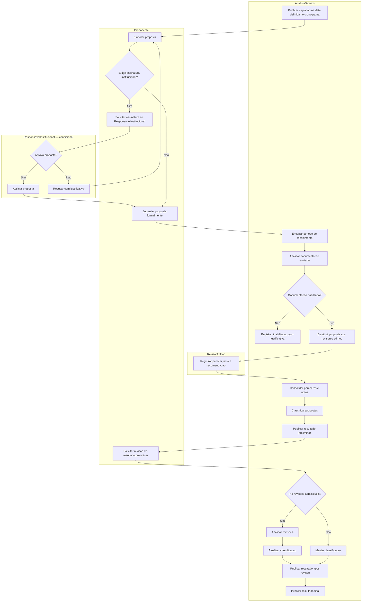
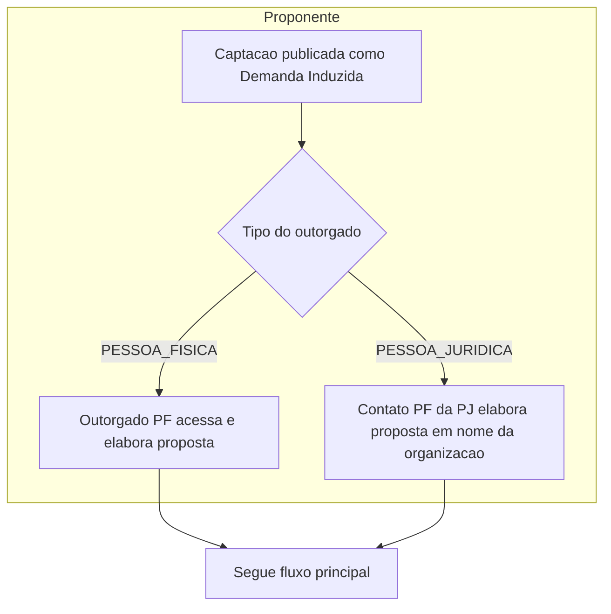
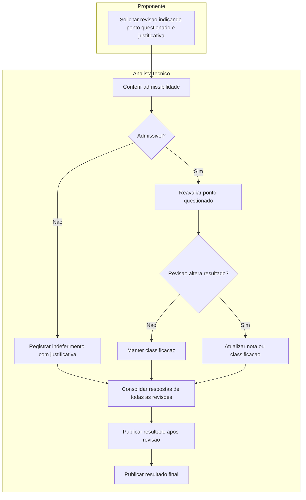
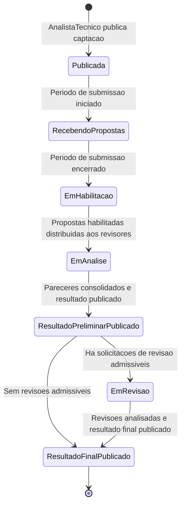

# Processo 3 — Selecao dos Projetos

## Visao Geral

Execucao concreta da captacao a partir de uma Captacao publicada (Processo 2). Cobre desde a
publicacao ate a divulgacao do resultado final.

Dois tipos de chamamento com pontos de entrada distintos:

- **Chamada Publica**: captacao aberta regida por edital; qualquer proponente habilitado pode submeter proposta dentro do periodo de recebimento.
- **Demanda Induzida**: captacao direcionada a um outorgado especifico (PF ou PJ). Quando PJ, a proposta e conduzida pelo contato PF indicado.

Em ambos os casos, o fluxo de analise, resultado e revisao e identico.

O M011 termina na publicacao do resultado final. Assinatura do termo de outorga e contratacao pertencem ao M022.

---

## Atores

| Ator | Papel no processo |
|------|-------------------|
| AnalistaTecnico | Publica captacao, conduz analise documental, distribui para revisores, consolida, classifica e publica resultados |
| Proponente | Elabora e submete a proposta; solicita revisao do resultado preliminar |
| ResponsavelInstitucional | Assina a proposta antes da submissao formal — apenas quando `exigeAprovacaoInstitucional = true` |
| RevisorAdHoc | Registra parecer e nota de merito para cada proposta distribuida |

---

## Fluxo Principal

---

## Atividades e Responsaveis

| # | Atividade | Responsavel | Descricao |
|---|-----------|-------------|-----------|
| 1 | Publicar captacao | AnalistaTecnico | Na data de publicacao definida no cronograma, a captacao fica visivel e disponivel para os proponentes. |
| 2 | Elaborar proposta | Proponente | Proponente preenche os campos da proposta conforme a matriz de configuracao definida na captacao. |
| 3 | Solicitar assinatura institucional | Proponente | **Condicional** — apenas quando `exigeAprovacaoInstitucional = true`. Proponente envia a proposta para o ResponsavelInstitucional assinar antes do prazo de submissao. |
| 4 | Assinar ou recusar proposta | ResponsavelInstitucional | **Condicional**. Responsavel assina a proposta (aprova) ou recusa com justificativa, devolvendo ao proponente para correcao. Deve ocorrer dentro do periodo de submissao. |
| 5 | Submeter proposta formalmente | Proponente | Proposta e submetida ao sistema. Quando exigida, so pode ser submetida apos assinatura institucional. |
| 6 | Encerrar periodo de recebimento | AnalistaTecnico | Ao atingir a data final, nenhuma nova proposta e aceita. Propostas sem assinatura institucional sao descartadas quando exigido. |
| 7 | Analisar documentacao | AnalistaTecnico | Confere a documentacao enviada por cada proponente e habilita ou inabilita a proposta. Inabilitacao requer justificativa. |
| 8 | Distribuir propostas aos revisores | AnalistaTecnico | Propostas habilitadas sao distribuidas ao pool de revisores ad hoc conforme regras de distribuicao configuradas. |
| 9 | Registrar parecer e nota | RevisorAdHoc | Cada revisor registra parecer, nota e recomendacao de merito para as propostas distribuidas, dentro do periodo de analise de merito. |
| 10 | Consolidar pareceres | AnalistaTecnico | Reune pareceres e notas de todos os revisores por proposta. |
| 11 | Classificar propostas | AnalistaTecnico | Ordena propostas habilitadas com base nas notas consolidadas. |
| 12 | Publicar resultado preliminar | AnalistaTecnico | Classificacao preliminar fica disponivel aos proponentes. |
| 13 | Solicitar revisao | Proponente | Dentro do periodo de recursos, proponente pode questionar o resultado preliminar indicando o ponto contestado e a justificativa. |
| 14 | Analisar revisoes | AnalistaTecnico | Confere admissibilidade e reavalia o ponto questionado. Atualiza classificacao quando pertinente ou mantem sem alteracao. |
| 15 | Publicar resultado apos revisao | AnalistaTecnico | Decisoes sobre recursos e eventuais ajustes de classificacao ficam disponiveis. |
| 16 | Publicar resultado final | AnalistaTecnico | Resultado final publicado. Processo de selecao encerrado no M011. Propostas aprovadas disponibilizadas para o M022. |

---

## Subprocesso: Demanda Induzida

---

## Subprocesso: Revisao do Resultado

---

## Marcos Temporais

| Marco | Efeito operacional | Responsavel |
|-------|--------------------|-------------|
| Data de publicacao | Captacao fica visivel para os proponentes | AnalistaTecnico |
| Periodo de submissao (inicio a fim) | Proponentes elaboram e submetem propostas. Quando `exigeAprovacaoInstitucional = true`, assinatura institucional deve ocorrer dentro deste mesmo periodo. | Proponente + ResponsavelInstitucional |
| Encerramento do recebimento | Nenhuma proposta aceita apos a data final. Propostas sem assinatura institucional descartadas quando exigido. | AnalistaTecnico |
| Periodo de analise documental | AnalistaTecnico habilita ou inabilita propostas | AnalistaTecnico |
| Periodo de analise de merito | Revisores registram pareceres e notas | RevisorAdHoc |
| Data de publicacao do resultado preliminar | Classificacao preliminar disponivel aos proponentes | AnalistaTecnico |
| Periodo de recursos | Proponentes podem solicitar revisao do resultado preliminar | Proponente |
| Data de publicacao do resultado apos revisao | Decisoes sobre recursos disponibilizadas | AnalistaTecnico |
| Data de publicacao do resultado final | Resultado final disponivel; M011 encerrado; propostas aprovadas consumidas pelo M022 | AnalistaTecnico |

---

## Estados da Instancia

---

## Regras de Negocio

| ID | Responsavel | Regra |
|----|-------------|-------|
| RN-SP01 | AnalistaTecnico | A captacao somente fica visivel para os proponentes a partir da data de publicacao definida no cronograma. |
| RN-SP02 | Proponente | Propostas somente podem ser submetidas entre a data inicial e a data final do periodo de recebimento. |
| RN-SP03 | Proponente | Quando `exigeAprovacaoInstitucional = true`, a proposta so pode ser submetida formalmente apos a assinatura do ResponsavelInstitucional. |
| RN-SP04 | ResponsavelInstitucional | A assinatura institucional deve ocorrer dentro do periodo de submissao. Recusa deve ter justificativa e devolve a proposta ao proponente. |
| RN-SP05 | AnalistaTecnico | Somente propostas com documentacao habilitada seguem para analise de merito. Inabilitacao requer justificativa. |
| RN-SP06 | RevisorAdHoc | Revisores somente podem registrar pareceres dentro do periodo de analise de merito. |
| RN-SP07 | AnalistaTecnico | O resultado preliminar deve ser publicado antes do inicio do periodo de recursos. |
| RN-SP08 | Proponente | Solicitacoes de revisao somente podem ser enviadas dentro do periodo de recursos. |
| RN-SP09 | AnalistaTecnico | O resultado final somente pode ser publicado apos o encerramento e analise de todas as revisoes admissiveis. |
| RN-SP10 | AnalistaTecnico | A publicacao do resultado final encerra o processo de selecao no M011. |
| RN-SP11 | AnalistaTecnico | Quando `tipoCaptacao = DEMANDA_INDUZIDA` e outorgado for PJ, a proposta e conduzida pelo contato PF indicado na configuracao. |
| RN-SP12 | AnalistaTecnico | Propostas aprovadas ficam disponiveis para consumo pelo M022 apos a publicacao do resultado final. |

---

## Integracao

| Modulo | Papel |
|--------|-------|
| M008 | Fornece dados de PessoaFisica para revisores e para o contato PF do outorgado PJ. |
| M021 | Formularios selecionados na configuracao estruturam a coleta na submissao, avaliacao e revisao. |
| M022 | Consome propostas aprovadas para contratacao e assinatura do termo de outorga. |
