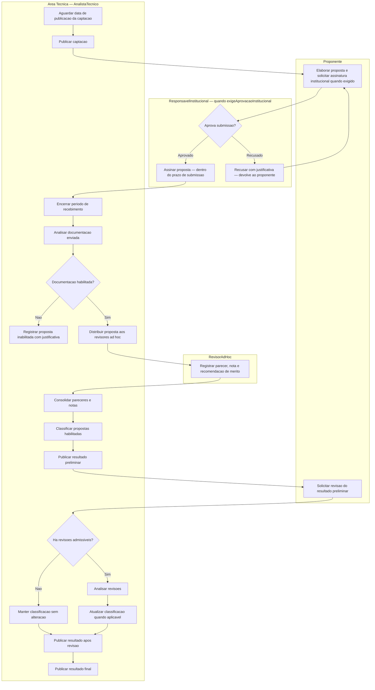
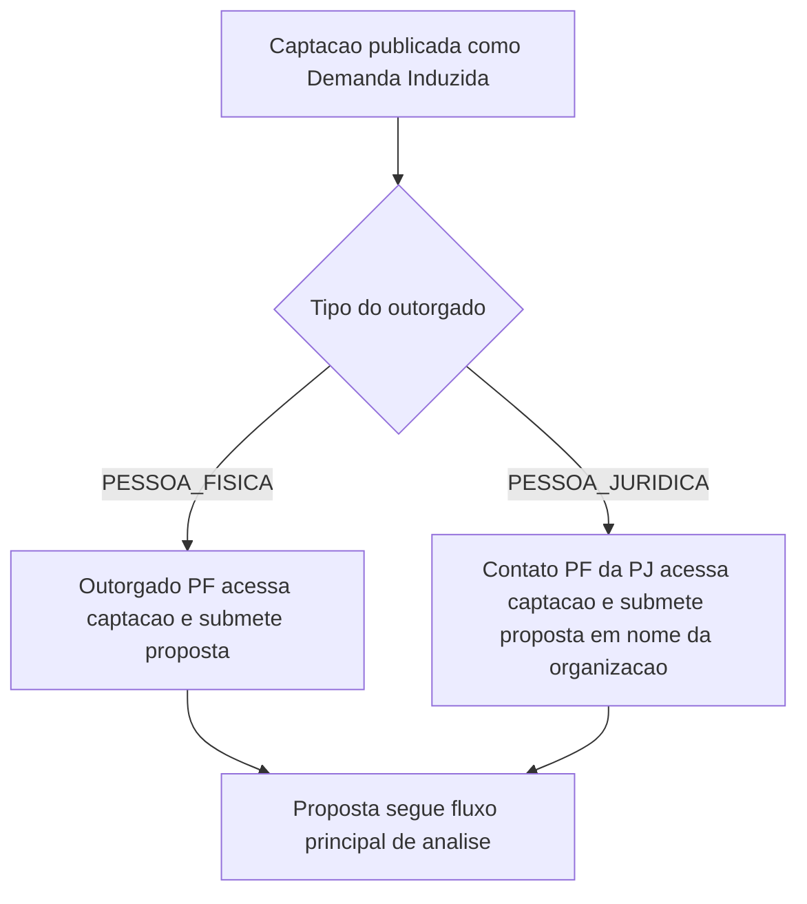
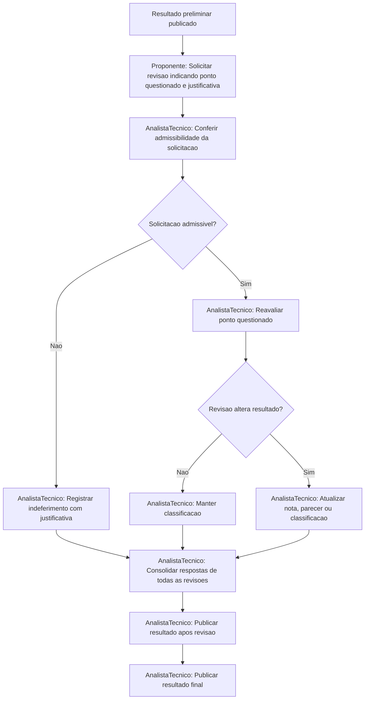
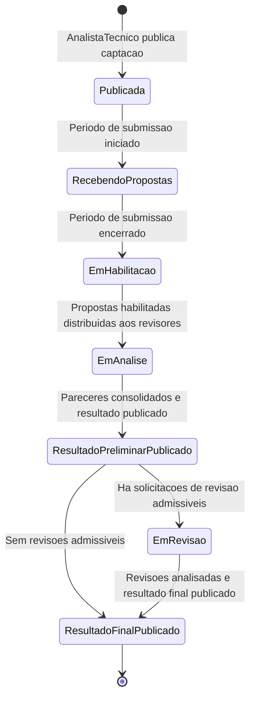

# Processo 3 — Selecao dos Projetos

## Visao Geral

O Processo de Selecao dos Projetos e a execucao concreta da captacao a partir de uma Captacao
publicada (Processo 2). Cobre desde a publicacao da captacao ate a divulgacao do resultado final.

O processo e aplicado a dois tipos de chamamento, com pontos de entrada distintos:

- **Chamada Publica**: captacao aberta regida por edital; qualquer proponente habilitado pode
  submeter proposta dentro do periodo de recebimento.
- **Demanda Induzida**: captacao direcionada a um outorgado especifico (Pessoa Fisica ou
  Pessoa Juridica). Quando Pessoa Juridica, a proposta e conduzida pelo contato PF indicado.

Em ambos os casos, o fluxo de analise, resultado e revisao e identico.

O M011 termina na publicacao do resultado final. A assinatura do termo de outorga e a
contratacao das propostas aprovadas pertencem ao M022.

---

## Atores

| Ator | Papel no processo |
|------|-------------------|
| AnalistaTecnico | Conduz todas as etapas operacionais: publicacao, analise documental, distribuicao para revisores, consolidacao, publicacao de resultados e analise de revisoes |
| Proponente | Submete a proposta e solicita revisao do resultado preliminar |
| ResponsavelInstitucional | Aprova ou recusa a submissao do projeto em nome da instituicao ou setor do proponente (apenas quando `exigeAprovacaoInstitucional = true`) |
| RevisorAdHoc | Registra parecer e nota de merito para cada proposta distribuida |
| GestorFAPES | Pode encerrar a captacao apos publicacao do resultado final |

---

## Fluxo Principal

---

## Subprocesso: Demanda Induzida

Quando `tipoCaptacao = DEMANDA_INDUZIDA`, o processo tem comportamento diferenciado na fase
de submissao:

---

## Subprocesso: Revisao do Resultado

---

## Marcos Temporais

Cada atividade so pode ocorrer dentro da fase correspondente do cronograma configurado no
Processo 2.

| Marco do cronograma | Efeito operacional | Responsavel |
|---------------------|-------------------|-------------|
| Data de publicacao da captacao | Captacao fica visivel e disponivel para os proponentes | AnalistaTecnico |
| Periodo de recebimento das propostas | Proponentes podem submeter propostas apenas entre a data inicial e a data final | Proponente |
| Periodo de recebimento das propostas — com aprovacao institucional | Quando `exigeAprovacaoInstitucional = true`: proponente elabora a proposta, ResponsavelInstitucional assina **dentro deste mesmo periodo** e so entao a proposta e formalmente submetida. Prazo unico para ambas as acoes. | Proponente + ResponsavelInstitucional |
| Encerramento do recebimento | Nenhuma nova proposta e aceita apos a data final. Propostas sem assinatura institucional sao descartadas quando exigido. | AnalistaTecnico |
| Periodo de analise documental | AnalistaTecnico habilita ou inabilita propostas com base na documentacao enviada | AnalistaTecnico |
| Periodo de analise de merito | RevisoresAdHoc podem registrar pareceres e notas apenas dentro deste periodo | RevisorAdHoc |
| Data de publicacao do resultado preliminar | Classificacao preliminar fica disponivel aos proponentes | AnalistaTecnico |
| Periodo de recebimento de revisoes | Proponentes podem solicitar revisao apenas dentro deste periodo | Proponente |
| Data de publicacao do resultado apos revisao | Decisoes sobre revisoes e eventuais ajustes ficam disponiveis | AnalistaTecnico |
| Data de publicacao do resultado final | Resultado final fica disponivel; M011 encerrado; propostas aprovadas consumidas pelo M022 | AnalistaTecnico |

---

## Estados da Instancia

---

## Regras de Negocio

| ID | Responsavel | Regra |
|----|-------------|-------|
| RN-SP01 | AnalistaTecnico | A captacao somente fica visivel para os proponentes a partir da data de publicacao definida no cronograma. |
| RN-SP02 | Proponente | Propostas somente podem ser submetidas entre a data inicial e a data final do periodo de recebimento. |
| RN-SP03 | AnalistaTecnico | Somente propostas com documentacao habilitada seguem para analise de merito. |
| RN-SP04 | AnalistaTecnico | Propostas inabilitadas devem ter justificativa registrada. |
| RN-SP05 | RevisorAdHoc | Revisores ad hoc somente podem registrar pareceres dentro do periodo de analise de merito. |
| RN-SP06 | AnalistaTecnico | O resultado preliminar deve ser publicado antes do inicio do periodo de revisoes. |
| RN-SP07 | Proponente | Solicitacoes de revisao somente podem ser enviadas dentro do periodo definido no cronograma. |
| RN-SP08 | AnalistaTecnico | O resultado final somente pode ser publicado apos o encerramento e analise de todas as revisoes admissiveis. |
| RN-SP09 | AnalistaTecnico | A publicacao do resultado final encerra o processo de selecao no M011. |
| RN-SP10 | AnalistaTecnico | Quando `tipoCaptacao = DEMANDA_INDUZIDA` e o outorgado for `PESSOA_JURIDICA`, a submissao e conduzida pelo contato PF indicado na configuracao. |
| RN-SP11 | AnalistaTecnico | Propostas aprovadas ficam disponiveis para consumo pelo M022 apos a publicacao do resultado final. A assinatura do termo de outorga ocorre no M022. |

---

## Integracao

| Modulo | Papel |
|--------|-------|
| M008 | Fornece dados de PessoaFisica para revisores e para o contato PF do outorgado PJ. |
| M021 | Formularios selecionados na configuracao estruturam a coleta de dados na submissao, na avaliacao e na revisao. |
| M022 | Consome as propostas aprovadas no resultado final para formalizar a contratacao e a assinatura do termo de outorga. |
