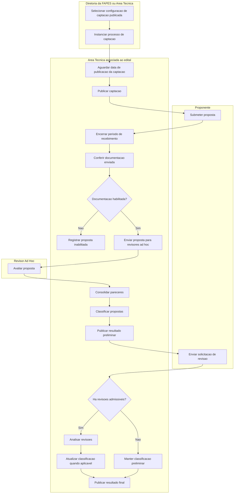
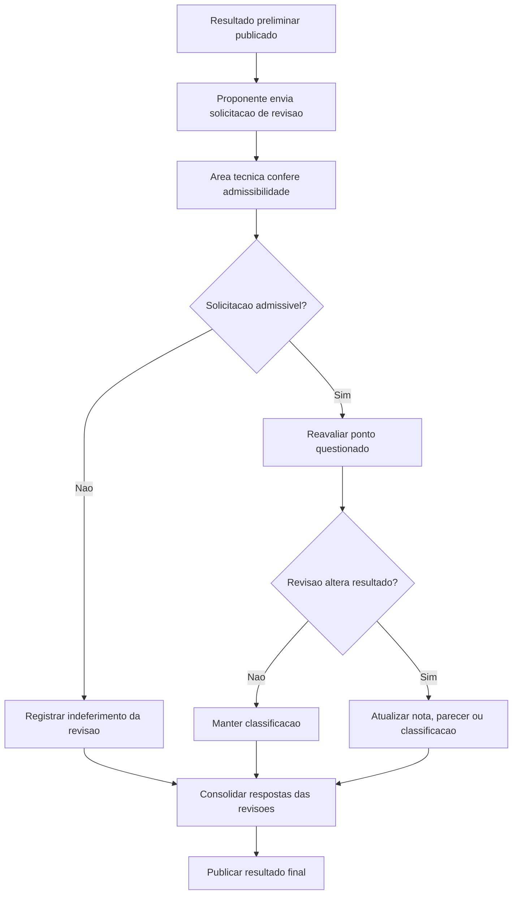
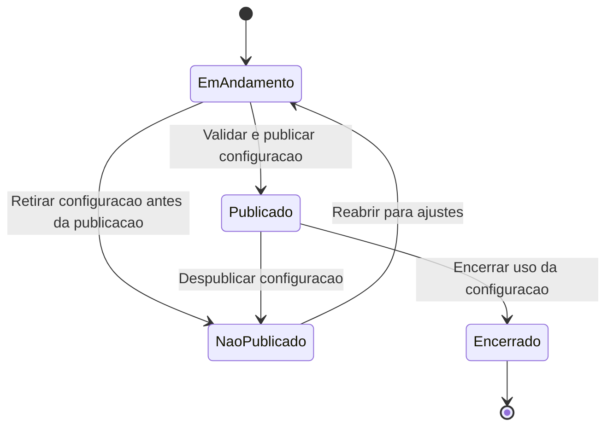
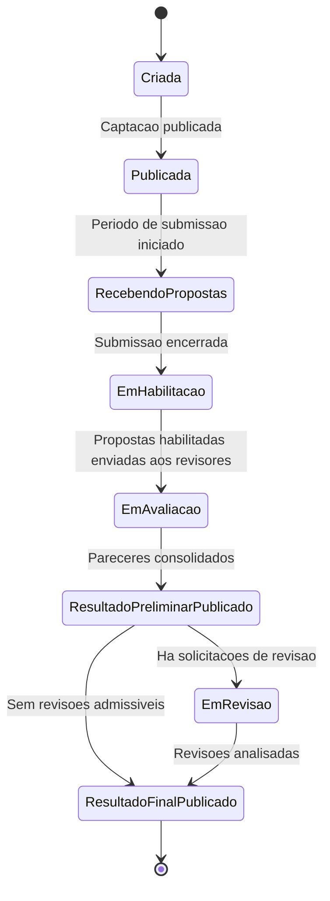

# Processo de Captacao de Iniciativas

## Visao Geral

O M011 cobre o fluxo **pre-award** da captacao de iniciativas. Para deixar a modelagem simples, o processo foi dividido em dois momentos:

1. **Configuracao do Processo de Captacao**: prepara as regras, o edital, o cronograma, os formularios e as configuracoes que serao usadas na captacao.
2. **Instancia do Processo de Captacao**: executa a captacao real, recebendo propostas, avaliando, tratando revisoes e publicando o resultado final.

A captacao pode receber aporte financeiro de um ou mais `Programa` ou `Parceria` do M010 e pode ser classificada como `Chamada Publica` ou `Demanda Induzida`. Quando for `Demanda Induzida`, a captacao deve ser direcionada para um `Ortogado` especifico.

O M011 termina na publicacao do resultado final. A contratacao/outorga das propostas aprovadas pertence ao M022 - Contratacao e Outorga. Depois da contratacao/outorga, a iniciativa passa a ser tratada pelo M003.

---

## Processo 1: Configuracao do Processo de Captacao

Este processo define a preparacao da captacao antes de sua publicacao. O resultado e uma `ConfiguracaoCaptacao` pronta para ser instanciada como processo real. As regras de captacao indicam quais informacoes serao exigidas ou orientadas para as propostas, como categorias e tipos de iniciativa, equipe, documentos exigidos do proponente, rubricas e subrubricas permitidas, faixas de financiamento, modalidades e niveis de bolsa permitidos quando a rubrica Bolsa estiver selecionada, cronograma da proposta, riscos, resultados e exigencia de prestacao tecnica ou financeira. Esses elementos sao opcionais e devem ser ativados conforme a natureza da captacao.

A configuracao tambem define o **cronograma da captacao**, que controla a execucao da captacao. Na tela, o cronograma deve ser montado como uma lista de cards, sendo um card para cada fase obrigatoria. Ao criar a captacao, o sistema deve validar se existe um card cadastrado para cada fase obrigatoria. Esse cronograma deve possuir, no minimo:

- data de publicacao da captacao;
- periodo de recebimento das propostas, com data inicial e data final;
- possibilidade de prorrogacao do periodo de recebimento das propostas, quando autorizada pela regra da captacao;
- periodo de avaliacao da documentacao enviada pelos proponentes;
- periodo de avaliacao ad hoc das propostas habilitadas;
- data de publicacao do resultado preliminar;
- periodo de recebimento de revisao do resultado preliminar;
- data de publicacao do resultado apos revisao;
- data de publicacao do resultado final.

Na edicao do cronograma, qualquer etapa pode ser adiada mediante informacao da quantidade de dias e justificativa. O sistema deve manter historico do adiamento, com datas originais e novas datas, e deve deslocar automaticamente todas as etapas posteriores pela mesma quantidade de dias para preservar a sequencia operacional da captacao.

A configuracao tambem seleciona, a partir da base de formularios gerenciada pelo M021, os formularios que estruturam a coleta e a avaliacao das informacoes:

- **Formulario de Submissao**: usado pelo proponente para registrar a proposta/iniciativa captada.
- **Formulario de Avaliacao Ad Hoc**: usado pelos revisores ad hoc para registrar parecer, nota, recomendacao e justificativas.
- **Formulario de Revisao do Resultado**: usado pelo proponente para solicitar revisao do resultado preliminar.
- **Formulario de Anexos**: usado para orientar a coleta de anexos adicionais quando a captacao exigir documentos complementares.

Quando o proponente for uma empresa ou instituicao, a submissao deve identificar a pessoa fisica representante responsavel por agir em nome desse proponente. Documentos institucionais recorrentes da pessoa juridica, como contrato social, balanco, certidoes e comprovantes de representacao, devem preferencialmente estar no cadastro corporativo do M008. A captacao deve apenas declarar quais documentos ou requisitos serao conferidos, solicitando novo envio somente quando o cadastro nao possuir documento valido ou quando a regra da captacao exigir versao especifica.

```mermaid
flowchart TD
    A[Diretoria identifica necessidade de captacao] --> B[Configurar aportes financeiros da captacao]
    B --> C{Origem do aporte}
    C --> D[Selecionar Programa e informar valor aportado]
    C --> E[Selecionar Parceria e informar valor aportado]
    D --> F[Adicionar novos aportes quando houver]
    E --> F
    F --> EA[Definir area tecnica responsavel e tipo de captacao]

    EA --> F{Tipo de captacao}
    F --> G[Chamada Publica]
    F --> H[Demanda Induzida]
    H --> HA[Selecionar ortogado destinatario]

    G --> IA[Definir categorias de iniciativas aceitas]
    HA --> IA
    IA --> I[Definir tipos de iniciativas aceitos]

    I --> K[Configurar se proposta exige equipe]
    K --> K1[Configurar regras de submissao]
    K1 --> K1A{Submissao restrita a escolhidos?}
    K1A -->|Sim| K1B[Selecionar instituicoes ou pessoas autorizadas]
    K1A -->|Nao| K2[Configurar requisitos do proponente]
    K1B --> K2
    K2 --> K3[Configurar documentos exigidos do proponente]
    K3 --> K4[Configurar faixas de financiamento e valor aportado por faixa]
    K4 --> L[Selecionar lista de rubricas e subrubricas permitidas quando aplicavel]
    L --> LA{Rubrica Bolsa selecionada?}
    LA -->|Sim| LB[Selecionar modalidades e niveis de bolsa permitidos]
    LB --> LC[Resolver ultima versao ativa de cada nivel no M001]
    LA -->|Nao| M[Configurar se proposta exige cronograma]
    LC --> M
    M --> N[Configurar se proposta exige riscos]
    N --> O[Configurar se proposta exige resultados esperados]
    O --> P[Definir regras da captacao]
    P --> Q[Definir documentos exigidos]
    Q --> R[Definir criterios de avaliacao]
    R --> S[Selecionar formulario de submissao na base]
    S --> T[Selecionar formulario de avaliacao ad hoc na base]
    T --> U[Selecionar formulario de revisao do resultado na base]
    U --> U1[Selecionar formulario de anexos quando aplicavel]
    U1 --> V[Selecionar pool de revisores ad hoc]
    V --> VA[Definir regras de distribuicao aos revisores]
    VA --> VB[Definir quantidade minima de revisores ad hoc]
    VB --> VC[Definir exigencia de prestacao tecnica e financeira]
    VC --> W[Configurar data de publicacao da captacao]
    W --> X[Configurar periodo de recebimento das propostas]
    X --> Y[Definir regra de prorrogacao do recebimento]
    Y --> Z[Configurar periodo de avaliacao documental]
    Z --> AA[Configurar periodo de avaliacao ad hoc]
    AA --> AB[Configurar data de publicacao do resultado preliminar]
    AB --> AC[Configurar periodo de recebimento de revisao]
    AC --> AD[Configurar data de publicacao do resultado apos revisao]
    AD --> AE[Configurar data de publicacao do resultado final]
    AE --> AF[Elaborar edital]
    AF --> AG[Informar link ou documento do edital]
    AG --> AH[Validar configuracao]
    AH --> AI{Configuracao aprovada?}
    AI -->|Nao| I
    AI -->|Sim| AJ[Configuracao pronta para instanciacao]
```

### Saida do Processo 1

A configuracao aprovada deve conter, no minimo:

- ao menos um aporte financeiro com origem em `Programa` ou `Parceria`;
- area tecnica responsavel pela gestao das iniciativas captadas;
- tipo de captacao: `Chamada Publica` ou `Demanda Induzida`;
- ortogado destinatario, quando a captacao for `Demanda Induzida`;
- categorias de iniciativas aceitas pela captacao;
- tipos de iniciativas aceitos pela captacao;
- descricao da captacao;
- regras de submissao;
- instituicoes ou pessoas autorizadas, quando a submissao for restrita a proponentes escolhidos;
- requisitos do proponente, incluindo direcionamento aberto, para instituicao especifica ou para tipo de instituicao;
- documentos exigidos do proponente, com formatos permitidos e obrigatoriedade;
- faixas de financiamento, quando a captacao possuir duracoes, valores minimos/maximos e valores aportados diferentes;
- indicacao se a proposta deve possuir equipe;
- rubricas e subrubricas permitidas ou orientadoras, quando a captacao exigir orcamento por rubrica;
- modalidades de bolsa e niveis de bolsa permitidos, com a ultima versao ativa de cada nivel resolvida a partir do M001, quando a captacao aceitar orcamento de bolsas na proposta/iniciativa;
- indicacao se a proposta deve possuir cronograma;
- indicacao se a proposta deve declarar riscos;
- indicacao se a proposta deve declarar resultados esperados;
- regras da captacao;
- documentos exigidos;
- criterios de avaliacao;
- formulario de submissao da proposta selecionado da base de formularios;
- formulario de avaliacao ad hoc selecionado da base de formularios;
- formulario de revisao do resultado preliminar selecionado da base de formularios;
- formulario de anexos selecionado da base de formularios, quando aplicavel;
- pool de revisores ad hoc selecionado;
- regras de distribuicao das propostas aos revisores ad hoc;
- quantidade minima de revisores ad hoc por proposta;
- exigencia de prestacao tecnica e/ou financeira;
- cronograma da captacao, incluindo publicacao, recebimento das propostas, avaliacao documental, avaliacao ad hoc, resultado preliminar, revisao de resultado e resultado final;
- edital ou link do edital.

### Cronograma da Captacao

O cronograma da captacao pertence a configuracao da captacao e orienta a execucao do processo instanciado. Ele nao deve ser confundido com o cronograma da proposta/iniciativa, que e informado pelo proponente apenas quando a matriz de configuracao exigir esse bloco.

| Marco ou periodo | Obrigatoriedade | Observacao |
|------------------|-----------------|------------|
| Data de publicacao da captacao | Obrigatoria | Define quando a captacao pode ser publicizada e quando a instancia passa a aceitar seu ciclo operacional. |
| Periodo de recebimento das propostas | Obrigatorio | Deve possuir data inicial e data final. Propostas fora desse periodo nao devem ser recebidas. |
| Prorrogacao do recebimento das propostas | Condicional | Pode alterar a data final de recebimento, mantendo historico da data original e justificativa da prorrogacao. |
| Adiamento de etapa do cronograma | Condicional | Pode acrescentar dias a uma etapa mediante justificativa; as etapas posteriores devem ser deslocadas pela mesma quantidade de dias e o historico deve ser preservado. |
| Periodo de avaliacao documental | Obrigatorio | Define quando a documentacao enviada sera conferida antes do envio das propostas habilitadas para avaliacao ad hoc. |
| Periodo de avaliacao ad hoc | Obrigatorio | Define quando os revisores podem registrar pareceres e notas. |
| Data de publicacao do resultado preliminar | Obrigatoria | Define quando a classificacao preliminar sera divulgada aos proponentes. |
| Periodo de recebimento de revisao do resultado | Obrigatorio | Define a janela em que os proponentes podem solicitar revisao do resultado preliminar. |
| Data de publicacao do resultado apos revisao | Obrigatoria | Define quando as decisoes de revisao e eventuais ajustes de classificacao serao divulgados. |
| Data de publicacao do resultado final | Obrigatoria | Define quando o resultado final da captacao sera publicado e quando o processo de captacao sera encerrado no M011. |

### Matriz de Configuracao da Iniciativa

A `ConfiguracaoCaptacao` tambem define quais blocos da futura `Iniciativa` serao exigidos, opcionais ou dispensados. Essa definicao sera consumida apos a contratacao/outorga, quando a proposta aprovada passar a ser registrada como iniciativa no M003.

| Bloco da futura iniciativa | Configuracao possivel | Efeito na proposta/captacao |
|----------------------------|-----------------------|------------------------------|
| Tipo de iniciativa | Tipos aceitos e obrigatoriedade de preenchimento | Define quais `TipoIniciativa` podem ser usados na captacao e se o proponente deve selecionar um deles na proposta. |
| Objetivos | Exigido, opcional ou dispensado | Define se a proposta deve informar objetivo geral e/ou objetivos especificos. |
| Resultados esperados | Exigido, opcional ou dispensado | Define se a proposta deve declarar entregas esperadas. |
| Riscos | Exigido, opcional ou dispensado | Define se a proposta deve declarar riscos, impacto, probabilidade e mitigacao. |
| Beneficios | Exigido, opcional ou dispensado | Define se a proposta deve declarar beneficios e indicadores. |
| Equipe | Exigido, opcional ou dispensado | Define se a proposta deve informar papeis, quantidade prevista ou membros. |
| Cronograma | Exigido, opcional ou dispensado | Define se a proposta deve informar atividades, datas e vinculos com resultados. |
| Orcamento | Exigido, opcional ou dispensado | Define se a proposta deve informar valores planejados. |
| Rubricas e subrubricas | Exigido, opcional ou dispensado | Define se o orcamento deve ser classificado por rubricas e subrubricas permitidas. |
| Bolsas | Exigido, opcional ou dispensado | Define se o orcamento pode usar modalidades e niveis de bolsa permitidos. Para cada nivel selecionado, a captacao deve usar sempre a ultima versao ativa disponivel no M001, com cotas e limites definidos na captacao. |

Essa matriz evita que o M003 trate todos os blocos da iniciativa como obrigatorios. O M003 modela a estrutura maxima possivel; a obrigatoriedade concreta nasce na configuracao da captacao.

### Formularios da Captacao

| Formulario | Quem preenche | Finalidade |
|------------|---------------|------------|
| Formulario de Submissao | Proponente | Registrar a proposta que podera gerar uma iniciativa captada. Deve refletir a matriz de configuracao da iniciativa. |
| Formulario de Avaliacao Ad Hoc | Revisor ad hoc | Registrar parecer, nota, recomendacao, criterios avaliados e justificativas. |
| Formulario de Revisao do Resultado | Proponente | Registrar pedido de revisao do resultado preliminar, indicando ponto questionado e justificativa. |

Os formularios pertencem ao M021, que mantem uma base de formularios reutilizaveis e versionados. A `ConfiguracaoCaptacao` seleciona quais formularios e quais versoes serao usados em uma captacao especifica. Uma instancia do processo de captacao deve usar as versoes selecionadas na configuracao no momento de sua criacao.

---

## Processo 2: Instancia do Processo de Captacao

Este processo representa a execucao concreta da captacao a partir de uma configuracao aprovada.

A instancia deve obedecer aos marcos temporais definidos no cronograma da captacao. Uma captacao do tipo `Chamada Publica` ou `Demanda Induzida` somente fica visivel e disponivel para os interessados na data de publicacao da captacao. As demais atividades tambem so podem ocorrer dentro de suas respectivas fases.

### Marcos Temporais do Processo 2

| Marco do cronograma da captacao | Efeito na instancia do processo |
|---------------------------------|----------------------------------|
| Data de publicacao da captacao | A captacao passa a ficar visivel e disponivel para os interessados. Antes dessa data, a instancia existe, mas nao deve aparecer como captacao aberta. |
| Periodo de recebimento das propostas | Proponentes podem submeter propostas apenas entre a data inicial e a data final desse periodo. |
| Prorrogacao do recebimento das propostas | Quando houver prorrogacao, a nova data final substitui a data final operacional, mantendo historico da data original e da justificativa. |
| Adiamento de etapa | Quando uma etapa for adiada, a etapa alterada e todas as posteriores devem ter suas datas acrescidas pela mesma quantidade de dias. |
| Periodo de avaliacao documental | A Area Tecnica associada ao edital confere a documentacao enviada e habilita ou inabilita propostas. |
| Periodo de avaliacao ad hoc | Revisores ad hoc podem registrar pareceres e notas apenas dentro desse periodo. |
| Data de publicacao do resultado preliminar | O resultado preliminar fica disponivel aos proponentes. |
| Periodo de recebimento de revisao do resultado | Proponentes podem solicitar revisao apenas dentro desse periodo. |
| Data de publicacao do resultado apos revisao | As decisoes sobre revisoes e eventuais ajustes de classificacao ficam disponiveis. |
| Data de publicacao do resultado final | O resultado final fica disponivel e encerra o processo de captacao no M011. As propostas aprovadas podem ser consumidas pelo M022 para contratacao/outorga. |

### Papeis no Processo 2

| Atividade | Papel responsavel |
|-----------|-------------------|
| Selecionar configuracao de captacao publicada | Diretoria da FAPES ou Area Tecnica |
| Instanciar processo de captacao | Diretoria da FAPES ou Area Tecnica |
| Aguardar data de publicacao da captacao | Area Tecnica associada ao edital |
| Publicar captacao | Area Tecnica associada ao edital |
| Encerrar periodo de recebimento | Area Tecnica associada ao edital |
| Conferir documentacao enviada | Area Tecnica associada ao edital |
| Registrar proposta inabilitada | Area Tecnica associada ao edital |
| Enviar proposta para revisores ad hoc | Area Tecnica associada ao edital |
| Consolidar pareceres | Area Tecnica associada ao edital |
| Classificar propostas | Area Tecnica associada ao edital |
| Publicar resultado preliminar | Area Tecnica associada ao edital |
| Analisar revisoes | Area Tecnica associada ao edital |
| Atualizar classificacao quando aplicavel | Area Tecnica associada ao edital |
| Manter classificacao preliminar | Area Tecnica associada ao edital |
| Publicar resultado final | Area Tecnica associada ao edital |

### Saida do Processo 2

A instancia do processo de captacao pode resultar em:

- propostas inabilitadas;
- propostas avaliadas e nao aprovadas;
- resultado final publicado;
- propostas aprovadas disponiveis para o M022 - Contratacao e Outorga.

---

## Revisao do Resultado

---

## Estados da Configuracao de Captacao

A configuracao da captacao pode assumir quatro status:

- `Em andamento`: a configuracao esta sendo preparada ou ajustada.
- `Publicado`: a configuracao foi validada e publicada, podendo ser usada para instanciar o processo de captacao.
- `Nao publicado`: a configuracao foi retirada da publicacao ou ainda nao deve ser usada para instanciar captacao.
- `Encerrado`: a configuracao nao deve mais ser usada para novas instancias de captacao, preservando historico.

## Estados da Instancia do Processo de Captacao

---

## Regras de Negocio

| ID | Regra |
|----|-------|
| RN01 | Toda configuracao de captacao deve possuir ao menos um aporte financeiro originado de Programa ou Parceria. |
| RN02 | Toda configuracao de captacao deve possuir tipo: `Chamada Publica` ou `Demanda Induzida`. |
| RN03 | Toda configuracao de captacao deve definir os tipos de iniciativas aceitos. |
| RN04 | Toda configuracao deve possuir edital ou link do edital antes de ser aprovada. |
| RN05 | Uma instancia de processo de captacao somente pode ser criada a partir de uma configuracao aprovada. |
| RN06 | A configuracao de captacao deve definir, para cada bloco da futura iniciativa, se ele sera exigido, opcional ou dispensado. |
| RN07 | Toda configuracao de captacao deve selecionar, na base de formularios, um formulario de submissao da proposta. |
| RN08 | Toda configuracao de captacao deve selecionar, na base de formularios, um formulario de avaliacao ad hoc. |
| RN09 | Toda configuracao de captacao deve selecionar, na base de formularios, um formulario de revisao. |
| RN10 | A configuracao de captacao pode exigir ou dispensar informacao de equipe na proposta. |
| RN11 | A configuracao de captacao pode definir rubricas e subrubricas permitidas ou orientadoras para o orcamento da proposta. |
| RN12 | Quando a rubrica Bolsa estiver permitida, a configuracao de captacao pode definir modalidades e niveis de bolsa permitidos para a proposta/iniciativa. Para cada nivel selecionado, o processo deve recuperar automaticamente a ultima versao ativa do nivel no M001 e usar essa versao para cotas, limites de bolsistas e validacao das propostas. |
| RN13 | A configuracao de captacao pode exigir ou dispensar cronograma na proposta. |
| RN14 | A configuracao de captacao pode exigir ou dispensar declaracao de riscos na proposta. |
| RN15 | A configuracao de captacao pode exigir ou dispensar resultados esperados na proposta. |
| RN16 | Somente propostas com documentacao habilitada seguem para avaliacao ad hoc. |
| RN17 | O resultado preliminar deve ser publicado antes do periodo de revisao. |
| RN18 | Solicitacoes de revisao somente podem ser recebidas dentro do periodo definido na configuracao. |
| RN19 | O resultado final somente pode ser publicado apos o encerramento e analise das revisoes admissiveis. |
| RN20 | A publicacao do resultado final encerra o processo de captacao no M011; a contratacao/outorga das propostas aprovadas ocorre no M022. |
| RN21 | Toda configuracao de captacao deve definir a data de publicacao da captacao. |
| RN22 | Toda configuracao de captacao deve definir o periodo de recebimento das propostas, com data inicial e data final. |
| RN23 | A data final de recebimento das propostas pode ser prorrogada quando a captacao permitir prorrogacao, mantendo historico da data original e justificativa. |
| RN24 | Toda configuracao de captacao deve definir o periodo de avaliacao da documentacao enviada pelos proponentes. |
| RN25 | Toda configuracao de captacao deve definir o periodo de avaliacao ad hoc. |
| RN26 | Toda configuracao de captacao deve definir a data de publicacao do resultado preliminar. |
| RN27 | Toda configuracao de captacao deve definir o periodo de recebimento de revisoes. |
| RN28 | Toda configuracao de captacao deve definir a data de publicacao do resultado apos revisao. |
| RN29 | Toda configuracao de captacao deve definir a data de publicacao do resultado final. |
| RN30 | Toda captacao do tipo `Demanda Induzida` deve ser direcionada para um ortogado destinatario. |
| RN31 | Toda configuracao de captacao deve selecionar um pool de revisores ad hoc. |
| RN32 | Toda configuracao de captacao deve definir regras de distribuicao das propostas aos revisores. |
| RN33 | A configuracao de captacao pode assumir os status `Em andamento`, `Publicado`, `Nao publicado` e `Encerrado`. |
| RN34 | Somente configuracoes com status `Publicado` podem instanciar um processo de captacao. |
| RN35 | Uma instancia de captacao somente deve ficar visivel para os interessados a partir da data de publicacao da captacao definida no cronograma. |
| RN36 | Cada atividade temporal da instancia deve respeitar a fase correspondente do cronograma da captacao. |
| RN37 | Toda configuracao de captacao deve definir a area tecnica responsavel pela gestao das iniciativas captadas. |
| RN38 | Cada aporte financeiro da captacao deve indicar exatamente uma origem, sendo `Programa` ou `Parceria`, e possuir valor aportado maior que zero. |
| RN39 | Quando a submissao for restrita a proponentes escolhidos, a configuracao deve selecionar ao menos uma instituicao ou uma pessoa autorizada a submeter proposta. |
| RN40 | A soma dos valores aportados nas faixas de financiamento nao deve ultrapassar o total financeiro calculado pelos aportes da captacao. |
| RN41 | Qualquer etapa do cronograma pode ser adiada mediante justificativa, mantendo historico das datas originais e novas datas. |
| RN42 | Ao adiar uma etapa, todas as etapas posteriores devem ser deslocadas pela mesma quantidade de dias para preservar a sequencia do cronograma. |

## Integracoes

| Modulo | Papel no Processo |
|--------|-------------------|
| M010 | Fornece Programa ou Parceria que podem aportar financeiramente na captacao. |
| M022 | Consome propostas aprovadas no resultado final para formalizar a contratacao/outorga. |
| M003 | Recebe a iniciativa apos contratacao/outorga; nao executa a contratacao dentro do M011. |
| M008 | Fornece dados de instituicoes, pessoas e revisores quando aplicavel. |
| M001 | Fornece modalidades, niveis e a ultima versao ativa de cada nivel de bolsa permitido na captacao. |
| M021 | Fornece a base de formularios reutilizaveis e versionados selecionados pela configuracao da captacao. |
