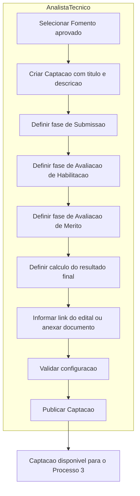
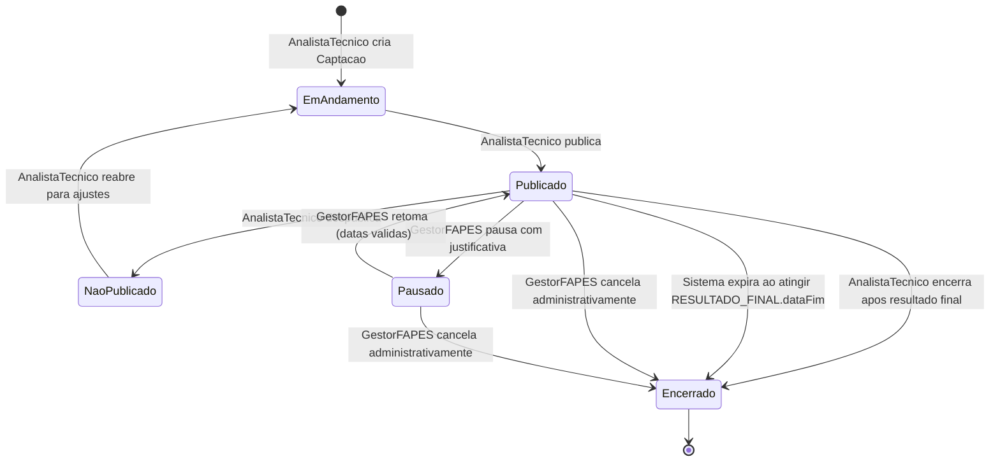
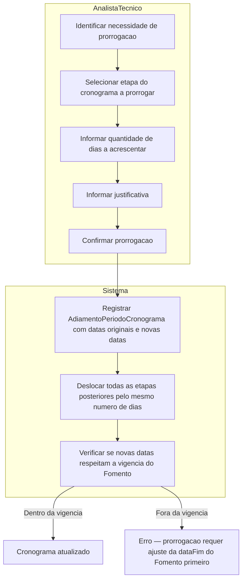

# Processo 2 — Configuracao da Selecao

## Visao Geral

O Processo de Configuracao da Selecao e conduzido pelo AnalistaTecnico a partir de um Fomento
aprovado. Neste processo sao definidos:

- as faixas do Fomento ativadas nesta captacao;
- as datas das etapas do processo de selecao;
- os formularios, regras de submissao, requisitos do proponente e exigencias de prestacao.

O resultado e uma `Captacao` com estado `PUBLICADO`, pronta para iniciar o Processo 3.

---

## Atores

| Ator | Papel no processo |
|------|-------------------|
| AnalistaTecnico | Configura e publica a captacao; encerra apos publicar resultado final |
| GestorFAPES | Pausa, retoma e cancela administrativamente a captacao |
| Sistema | Encerra automaticamente a captacao quando `RESULTADO_FINAL.dataFim` e atingida sem publicacao manual |

---

## Fluxo do Processo

---

## Atividades e Responsaveis

| # | Atividade | Responsavel | Descricao |
|---|-----------|-------------|-----------|
| 1 | Selecionar Fomento aprovado | AnalistaTecnico | Escolhe o Fomento com estado APROVADO que financiara esta captacao. |
| 2 | Criar Captacao com titulo e descricao | AnalistaTecnico | Registra a Captacao vinculada ao Fomento. Inicia no estado `EM_ANDAMENTO`. |
| 3 | Definir fase de Submissao | AnalistaTecnico | Define o periodo de submissao de propostas: data de inicio e data de fim. |
| 4 | Definir fase de Avaliacao de Habilitacao | AnalistaTecnico (Area Tecnica) | Configura a fase de habilitacao documental. Pode ter uma ou mais subatividades, cada uma com: data limite, formulario utilizado pelos avaliadores, quem executara a avaliacao (pessoa interna a FAPES ou avaliador externo), e peso percentual dentro da fase. Define tambem o tipo geral da fase (classificatoria ou eliminatoria) e o peso percentual desta fase na composicao da nota final. |
| 5 | Definir fase de Avaliacao de Merito | AnalistaTecnico | Configura a fase de avaliacao de merito e seu peso percentual na nota final. Pode ter uma ou mais subatividades de avaliacao, cada uma com modalidade propria: avaliacao ad hoc (revisores externos), apresentacao/pitch do proponente, ou visita in loco. Para cada subatividade define: data limite, quantidade minima de respostas por proposta, quem executara a avaliacao (pessoa interna a FAPES ou avaliador externo), formula de calculo da nota da subatividade, e peso percentual da subatividade dentro desta fase. Tipo geral da fase: classificatoria ou eliminatoria. |
| 5b | Definir calculo do resultado final | AnalistaTecnico | Define o peso percentual de cada fase (Habilitacao e Merito) e de cada subatividade da fase de Merito na composicao da nota final. A soma dos pesos das fases deve ser 100%. Dentro da fase de Merito, a soma dos pesos das subatividades tambem deve ser 100%. |
| 6 | Adicionar edital | AnalistaTecnico | Informa o titulo do edital e ao menos um dos seguintes: link externo (URL) ou upload do documento. Pode informar versao quando houver rerratificacoes. Obrigatorio antes da publicacao. |
| 19 | Validar e publicar Captacao | AnalistaTecnico | Verifica configuracao completa e publica. Captacao transita para `PUBLICADO`. |

---

> ⚠️ **IDEIA EM AVALIACAO** — Associar tipos de resultados, riscos e metricas de sucesso por tipo de projeto. Ao selecionar o tipo de projeto na proposta, esses campos viriam pre-preenchidos para o coordenador aceitar ou ajustar. Objetivo: padronizar a analise de impacto para a FAPES. Requer modelagem em M008 (TipoProjeto) ou novo modulo de templates. Nao implementado nesta versao.

## Matriz de Campos da Proposta

O AnalistaTecnico define, para cada bloco fixo da proposta, se ele e `EXIGIDO` ou `DISPENSADO`.
Blocos dispensados nao aparecem para o proponente — nao sao exibidos nem solicitados no
formulario de submissao. Blocos exigidos sao obrigatorios para a submissao ser concluida.

| Bloco | Descricao | Opcoes |
|-------|-----------|--------|
| Equipe | Papeis, quantidade prevista ou membros da equipe do projeto. | EXIGIDO / DISPENSADO |
| Resultados | Entregas e resultados esperados do projeto. | EXIGIDO / DISPENSADO |
| Riscos | Riscos identificados com impacto, probabilidade e mitigacao. | EXIGIDO / DISPENSADO |
| Cronograma do projeto | Atividades com datas e vinculos com resultados. | EXIGIDO / DISPENSADO |
| Orcamento | Valores planejados classificados por rubrica. | EXIGIDO / DISPENSADO |
| Objetivos | Objetivo geral e objetivos especificos do projeto. | EXIGIDO / DISPENSADO |
| Beneficios | Beneficios esperados e indicadores de alcance. | EXIGIDO / DISPENSADO |

---

## Cronograma da Selecao

| Etapa | TipoPeriodo | Tipo | Obrigatoriedade | Descricao |
|-------|-------------|------|-----------------|-----------|
| Publicacao da Captacao | PUBLICACAO_CAPTACAO | Data (inicio + fim) | Obrigatoria | Data em que a captacao e tornada publica para os proponentes. Marca o inicio formal do processo. |
| Recebimento de Propostas | RECEBIMENTO_PROPOSTAS | Periodo (inicio + fim) | Obrigatoria | Janela em que proponentes podem enviar propostas. Quando `exigeAprovacaoInstitucional = true`, o ResponsavelInstitucional deve assinar a proposta **dentro deste mesmo periodo** — nao ha etapa separada para aprovacao. |
| Avaliacao Documental | AVALIACAO_DOCUMENTAL | Periodo (inicio + fim) | Obrigatoria | AnalistaTecnico confere documentacao e habilita ou inabilita propostas. |
| Avaliacao Ad Hoc | AVALIACAO_AD_HOC | Periodo (inicio + fim) | Obrigatoria | Revisores ad hoc registram pareceres e notas das propostas habilitadas. |
| Resultado Preliminar | RESULTADO_PRELIMINAR | Data (inicio + fim) | Obrigatoria | Data em que o resultado preliminar e divulgado aos proponentes, abrindo prazo para interposicao de recursos. |
| Recebimento de Revisoes | RECEBIMENTO_REVISAO | Periodo (inicio + fim) | Obrigatoria | Proponentes podem solicitar revisao do resultado preliminar. |
| Resultado Apos Revisao | RESULTADO_APOS_REVISAO | Data (inicio + fim) | Obrigatoria | Data em que e publicado o resultado apos analise dos recursos e revisoes interpostos. |
| Resultado Final | RESULTADO_FINAL | Data | Obrigatoria | Data em que o resultado final e divulgado e o processo de selecao e encerrado no M011. Quando atingida sem publicacao manual, o Sistema encerra a Captacao automaticamente. |

Qualquer etapa pode ser adiada pelo AnalistaTecnico mediante justificativa. O sistema desloca
automaticamente todas as etapas posteriores pelo mesmo numero de dias e preserva historico com
datas originais e novas datas.

---

## Saida do Processo 2

Captacao publicada contendo:

- referencia ao Fomento aprovado;
- faixas do Fomento selecionadas para esta captacao;
- link do edital;
- regras de submissao e proponentes autorizados quando restrita;
- requisitos do proponente;
- documentos exigidos com formatos e obrigatoriedade;
- exigencia de prestacao tecnica e/ou financeira;
- formularios de submissao, avaliacao, recursos e anexos selecionados no M021;
- cronograma com as 8 etapas obrigatorias (PUBLICACAO_CAPTACAO, RECEBIMENTO_PROPOSTAS, AVALIACAO_DOCUMENTAL, AVALIACAO_AD_HOC, RESULTADO_PRELIMINAR, RECEBIMENTO_REVISAO, RESULTADO_APOS_REVISAO, RESULTADO_FINAL).

---

## Estados da Configuracao

---

## Regras de Negocio

| ID | Responsavel | Regra |
|----|-------------|-------|
| RN-CS00 | AnalistaTecnico | Rubricas e tipos de projetos sao definidos no Fomento e herdados pela Captacao atraves das faixas selecionadas. Nao sao reconfigurados no processo de selecao. |
| RN-CS01 | AnalistaTecnico | A Captacao deve referenciar um Fomento com estado APROVADO. |
| RN-CS05 | AnalistaTecnico | A Captacao deve selecionar ao menos uma faixa do Fomento. |
| RN-CS06 | AnalistaTecnico | As faixas selecionadas devem pertencer ao Fomento referenciado. |
| RN-CS07 | AnalistaTecnico | A Captacao deve ter link do edital preenchido antes da publicacao. |
| RN-CS08 | AnalistaTecnico | O cronograma deve conter as 8 etapas obrigatorias antes da publicacao: PUBLICACAO_CAPTACAO, RECEBIMENTO_PROPOSTAS, AVALIACAO_DOCUMENTAL, AVALIACAO_AD_HOC, RESULTADO_PRELIMINAR, RECEBIMENTO_REVISAO, RESULTADO_APOS_REVISAO e RESULTADO_FINAL. |
| RN-CS09 | AnalistaTecnico | Todas as datas do cronograma devem estar dentro da vigencia do Fomento (dataInicio a dataFim). |
| RN-CS10 | AnalistaTecnico | Toda Captacao deve selecionar formulario de submissao, avaliacao ad hoc e revisao de resultado no M021. |
| RN-CS11 | AnalistaTecnico | Quando submissao restrita a escolhidos, deve ser selecionada ao menos uma instituicao ou pessoa autorizada. |
| RN-CS12 | AnalistaTecnico | Qualquer etapa do cronograma pode ser adiada mediante justificativa, preservando historico das datas originais. |
| RN-CS13 | AnalistaTecnico | Ao adiar uma etapa, todas as etapas posteriores sao deslocadas pela mesma quantidade de dias. |
| RN-CS14 | AnalistaTecnico | A Captacao so pode ser publicada quando toda a configuracao obrigatoria estiver preenchida. |
| RN-CS15 | AnalistaTecnico | A Captacao so pode ser despublicada quando nenhuma proposta estiver submetida no periodo ativo. |
| RN-CS17 | AnalistaTecnico | O edital deve conter ao menos um link externo ou um arquivo anexado antes da publicacao da captacao. |
| RN-CS18 | AnalistaTecnico | O edital pode ser rerratificado informando nova versao. O historico de versoes deve ser preservado. |
| RN-CS19 | AnalistaTecnico | Cada bloco fixo da proposta deve ser configurado como EXIGIDO ou DISPENSADO antes da publicacao. |
| RN-CS25 | Sistema | Quando `exigeAprovacaoInstitucional = true`, a assinatura do ResponsavelInstitucional deve ocorrer dentro do periodo de Submissao de Propostas. Nao ha etapa separada para aprovacao institucional. |
| RN-CS26 | Sistema | Proposta sem assinatura institucional nao pode ser submetida formalmente quando `exigeAprovacaoInstitucional = true`. |
| RN-CS27 | ResponsavelInstitucional | O responsavel assina ou recusa a proposta antes da dataFim do periodo de submissao. Recusa deve ter justificativa registrada e devolve a proposta ao proponente para correcao ou desistencia. |
| RN-CS22 | AnalistaTecnico | O AnalistaTecnico pode exigir documentos adicionais especificos do edital, independentes dos blocos da matriz. Cada documento tem nome, formatos permitidos e obrigatoriedade propria. |
| RN-CS23 | Sistema | Documentos marcados como obrigatorios bloqueiam a submissao da proposta quando ausentes. |
| RN-CS24 | Sistema | Quando `reutilizarCadastroCorporativo = true`, o sistema verifica se o proponente ja possui o documento valido no M008 e o reaproveita, dispensando novo upload. Se o documento estiver vencido e `exigirNovoEnvioSeVencido = true`, novo upload e solicitado. |
| RN-CS20 | Sistema | Blocos configurados como DISPENSADO nao aparecem no formulario de submissao do proponente. |
| RN-CS21 | Sistema | Blocos configurados como EXIGIDO sao obrigatorios — a proposta nao pode ser submetida sem que estejam preenchidos. |

---

## Integracao

| Modulo | Papel |
|--------|-------|
| M011/Fomento | Fornece as faixas, rubricas, bolsas, tipos de projeto e vigencia. |
| M008 | Fornece AreaTecnica, Instituicoes, TiposInstituicao, NivelAcademico e PessoaFisica. |
| M021 | Fornece a base de formularios reutilizaveis e versionados. |

---

## Subprocesso: Prorrogacao de Prazo do Cronograma

A Area Tecnica pode prorrogar qualquer etapa do cronograma de uma Captacao publicada,
mediante justificativa. A prorrogacao desloca automaticamente todas as etapas posteriores
pelo mesmo numero de dias, preservando a sequencia operacional. O historico completo de
datas originais e novas datas e registrado de forma imutavel.

Exemplo tipico: prorrogacao do periodo de submissao de propostas por demanda insuficiente
ou por solicitacao dos proponentes.

### Atividades

| # | Atividade | Responsavel | Descricao |
|---|-----------|-------------|-----------|
| 1 | Identificar necessidade de prorrogacao | AnalistaTecnico | Identifica que uma etapa do cronograma precisa ser estendida — ex: baixa adesao no periodo de submissao, demanda de proponentes, decisao da diretoria. |
| 2 | Selecionar etapa a prorrogar | AnalistaTecnico | Seleciona qual periodo do cronograma sera estendido (ex: Submissao de Propostas, Analise Documental). |
| 3 | Informar quantidade de dias | AnalistaTecnico | Define quantos dias serao acrescidos ao periodo selecionado. Deve ser maior que zero. |
| 4 | Informar justificativa | AnalistaTecnico | Registra o motivo da prorrogacao. Obrigatorio. |
| 5 | Confirmar prorrogacao | AnalistaTecnico | Confirma a operacao. |
| 6 | Registrar adiamento | Sistema | Grava registro imutavel com datas originais, novas datas e data do registro. |
| 7 | Deslocar etapas posteriores | Sistema | Todas as etapas com ordem posterior a etapa prorrogada sao deslocadas pelo mesmo numero de dias automaticamente. |
| 8 | Validar vigencia do Fomento | Sistema | Verifica se as novas datas estao dentro da vigencia do Fomento. Se nao estiverem, bloqueia a prorrogacao e orienta o GestorFomento a ajustar a dataFim do Fomento primeiro. |

### Regras

| ID | Responsavel | Regra |
|----|-------------|-------|
| RN-PR01 | AnalistaTecnico | Prorrogacao pode ser aplicada a qualquer etapa do cronograma de uma Captacao com estado PUBLICADO. |
| RN-PR02 | AnalistaTecnico | A quantidade de dias deve ser maior que zero. |
| RN-PR03 | AnalistaTecnico | Justificativa e obrigatoria para toda prorrogacao. |
| RN-PR04 | Sistema | Ao prorrogar uma etapa, todas as etapas com ordem posterior sao deslocadas pelo mesmo numero de dias. |
| RN-PR05 | Sistema | O registro da prorrogacao e imutavel — preserva dataInicioOriginal, dataFimOriginal, dataInicioNova e dataFimNova. |
| RN-PR06 | Sistema | As novas datas nao podem ultrapassar a dataFim do Fomento. Se ultrapassarem, a prorrogacao e bloqueada ate que o GestorFomento ajuste a vigencia do Fomento. |

---

## Historico de Alteracoes

| Commit | Data | Autor | Descricao |
|--------|------|-------|-----------|
| `cdc84dd` | 2026-05-31 | Paulo Sergio Santos Junior | Simplificacao do P2: pool revisores, avaliacao merito e categorias removidos do processo de configuracao |
| `a718782` | 2026-05-31 | Paulo Sergio Santos Junior | Renomeia TipoIniciativa para TipoProjeto |
| `3756666` | 2026-05-31 | Paulo Sergio Santos Junior | Move arquivos de processo para subpasta process/ |
| `6b209d7` | 2026-05-29 | victoriocarvalho | Adicao da classe Fomento e outros ajustes |
| `b5e6ef8` | 2026-05-29 | Paulo Sergio Santos Junior | Normaliza terminologia iniciativa -> projeto |
| `985c5f0` | 2026-05-29 | Paulo Sergio Santos Junior | Alinha documentos com a ontologia |
| `d716bab` | 2026-05-29 | Paulo Sergio Santos Junior | Normaliza encerramento de captacao em tres modalidades |
| `da8e2b6` | 2026-05-29 | Paulo Sergio Santos Junior | Refina processos, ontologia e navegacao |
| `e722e02` | 2026-05-29 | Paulo Sergio Santos Junior | Reestrutura ontologia e processos do modulo de captacao |
