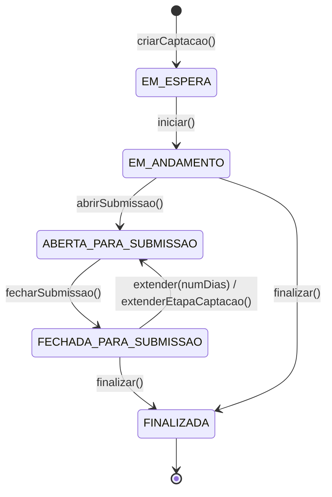

# Processo 2 — Configuracao da Captacao

## Visao Geral

O Processo de Configuracao da Captacao e conduzido pelo AnalistaTecnico a partir de um Fomento
ativo no P1, apto a originar Captacoes. Neste processo sao definidos:

- os dados basicos da Captacao (`nome`, `dataInicio`, `dataFim`);
- os limites operacionais (`limiteProjetos` e `recursoMaximo`);
- o cronograma da Captacao por meio de `EtapaCaptacao`;
- a `etapaAtual` quando houver uma etapa operacional em execucao;
- as extensoes de etapa por meio de `ExtensaoEtapaCaptacao`.

O resultado e uma `Captacao` criada em `EM_ESPERA`, iniciada por `iniciar()`, aberta para submissao por `abrirSubmissao()`, fechada por `fecharSubmissao()` e finalizada por `finalizar()`.

---

## Atores

| Ator | Papel no processo |
|------|-------------------|
| AnalistaTecnico | Cria, configura, inicia, abre submissao, fecha submissao, estende etapas e finaliza a Captacao |
| Sistema | Valida vigencia, limites, encadeamento, pertencimento das etapas e nao sobreposicao das datas |

---

## Fluxo do Processo

```mermaid
flowchart TD
    subgraph AnalistaTecnico[AnalistaTecnico]
        A[Selecionar Fomento ativo]
        B[criarCaptacao()]
        C[Informar nome, dataInicio, dataFim]
        D[Definir limiteProjetos e recursoMaximo]
        E[Associar EtapaCaptacao baseada em EtapaFomento]
        F[Definir etapaAtual quando aplicavel]
        G[Validar cronograma]
        H[iniciar()]
        I[abrirSubmissao()]
        J[fecharSubmissao()]
        K{Necessita extensao?}
        L[extender(numDias)]
        M[finalizar()]
    end

    subgraph Sistema[Sistema]
        V1[Validar vigencia do Fomento]
        V2[Validar ordem e nao sobreposicao das etapas]
        V3[Validar limite de projetos e recurso maximo]
    end

    A --> B --> C --> D --> E --> F --> G
    G --> V1 --> V2 --> V3 --> H --> I --> J --> K
    K -->|Sim| L --> V2 --> I
    K -->|Nao| M
```

---

## Atividades e Responsaveis

| # | Atividade | Responsavel | Descricao |
|---|-----------|-------------|-----------|
| 1 | Selecionar Fomento ativo | AnalistaTecnico | Escolhe um Fomento em estado `PUBLICADO` ou `EM_ANDAMENTO`, apto a originar Captacoes. |
| 2 | Criar Captacao | AnalistaTecnico | Executa `criarCaptacao()` e registra a Captacao em `EM_ESPERA`. |
| 3 | Informar dados basicos | AnalistaTecnico | Informa nome, `dataInicio` e `dataFim`. As datas devem permanecer dentro da vigencia do Fomento. |
| 4 | Definir limites | AnalistaTecnico | Informa `limiteProjetos` e `recursoMaximo` quando aplicavel. |
| 5 | Associar cronograma | AnalistaTecnico | Cria uma ou mais `EtapaCaptacao`, cada uma baseada em uma `EtapaFomento` pertencente ao Fomento da Captacao. |
| 6 | Encadear etapas | AnalistaTecnico | Define a relacao `proxima` entre etapas quando houver sequencia operacional. A cadeia deve pertencer a mesma Captacao e nao pode formar ciclo. |
| 7 | Definir etapa atual | AnalistaTecnico | Define `etapaAtual` quando a Captacao possuir uma etapa operacional em execucao. |
| 8 | Validar Captacao | Sistema | Verifica vigencia, Fomento, limites, etapas, ordem operacional e nao sobreposicao de datas. |
| 9 | Iniciar Captacao | AnalistaTecnico | Executa `iniciar()` e transiciona de `EM_ESPERA` para `EM_ANDAMENTO`. |
| 10 | Abrir submissao | AnalistaTecnico | Executa `abrirSubmissao()` e transiciona de `EM_ANDAMENTO` para `ABERTA_PARA_SUBMISSAO`. |
| 11 | Fechar submissao | AnalistaTecnico | Executa `fecharSubmissao()` e transiciona de `ABERTA_PARA_SUBMISSAO` para `FECHADA_PARA_SUBMISSAO`. |
| 12 | Finalizar Captacao | AnalistaTecnico | Executa `finalizar()` e transiciona para `FINALIZADA` quando nao houver novas etapas operacionais. |

---

> ⚠️ **IDEIA EM AVALIACAO** — Associar tipos de resultados, riscos e metricas de sucesso por tipo de projeto. Ao selecionar o tipo de projeto na proposta, esses campos viriam pre-preenchidos para o coordenador aceitar ou ajustar. Objetivo: padronizar a analise de impacto para a FAPES. Requer modelagem em M008 (TipoProjeto) ou novo modulo de templates. Nao implementado nesta versao.

## Cronograma da Captacao

O cronograma da Captacao e composto por `EtapaCaptacao`. Cada etapa:

- referencia uma `EtapaFomento` do mesmo Fomento;
- possui `dtInicio`;
- pode possuir `dtResultadoParcial`, `dtRecurso` e `dtResultadoFinal`, conforme a configuracao da etapa base;
- pode apontar para uma proxima `EtapaCaptacao`;
- pode registrar zero ou mais `ExtensaoEtapaCaptacao`.

As datas de etapas da mesma Captacao nao podem se sobrepor. A proxima etapa so pode iniciar apos o marco final da etapa anterior. Quando uma etapa e estendida, as etapas posteriores devem ser deslocadas quando necessario para preservar a sequencia operacional.

---

## Saida do Processo 2

Captacao configurada contendo:

- referencia ao Fomento ativo;
- nome, codigo, dataInicio e dataFim;
- limiteProjetos e recursoMaximo quando informados;
- uma ou mais EtapaCaptacao baseadas em EtapaFomento;
- etapaAtual quando aplicavel;
- historico de ExtensaoEtapaCaptacao quando houver extensao.

---

## Fluxo de Eventos da Captacao



---

## Regras de Negocio

| ID | Responsavel | Regra |
|----|-------------|-------|
| RN-CS01 | AnalistaTecnico | A Captacao deve referenciar exatamente um Fomento ativo do P1, apto a originar Captacoes. |
| RN-CS02 | AnalistaTecnico | `Captacao.dataInicio` e `Captacao.dataFim` devem estar dentro da vigencia do Fomento referenciado. |
| RN-CS03 | AnalistaTecnico | `Captacao.dataFim` deve ser posterior ou igual a `Captacao.dataInicio`. |
| RN-CS04 | AnalistaTecnico | Toda Captacao deve possuir ao menos uma EtapaCaptacao vinculada antes de ser iniciada. |
| RN-CS05 | AnalistaTecnico | Toda EtapaCaptacao deve ser baseada em uma EtapaFomento pertencente ao Fomento da Captacao. |
| RN-CS06 | Sistema | A cadeia `EtapaCaptacao.proxima` deve pertencer a mesma Captacao e nao pode formar ciclo. |
| RN-CS07 | Sistema | A Captacao e criada em `EM_ESPERA` por `criarCaptacao()`. |
| RN-CS08 | AnalistaTecnico | A Captacao so pode transitar de `EM_ESPERA` para `EM_ANDAMENTO` por `iniciar()` quando possuir nome, vigencia, Fomento e etapas configuradas. |
| RN-CS09 | Sistema | A abertura de submissao so pode ocorrer em `EM_ANDAMENTO` quando a data de inicio aplicavel for atingida. |
| RN-CS10 | Sistema | `abrirSubmissao()` transiciona a Captacao de `EM_ANDAMENTO` para `ABERTA_PARA_SUBMISSAO`. |
| RN-CS11 | Sistema | Enquanto a Captacao estiver `ABERTA_PARA_SUBMISSAO`, o cadastro/submissao de projetos fica permitido ate o limite de projetos ou ate o fechamento do periodo. |
| RN-CS12 | Sistema | `fecharSubmissao()` transiciona a Captacao de `ABERTA_PARA_SUBMISSAO` para `FECHADA_PARA_SUBMISSAO` quando o prazo de submissao terminar ou o fechamento for acionado. |
| RN-CS13 | AnalistaTecnico | `extender()` so pode ser aplicado em `FECHADA_PARA_SUBMISSAO` para reabrir submissao com nova data aplicavel e historico da extensao. |
| RN-CS14 | AnalistaTecnico | A Captacao pode ser finalizada a partir de `EM_ANDAMENTO` quando nao houver abertura de submissao prevista, ou a partir de `FECHADA_PARA_SUBMISSAO` apos execucao das etapas internas. |
| RN-CS15 | Sistema | `FINALIZADA` e estado terminal; nenhuma nova submissao, extensao ou etapa operacional pode ser iniciada. |
| RN-CS16 | Sistema | `limiteProjetos`, quando informado, bloqueia novas submissoes ao atingir a quantidade maxima configurada. |
| RN-CS17 | Sistema | `recursoMaximo`, quando informado, nao pode exceder o recurso disponivel do Fomento para a Captacao. |
| RN-CS18 | Sistema | As datas `dtInicio`, `dtResultadoParcial`, `dtRecurso` e `dtResultadoFinal` de EtapaCaptacao devem respeitar a ordem operacional definida pela EtapaFomento e permanecer dentro da vigencia da Captacao. |
| RN-CS19 | Sistema | EtapaCaptacao com recurso permitido pela EtapaFomento deve possuir `dtRecurso`; etapas sem recurso nao devem abrir periodo de recurso. |
| RN-CS20 | Sistema | Datas de EtapaCaptacao da mesma Captacao nao podem se sobrepor; a proxima EtapaCaptacao so pode iniciar apos o marco final da etapa anterior. |
| RN-CS21 | AnalistaTecnico | Toda ExtensaoEtapaCaptacao deve possuir `numeroDias > 0` e justificativa. |
| RN-CS22 | Sistema | Ao estender uma EtapaCaptacao, o sistema deve deslocar as etapas posteriores quando necessario para manter a sequencia e impedir sobreposicao de datas. |
| RN-CS23 | Sistema | `etapaAtual`, quando preenchida, deve referenciar uma EtapaCaptacao pertencente a propria Captacao. |

---

## Integracao

| Modulo | Papel |
|--------|-------|
| M011/Fomento | Fornece vigencia, recurso disponivel, TipoProjeto, TipoDocumento, Faixa, EtapaFomento, rubricas e bolsas. |
| M008 | Fornece AreaTecnica, TipoProjeto, Rubricas e cadastros auxiliares usados pelo Fomento. |

---

## Subprocesso: Extensao de Etapa da Captacao

O AnalistaTecnico pode estender uma EtapaCaptacao quando a Captacao estiver
`FECHADA_PARA_SUBMISSAO`, mediante justificativa. A extensao registra uma
`ExtensaoEtapaCaptacao` com quantidade de dias e justificativa, reabre a submissao e
desloca as etapas posteriores quando necessario para manter a sequencia operacional.

Exemplo tipico: extensao do periodo de submissao de propostas por demanda insuficiente
ou por solicitacao dos proponentes.

```mermaid
flowchart TD
    subgraph AnalistaTecnico[AnalistaTecnico]
        A[Identificar necessidade de extensao]
        B[Selecionar EtapaCaptacao a estender]
        C[Informar quantidade de dias a acrescentar]
        D[Informar justificativa]
        E[Confirmar extender(numDias)]
    end

    subgraph Sistema[Sistema]
        F[Registrar ExtensaoEtapaCaptacao]
        G[Deslocar etapas posteriores quando necessario]
        H[Verificar vigencia e nao sobreposicao]
    end

    A --> B --> C --> D --> E --> F --> G --> H
    H -->|Valido| I[Captacao volta para ABERTA_PARA_SUBMISSAO]
    H -->|Invalido| J[Erro - extensao bloqueada]
```

### Atividades

| # | Atividade | Responsavel | Descricao |
|---|-----------|-------------|-----------|
| 1 | Identificar necessidade de extensao | AnalistaTecnico | Identifica que uma EtapaCaptacao precisa ser estendida. |
| 2 | Selecionar etapa a estender | AnalistaTecnico | Seleciona a EtapaCaptacao que recebera extensao. |
| 3 | Informar quantidade de dias | AnalistaTecnico | Define quantos dias serao acrescidos. Deve ser maior que zero. |
| 4 | Informar justificativa | AnalistaTecnico | Registra o motivo da extensao. Obrigatorio. |
| 5 | Confirmar extensao | AnalistaTecnico | Executa `extender(numDias)` ou `extenderEtapaCaptacao(numDias)`. |
| 6 | Registrar extensao | Sistema | Grava `ExtensaoEtapaCaptacao` com `numeroDias` e justificativa. |
| 7 | Deslocar etapas posteriores | Sistema | Desloca etapas posteriores quando necessario para manter sequencia e nao sobreposicao. |
| 8 | Validar cronograma | Sistema | Verifica se as novas datas permanecem dentro da vigencia do Fomento e nao se sobrepoem. |

### Regras

| ID | Responsavel | Regra |
|----|-------------|-------|
| RN-EX01 | AnalistaTecnico | Extensao so pode ser aplicada quando a Captacao estiver `FECHADA_PARA_SUBMISSAO`. |
| RN-EX02 | AnalistaTecnico | A quantidade de dias deve ser maior que zero. |
| RN-EX03 | AnalistaTecnico | Justificativa e obrigatoria para toda extensao. |
| RN-EX04 | Sistema | Ao estender uma etapa, etapas posteriores devem ser deslocadas quando necessario para impedir sobreposicao. |
| RN-EX05 | Sistema | O registro da extensao preserva `numeroDias` e justificativa. |
| RN-EX06 | Sistema | As novas datas nao podem ultrapassar a vigencia do Fomento. |

---

## Historico de Alteracoes

| Commit | Data | Autor | Descricao |
|--------|------|-------|-----------|
| `cdc84dd` | 2026-05-31 | Paulo Sergio Santos Junior | Simplificacao do P2: pool revisores, avaliacao merito e categorias removidos do processo de configuracao |
| `a718782` | 2026-05-31 | Paulo Sergio Santos Junior | Renomeia TipoIniciativa para TipoProjeto |
| `3756666` | 2026-05-31 | Paulo Sergio Santos Junior | Move arquivos de processo para subpasta process/ |
| `6b209d7` | 2026-05-29 | victoriocarvalho | Adicao da classe Fomento e outros ajustes |
| `b5e6ef8` | 2026-05-29 | Paulo Sergio Santos Junior | Normaliza terminologia iniciativa -> projeto |
| `985c5f0` | 2026-05-29 | Paulo Sergio Santos Junior | Alinha documentos com a ontologia |
| `d716bab` | 2026-05-29 | Paulo Sergio Santos Junior | Normaliza encerramento de captacao em tres modalidades |
| `da8e2b6` | 2026-05-29 | Paulo Sergio Santos Junior | Refina processos, ontologia e navegacao |
| `e722e02` | 2026-05-29 | Paulo Sergio Santos Junior | Reestrutura ontologia e processos do modulo de captacao |
