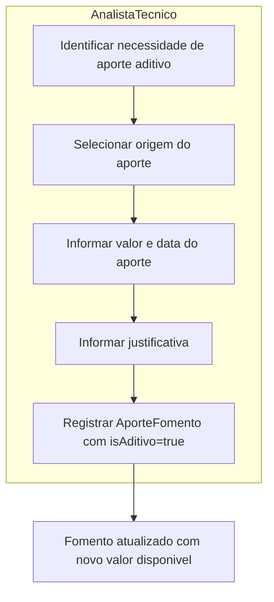
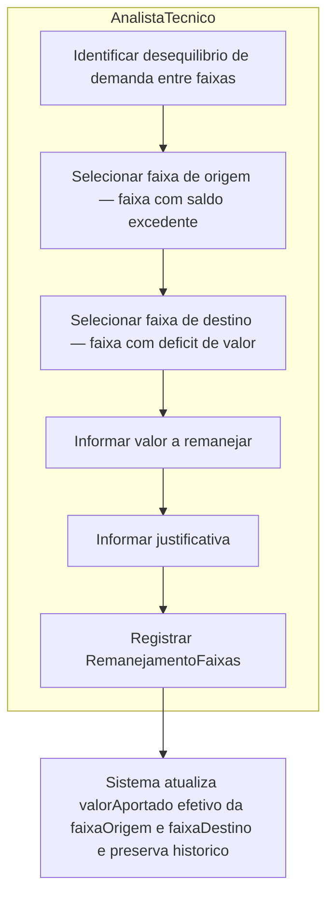
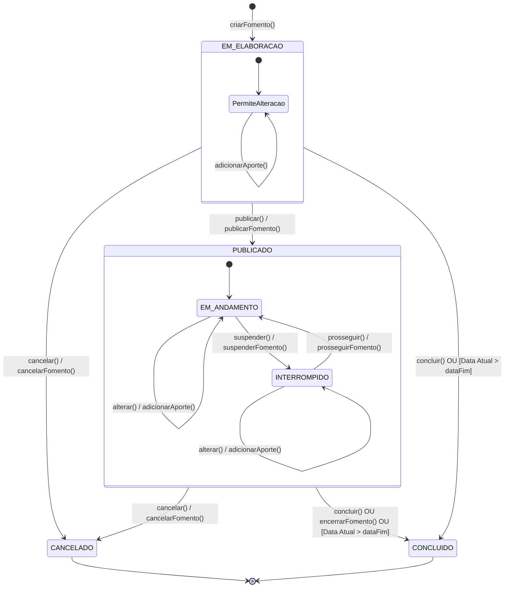

# Processo 1 — Fomento

## Visao Geral

O Processo de Fomento representa o aporte financeiro de um Programa, Parceria ou ContaContabil para
fomentar projetos de um eixo estrategico. Um Fomento define tipo de chamamento, tipo de outorgado,
vigencia, faixas, rubricas permitidas por faixa, bolsas permitidas, documentos, etapas, formularios,
criterios de selecao e resultados esperados.

O Fomento e a base financeira e de regras de investimento que uma Captacao (Processo 2) ira
utilizar. Uma Captacao somente pode ser criada a partir de um Fomento com estado `PUBLICADO` ou
subestado operacional `EM_ANDAMENTO`.

---

## Atores

| Ator | Papel no processo |
|------|-------------------|
| AnalistaTecnico | Responsavel por todo o processo de Fomento: cria, edita, define tipo de chamamento, vincula eixo estrategico, adiciona aportes, define faixas, configura rubricas e bolsas, configura etapas e criterios, publica, suspende, prossegue, conclui e cancela o Fomento. |

---

## Fluxo do Processo

```mermaid
flowchart TD
    subgraph AnalistaTecnico[AnalistaTecnico]
        A[Identificar necessidade de fomento]
        B[Criar Fomento com titulo, descricao, data de inicio e data de fim]
        TCH[Definir tipo de chamamento]
        ETH{Tipo de chamamento}
        TOU[Definir tipo do outorgado — PF ou PJ]
        GOU[Selecionar outorgado destinatario]
        GAO{Tipo do outorgado}
        GFP[Informar CPF e nome — PF]
        GFJ[Informar CNPJ, razao social e contato PF — PJ]
        AT[Definir area tecnica responsavel]
        C[Vincular ao eixo estrategico do M010]
        D[Adicionar aportes financeiros]
        E{Tipo de origem do aporte}
        F[Selecionar Programa e informar valor aportado]
        G[Selecionar Parceria e informar valor aportado]
        RI[Selecionar ContaContabil interna e informar valor aportado]
        H[Adicionar mais aportes quando necessario]
        I[Definir resultados esperados]
        J[Definir faixas]
        K[Informar nome, descricao e valor do aporte financeiro]
        L[Selecionar rubricas permitidas por faixa]
        REM[Configurar remanejamento entre rubricas]
        M{Rubrica do tipo Bolsa selecionada?}
        N[Configurar modalidades e niveis de bolsa para a faixa]
        O[Sistema resolve ultima versao ativa de cada nivel no M001]
        subgraph CRS[Configurar regras de submissao]
            JPA{Exige aprovacao institucional?}
            JPB[Habilitar solicitacao de assinatura institucional na submissao]
            SRE{Submissao restrita a escolhidos?}
            SPA[Selecionar proponentes autorizados]
            CRP[Configurar requisitos do proponente]
            PRE[Configurar pre-requisitos para submissao]
            CDE[Configurar documentos exigidos]
            DEP[Definir exigencia de prestacao tecnica e financeira]
        end
        EFT[Configurar EtapaFomento, formularios e criterios]
        P[Revisar fomento]
        Q{Fomento valido?}
        R[Publicar Fomento]
    end

    A --> B --> TCH --> ETH
    ETH -->|CHAMADA_PUBLICA| TOU --> AT
    ETH -->|DEMANDA_INDUZIDA| GOU --> GAO
    GAO -->|PESSOA_FISICA| GFP --> AT
    GAO -->|PESSOA_JURIDICA| GFJ --> AT
    AT --> C --> D --> E
    E -->|PROGRAMA| F --> H
    E -->|PARCERIA| G --> H
    E -->|CONTA_CONTABIL| RI --> H
    H --> I --> J --> K --> L
    L --> REM --> M
    M -->|Sim| N --> O --> JPA
    M -->|Nao| JPA
    JPA -->|Sim| JPB --> SRE
    JPA -->|Nao| SRE
    SRE -->|Sim| SPA --> CRP
    SRE -->|Nao| CRP
    CRP --> PRE --> CDE --> DEP --> EFT --> P
    P --> Q
    Q -->|Nao| J
    Q -->|Sim| R
    R --> S[Fomento PUBLICADO e disponivel para uso em Captacoes]
```

---

## Atividades e Responsaveis

| # | Atividade | Responsavel | Descricao |
|---|-----------|-------------|-----------|
| 1 | Identificar necessidade de fomento | AnalistaTecnico | Identifica necessidade de fomentar projetos em um eixo estrategico e decide iniciar novo Fomento. |
| 2 | Criar Fomento com titulo e descricao | AnalistaTecnico | Registra o Fomento com titulo, descricao do objetivo, data de inicio e data de fim da vigencia. Inicia no estado `EM_ELABORACAO`. |
| 3 | Definir tipo de chamamento | AnalistaTecnico | Define se o Fomento e `CHAMADA_PUBLICA` (edital aberto) ou `DEMANDA_INDUZIDA` (destinatario especifico). |
| 4 | Definir tipo do outorgado | AnalistaTecnico | Define se o outorgado e `PESSOA_FISICA` ou `PESSOA_JURIDICA`. Em `CHAMADA_PUBLICA` declara o perfil dos proponentes habilitados a receber outorga. Em `DEMANDA_INDUZIDA` deve coincidir com o tipo do destinatario informado no passo seguinte. |
| 5 | Selecionar outorgado destinatario | AnalistaTecnico | Apenas quando `DEMANDA_INDUZIDA`. Informa o destinatario especifico: PF (CPF + nome) ou PJ (CNPJ + razao social + contato PF). O tipo deve coincidir com o definido no passo anterior. |
| 6 | Definir area tecnica responsavel | AnalistaTecnico | Seleciona a Area Tecnica da FAPES responsavel pela gestao deste fomento. |
| 7 | Vincular ao eixo estrategico | AnalistaTecnico | Seleciona o eixo do planejamento estrategico (M010) que o Fomento pretende atingir. |
| 8 | Adicionar aportes financeiros | AnalistaTecnico | Inclui um ou mais aportes com tipo de origem (PROGRAMA, PARCERIA ou CONTA_CONTABIL), referencia ao Programa ou Parceria do M010 quando aplicavel, ou a ContaContabil do M016 quando for recurso interno, valor aportado, data do aporte, indicacao se e aporte aditivo e justificativa quando aplicavel. |
| 9 | Definir resultados esperados | AnalistaTecnico | Declara os produtos, servicos ou processos esperados dos projetos financiados. Opcional. |
| 10 | Definir faixas | AnalistaTecnico | Cria uma ou mais faixas. Para cada faixa informa nome, descricao e valor do aporte financeiro destinado a ela. |
| 11 | Selecionar rubricas permitidas por faixa | AnalistaTecnico | Para cada faixa, seleciona do catalogo M008 rubricas e subrubricas autorizadas para o orcamento dos projetos daquela faixa. Define obrigatoriedade, limites de valor ou percentual, observacoes e restricoes especificas. |
| 12 | Configurar remanejamento entre rubricas | AnalistaTecnico | Define se o fomento permite que o coordenador solicite remanejamento de valores entre rubricas durante a execucao do projeto. Quando habilitado, configura quais rubricas podem ser origem e quais podem ser destino de remanejamentos — podendo restringir o destino apenas as rubricas do edital ou permitir qualquer rubrica do catalogo. **Pendente:** verificar se o remanejamento exige aprovacao da FAPES ou e autorizado diretamente pelo coordenador. |
| 13 | Configurar modalidades e niveis de bolsa por faixa | AnalistaTecnico | Quando rubrica do tipo Bolsa selecionada, configura modalidades e niveis com cotas e limite de bolsistas. Sistema resolve automaticamente ultima versao ativa de cada nivel no M001. |
| 14 | Configurar regras de submissao | AnalistaTecnico | Define se permite multiplas propostas, acumulo de bolsa, participacao em outra proposta e se a submissao e restrita a proponentes escolhidos. Tambem define se exige aprovacao institucional (`exigeAprovacaoInstitucional`). Inclui as seguintes sub-tarefas: (a) **Configurar requisitos do proponente** — define direcionamento, vinculo empregaticio, gestor institucional, nivel academico minimo e limites de submissao por instituicao ou departamento; (b) **Configurar pre-requisitos para submissao** — define restricoes que impedem a submissao, habilitaveis individualmente (proposta contratada em fomento anterior, sem titulacao minima, ja contratado na mesma chamada, em chamada continua com contratacao ativa, limite de submissoes excedido, vinculo empregaticio ativo, numero maximo de projetos ativos atingido); (c) **Configurar documentos exigidos** — define documentos adicionais que o proponente deve anexar na submissao, com nome, descricao, formatos permitidos, obrigatoriedade e possibilidade de reaproveitamento do M008; (d) **Definir exigencia de prestacao tecnica e financeira** — define se os projetos gerados exigirao prestacao tecnica e/ou financeira. |
| 14b | Habilitar solicitacao de assinatura institucional | AnalistaTecnico | **Condicional — apenas quando `exigeAprovacaoInstitucional = true`.** Configura que o proponente devera solicitar a assinatura do ResponsavelInstitucional durante o periodo de submissao. A proposta so pode ser submetida formalmente apos a assinatura ser obtida. |
| 15 | Selecionar proponentes autorizados | AnalistaTecnico | Quando submissao restrita, seleciona as instituicoes ou pessoas autorizadas a submeter proposta. |
| 16 | Configurar requisitos do proponente | AnalistaTecnico | Define direcionamento (aberto, instituicao, tipo de instituicao), exigencia de vinculo empregaticio, gestor institucional e nivel academico minimo. Permite configurar limite de submissoes por instituicao ou por departamento da instituicao — alguns editais restringem a uma unica proposta por instituicao ou unidade organizacional. |
| 16b | Configurar pre-requisitos para submissao | AnalistaTecnico | Define restricoes configuráveis que impedem a submissao de proposta. As restricoes aplicáveis sao: (a) proponente com proposta contratada em fomento anterior — sistema lista os fomentos existentes para selecao; (b) proponente sem titulacao minima exigida; (c) proponente com proposta ja contratada por chamada anterior do mesmo fomento; (d) em chamada continua, proponente com proposta contratada no mesmo fomento nao pode submeter nova proposta enquanto a contratacao estiver ativa; (e) proponente que ja submeteu mais de uma proposta no mesmo fomento. Cada restricao pode ser habilitada ou desabilitada individualmente. (f) proponente com vinculo empregaticio ativo no momento da submissao ou da contratacao — configura se o impedimento se aplica na submissao, na contratacao ou em ambos os momentos; (g) coordenador que ja atingiu o numero maximo de projetos ativos permitidos — o AnalistaTecnico define o limite maximo (ex.: 3 projetos); o sistema bloqueia a submissao quando o coordenador ja possui esse numero de projetos contratados ou em execucao. |
| 17 | Configurar documentos adicionais exigidos | AnalistaTecnico | Define quais documentos o proponente deve anexar na submissao, alem dos blocos estruturais da proposta. Exemplos: certidoes, contratos sociais, comprovantes de vinculo, declaracoes especificas do edital. Para cada documento informa: nome, descricao, formatos permitidos (PDF, DOCX, etc.), obrigatoriedade, e se pode ser reaproveitado do cadastro corporativo do M008 quando valido. |
| 18 | Definir exigencia de prestacao tecnica e financeira | AnalistaTecnico | Define se os projetos gerados exigirao prestacao tecnica e/ou financeira. |
| 19 | Configurar etapas e criterios | AnalistaTecnico | Define EtapaFomento, TipoEtapa, formularios e criterios de selecao que poderao orientar as EtapaCaptacao derivadas. |
| 20 | Revisar fomento | AnalistaTecnico | Confere vigencia, tipo de chamamento, outorgado destinatario (quando DEMANDA_INDUZIDA), area tecnica, faixas, tipos associados, aportes, rubricas, etapas e criterios antes da publicacao. Retorna para ajustes se necessario. |
| 21 | Publicar Fomento | AnalistaTecnico | Transita para `PUBLICADO`. Exige ao menos um aporte, uma faixa, um tipo de projeto, area tecnica, tipo de chamamento e configuracoes obrigatorias definidas. Disponivel para uso em Captacoes. |

---

## Saida do Processo 1

Fomento publicado contendo:

- tipo de chamamento (`CHAMADA_PUBLICA` ou `DEMANDA_INDUZIDA`);
- tipo do outorgado (`PESSOA_FISICA` ou `PESSOA_JURIDICA`);
- outorgado destinatario (PF ou PJ com contato PF), quando `DEMANDA_INDUZIDA`;
- ao menos um aporte financeiro com origem em Programa, Parceria ou ContaContabil;
- eixo estrategico atingido;
- ao menos uma faixa;
- tipos de projeto aceitos pelo Fomento;
- rubricas e subrubricas permitidas por faixa, com percentuais, restricoes e observacoes quando aplicavel;
- configuracoes de modalidade e nivel de bolsa por faixa, com a ultima versao ativa resolvida no M001, quando a rubrica Bolsa estiver selecionada;
- etapas, formularios e criterios de selecao configurados;
- resultados esperados (produtos, servicos ou processos), quando aplicavel.

---

## Cronograma Financeiro

| Restricao | Regra |
|-----------|-------|
| Total de aportes | Soma dos `valorAportado` de todos os `AporteFomento` |
| Aporte individual | Cada aporte deve ser maior que zero |
| Origem exclusiva | Cada aporte referencia exatamente um Programa, uma Parceria ou uma ContaContabil |

---

## Subprocesso: Aporte Aditivo

A qualquer momento enquanto o Fomento nao estiver em estado terminal, o AnalistaTecnico pode registrar um novo `AporteFomento` com `isAditivo=true` para ampliar o valor disponivel do Fomento. O aporte aditivo preserva origem, valor, data do aporte e justificativa no proprio historico de aportes do Fomento.

| # | Atividade | Responsavel | Descricao |
|---|-----------|-------------|-----------|
| 1 | Identificar necessidade de aporte aditivo | AnalistaTecnico | Identifica que o fomento precisa de ampliacao de valor. |
| 2 | Selecionar origem do aporte | AnalistaTecnico | Define se a origem do aporte aditivo e PROGRAMA, PARCERIA ou CONTA_CONTABIL. |
| 3 | Informar valor e data do aporte | AnalistaTecnico | Informa o valor financeiro a ser acrescido ao total do fomento e a data do aporte. O valor deve ser maior que zero. |
| 4 | Informar justificativa | AnalistaTecnico | Registra o motivo do aporte aditivo. Obrigatorio. |
| 5 | Registrar AporteFomento | AnalistaTecnico | Confirma o aporte com `isAditivo=true`. O sistema preserva o registro no historico de aportes e recalcula o total financeiro pela soma dos aportes. |

**Regras do aporte aditivo:**

| ID | Responsavel | Regra |
|----|-------------|-------|
| RN-A01 | AnalistaTecnico | Aporte aditivo pode ser registrado em Fomento nao terminal, inclusive apos publicacao, desde que possua `isAditivo=true`. |
| RN-A02 | AnalistaTecnico | Aporte aditivo deve possuir valor maior que zero, data do aporte e justificativa. |
| RN-A03 | AnalistaTecnico | Quando a origem representar recurso interno, o aporte deve referenciar uma ContaContabil interna da FAPES. |
| RN-A04 | Sistema | O total financeiro do Fomento e recalculado pela soma de todos os AporteFomento, incluindo os registros com `isAditivo=true`. |

---

## Subprocesso: Remanejamento de Valores entre Faixas

Apos a selecao dos projetos (Processo 3), o AnalistaTecnico pode remanejar valor aportado entre
faixas do mesmo Fomento. Isso ocorre quando a demanda real de projetos aprovados em uma faixa
supera ou nao atinge o valor originalmente alocado.

Cada remanejamento e um registro imutavel com historico dos valores anteriores de cada faixa.

| # | Atividade | Responsavel | Descricao |
|---|-----------|-------------|-----------|
| 1 | Identificar desequilibrio de demanda | AnalistaTecnico | Apos resultado da selecao, verifica quais faixas tiveram mais ou menos projetos aprovados do que o valor alocado comporta. |
| 2 | Selecionar faixa de origem | AnalistaTecnico | Seleciona a faixa com saldo excedente — valor aportado maior do que a demanda de projetos aprovados. |
| 3 | Selecionar faixa de destino | AnalistaTecnico | Seleciona a faixa com deficit — valor aportado insuficiente para atender os projetos aprovados. Deve ser diferente da faixa de origem. |
| 4 | Informar valor a remanejar | AnalistaTecnico | Define o valor a ser transferido. Nao pode exceder o valorAportado efetivo da faixa de origem. |
| 5 | Informar justificativa | AnalistaTecnico | Registra o motivo do remanejamento — geralmente excesso ou falta de demanda. Obrigatorio. |
| 6 | Registrar RemanejamentoFaixas | AnalistaTecnico | Confirma o remanejamento. Sistema grava registro imutavel com valores anteriores de cada faixa para rastreabilidade e atualiza os valores efetivos. |

**Regras do remanejamento:**

| ID | Responsavel | Regra |
|----|-------------|-------|
| RN-R01 | AnalistaTecnico | Remanejamento so pode ser registrado em Fomento nao terminal, preservando historico e auditoria. |
| RN-R02 | AnalistaTecnico | Faixa de origem e faixa de destino devem pertencer ao mesmo Fomento. |
| RN-R03 | AnalistaTecnico | Faixa de origem e faixa de destino devem ser diferentes. |
| RN-R04 | AnalistaTecnico | O valor remanejado deve ser maior que zero e nao pode exceder o valorAportado efetivo da faixa de origem. |
| RN-R05 | Sistema | O registro e imutavel — preserva `valorOrigemAnterior` e `valorDestinoAnterior` para rastreabilidade. |
| RN-R06 | Sistema | Apos remanejamento, o valorAportado efetivo de cada faixa e recalculado considerando todos os remanejamentos registrados. |

---

## Estados do Fomento

| Estado | Descricao | Efeito nos projetos vinculados |
|--------|-----------|-------------------------------|
| EM_ELABORACAO | Fomento sendo configurado, ainda nao publicado. | Nenhum — nao ha captacoes ativas. |
| PUBLICADO | Fomento publicado e apto ao ciclo operacional. | Pode originar captacoes enquanto estiver ativo. |
| EM_ANDAMENTO | Subestado operacional do Fomento publicado enquanto esta ativo para captacoes. | Captacoes e projetos operam normalmente. |
| INTERROMPIDO | AnalistaTecnico suspendeu temporariamente o Fomento por `suspenderFomento()`. | Novas captacoes ficam bloqueadas enquanto o Fomento estiver interrompido. |
| CANCELADO | Fomento cancelado por `cancelarFomento()`. | Nenhuma nova captacao pode ser criada. |
| CONCLUIDO | Prazo do fomento (`dataFim`) foi ultrapassado ou `concluir()` foi acionado. | Nenhuma nova captacao pode ser criada. Projetos em andamento seguem seus proprios prazos. |

---

## Regras de Negocio

| ID | Responsavel | Regra |
|----|-------------|-------|
| RN-F01 | AnalistaTecnico | Todo Fomento deve possuir codigo, titulo, vigencia (`dataInicio` e `dataFim`), eixo estrategico, area tecnica, tipo de chamamento e tipo de outorgado. |
| RN-F02 | AnalistaTecnico | `Fomento.dataFim` deve ser posterior ou igual a `Fomento.dataInicio`. |
| RN-F03 | AnalistaTecnico | Todo Fomento deve possuir ao menos um aporte financeiro originado de Programa, Parceria ou ContaContabil antes de ser publicado. |
| RN-F04 | AnalistaTecnico | Todo Fomento deve possuir ao menos uma faixa antes de ser publicado. |
| RN-F05 | AnalistaTecnico | Todo Fomento deve possuir ao menos um TipoProjeto aceito antes de ser publicado. |
| RN-F06 | AnalistaTecnico | Todo Fomento deve possuir um Edital associado antes de ser publicado, conforme o modelo estrutural atual. |
| RN-F07 | AnalistaTecnico | Quando `tipoChamamento=DEMANDA_INDUZIDA`, o Fomento deve possuir exatamente um OutorgadoDemanda. |
| RN-F08 | Sistema | Quando houver OutorgadoDemanda, o tipo informado deve coincidir com `Fomento.tipoOutorgado`; se for PJ, deve haver contato de pessoa fisica. |
| RN-F09 | AnalistaTecnico | Cada aporte deve indicar exatamente uma origem, possuir valor maior que zero, data do aporte e justificativa quando `isAditivo=true`. |
| RN-F10 | Sistema | O total financeiro do Fomento e calculado pela soma dos `AporteFomento.valorAportado`; nao ha total financeiro manual. |
| RN-F11 | AnalistaTecnico | Dados, faixas, aportes, documentos, formularios, criterios e etapas do Fomento podem ser alterados a qualquer momento enquanto o Fomento existir, preservando historico/auditoria quando houver captacoes vinculadas. |
| RN-F12 | Sistema | O Fomento inicia em EM_ELABORACAO e transita para PUBLICADO por `publicar()` ou `publicarFomento()` quando as configuracoes obrigatorias estiverem completas. |
| RN-F13 | Sistema | Somente Fomento PUBLICADO ou EM_ANDAMENTO pode originar novas Captacoes; Fomento INTERROMPIDO, CANCELADO ou CONCLUIDO nao pode originar novas Captacoes. |
| RN-F14 | AnalistaTecnico | `suspender()` ou `suspenderFomento()` suspende temporariamente um Fomento PUBLICADO ou EM_ANDAMENTO, transicionando-o para INTERROMPIDO. |
| RN-F15 | AnalistaTecnico | `prosseguir()` ou `prosseguirFomento()` retoma um Fomento INTERROMPIDO, devolvendo-o ao ciclo operacional PUBLICADO/EM_ANDAMENTO. |
| RN-F16 | Sistema | Fomento transita para CONCLUIDO por `concluir()` ou automaticamente quando `dataFim` for ultrapassada; nenhuma nova Captacao pode ser criada a partir de Fomento CONCLUIDO. |
| RN-F17 | AnalistaTecnico | Fomento EM_ELABORACAO, PUBLICADO, EM_ANDAMENTO ou INTERROMPIDO pode ser cancelado por `cancelar()` ou `cancelarFomento()`, transicionando para CANCELADO. |
| RN-F18 | Sistema | Nenhuma data do cronograma de uma Captacao pode ser anterior a `Fomento.dataInicio` nem posterior a `Fomento.dataFim`. |
| RN-F19 | Sistema | O TipoProjeto de um Projeto captado deve estar na lista de tipos permitidos do Fomento vinculado. |
| RN-F20 | AnalistaTecnico | Rubricas e subrubricas sao configuradas por Faixa. |
| RN-F21 | AnalistaTecnico | Quando a rubrica Bolsa estiver permitida em uma Faixa, devem ser configuradas as BolsasPermitidasFaixa com versao de nivel, cotas e quantidade minima de bolsistas. |
| RN-F22 | Sistema | BolsaPermitidaFaixa so pode ser configurada em Faixa que permite rubrica do tipo Bolsa. |
| RN-F23 | AnalistaTecnico | Todo Fomento deve possuir ao menos uma EtapaFomento inicial, identificada por nao possuir pre-requisito. |
| RN-F24 | Sistema | Pre-requisitos entre EtapaFomento devem pertencer ao mesmo Fomento e nao podem formar ciclo. |
| RN-F25 | Sistema | Captacoes criadas a partir do Fomento devem referenciar somente TipoProjeto, TipoDocumento, Faixa, EtapaFomento, rubricas e bolsas configurados no proprio Fomento. |

> ⚠️ **PENDENTE DE DETALHAMENTO** — `CHAMADA_PUBLICA` pode ser **continua** (sem prazo fixo de encerramento, recebe propostas de forma permanente ou por ciclos) ou **nao continua** (prazo fixo de submissao). A distincao afeta o cronograma, o encerramento da captacao e possivelmente as regras de publicacao do resultado. Nao ha definicao de como cada modalidade funciona nesta versao.

---

## Integracao

| Modulo | Papel |
|--------|-------|
| M010 | Fornece Programa, Parceria e EixoEstrategico que alimentam o Fomento. |
| M016 | Fornece a referencia de recurso interno quando o aporte vier de fundo/carteira financeira da FAPES. |
| M008 | Fornece o catalogo de TipoProjeto e de Rubricas disponivel para configuracao por faixa. |
| M001 | Fornece modalidades, niveis e a ultima versao ativa de cada nivel de bolsa configurado por faixa. |

---

## Historico de Alteracoes

| Commit | Data | Autor | Descricao |
|--------|------|-------|-----------|
| `a718782` | 2026-05-31 | Paulo Sergio Santos Junior | Renomeia TipoIniciativa para TipoProjeto |
| `3756666` | 2026-05-31 | Paulo Sergio Santos Junior | Move arquivos de processo para subpasta process/ |
| `6b209d7` | 2026-05-29 | victoriocarvalho | Adicao da classe Fomento e outros ajustes |
| `b5e6ef8` | 2026-05-29 | Paulo Sergio Santos Junior | Normaliza terminologia iniciativa -> projeto |
| `985c5f0` | 2026-05-29 | Paulo Sergio Santos Junior | Alinha documentos com a ontologia |
| `e722e02` | 2026-05-29 | Paulo Sergio Santos Junior | Reestrutura ontologia e processos do modulo de captacao |
