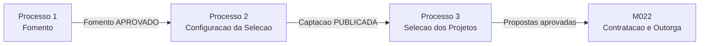

# M011 — Processos de Captacao de Projetos

O modulo M011 cobre o fluxo **pre-award** da captacao de projetos, dividido em tres processos
sequenciais e dependentes.

Modelo estrutural por processo: [modelo-estrutural-por-processo.md](../modelo-estrutural/modelo-estrutural-p1-fomento.md).

---

## Processos

| # | Processo | Responsavel principal | Descricao resumida |
|---|----------|-----------------------|--------------------|
| 1 | [Fomento](process-fomento.md) | GestorFomento | Aporte financeiro de Programa, Parceria ou recurso interno para um eixo estrategico. Define faixas de investimento, rubricas por faixa e resultados esperados. |
| 2 | [Configuracao da Selecao](process-configuracao-selecao.md) | AnalistaTecnico | A Area Tecnica configura o tipo de chamamento, cronograma com 8 etapas obrigatorias, formularios e regras de selecao sobre um Fomento aprovado. GestorFAPES e responsavel por publicar, pausar, retomar e cancelar a Captacao. |
| 3 | [Selecao dos Projetos](process-selecao-projetos.md) | AnalistaTecnico | Execucao da captacao: recebimento de propostas, analise documental, analise de merito, resultado preliminar, revisao e resultado final. Envolve tambem Proponente, RevisorAdHoc e ResponsavelInstitucional. |

---

## Dependencias entre Processos

- O Processo 2 exige um Fomento com estado `APROVADO`.
- O Processo 3 exige uma Captacao com estado `PUBLICADO`. Uma Captacao pode ser pausada (`PAUSADO`) por GestorFAPES, bloqueando todas as operacoes de selecao ate ser retomada.
- A Captacao pode ser encerrada de tres formas: encerramento normal pelo AnalistaTecnico apos publicacao do resultado final, expiracao automatica pelo sistema ao fim do periodo `RESULTADO_FINAL`, ou cancelamento administrativo por GestorFAPES com justificativa.
- O M011 termina na publicacao do resultado final. A assinatura do termo de outorga e contratacao pertencem ao M022.

---

## Atores do Modulo

| Ator | Processos |
|------|-----------|
| GestorFomento | 1 — cria, edita e aprova Fomento; registra aportes, aportes aditivos e remanejamentos de faixas; interrompe, retoma e encerra Fomento |
| GestorFAPES | 2 — publica, despublica, pausa, retoma e cancela Captacao |
| AnalistaTecnico (Area Tecnica) | 2 — configura Captacao (cronograma, formularios, regras); 3 — conduz selecao e encerra Captacao apos resultado final |
| Proponente | 3 — submete proposta e solicita revisao |
| RevisorAdHoc | 3 — registra parecer de avaliacao ad hoc |
| ResponsavelInstitucional | 3 — aprova ou recusa proposta quando exigeAprovacaoInstitucional=true |
| Sistema | Transicoes automaticas: conclui Fomento quando hoje >= dataFim; expira Captacao ao fim do periodo RESULTADO_FINAL |

---

## Integracao com Outros Modulos

| Modulo | Papel |
|--------|-------|
| M010 | Fornece Programa, Parceria e EixoEstrategico para o Fomento. |
| M016 | Fornece a referencia de recurso interno quando o aporte do Fomento vier de fundo/carteira financeira da FAPES. |
| M001 | Fornece modalidades, niveis e versoes ativas de bolsa configuradas por faixa. |
| M008 | Fornece Rubricas, AreaTecnica, Instituicoes, NivelAcademico e PessoaFisica. |
| M021 | Fornece a base de formularios versionados usados na selecao. |
| M022 | Consome propostas aprovadas para contratacao e assinatura do termo de outorga. |
| M003 | Recebe o projeto apos contratacao no M022. |
