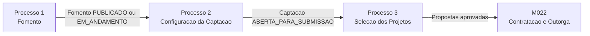

# M011 — Processos de Captacao de Projetos

O modulo M011 cobre o fluxo **pre-award** da captacao de projetos, dividido em tres processos
sequenciais e dependentes.

Modelos estruturais por processo: [P1 Fomento](../modelo-estrutural/modelo-estrutural-p1-fomento.md), [P2 Configuracao da Captacao](../modelo-estrutural/modelo-estrutural-p2-configuracao-selecao.md) e [P3 Selecao dos Projetos](../modelo-estrutural/modelo-estrutural-p3-selecao-projetos.md).

---

## Processos

| # | Processo | Responsavel principal | Descricao resumida |
|---|----------|-----------------------|--------------------|
| 1 | [Fomento](process-fomento.md) | AnalistaTecnico | Aporte financeiro de Programa, Parceria ou ContaContabil para um eixo estrategico. Define tipo de chamamento, tipo de outorgado, faixas, rubricas, bolsas, etapas, formularios, criterios e resultados esperados. |
| 2 | [Configuracao da Captacao](process-configuracao-captacao.md) | AnalistaTecnico | Configura Captacao sobre um Fomento ativo, com datas, limites, recurso maximo, EtapaCaptacao baseada em EtapaFomento, etapa atual, extensoes e abertura/fechamento de submissao. |
| 3 | [Selecao dos Projetos](process-selecao-projetos.md) | AnalistaTecnico | Execucao da captacao: recebimento de propostas, analise documental, analise de merito, resultado preliminar, revisao e resultado final. Envolve tambem Proponente, RevisorAdHoc e ResponsavelInstitucional. |

---

## Dependencias entre Processos

- O Processo 2 exige um Fomento com estado `PUBLICADO` ou subestado operacional `EM_ANDAMENTO`.
- O Processo 3 exige uma Captacao em `ABERTA_PARA_SUBMISSAO` para recebimento de propostas.
- A Captacao pode ser fechada por `fecharSubmissao()`, reaberta por `extender(numDias)` a partir de `FECHADA_PARA_SUBMISSAO` e finalizada por `finalizar()`.
- O M011 termina na publicacao do resultado final. A assinatura do termo de outorga e contratacao pertencem ao M022.

---

## Atores do Modulo

| Ator | Processos |
|------|-----------|
| AnalistaTecnico (Area Tecnica) | 1 — cria, edita, publica, suspende, prossegue, conclui e cancela Fomento; registra aportes e aportes aditivos; 2 — configura Captacao, etapas e extensoes; 3 — conduz selecao e finaliza Captacao |
| Proponente | 3 — submete proposta e solicita revisao |
| RevisorAdHoc | 3 — registra parecer de avaliacao ad hoc |
| ResponsavelInstitucional | 3 — aprova ou recusa proposta quando exigeAprovacaoInstitucional=true |
| Sistema | Transicoes automaticas e validacoes: conclui Fomento quando hoje > dataFim; valida vigencia, limites, encadeamento e nao sobreposicao das etapas da Captacao |

---

## Integracao com Outros Modulos

| Modulo | Papel |
|--------|-------|
| M010 | Fornece Programa, Parceria e EixoEstrategico para o Fomento. |
| M016 | Fornece a referencia de recurso interno quando o aporte do Fomento vier de fundo/carteira financeira da FAPES. |
| M001 | Fornece modalidades, niveis e versoes ativas de bolsa configuradas por faixa. |
| M008 | Fornece Rubricas, AreaTecnica, Instituicoes, NivelAcademico e PessoaFisica. |
| M021 | Fornece a base de formularios versionados usados na selecao. |
| M022 | Consome propostas aprovadas para contratacao e assinatura do termo de outorga. |
| M003 | Recebe o projeto apos contratacao no M022. |
