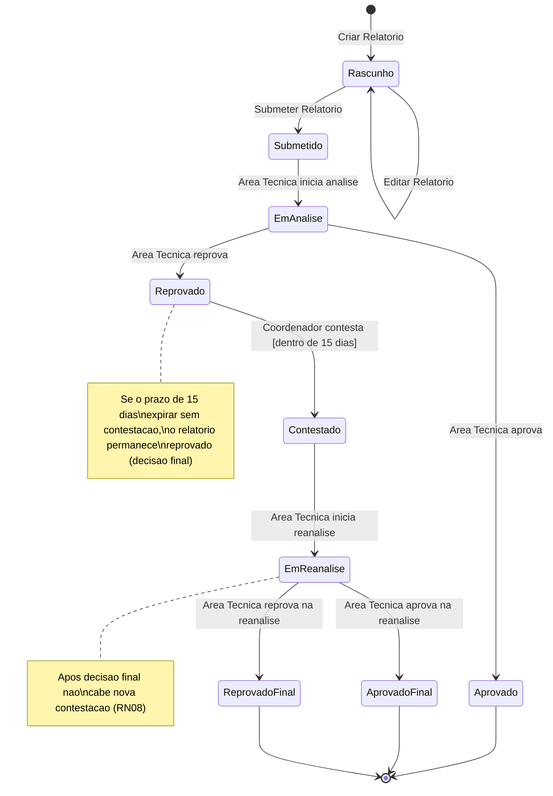
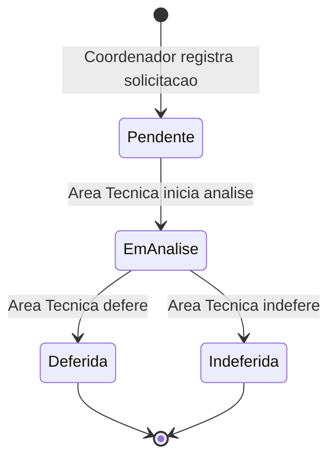

# Modelo Comportamental

Dominio e regras de negocio: ver [README.md](README.md)

### Ciclo de Vida: RelatorioTecnico

```mermaid
stateDiagram-v2
    [*] --> Rascunho : Criar Relatorio

    Rascunho --> Rascunho : Editar Relatorio
    Rascunho --> Submetido : Submeter Relatorio

    Submetido --> EmAnalise : Area Tecnica inicia analise

    EmAnalise --> Aprovado : Area Tecnica aprova
    EmAnalise --> Reprovado : Area Tecnica reprova

    Reprovado --> Contestado : Coordenador contesta [dentro de 15 dias]

    Contestado --> EmReanalise : Area Tecnica inicia reanalise

    EmReanalise --> AprovadoFinal : Area Tecnica aprova na reanalise
    EmReanalise --> ReprovadoFinal : Area Tecnica reprova na reanalise

    Aprovado --> [*]
    AprovadoFinal --> [*]
    ReprovadoFinal --> [*]

    state Rascunho : Relatorio em elaboracao pelo coordenador
    state Submetido : Aguardando inicio da analise
    state EmAnalise : Area Tecnica avaliando
    state Aprovado : Relatorio aceito sem contestacao
    state Reprovado : Aguardando contestacao (15 dias)
    state Contestado : Contestacao registrada, aguardando reanalise
    state EmReanalise : Area Tecnica reavaliando
    state AprovadoFinal : Aprovado apos reanalise
    state ReprovadoFinal : Reprovado definitivamente

    note right of Reprovado : Se o prazo de 15 dias\nexpirar sem contestacao,\no relatorio permanece\nreprovado (decisao final)
    note right of EmReanalise : Apos decisao final nao\ncabe nova contestacao (RN08)
```

### Ciclo de Vida: SolicitacaoAlteracao

```mermaid
stateDiagram-v2
    [*] --> Pendente : Coordenador registra solicitacao

    Pendente --> EmAnalise : Area Tecnica inicia analise

    EmAnalise --> Deferida : Area Tecnica defere
    EmAnalise --> Indeferida : Area Tecnica indefere

    Deferida --> [*]
    Indeferida --> [*]

    state Pendente : Aguardando inicio da analise
    state EmAnalise : Area Tecnica avaliando
    state Deferida : Alteracao autorizada
    state Indeferida : Alteracao negada
```
