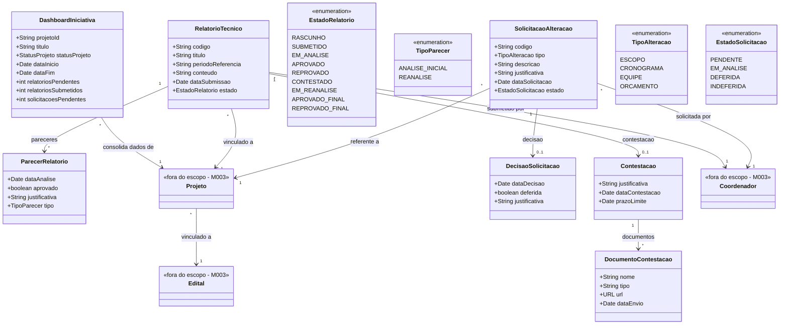

# Modelo Estrutural

Dominio e regras de negocio: ver [README.md](README.md)

### Diagrama de Classes

## Dicionario de Dados

| Classe | Atributo | Definicao | Obrig. | Tipo | Dominio | Tamanho | Unico |
|--------|----------|-----------|--------|------|---------|---------|-------|
| **DashboardIniciativa** | projetoId | Identificador do projeto no dashboard | Sim | String | Ex: PRJ-2026-001 | | |
| | titulo | Titulo do projeto | Sim | String | | 300 | |
| | statusProjeto | Status atual do projeto | Sim | StatusProjeto | Ativo, Concluido, Cancelado | | |
| | dataInicio | Data de inicio do projeto | Sim | Date | | | |
| | dataFim | Data prevista de fim do projeto | Sim | Date | | | |
| | relatoriosPendentes | Quantidade de relatorios pendentes de submissao | Gerado | Int | | | |
| | relatoriosSubmetidos | Quantidade de relatorios ja submetidos | Gerado | Int | | | |
| | solicitacoesPendentes | Quantidade de solicitacoes de alteracao pendentes | Gerado | Int | | | |
| **RelatorioTecnico** | codigo | Codigo de identificacao unica do relatorio | Gerado | String | Ex: RT-2026-001 | | Sim |
| | titulo | Titulo do relatorio tecnico | Sim | String | | 300 | |
| | periodoReferencia | Periodo coberto pelo relatorio | Sim | String | Ex: Jan/2026 a Jun/2026 | 100 | |
| | conteudo | Conteudo textual do relatorio tecnico | Sim | String | | 10000 | |
| | dataSubmissao | Data em que o relatorio foi submetido | Gerado | Date | Preenchida ao submeter | | |
| | estado | Estado atual do relatorio no ciclo de vida | Gerado | EstadoRelatorio | Ver enumeracao | | |
| **ParecerRelatorio** | dataAnalise | Data em que o parecer foi emitido | Sim | Date | | | |
| | aprovado | Indica se o relatorio foi aprovado | Sim | Boolean | true/false | | |
| | justificativa | Justificativa do parecer | Sim | String | | 2000 | |
| | tipo | Tipo do parecer (analise inicial ou reanalise) | Sim | TipoParecer | Ver enumeracao | | |
| **Contestacao** | justificativa | Justificativa da contestacao pelo coordenador | Sim | String | | 3000 | |
| | dataContestacao | Data em que a contestacao foi registrada | Gerado | Date | | | |
| | prazoLimite | Data limite para registro da contestacao (15 dias apos notificacao) | Gerado | Date | | | |
| **DocumentoContestacao** | nome | Nome do documento complementar | Sim | String | | 200 | |
| | tipo | Tipo/categoria do documento | Sim | String | | 100 | |
| | url | URL de acesso ao documento armazenado | Sim | URL | | | |
| | dataEnvio | Data de envio do documento | Sim | Date | | | |
| **SolicitacaoAlteracao** | codigo | Codigo de identificacao da solicitacao | Gerado | String | Ex: SA-2026-001 | | Sim |
| | tipo | Tipo de alteracao solicitada | Sim | TipoAlteracao | Ver enumeracao | | |
| | descricao | Descricao da alteracao pretendida | Sim | String | | 3000 | |
| | justificativa | Justificativa para a alteracao | Sim | String | | 3000 | |
| | dataSolicitacao | Data em que a solicitacao foi registrada | Gerado | Date | | | |
| | estado | Estado atual da solicitacao | Gerado | EstadoSolicitacao | Ver enumeracao | | |
| **DecisaoSolicitacao** | dataDecisao | Data em que a decisao foi registrada | Sim | Date | | | |
| | deferida | Indica se a solicitacao foi deferida | Sim | Boolean | true/false | | |
| | justificativa | Justificativa da decisao | Sim | String | | 2000 | |

## Notas de Implementacao

**Entidades externas:**
- Projeto, Coordenador, Edital: gerenciados por M002/M003 (Importacao e Gerenciamento de Editais)

**Navegabilidade:**
- Cardinalidade 1: atributo do tipo da classe destino (ex: RelatorioTecnico.projeto: Projeto)
- Cardinalidade N: atributo lista do tipo da classe destino (ex: RelatorioTecnico.pareceres: List&lt;ParecerRelatorio&gt;)
