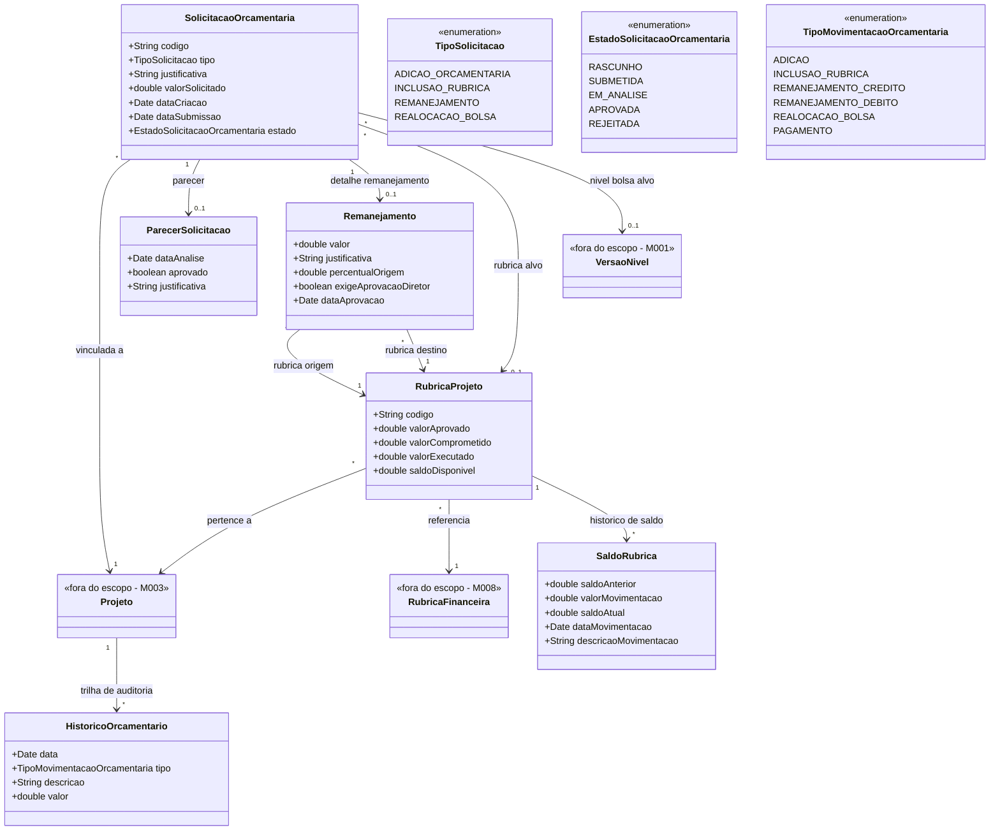

# Modelo Estrutural

Dominio e regras de negocio: ver [README.md](README.md)

### Diagrama de Classes

## Dicionario de Dados

| Classe | Atributo | Definicao | Obrig. | Tipo | Dominio | Tamanho | Unico |
|--------|----------|-----------|--------|------|---------|---------|-------|
| **SolicitacaoOrcamentaria** | codigo | Codigo de identificacao unica da solicitacao | Gerado | String | Ex: SO-2026-001 | | Sim |
| | tipo | Tipo da solicitacao orcamentaria | Sim | TipoSolicitacao | Ver enumeracao | | |
| | justificativa | Justificativa do coordenador para a solicitacao | Sim | String | | 2000 | |
| | valorSolicitado | Valor monetario envolvido na solicitacao | Sim | Double | Ex: 15000.00 | | |
| | dataCriacao | Data de criacao da solicitacao | Gerado | Date | | | |
| | dataSubmissao | Data em que a solicitacao foi submetida | Cond. | Date | Preenchida ao submeter | | |
| | estado | Estado atual da solicitacao no fluxo de aprovacao | Gerado | EstadoSolicitacaoOrcamentaria | Ver enumeracao | | |
| **RubricaProjeto** | codigo | Codigo de identificacao da rubrica no projeto | Gerado | String | Ex: RP-2026-001 | | Sim |
| | valorAprovado | Valor total aprovado para a rubrica no projeto | Sim | Double | | | |
| | valorComprometido | Valor comprometido com despesas em andamento | Gerado | Double | | | |
| | valorExecutado | Valor ja pago/executado | Gerado | Double | | | |
| | saldoDisponivel | Saldo disponivel para novas despesas (aprovado - comprometido - executado) | Gerado | Double | | | |
| **Remanejamento** | valor | Valor a ser remanejado entre rubricas | Sim | Double | | | |
| | justificativa | Justificativa para o remanejamento | Sim | String | | 2000 | |
| | percentualOrigem | Percentual que o valor representa da rubrica de origem | Gerado | Double | Ex: 18.5% | | |
| | exigeAprovacaoDiretor | Indica se o percentual excede 25% e exige aprovacao do Diretor | Gerado | Boolean | true se percentual > 25% | | |
| | dataAprovacao | Data da aprovacao do remanejamento | Cond. | Date | | | |
| **SaldoRubrica** | saldoAnterior | Saldo da rubrica antes da movimentacao | Gerado | Double | | | |
| | valorMovimentacao | Valor da movimentacao (positivo ou negativo) | Sim | Double | | | |
| | saldoAtual | Saldo resultante apos a movimentacao | Gerado | Double | | | |
| | dataMovimentacao | Data em que a movimentacao ocorreu | Gerado | Date | | | |
| | descricaoMovimentacao | Descricao textual da movimentacao | Sim | String | | 500 | |
| **ParecerSolicitacao** | dataAnalise | Data em que o parecer foi emitido | Sim | Date | | | |
| | aprovado | Indica se a solicitacao foi aprovada | Sim | Boolean | true/false | | |
| | justificativa | Justificativa do parecer | Sim | String | | 1000 | |
| **HistoricoOrcamentario** | data | Data do evento orcamentario | Gerado | Date | | | |
| | tipo | Tipo da movimentacao registrada | Sim | TipoMovimentacaoOrcamentaria | Ver enumeracao | | |
| | descricao | Descricao textual do evento | Sim | String | | 500 | |
| | valor | Valor envolvido na movimentacao | Sim | Double | | | |

## Notas de Implementacao

**Entidades externas:**
- Projeto: gerenciado por M003 (Gerenciar Editais).
- RubricaFinanceira: gerenciada por M008 (Cadastros Corporativos). Este modulo especializa a rubrica no contexto do projeto por meio de RubricaProjeto.
- VersaoNivel: gerenciada por M001 (Modalidade de Bolsa).

**Navegabilidade:**
- Cardinalidade 1: atributo do tipo da classe destino (ex: SolicitacaoOrcamentaria.projeto: Projeto)
- Cardinalidade N: atributo lista do tipo da classe destino (ex: RubricaProjeto.historicoSaldo: List<SaldoRubrica>)
