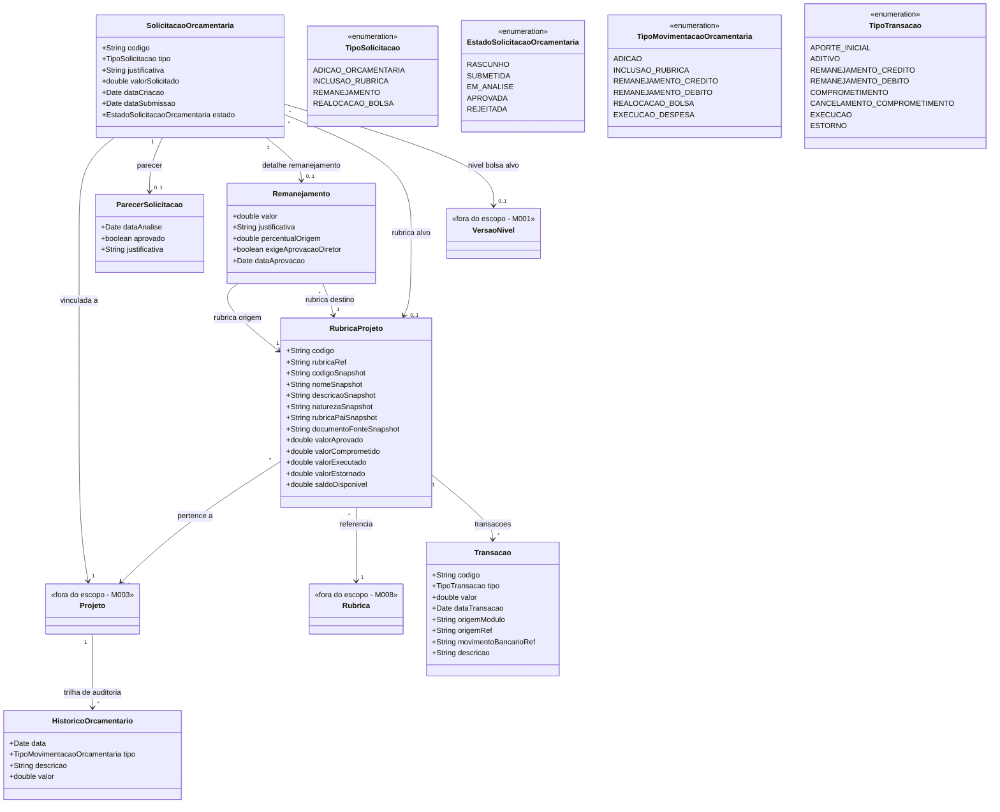

# Modelo Estrutural

Dominio e regras de negocio: ver [README.md](README.md)

### Diagrama de Classes

## Dicionario de Dados

| Classe | Atributo | Definicao | Obrig. | Tipo | Dominio | Tamanho | Unico |
|--------|----------|-----------|--------|------|---------|---------|-------|
| **SolicitacaoOrcamentaria** | codigo | Codigo de identificacao unica da solicitacao | Gerado | String | Ex: SO-2026-001 | | Sim |
| | tipo | Tipo da solicitacao orcamentaria | Sim | TipoSolicitacao | Ver enumeracao | | |
| | justificativa | Justificativa do coordenador para a solicitacao | Sim | String | | 2000 | |
| | valorSolicitado | Valor monetario envolvido na solicitacao | Sim | Double | Ex: 15000.00 | | |
| | dataCriacao | Data de criacao da solicitacao | Gerado | Date | | | |
| | dataSubmissao | Data em que a solicitacao foi submetida | Cond. | Date | Preenchida ao submeter | | |
| | estado | Estado atual da solicitacao no fluxo de aprovacao | Gerado | EstadoSolicitacaoOrcamentaria | Ver enumeracao | | |
| **RubricaProjeto** | codigo | Codigo de identificacao da rubrica no projeto | Gerado | String | Ex: RP-2026-001 | | Sim |
| | rubricaRef | Identificador da Rubrica canonica no M008 | Sim | String | Ex: RUB-DIARIAS | 80 | |
| | codigoSnapshot | Codigo canonico da Rubrica no momento da aprovacao do orcamento do projeto | Sim | String | Ex: RUB-DIARIAS | 80 | |
| | nomeSnapshot | Nome da Rubrica no momento da aprovacao do orcamento do projeto | Sim | String | Ex: Diarias | 150 | |
| | descricaoSnapshot | Descricao da Rubrica no momento da aprovacao do orcamento do projeto | Sim | String | | 500 | |
| | naturezaSnapshot | Natureza da Rubrica no momento da aprovacao | Sim | String | CUSTEIO, CAPITAL | 20 | |
| | rubricaPaiSnapshot | Codigo/nome da Rubrica pai no momento da aprovacao, quando houver | Nao | String | Ex: RUB-DIARIAS - Diarias | 220 | |
| | documentoFonteSnapshot | Documento fonte conhecido no momento da aprovacao | Nao | String | Ex: Resolucao CCAF no 309/2022 | 300 | |
| | valorAprovado | Valor total aprovado para a rubrica no projeto | Sim | Double | | | |
| | valorComprometido | Valor comprometido por transacoes ainda nao executadas | Gerado | Double | | | |
| | valorExecutado | Valor ja executado a partir de transacoes aprovadas | Gerado | Double | | | |
| | valorEstornado | Valor revertido por transacoes de estorno/cancelamento | Gerado | Double | | | |
| | saldoDisponivel | Saldo disponivel para novas despesas (aprovado - comprometido - executado + estornado) | Gerado | Double | | | |
| **Remanejamento** | valor | Valor a ser remanejado entre rubricas | Sim | Double | | | |
| | justificativa | Justificativa para o remanejamento | Sim | String | | 2000 | |
| | percentualOrigem | Percentual que o valor representa da rubrica de origem | Gerado | Double | Ex: 18.5% | | |
| | exigeAprovacaoDiretor | Indica se o percentual excede 25% e exige aprovacao do Diretor | Gerado | Boolean | true se percentual > 25% | | |
| | dataAprovacao | Data da aprovacao do remanejamento | Cond. | Date | | | |
| **Transacao** | codigo | Codigo unico da transacao | Gerado | String | Ex: TR-2026-001 | | Sim |
| | tipo | Tipo do movimento que afeta a RubricaProjeto | Sim | TipoTransacao | Ver enumeracao | | |
| | valor | Valor da transacao | Sim | Double | >= 0 | | |
| | dataTransacao | Data/hora da transacao | Gerado | Date | | | |
| | origemModulo | Modulo ou contexto que originou a transacao | Sim | String | M003, M014, M016, BACKOFFICE | 30 | |
| | origemRef | Referencia externa do fato de negocio que gerou a transacao | Sim | String | SolicitacaoDiariaId, PrestacaoId, RemanejamentoId | 120 | |
| | movimentoBancarioRef | Referencia opcional ao movimento bancario conciliado | Nao | String | TransacaoFinanceiraId/MovimentoBancarioId | 120 | |
| | descricao | Descricao textual da transacao | Sim | String | | 500 | |
| **ParecerSolicitacao** | dataAnalise | Data em que o parecer foi emitido | Sim | Date | | | |
| | aprovado | Indica se a solicitacao foi aprovada | Sim | Boolean | true/false | | |
| | justificativa | Justificativa do parecer | Sim | String | | 1000 | |
| **HistoricoOrcamentario** | data | Data do evento orcamentario | Gerado | Date | | | |
| | tipo | Tipo da movimentacao registrada | Sim | TipoMovimentacaoOrcamentaria | Ver enumeracao | | |
| | descricao | Descricao textual do evento | Sim | String | | 500 | |
| | valor | Valor envolvido na movimentacao | Sim | Double | | | |

## Notas de Implementacao

**Entidades externas:**
- Projeto: gerenciado por M003 (Gestao de Iniciativas Captadas).
- Rubrica: gerenciada por M008 (Cadastros Corporativos). Este modulo especializa a rubrica no contexto do projeto por meio de RubricaProjeto.
- VersaoNivel: gerenciada por M001 (Modalidade de Bolsa).

**Rubrica x transacao:**
- `RubricaProjeto` e a categoria orcamentaria aprovada para a iniciativa. Ela guarda limites, snapshots e saldos derivados.
- `Transacao` e o movimento da rubrica: comprometimento, execucao, estorno, reversao, remanejamento ou ajuste.
- `TransacaoFinanceira` e movimento bancario/financeiro e pertence a M014/M016. Quando existir conciliacao, a `Transacao` pode guardar apenas `movimentoBancarioRef`.
- A rubrica nao armazena o movimento em si; ela apenas classifica despesas e recebe saldos derivados das suas transacoes.

**Navegabilidade:**
- Cardinalidade 1: atributo do tipo da classe destino (ex: SolicitacaoOrcamentaria.projeto: Projeto)
- Cardinalidade N: atributo lista do tipo da classe destino (ex: RubricaProjeto.transacoes: List<Transacao>)
