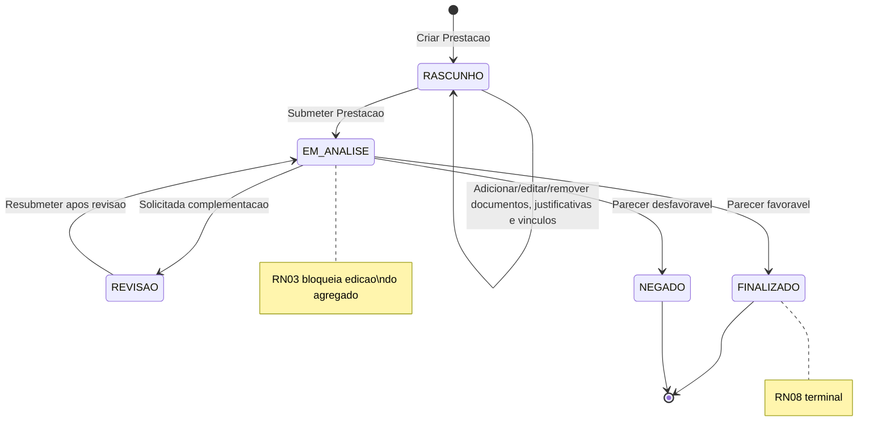
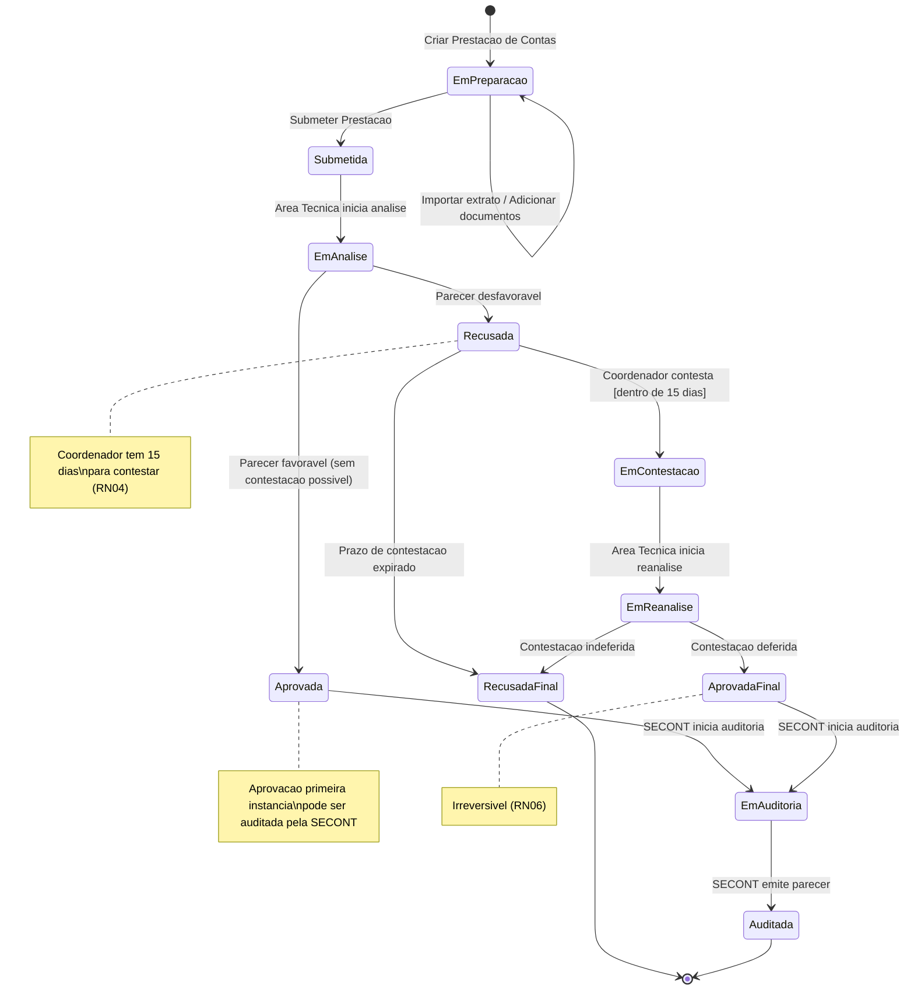
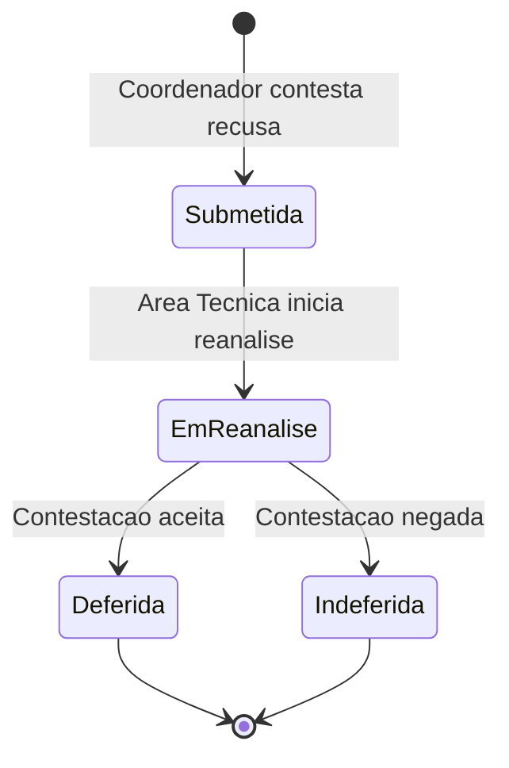
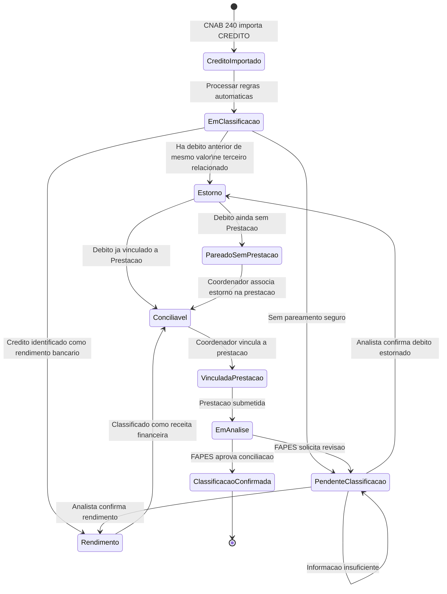

# Modelo Comportamental

Dominio e regras de negocio: ver [README.md](README.md)

> **Atencao — duas maquinas de estados.** Este modulo documenta dois ciclos de vida para `PrestacaoContas`:
>
> - **V1 (implementada):** ciclo nuclear de 5 estados — `RASCUNHO → EM_ANALISE → {FINALIZADO | NEGADO | REVISAO → EM_ANALISE}`. E o que o backend atual (`ConectaFapes.PrestacaoContas.*`) executa hoje e o que o `contrato-api.md`, README, modelo-estrutural e processos refletem.
> - **Pos-MVP (target evolutivo, aguardando DT-M014-002 + EPIC-M014-002/003):** ciclo de 11 estados PascalCase incluindo contestacao (EmContestacao, EmReanalise, AprovadaFinal, RecusadaFinal) e auditoria SECONT (EmAuditoria, Auditada). Permanece documentado abaixo apenas como referencia evolutiva e **nao** esta implementado.
>
> Toda regra/codigo do M014 hoje aplica a maquina V1. Diagramas Pos-MVP entram em vigor apenas quando os EPICs correspondentes forem priorizados.

### Ciclo de Vida V1: PrestacaoContas (implementado)

### Ciclo de Vida Pos-MVP: PrestacaoContas (target evolutivo, aguardando DT-M014-002)

### Ciclo de Vida Pos-MVP: Contestacao (EPIC-M014-003)

### Ciclo de Classificacao: TransacaoFinanceira de Credito

> **Aviso de versao.** Os estados detalhados (`CreditoImportado`, `EmClassificacao`, `PareadoSemPrestacao`, `Conciliavel`, `VinculadaPrestacao`, `ClassificacaoConfirmada`) descrevem o pipeline Pos-MVP. **No V1, o que o sistema persiste sao apenas as 4 categorias de `TipoClassificacaoTransacao`: `DESPESA`, `ESTORNO`, `RENDIMENTO`, `PENDENTE_CLASSIFICACAO`** (ver RN11 no README e enum em modelo-estrutural). O diagrama abaixo descreve o ciclo conceitual completo planejado.

Creditos importados do extrato bancario precisam ser classificados antes ou durante a conciliacao da prestacao. Um credito pode ser rendimento, estorno ou permanecer pendente de classificacao. O estorno representa devolucao de terceiro, como vendedor ou fornecedor, anulando um debito anterior de mesmo valor referente a compra nao concluida, cancelada ou nao entregue. Esse debito pode ainda nao ter prestacao de contas, justificativa ou validacao pela FAPES.

#### Regras comportamentais do estorno

- O estorno so pode ser aplicado a `TransacaoFinanceira` de `Tipo = CREDITO`.
- O credito classificado como `ESTORNO` deve ser pareado a uma `TransacaoFinanceira` anterior de `Tipo = DEBITO`.
- O valor do credito deve ser igual ao valor do debito estornado.
- A origem do credito deve indicar terceiro relacionado ao debito original, como vendedor, fornecedor, operadora ou prestador.
- O debito estornado pode estar sem `Prestacao`, sem justificativa e sem validacao pela FAPES; o estorno deve ser permitido como pareamento financeiro antes da prestacao de contas.
- Quando o pareamento automatico nao for seguro, a classificacao deve permanecer `PENDENTE_CLASSIFICACAO` ate revisao manual.
- Quando confirmado e vinculado a uma prestacao, o par debito/estorno deve aparecer junto na conciliacao, com efeito liquido `R$ 0,00`.
- A associacao manual do estorno pode ocorrer em `RASCUNHO` ou `REVISAO` como parte da elaboracao. Se a `Prestacao` ja estiver `EM_ANALISE`, `FINALIZADO` ou `NEGADO`, a associacao deve ser registrada como ajuste conciliatorio pos-prestacao, append-only, com auditoria e sem alterar documentos ou justificativas ja submetidos.
