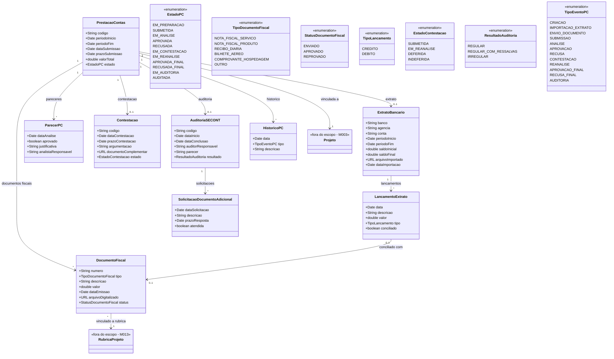

# Modelo Estrutural

Dominio e regras de negocio: ver [README.md](README.md)

### Diagrama de Classes

## Dicionario de Dados

| Classe | Atributo | Definicao | Obrig. | Tipo | Dominio | Tamanho | Unico |
|--------|----------|-----------|--------|------|---------|---------|-------|
| **PrestacaoContas** | codigo | Codigo de identificacao unica da prestacao | Gerado | String | Ex: PC-2026-001 | | Sim |
| | periodoInicio | Data de inicio do periodo de execucao coberto | Sim | Date | | | |
| | periodoFim | Data de fim do periodo de execucao coberto | Sim | Date | | | |
| | dataSubmissao | Data em que a prestacao foi submetida | Cond. | Date | Preenchida ao submeter | | |
| | prazoSubmissao | Data limite para submissao (periodoFim + 30 dias) | Gerado | Date | | | |
| | valorTotal | Soma dos valores dos documentos fiscais submetidos | Gerado | Double | | | |
| | estado | Estado atual da prestacao no fluxo | Gerado | EstadoPC | Ver enumeracao | | |
| **DocumentoFiscal** | numero | Numero do documento fiscal | Sim | String | Ex: NF-2026-12345 | 100 | |
| | tipo | Tipo do documento fiscal | Sim | TipoDocumentoFiscal | Ver enumeracao | | |
| | descricao | Descricao da despesa | Sim | String | | 500 | |
| | valor | Valor do documento fiscal | Sim | Double | | | |
| | dataEmissao | Data de emissao do documento fiscal | Sim | Date | | | |
| | arquivoDigitalizado | URL do arquivo digitalizado do documento | Sim | URL | | | |
| | status | Status do documento na analise | Gerado | StatusDocumentoFiscal | Ver enumeracao | | |
| **ExtratoBancario** | banco | Nome ou codigo do banco | Sim | String | | 100 | |
| | agencia | Numero da agencia bancaria | Sim | String | | 20 | |
| | conta | Numero da conta corrente do projeto | Sim | String | | 30 | |
| | periodoInicio | Data de inicio do periodo do extrato | Sim | Date | | | |
| | periodoFim | Data de fim do periodo do extrato | Sim | Date | | | |
| | saldoInicial | Saldo da conta no inicio do periodo | Sim | Double | | | |
| | saldoFinal | Saldo da conta no fim do periodo | Sim | Double | | | |
| | arquivoImportado | URL do arquivo do extrato importado | Sim | URL | | | |
| | dataImportacao | Data em que o extrato foi importado no sistema | Gerado | Date | | | |
| **LancamentoExtrato** | data | Data do lancamento bancario | Sim | Date | | | |
| | descricao | Descricao do lancamento | Sim | String | | 300 | |
| | valor | Valor do lancamento | Sim | Double | | | |
| | tipo | Tipo do lancamento (credito ou debito) | Sim | TipoLancamento | Ver enumeracao | | |
| | conciliado | Indica se o lancamento foi conciliado com um documento fiscal | Gerado | Boolean | true/false | | |
| **ParecerPC** | dataAnalise | Data em que o parecer foi emitido | Sim | Date | | | |
| | aprovado | Indica se a prestacao foi aprovada | Sim | Boolean | true/false | | |
| | justificativa | Justificativa do parecer | Sim | String | | 2000 | |
| | analistaResponsavel | Nome do analista que emitiu o parecer | Sim | String | | 200 | |
| **Contestacao** | codigo | Codigo de identificacao da contestacao | Gerado | String | Ex: CT-2026-001 | | Sim |
| | dataContestacao | Data em que a contestacao foi submetida | Sim | Date | | | |
| | prazoContestacao | Data limite para contestacao (data recusa + 15 dias) | Gerado | Date | | | |
| | argumentacao | Argumentacao do coordenador contestando a recusa | Sim | String | | 3000 | |
| | documentoComplementar | URL de documento complementar anexado a contestacao | Nao | URL | | | |
| | estado | Estado da contestacao | Gerado | EstadoContestacao | Ver enumeracao | | |
| **AuditoriaSECONT** | codigo | Codigo de identificacao da auditoria | Gerado | String | Ex: AUD-2026-001 | | Sim |
| | dataInicio | Data de inicio da auditoria | Sim | Date | | | |
| | dataConclusao | Data de conclusao da auditoria | Cond. | Date | Preenchida ao concluir | | |
| | auditorResponsavel | Nome do auditor responsavel | Sim | String | | 200 | |
| | parecer | Parecer final da auditoria | Cond. | String | Preenchido ao concluir | 3000 | |
| | resultado | Resultado da auditoria | Cond. | ResultadoAuditoria | Ver enumeracao | | |
| **SolicitacaoDocumentoAdicional** | dataSolicitacao | Data em que o documento adicional foi solicitado | Sim | Date | | | |
| | descricao | Descricao do documento solicitado | Sim | String | | 500 | |
| | prazoResposta | Data limite para envio do documento | Sim | Date | | | |
| | atendida | Indica se a solicitacao foi atendida | Gerado | Boolean | true/false | | |
| **HistoricoPC** | data | Data do evento | Gerado | Date | | | |
| | tipo | Tipo do evento registrado | Sim | TipoEventoPC | Ver enumeracao | | |
| | descricao | Descricao textual do evento | Sim | String | | 500 | |

## Notas de Implementacao

**Entidades externas:**
- Projeto: gerenciado por M002/M003 (Importacao e Gerenciamento de Editais)
- RubricaProjeto: gerenciada por M013 (Gestao Orcamentaria do Projeto)

**Navegabilidade:**
- Cardinalidade 1: atributo do tipo da classe destino (ex: PrestacaoContas.projeto: Projeto)
- Cardinalidade N: atributo lista do tipo da classe destino (ex: PrestacaoContas.documentos: List&lt;DocumentoFiscal&gt;)
