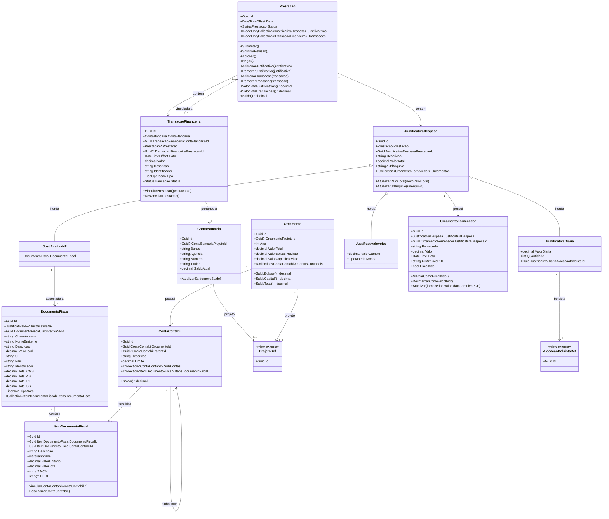

# Modelo Estrutural

Dominio e regras de negocio: ver [README.md](README.md)

## Diagrama de Classes

---

## Classe Base — BaseEntity

Todas as entidades herdam de `BaseEntity` (`ConectaFapes.Common.Domain.BaseEntities`):

| Atributo | Tipo | Nullable | Descricao |
|---|---|---|---|
| Id | Guid | Nao | Identificador unico gerado automaticamente |
| DateCreated | DateTimeOffset | Nao | Data de criacao do registro (default: DateTimeOffset.Now) |
| DateUpdated | DateTimeOffset? | Sim | Data da ultima atualizacao |
| DateDeleted | DateTimeOffset? | Sim | Data de exclusao logica — preenchida pelo metodo `Delete()` |

---

## Dicionario de Dados

### Prestacao

| Atributo | Tipo | Nullable | Obrig. | Descricao |
|---|---|---|---|---|
| Data | DateTimeOffset | Nao | Sim | Data de referencia da prestacao de contas |
| Status | StatusPrestacao | Nao | Gerado | Estado atual no ciclo de vida — ver enumeracoes |
| Justificativas | IReadOnlyCollection&lt;JustificativaDespesa&gt; | Nao | — | Justificativas de despesa vinculadas a esta prestacao |
| Transacoes | IReadOnlyCollection&lt;TransacaoFinanceira&gt; | Nao | — | Transacoes financeiras vinculadas a esta prestacao |

### TransacaoFinanceira

| Atributo | Tipo | Nullable | Obrig. | Descricao |
|---|---|---|---|---|
| ContaBancaria | ContaBancaria | Nao | Sim | Navegacao para a conta bancaria proprietaria |
| TransacaoFinanceiraContaBancariaId | Guid | Nao | Sim | FK para ContaBancaria |
| Prestacao | Prestacao? | Sim | Nao | Navegacao para a prestacao vinculada (null se ainda nao vinculada) |
| TransacaoFinanceiraPrestacaoId | Guid? | Sim | Nao | FK para Prestacao — null se a transacao ainda nao foi vinculada |
| Data | DateTimeOffset | Nao | Sim | Data do lancamento bancario |
| Valor | decimal | Nao | Sim | Valor monetario da transacao (>= 0) |
| Descricao | string | Nao | Sim | Descricao do lancamento conforme extrato |
| Identificador | string | Nao | Sim | Identificador unico da transacao no extrato bancario |
| Tipo | TipoOperacao | Nao | Sim | DEBITO ou CREDITO |
| Status | StatusTransacao | Nao | Gerado | Derivado do Status da Prestacao vinculada — ver enumeracoes |

### ContaBancaria

| Atributo | Tipo | Nullable | Obrig. | Descricao |
|---|---|---|---|---|
| ContaBancariaProjetoId | Guid? | Sim | Nao | FK para ProjetoRef (view externa do sistema de importacao) |
| Banco | string | Nao | Sim | Nome do banco |
| Agencia | string | Nao | Sim | Numero da agencia bancaria |
| Numero | string | Nao | Sim | Numero da conta corrente do projeto |
| Titular | string | Nao | Sim | Nome do titular da conta |
| SaldoAtual | decimal | Nao | Gerado | Saldo atual calculado a partir das transacoes |

### JustificativaDespesa (classe base)

Classe base concreta (nao declarada `abstract` no codigo, porem com construtor `protected` — instancia-se apenas atraves de `JustificativaNF`, `JustificativaDiaria` ou `JustificativaInvoice`).

| Atributo | Tipo | Nullable | Obrig. | Descricao |
|---|---|---|---|---|
| Prestacao | Prestacao | Nao | Sim | Navegacao para a prestacao proprietaria |
| JustificativaDespesaPrestacaoId | Guid | Nao | Sim | FK para Prestacao |
| Descricao | string | Nao | Sim | Descricao textual da despesa justificada |
| ValorTotal | decimal | Nao | Gerado | Valor total da despesa (>= 0) — atualizado por `AtualizarValorTotal()` |
| UrlArquivo | string? | Sim | Nao | URL do arquivo comprovante armazenado no MinIO — atualizado por `AtualizarUrlArquivo()` |
| Orcamentos | ICollection&lt;OrcamentoFornecedor&gt; | Nao | — | Orcamentos de fornecedor vinculados |

### JustificativaNF

Herda todos os atributos de `JustificativaDespesa`. Valor total derivado do `DocumentoFiscal` vinculado (inicializado como 0).

| Atributo | Tipo | Nullable | Obrig. | Descricao |
|---|---|---|---|---|
| DocumentoFiscal | DocumentoFiscal | Nao | Sim | Nota fiscal associada a esta justificativa (navegacao) |

### JustificativaDiaria

Herda todos os atributos de `JustificativaDespesa`.

| Atributo | Tipo | Nullable | Obrig. | Descricao |
|---|---|---|---|---|
| ValorDiaria | decimal | Nao | Sim | Valor unitario de cada diaria (>= 0) |
| Quantidade | int | Nao | Sim | Numero de diarias (> 0) |
| JustificativaDiariaAlocacaoBolsistaId | Guid | Nao | Sim | FK para AlocacaoBolsistaRef — bolsista beneficiario da diaria |

### JustificativaInvoice

Herda todos os atributos de `JustificativaDespesa`. Usada para despesas realizadas em moeda estrangeira.

| Atributo | Tipo | Nullable | Obrig. | Descricao |
|---|---|---|---|---|
| ValorCambio | decimal | Nao | Sim | Taxa de cambio aplicada na conversao para BRL |
| Moeda | TipoMoeda | Nao | Sim | Moeda estrangeira utilizada — ver enumeracoes |

### OrcamentoFornecedor

| Atributo | Tipo | Nullable | Obrig. | Descricao |
|---|---|---|---|---|
| JustificativaDespesa | JustificativaDespesa | Nao | Sim | Navegacao para a justificativa proprietaria |
| OrcamentoFornecedorJustificativaDespesaId | Guid | Nao | Sim | FK para JustificativaDespesa |
| Fornecedor | string | Nao | Sim | Nome ou razao social do fornecedor |
| Valor | decimal | Nao | Sim | Valor total do orcamento (>= 0) |
| Data | DateTime | Nao | Sim | Data de emissao do orcamento |
| UrlArquivoPDF | string | Nao | Sim | URL do PDF do orcamento armazenado no MinIO |
| Escolhido | bool | Nao | Gerado | Indica se este orcamento foi selecionado como vencedor — definido por `MarcarComoEscolhido()` |

### DocumentoFiscal

| Atributo | Tipo | Nullable | Obrig. | Descricao |
|---|---|---|---|---|
| JustificativaNF | JustificativaNF? | Sim | Nao | Navegacao para a justificativa associada (1:1) |
| DocumentoFiscalJustificativaNFId | Guid | Nao | Sim | FK para JustificativaNF |
| ChaveAcesso | string | Nao | Sim | Chave de acesso da NF-e com 44 digitos — usada na consulta SERPRO |
| NomeEmitente | string | Nao | Sim | Razao social do emitente da nota fiscal |
| Descricao | string | Nao | Sim | Descricao do objeto da nota fiscal |
| ValorTotal | decimal | Nao | Sim | Valor total da nota (>= 0) |
| UF | string | Nao | Sim | Unidade federativa do emitente |
| Pais | string | Nao | Sim | Pais do emitente |
| Identificador | string | Nao | Sim | CPF ou CNPJ do emitente |
| TotalICMS | decimal | Nao | Sim | Total de ICMS destacado na nota (>= 0) |
| TotalPIS | decimal | Nao | Sim | Total de PIS destacado na nota (>= 0) |
| TotalIPI | decimal | Nao | Sim | Total de IPI destacado na nota (>= 0) |
| TotalISS | decimal | Nao | Sim | Total de ISS destacado na nota (>= 0) |
| TipoNota | TipoNota | Nao | Sim | Tipo da nota: PRODUTO ou SERVICO |
| ItensDocumentoFiscal | ICollection&lt;ItemDocumentoFiscal&gt; | Nao | — | Itens discriminados na nota fiscal |

### ItemDocumentoFiscal

| Atributo | Tipo | Nullable | Obrig. | Descricao |
|---|---|---|---|---|
| ItemDocumentoFiscalDocumentoFiscalId | Guid | Nao | Sim | FK para DocumentoFiscal |
| ItemDocumentoFiscalContaContabilId | Guid | Nao | Sim | FK para ContaContabil — define a classificacao contabil do item |
| Descricao | string | Nao | Sim | Descricao do item conforme nota fiscal |
| Quantidade | int | Nao | Sim | Quantidade do item (> 0) |
| ValorUnitario | decimal | Nao | Sim | Valor unitario do item (>= 0) |
| ValorTotal | decimal | Nao | Gerado | Valor total do item — calculado como Quantidade * ValorUnitario |
| NCM | string? | Sim | Nao | Codigo NCM — Nomenclatura Comum do Mercosul |
| CFOP | string? | Sim | Nao | Codigo CFOP — Codigo Fiscal de Operacoes e Prestacoes |

### Orcamento

> **DT-M014-001:** Implementado neste backend mas pertence conceitualmente a M013 (Gestao Orcamentaria).

| Atributo | Tipo | Nullable | Obrig. | Descricao |
|---|---|---|---|---|
| OrcamentoProjetoId | Guid? | Sim | Nao | FK para ProjetoRef (view externa) |
| Ano | int | Nao | Sim | Ano de referencia do orcamento |
| ValorTotal | decimal | Nao | Sim | Valor total aprovado para o projeto no ano |
| ValorBolsasPrevisto | decimal | Nao | Sim | Valor previsto para pagamento de bolsas |
| ValorCapitalPrevisto | decimal | Nao | Sim | Valor previsto para aquisicao de capital |
| ContasContabeis | ICollection&lt;ContaContabil&gt; | Nao | — | Contas contabeis que estruturam o orcamento |

### ContaContabil

> **DT-M014-001:** Implementado neste backend mas pertence conceitualmente a M013 (Gestao Orcamentaria).

| Atributo | Tipo | Nullable | Obrig. | Descricao |
|---|---|---|---|---|
| ContaContabilOrcamentoId | Guid | Nao | Sim | FK para Orcamento |
| ContaContabilParentId | Guid? | Sim | Nao | FK para ContaContabil pai — null se conta raiz (auto-referencia hierarquica) |
| Descricao | string | Nao | Sim | Descricao da rubrica ou conta contabil |
| Limite | decimal | Nao | Sim | Limite de gasto aprovado para esta conta (>= 0) |
| SubContas | ICollection&lt;ContaContabil&gt; | Nao | — | Contas filhas na hierarquia |
| ItensDocumentoFiscal | ICollection&lt;ItemDocumentoFiscal&gt; | Nao | — | Itens de documentos fiscais classificados nesta conta |

---

## Entidades de Referencia Externa (ImportacaoEditais)

Entidades triviais mapeadas a views de banco de dados do sistema de Importacao de Editais (M002). Nao herdam de `BaseEntity`, nao possuem repositorio proprio e sao somente leitura.

### ProjetoRef

Namespace: `ConectaFapes.PrestacaoContas.Domain.Entities.ImportacaoEditais`

| Atributo | Tipo | Nullable | Obrig. | Descricao |
|---|---|---|---|---|
| Id | Guid | Nao | Sim | Identificador do projeto na view externa |

Referenciada por: `ContaBancaria.ContaBancariaProjetoId`, `Orcamento.OrcamentoProjetoId`.

### AlocacaoBolsistaRef

Namespace: `ConectaFapes.PrestacaoContas.Domain.Entities.ImportacaoEditais`

| Atributo | Tipo | Nullable | Obrig. | Descricao |
|---|---|---|---|---|
| Id | Guid | Nao | Sim | Identificador da alocacao de bolsista na view externa |

Referenciada por: `JustificativaDiaria.JustificativaDiariaAlocacaoBolsistaId`.

---

## Value Objects planejados (inativos)

Os seguintes Value Objects existem em `src/Domain/ValueObjects/` mas estao integralmente comentados no codigo — **nao estao ativos**. Os campos correspondentes nas entidades usam tipos primitivos.

| Value Object | Estado | Substituido por |
|---|---|---|
| `ChaveAcessoNF` | Comentado | `string` em `DocumentoFiscal.ChaveAcesso` (validacao de 44 digitos feita no servico SERPRO) |
| `Moeda` | Comentado | Enum `TipoMoeda` em `JustificativaInvoice.Moeda` |
| `AlocacaoBolsista` | Comentado | FK `Guid` em `JustificativaDiaria.JustificativaDiariaAlocacaoBolsistaId` apontando para `AlocacaoBolsistaRef` |
| `ValueObject` (base) | Comentado | — |

---

## Enumeracoes

| Enum | Entidade | Valores |
|---|---|---|
| StatusPrestacao | Prestacao | RASCUNHO (1), EM_ANALISE (2), REVISAO (3), FINALIZADO (4), NEGADO (5) |
| StatusTransacao | TransacaoFinanceira | PENDENTE (1), EM_RASCUNHO (2), EM_ANALISE (3), EM_REVISAO (4), APROVADA (5), REJEITADA (6) |
| TipoOperacao | TransacaoFinanceira | DEBITO (1), CREDITO (2) |
| TipoNota | DocumentoFiscal | PRODUTO (1), SERVICO (2) |
| TipoDocumentoFiscal | DocumentoFiscal | NFE_PRODUTO (1), NFSE_SERVICO (2) |
| TipoMoeda | JustificativaInvoice | BRL, USD, EUR, GBP |
| TipoJustificativa | JustificativaDespesa | NF, INVOICE, DIARIA |
| TipoArquivoNfe | (processamento interno SERPRO) | XML (1), PDF (2), Imagem (3) |

---

## Notas de Implementacao

**Backend separado:**
Este modulo roda em projeto independente `ConectaFapes.PrestacaoContas.*` com seu proprio `AppDbContext` (SQL Server) e pipeline de injecao de dependencias. Detalhes de infraestrutura em [architecture/04-dados-e-operacao.md](../../../architecture/04-dados-e-operacao.md).

**Heranca de BaseEntity:**
Todas as entidades herdam de `BaseEntity` (`ConectaFapes.Common.Domain.BaseEntities`), que fornece `Id` (Guid), timestamps de auditoria (`DateCreated`, `DateUpdated`) e exclusao logica (`DateDeleted` via `Delete()`). Nenhuma entidade e removida fisicamente do banco.

**Entidades de referencia externa:**
`ProjetoRef` e `AlocacaoBolsistaRef` sao mapeadas a views de banco de dados do sistema de Importacao de Editais (M002). Nao herdam de `BaseEntity` e nao possuem repositorio proprio — sao somente leitura.

**Divida tecnica DT-M014-001:**
`ContaBancaria`, `Orcamento`, `ContaContabil` e `TransacaoFinanceira` estao implementadas neste backend mas pertencem conceitualmente a M013 (Gestao Orcamentaria) e M016 (Contabilidade e Financeiro). A separacao e planejada como debito tecnico de prioridade alta — ver [backlog.md](backlog.md#debito-tecnico).

**Integracao SERPRO:**
`DocumentoFiscal` e processado via API SERPRO para NF-e (consulta por `ChaveAcesso` de 44 digitos) ou por upload direto para NFS-e. A autenticacao usa OAuth2 com cache de token em `SerproTokenService`. O tipo do arquivo (XML, PDF ou imagem) e detectado automaticamente por `TipoArquivoIdentifierService`.

**Armazenamento MinIO:**
`UrlArquivo` em `JustificativaDespesa` e `UrlArquivoPDF` em `OrcamentoFornecedor` referenciam objetos armazenados no MinIO. O upload e feito via URL pre-assinada gerada pelo `MinioService` — o cliente faz o upload diretamente, sem passar pelo backend.

**StatusTransacao como estado derivado:**
O `Status` de `TransacaoFinanceira` nao e persistido diretamente — e uma propriedade calculada que reflete o `Status` da `Prestacao` a qual a transacao esta vinculada. Transacoes sem vinculo ficam com status `PENDENTE`.

**Navegabilidade:**
- Cardinalidade 1: atributo do tipo da classe destino (ex: `JustificativaNF.DocumentoFiscal: DocumentoFiscal`)
- Cardinalidade N: atributo lista (ex: `Prestacao.Justificativas: IReadOnlyCollection<JustificativaDespesa>`)
- `IReadOnlyCollection` em `Prestacao` indica que as colecoes sao mutadas apenas pelos metodos da propria entidade (`AdicionarJustificativa`, `RemoverJustificativa`, etc.)
