# Processo - Prestacao de Contas

[<< Voltar ao M014](README.md) | [Estrutural](modelo-estrutural.md) | [Comportamental](modelo-comportamental.md)

---

## Contexto

Prestacao de Contas e uma funcionalidade para os perfis de usuario Coordenador e o setor de Prestacao de Contas da FAPES.

Na tela ira aparecer as saidas financeiras da conta bancaria do projeto e o Coordenador deve justifica-las.

O Coordenador pode realizar compras de produtos ou servicos, sempre com nota fiscal. Antes de realizar uma compra ele deve confirmar se o fornecedor emite nota fiscal. A FAPES nao aceita Prestacao de Contas sem nota fiscal.

Apos o Coordenador realizar a compra e fazer sua comprovacao, um funcionario da FAPES aprova ou nao manualmente.

---

## Visao Geral

O processo de Prestacao de Contas cobre o ciclo operacional do modulo: importacoes financeiras e orcamentarias, preparacao da prestacao pelo Coordenador, submissao para analise e decisao do Responsavel FAPES. A prestacao nasce em `RASCUNHO`, pode ir para `EM_ANALISE`, retornar para `REVISAO`, ou terminar como `FINALIZADO` ou `NEGADO`.

1. **Carga unica do orcamento original** - primeira integracao entre Conecta FAPES e SIGFAPES para importar o orcamento original aprovado da iniciativa.
2. **Importacao diaria de movimentos bancarios** - processo diario que captura o CNAB 240 gerado pelo EDI Banestes em uma pasta de servidor, envia o arquivo para a API/Base M014, que salva no MinIO e publica a referencia em uma fila para workers processarem em paralelo.
3. **Elaboracao da prestacao** - criacao da `Prestacao`, vinculacao de transacoes, registro de justificativas e classificacao de documentos fiscais.
4. **Associar compra e cotacao** - vinculacao da compra as categorias, itens e rubricas aprovadas do projeto, com exigencia de cotacao quando aplicavel.
5. **Submissao e analise** - validacao de conciliacao, bloqueio de edicoes e parecer do Responsavel FAPES.
6. **Revisao pelo Coordenador** - ajustes solicitados pela FAPES e nova submissao para analise.

---

## Fluxo 1 - Carga Unica do Orcamento Original

Este fluxo representa a primeira integracao do modulo: o Conecta FAPES consulta o SIGFAPES para importar o orcamento original aprovado da iniciativa. Essa carga e executada apenas uma vez por iniciativa; depois de concluida com sucesso, o orcamento fica marcado como importado para evitar nova carga automatica.

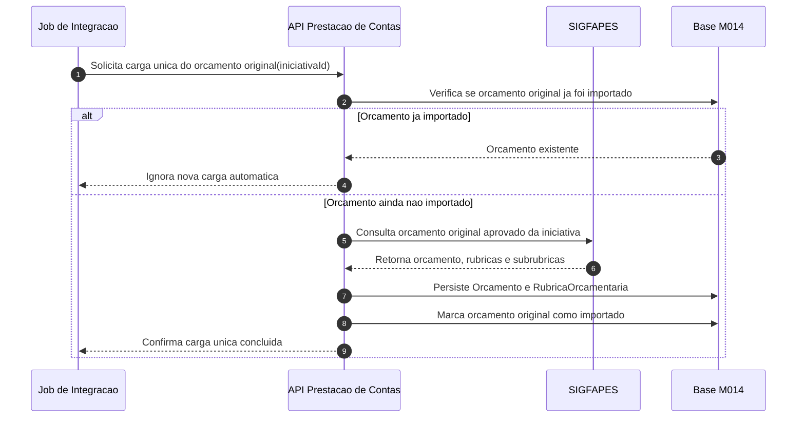

### Atividades da carga unica

| # | Atividade | Responsavel | Resultado |
|---|-----------|-------------|-----------|
| 1 | Solicitar carga unica | Job de Integracao | API de Prestacao de Contas acionada para importar o orcamento original da iniciativa. |
| 2 | Consultar SIGFAPES | API Prestacao de Contas / SIGFAPES | Orcamento original aprovado da iniciativa retornado pelo SIGFAPES. |
| 3 | Persistir orcamento e rubricas | API Prestacao de Contas | `Orcamento` e `RubricaOrcamentaria` criados na base M014. |
| 4 | Marcar orcamento como importado | API Prestacao de Contas | Carga unica registrada para evitar nova importacao automatica do mesmo orcamento. |

---

## Fluxo 2 - Importacao Diaria de Movimentos Bancarios

Este fluxo e independente da carga unica do SIGFAPES. Diariamente, o EDI Banestes grava o arquivo CNAB 240 em uma pasta de servidor. Um job de captura le essa pasta e envia o arquivo para a API/Base M014. A API registra a captura, salva o arquivo bruto no MinIO e publica uma mensagem em fila com a referencia do objeto. Workers de importacao consomem a fila em paralelo e chamam a API de Prestacao de Contas para processar o arquivo e persistir os debitos e creditos como `TransacaoFinanceira`. As transacoes ficam pendentes ate serem vinculadas a uma prestacao.

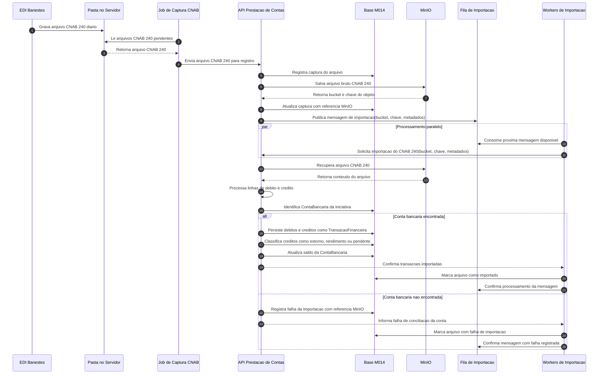

### Atividades da importacao diaria

| # | Atividade | Responsavel | Resultado |
|---|-----------|-------------|-----------|
| 1 | Gerar CNAB 240 | EDI Banestes | Arquivo diario gravado em uma pasta no servidor. |
| 2 | Capturar arquivo | Job de Captura CNAB | Arquivo CNAB 240 lido da pasta do servidor. |
| 3 | Enviar arquivo para API | Job de Captura CNAB | Arquivo CNAB 240 enviado para a API/Base M014. |
| 4 | Registrar e armazenar captura | API Prestacao de Contas / MinIO | API registra a captura na Base M014 e salva o CNAB 240 no MinIO. |
| 5 | Publicar mensagem | API Prestacao de Contas / Fila de Importacao | Mensagem criada com bucket, chave e metadados do CNAB 240. |
| 6 | Consumir em paralelo | Workers de Importacao | Workers consomem mensagens da fila para acelerar o processamento. |
| 7 | Enviar para API | Workers de Importacao | API de Prestacao de Contas acionada com a referencia do objeto no MinIO. |
| 8 | Processar CNAB 240 | API Prestacao de Contas | Arquivo recuperado do MinIO e interpretado em linhas de debito e credito. |
| 9 | Identificar conta bancaria | API Prestacao de Contas | Conta da iniciativa localizada para associar os movimentos importados. |
| 10 | Salvar debitos e creditos | API Prestacao de Contas | Debitos e creditos persistidos como `TransacaoFinanceira`. |
| 11 | Classificar creditos | API Prestacao de Contas | Creditos classificados como `ESTORNO`, `RENDIMENTO` ou `PENDENTE_CLASSIFICACAO`, conforme RN11. |
| 12 | Atualizar saldo | API Prestacao de Contas / Financeiro M016 | Saldo da `ContaBancaria` atualizado a partir dos movimentos importados. |
| 13 | Registrar resultado | API Prestacao de Contas / Workers de Importacao | Arquivo marcado como importado ou com falha registrada; mensagem da fila confirmada. |

### Cenario de estorno

Um **estorno** ocorre quando a conta bancaria recebe um credito de terceiro que anula um debito anterior do mesmo valor. O caso tipico e o vendedor/fornecedor devolver o valor de uma compra que nao foi concluida, cancelada ou nao entregue. O debito original pode ainda nao ter sido vinculado a uma prestacao de contas, pode estar sem justificativa e pode nao ter sido validado pela FAPES. O estorno nasce do pareamento financeiro entre credito e debito; depois, quando a prestacao for montada, o par deve aparecer junto para demonstrar que a saida financeira foi revertida.

Exemplo operacional:

| Data | Movimento | Tipo | Classificacao | Valor | Efeito esperado |
|------|-----------|------|---------------|-------|-----------------|
| 10/04/2026 | Pagamento ao fornecedor por compra nao concluida | DEBITO | DESPESA | R$ 1.250,00 | Reduz saldo bancario e pode ficar sem prestacao de contas ate a conciliacao. |
| 12/04/2026 | Devolucao do fornecedor/vendedor pela compra cancelada | CREDITO | ESTORNO | R$ 1.250,00 | Anula o debito original antes ou durante a prestacao, restabelecendo o saldo pelo mesmo valor. |

Regra de pareamento:

- O credito classificado como `ESTORNO` deve possuir o mesmo valor do debito estornado.
- A origem do credito deve ser terceiro relacionado ao debito original, como vendedor, fornecedor, operadora ou prestador que devolveu valor pago.
- O debito original nao precisa estar vinculado a uma `Prestacao`, nao precisa ter justificativa cadastrada e nao precisa estar validado pela FAPES para que o credito seja pareado como `ESTORNO`.
- O sistema deve manter referencia entre o credito de estorno e o debito original sempre que o pareamento for identificado automaticamente ou informado na analise.
- O saldo liquido do par debito/estorno deve ser zero.
- Quando a prestacao for montada, ela deve apresentar o par na conciliacao para que a FAPES entenda que nao houve despesa efetiva naquele movimento.
- Durante a elaboracao ou apos a criacao da prestacao, o Coordenador pode associar manualmente um credito de estorno disponivel ao debito correspondente; nesse caso, o sistema deve vincular os dois movimentos a mesma prestacao.
- Quando a prestacao ja tiver sido submetida ou finalizada, a associacao deve ser registrada como ajuste conciliatorio pos-prestacao, com trilha de auditoria, sem apagar a submissao original.
- Quando o credito tiver valor diferente do debito, ou nao houver debito correspondente, a classificacao deve permanecer `PENDENTE_CLASSIFICACAO` ate revisao.

```gherkin
Funcionalidade: Classificacao de estorno em prestacao de contas

  Cenario: Credito estorna debito de mesmo valor
    Dado que existe uma TransacaoFinanceira de DEBITO no valor de R$ 1.250,00
    E o debito ainda nao foi vinculado a uma Prestacao
    E o CNAB 240 importou uma TransacaoFinanceira de CREDITO no valor de R$ 1.250,00
    E o credito foi realizado por terceiro relacionado ao debito original
    E o credito possui identificacao bancaria ou referencia operacional compativel com a compra nao concluida
    Quando o sistema processa a classificacao dos creditos
    Entao o credito deve ser classificado como ESTORNO
    E o credito deve ficar pareado ao debito original
    E o efeito liquido do par deve ser R$ 0,00
    E quando a prestacao for montada ela deve exibir o debito e o estorno juntos na conciliacao

  Cenario: Coordenador associa estorno na prestacao
    Dado que a prestacao de contas esta em RASCUNHO
    E existe um debito ainda sem justificativa no valor de R$ 1.250,00
    E existe um credito de ESTORNO no valor de R$ 1.250,00 do mesmo terceiro
    Quando o Coordenador associa o credito de estorno ao debito na tela da prestacao
    Entao o sistema vincula o debito e o credito a mesma Prestacao
    E mantem TransacaoEstornadaId apontando para o debito original
    E exibe o efeito liquido do par como R$ 0,00

  Cenario: Coordenador associa estorno a prestacao ja feita
    Dado que existe uma prestacao de contas "PC-2026-013" ja criada para o projeto
    E existe um debito da prestacao no valor de R$ 1.250,00
    E existe um credito de ESTORNO posterior no valor de R$ 1.250,00 do mesmo terceiro
    Quando o Coordenador associa o credito de estorno a prestacao existente
    Entao o sistema registra um ajuste conciliatorio pos-prestacao
    E preserva o historico da submissao original
    E exibe o par debito/estorno na conciliacao da prestacao existente
    E exibe o efeito liquido do par como R$ 0,00
```

---

## Fluxo 3 - Elaboracao da Prestacao

Este fluxo inicia quando o Coordenador cria a prestacao em `RASCUNHO` e vincula as transacoes bancarias importadas. A partir dessa base comum, a elaboracao se divide em modelos separados por tipo de despesa: nota fiscal de produto, produto sem nota fiscal, nota fiscal de servico, invoice, diarias e passagens. Nota fiscal de produto passa pela integracao SERPRO. Nota fiscal de servico, no fluxo atual, e validada por biblioteca interna; a validacao por SERPRO fica prevista como evolucao futura. Os demais tipos seguem por validacoes internas, armazenamento dos arquivos e classificacao em rubricas.

**Separacao obrigatoria:** `RubricaProjeto` e `TransacaoFinanceira` nao sao a mesma coisa. A rubrica classifica a despesa contra o orcamento aprovado; a transacao financeira representa o movimento bancario que sera conciliado. A tela e a API devem permitir selecionar/validar esses dois objetos separadamente, exceto quando a rubrica vier herdada de um objeto operacional anterior, como uma `SolicitacaoDiaria` do M003.

### Fluxo 3.1 - Base da Prestacao

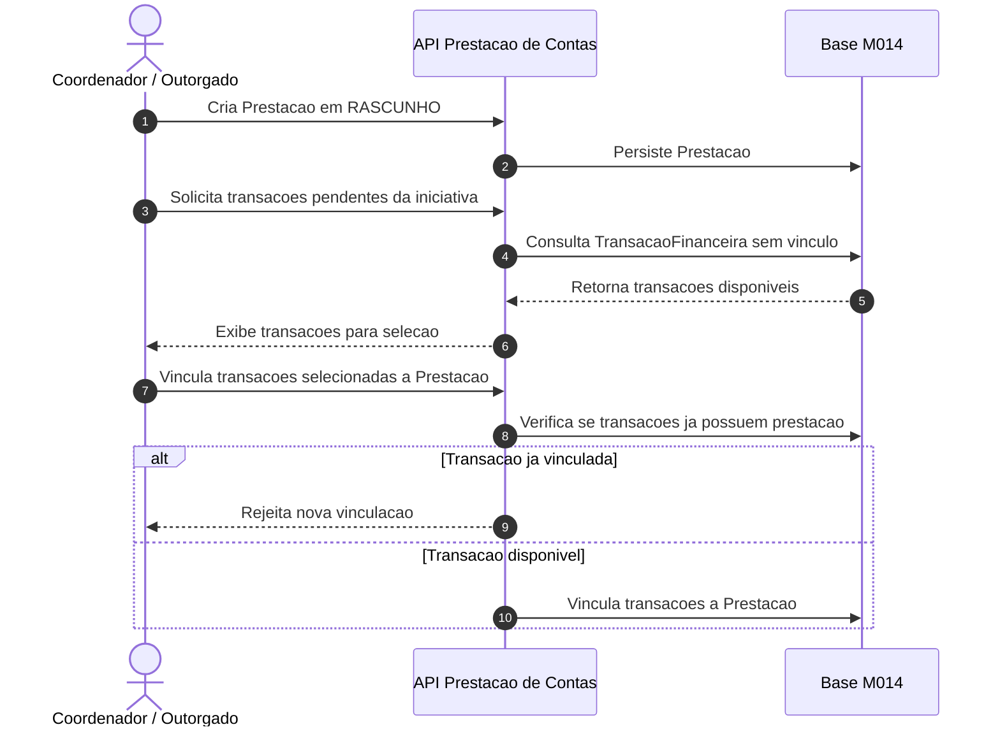

### Fluxo 3.2 - Nota Fiscal de Produto

Nota fiscal de produto e o unico tipo que passa pelo SERPRO. Antes de persistir o documento, a API verifica se a nota ja foi usada. Se a nota ja foi utilizada, for falsa ou for invalida no SERPRO, o uso e impedido. Quando a nota e verdadeira, o SERPRO retorna os dados da nota fiscal e o sistema usa os itens retornados para encaixar as compras nas rubricas do orcamento.

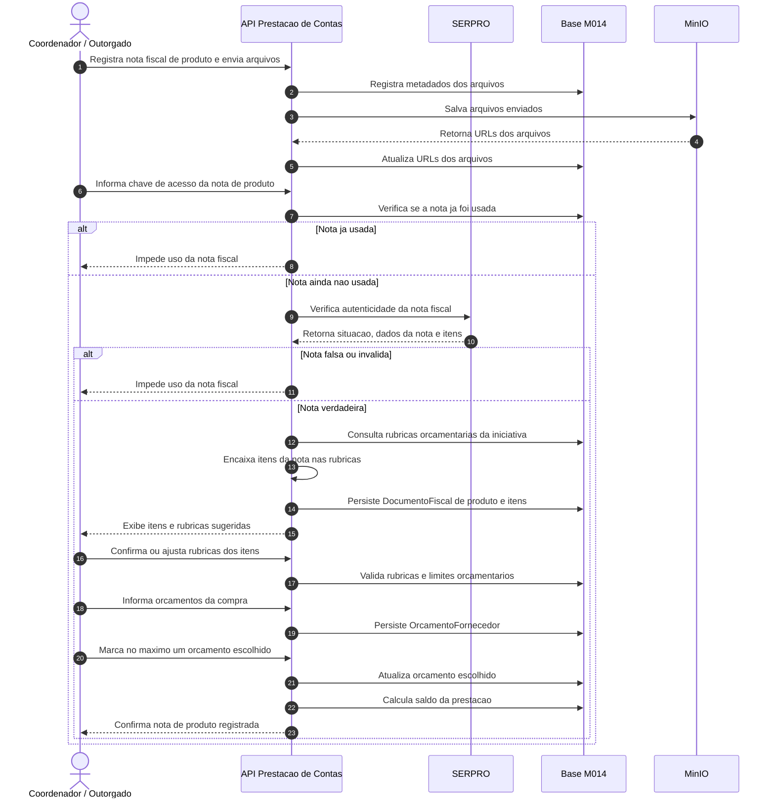

### Fluxo 3.3 - Nota Fiscal de Servico

Nota fiscal de servico, no fluxo atual, nao passa pelo SERPRO. A API usa uma biblioteca interna para validar os dados informados, verifica se a nota ja foi usada e impede novo uso quando houver duplicidade. A validacao por SERPRO para servicos fica prevista como evolucao futura.

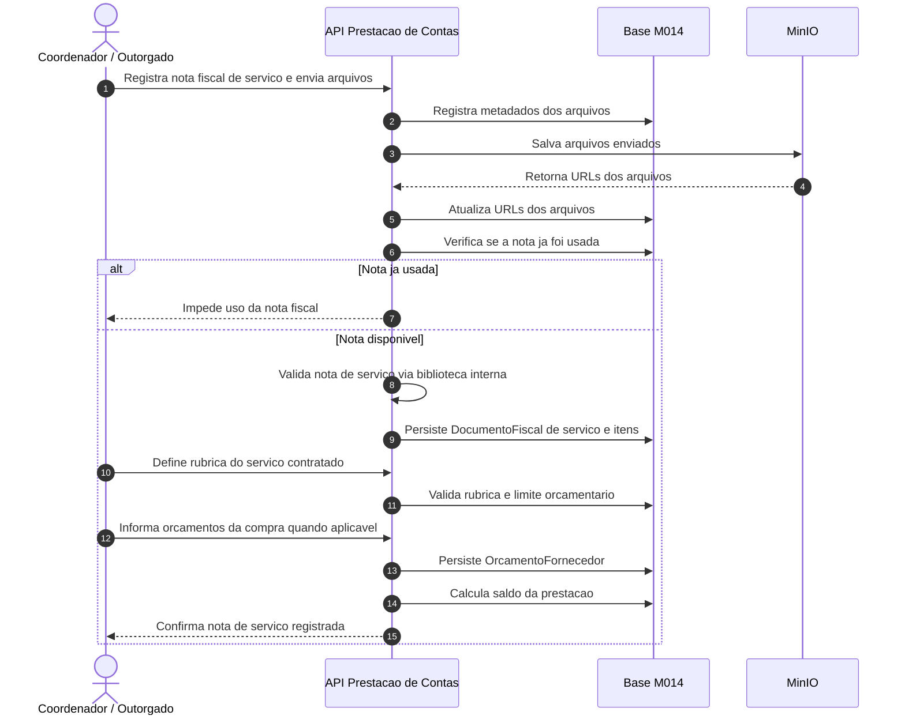

### Fluxo 3.4 - Produto sem Nota Fiscal

Compra de produto sem nota fiscal e um fluxo excepcional. Nao passa pelo SERPRO e exige justificativa formal para ausencia da nota, comprovante alternativo da despesa, rubrica orcamentaria e vinculacao a transacao bancaria. A despesa fica marcada para analise obrigatoria pela Area Tecnica.

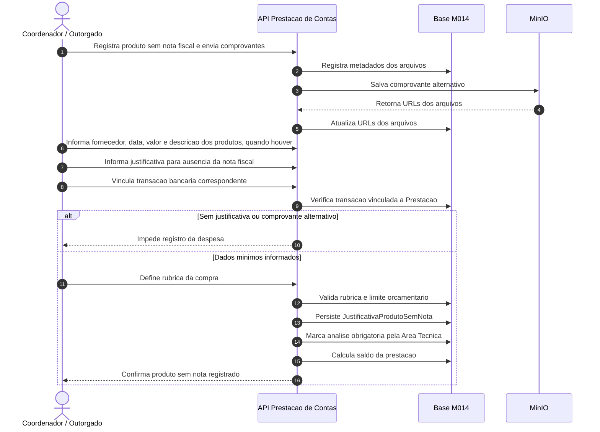

### Fluxo 3.5 - Invoice

Invoice nao passa pelo SERPRO. A API valida internamente os dados da despesa internacional, incluindo moeda e cambio, armazena os arquivos e permite a classificacao em rubrica.

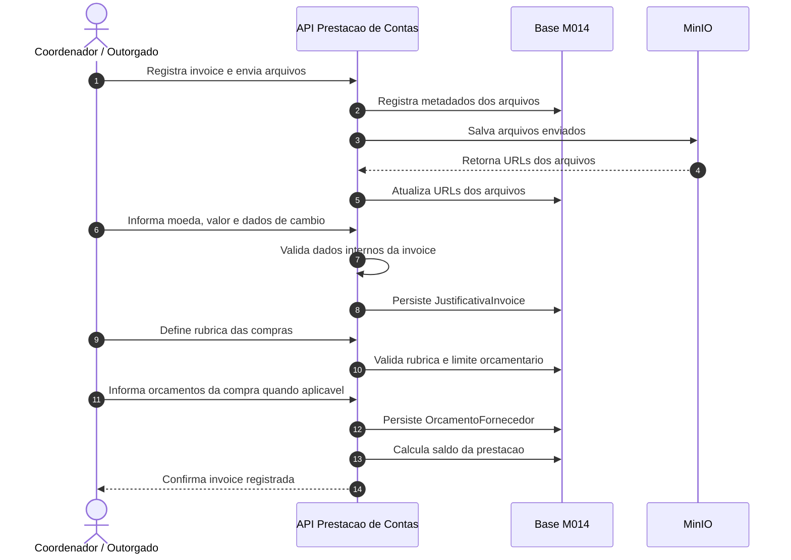

### Fluxo 3.6 - Diarias

Diarias nao passam pelo SERPRO. A solicitacao operacional de diaria pertence ao M003 e nao exige aprovacao manual da FAPES: ela nasce quando ha saldo na RubricaProjeto aplicavel, gera comprometimento e segue aceite/recusa do beneficiario quando houver bolsista. No M014, o Coordenador escolhe a diaria em uma lista de solicitacoes elegiveis que ainda nao foram prestadas contas, informa o PIX do pagamento quando aplicavel, anexa o comprovante de pagamento da diaria e registra a despesa. A API valida a solicitacao no M003, beneficiario, quantidade, valor calculado da diaria, comprometimento na RubricaProjeto de Diarias e Passagens, ausencia de JustificativaDiaria anterior e comprovante PIX/pagamento, armazena os comprovantes e registra a justificativa.

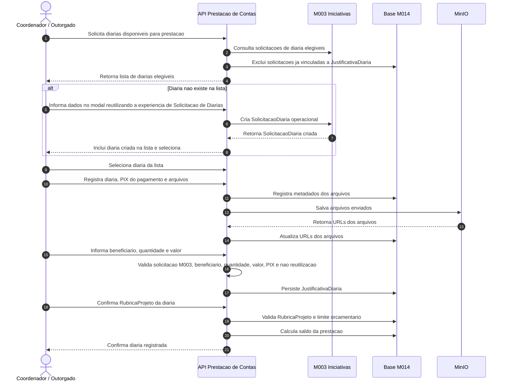

### Fluxo 3.7 - Passagens

Passagens nao passam pelo SERPRO. O Coordenador deve informar os dados da viagem, informar o valor da passagem comprada, selecionar a RubricaProjeto de passagem, anexar o comprovante de pagamento da passagem e anexar o comprovante de realizacao da viagem. O comprovante de realizacao pode ser cartao de embarque, declaracao de participacao, certificado, carta de aceite de artigo ou declaracao de reuniao/visita tecnica. A API valida os comprovantes obrigatorios, o valor informado, os dados da viagem, o pagamento e a rubrica selecionada, armazena os arquivos e registra a despesa associada a RubricaProjeto de passagem.

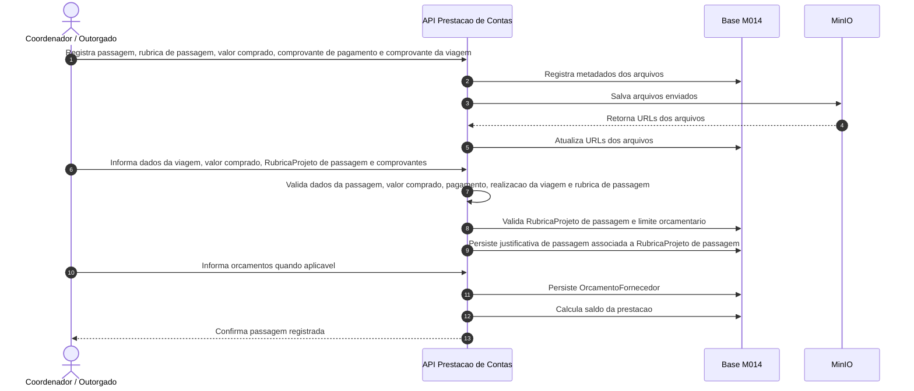

### Atividades da elaboracao

| # | Atividade | Responsavel | Resultado |
|---|-----------|-------------|-----------|
| 1 | Criar Prestacao | Coordenador / Outorgado | `Prestacao` criada em `RASCUNHO`. |
| 2 | Vincular transacoes | Coordenador / Outorgado | Movimentos bancarios associados a prestacao, respeitando RN04. |
| 3 | Registrar nota fiscal de produto | Coordenador / Outorgado / SERPRO | SERPRO retorna dados e itens da nota; o sistema encaixa os itens nas rubricas, e nota falsa, invalida ou ja usada e impedida. |
| 4 | Registrar nota fiscal de servico | Coordenador / Outorgado | Despesa segue por biblioteca interna no fluxo atual; validacao via SERPRO fica prevista como evolucao futura. |
| 5 | Registrar produto sem nota fiscal | Coordenador / Outorgado | Despesa excepcional registrada com justificativa, comprovante alternativo, rubrica e analise obrigatoria pela Area Tecnica. |
| 6 | Registrar invoice | Coordenador / Outorgado | Despesa internacional registrada com moeda, valor e cambio, sem chamada ao SERPRO. |
| 7 | Registrar diaria | Coordenador / Outorgado | Diaria registrada a partir da solicitacao de diaria aprovada do M003, com beneficiario, quantidade, valor calculado e comprovante de pagamento da diaria, sem chamada ao SERPRO. |
| 8 | Registrar passagem | Coordenador / Outorgado | Passagem registrada com dados da viagem, valor da passagem comprada, comprovante de pagamento da passagem e comprovante de realizacao da viagem, sem chamada ao SERPRO. |
| 9 | Enviar arquivos | Coordenador / Outorgado / MinIO | Arquivos comprobatorios armazenados no MinIO e vinculados a despesa. |
| 10 | Definir rubrica | Coordenador / Outorgado | Despesa classificada na rubrica orcamentaria correspondente, separada da transacao bancaria. |
| 11 | Informar orcamentos | Coordenador / Outorgado | Orcamentos cadastrados quando aplicavel e, quando necessario, um orcamento marcado como escolhido. |
| 12 | Conciliar transacoes | Modulo M014 | Diferenca da prestacao calculada por `ValorTotalTransacoes - ValorTotalJustificativas`. |
| 13 | Atualizar execucao orcamentaria | M014 / M013 | Quando aplicavel, M013 registra `Transacao` de execucao na `RubricaProjeto`; a `TransacaoFinanceira` fica apenas como referencia de conciliacao. |

---

## Fluxo 4 - Associar Compra e Cotacao

Este fluxo organiza a associacao da compra realizada pelo Coordenador ao planejamento aprovado do projeto e define quando a cotacao deve ser exigida. A associacao deve separar a categoria/rubrica, o item comprado, a nota fiscal e os arquivos comprobatorios enviados.

### Associar Compra

Quando o Coordenador tem seu projeto aprovado, possui a lista de compras que pode realizar no projeto. Em Prestacao de Contas ele deve apenas comprar o que esta mapeado em seu projeto, tanto a categoria/rubrica (Material Permanente, Material de Consumo, Passagem, Diaria, Pessoa Fisica e Pessoa Juridica) quanto o item.

Se o Coordenador deseja comprar algo de uma categoria ou item que nao esta disponivel no seu edital, deve solicitar o Remanejamento de Recursos para a FAPES, que pode aprovar ou nao.

Se o Coordenador deseja comprar uma categoria e item que esta disponivel em seu projeto, mas o valor ja acabou para a categoria, ele pode solicitar o Remanejamento de Recursos manualmente de uma categoria para outra em sua conta Conecta FAPES.

### Cotacao

Se o produto ou servico que o Coordenador comprou possui valor acima de 300 VRTE, ele deve enviar a cotacao com tres orcamentos, comprovando que pesquisou o melhor valor.

O valor de 300 VRTE (Valor de Referencia do Tesouro Estadual) no Espirito Santo e de R$ 1.481,49. Esse valor deve ser parametrizavel, pois e atualizado periodicamente pelo governo.

Se uma nota fiscal possui dois produtos de valor acima de 300 VRTE, o Coordenador deve enviar duas cotacoes (6 orcamentos). E assim por diante.

Se a compra for menor que 300 VRTE, a sessao de Cotacao nao deve aparecer para o usuario.

Apos fazer o upload da imagem ou arquivo comprobatorio, o usuario deve conseguir ver qual arquivo enviou sem precisar baixa-lo, alterar o nome do arquivo e excluir.

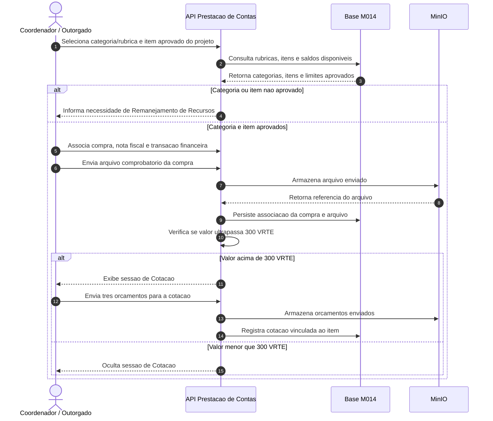

### Atividades de associacao e cotacao

| # | Atividade | Responsavel | Resultado |
|---|-----------|-------------|-----------|
| 1 | Selecionar categoria/rubrica | Coordenador / Outorgado | Categoria da compra escolhida entre as rubricas aprovadas do projeto. |
| 2 | Selecionar item | Coordenador / Outorgado | Item comprado associado a lista aprovada no projeto. |
| 3 | Validar elegibilidade | Modulo M014 | Sistema verifica se categoria, item e saldo estao disponiveis para prestacao. |
| 4 | Orientar remanejamento | Modulo M014 / Coordenador | Quando categoria, item ou saldo nao estao disponiveis, Coordenador deve solicitar Remanejamento de Recursos. |
| 5 | Enviar arquivo comprobatorio | Coordenador / Outorgado / MinIO | Arquivo enviado, visualizavel sem download, renomeavel e removivel enquanto permitido. |
| 6 | Verificar limite de VRTE | Modulo M014 | Sistema compara o valor da compra com o parametro de 300 VRTE. |
| 7 | Exigir cotacao quando aplicavel | Coordenador / Outorgado | Para compra acima de 300 VRTE, Coordenador envia tres orcamentos por item aplicavel. |
| 8 | Ocultar cotacao quando nao aplicavel | Modulo M014 | Para compra menor que 300 VRTE, sessao de Cotacao nao e exibida. |

---

## Fluxo 5 - Submissao e Analise da Prestacao

A submissao so pode ocorrer quando a prestacao esta em `RASCUNHO` ou `REVISAO` e possui conciliacao suficiente entre transacoes e justificativas. Ao entrar em `EM_ANALISE`, edicoes e exclusoes no agregado ficam bloqueadas ate a decisao da FAPES.

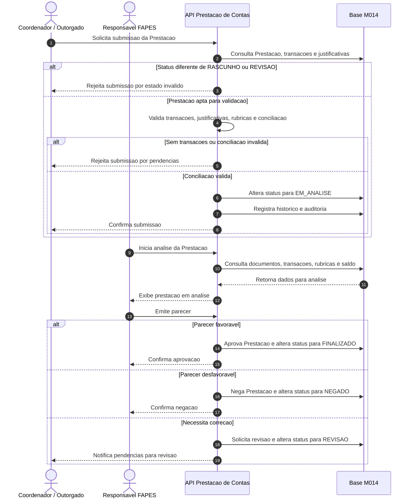

### Atividades da submissao e analise

| # | Atividade | Responsavel | Resultado |
|---|-----------|-------------|-----------|
| 1 | Solicitar submissao | Coordenador / Outorgado | Pedido de envio para analise iniciado. |
| 2 | Validar aptidao | Modulo M014 | Prestacao aceita apenas se estiver em `RASCUNHO` ou `REVISAO` e atender RN01 e RN02. |
| 3 | Bloquear edicoes | Modulo M014 | Alteracoes no agregado bloqueadas em `EM_ANALISE`, conforme RN03. |
| 4 | Analisar documentos | Responsavel FAPES | Verificacao de transacoes, justificativas, rubricas, documentos fiscais e saldo. |
| 5 | Emitir parecer | Responsavel FAPES | Prestacao aprovada, negada ou devolvida para revisao, conforme RN10. |
| 6 | Registrar auditoria | Modulo M014 | Operacoes relevantes registradas em historico, conforme RN09. |

---

## Fluxo 6 - Revisao pelo Coordenador

Quando a FAPES solicita revisao, a prestacao retorna para `REVISAO`. O Coordenador pode ajustar justificativas, documentos, orcamentos, classificacoes e transacoes vinculadas antes de submeter novamente. `FINALIZADO` e `NEGADO` sao estados terminais.

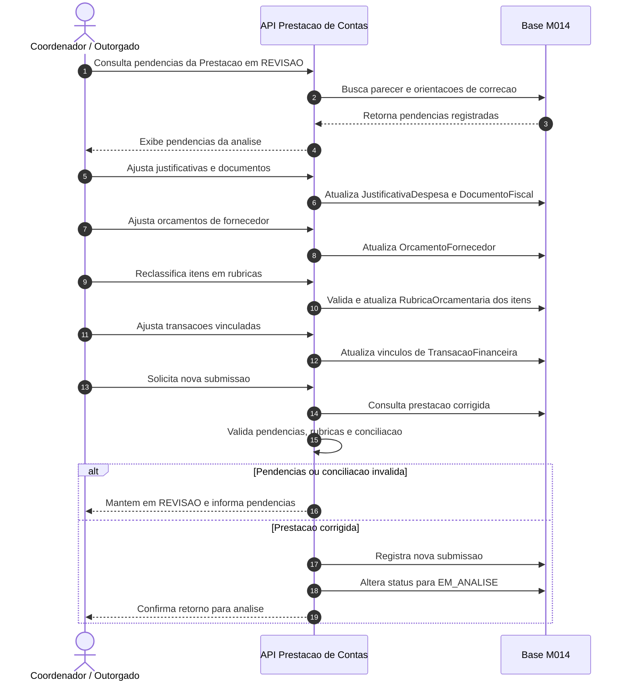

### Atividades da revisao

| # | Atividade | Responsavel | Resultado |
|---|-----------|-------------|-----------|
| 1 | Ler pendencias | Coordenador / Outorgado | Coordenador identifica os pontos devolvidos pela FAPES. |
| 2 | Ajustar prestacao | Coordenador / Outorgado | Justificativas, documentos, orcamentos, rubricas e transacoes corrigidos. |
| 3 | Validar conciliacao | Modulo M014 | Nova versao validada antes da submissao. |
| 4 | Submeter novamente | Coordenador / Outorgado | Prestacao retorna para `EM_ANALISE`. |
| 5 | Bloquear edicoes | Modulo M014 | Agregado protegido durante nova analise. |
