# Processo - Prestacao de Contas

[<< Voltar ao M014](README.md) | [Estrutural](modelo-estrutural.md) | [Comportamental](modelo-comportamental.md)

---

## Visao Geral

O processo de Prestacao de Contas cobre o ciclo operacional do modulo: importacoes financeiras e orcamentarias, preparacao da prestacao pelo Coordenador, submissao para analise e decisao do Responsavel FAPES. A prestacao nasce em `RASCUNHO`, pode ir para `EM_ANALISE`, retornar para `REVISAO`, ou terminar como `FINALIZADO` ou `NEGADO`.

1. **Carga unica do orcamento original** - primeira integracao entre Conecta FAPES e SIGFAPES para importar o orcamento original aprovado da iniciativa.
2. **Importacao diaria de movimentos bancarios** - processo diario que captura o CNAB 240 gerado pelo EDI Banestes em uma pasta de servidor, envia o arquivo para a API/Base M014, que salva no MinIO e publica a referencia em uma fila para workers processarem em paralelo.
3. **Elaboracao da prestacao** - criacao da `Prestacao`, vinculacao de transacoes, registro de justificativas e classificacao de documentos fiscais.
4. **Submissao e analise** - validacao de conciliacao, bloqueio de edicoes e parecer do Responsavel FAPES.
5. **Revisao pelo Coordenador** - ajustes solicitados pela FAPES e nova submissao para analise.

---

## Fluxo 1 - Carga Unica do Orcamento Original

Este fluxo representa a primeira integracao do modulo: o Conecta FAPES consulta o SIGFAPES para importar o orcamento original aprovado da iniciativa. Essa carga e executada apenas uma vez por iniciativa; depois de concluida com sucesso, o orcamento fica marcado como importado para evitar nova carga automatica.

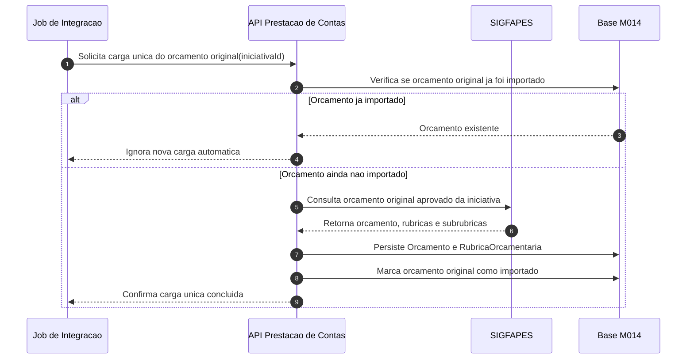

### Atividades da carga unica

| # | Atividade | Responsavel | Resultado |
|---|-----------|-------------|-----------|
| 1 | Solicitar carga unica | Job de Integracao | API de Prestacao de Contas acionada para importar o orcamento original da iniciativa. |
| 2 | Consultar SIGFAPES | API Prestacao de Contas / SIGFAPES | Orcamento original aprovado da iniciativa retornado pelo SIGFAPES. |
| 3 | Persistir orcamento e rubricas | API Prestacao de Contas | `Orcamento` e `RubricaOrcamentaria` criados na base M014. |
| 4 | Marcar orcamento como importado | API Prestacao de Contas | Carga unica registrada para evitar nova importacao automatica do mesmo orcamento. |

---

## Fluxo 2 - Importacao Diaria de Movimentos Bancarios

Este fluxo e independente da carga unica do SIGFAPES. Diariamente, o EDI Banestes grava o arquivo CNAB 240 em uma pasta de servidor. Um job de captura le essa pasta e envia o arquivo para a API/Base M014. A API registra a captura, salva o arquivo bruto no MinIO e publica uma mensagem em fila com a referencia do objeto. Workers de importacao consomem a fila em paralelo e chamam a API de Prestacao de Contas para processar o arquivo e persistir os debitos e creditos como `TransacaoFinanceira`. As transacoes ficam pendentes ate serem vinculadas a uma prestacao.

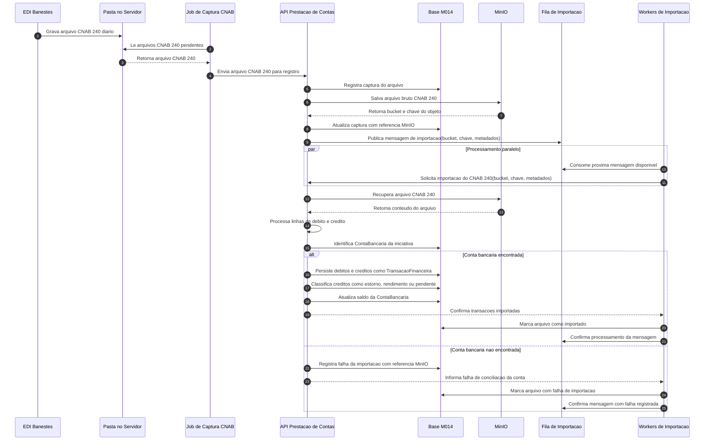

### Atividades da importacao diaria

| # | Atividade | Responsavel | Resultado |
|---|-----------|-------------|-----------|
| 1 | Gerar CNAB 240 | EDI Banestes | Arquivo diario gravado em uma pasta no servidor. |
| 2 | Capturar arquivo | Job de Captura CNAB | Arquivo CNAB 240 lido da pasta do servidor. |
| 3 | Enviar arquivo para API | Job de Captura CNAB | Arquivo CNAB 240 enviado para a API/Base M014. |
| 4 | Registrar e armazenar captura | API Prestacao de Contas / MinIO | API registra a captura na Base M014 e salva o CNAB 240 no MinIO. |
| 5 | Publicar mensagem | API Prestacao de Contas / Fila de Importacao | Mensagem criada com bucket, chave e metadados do CNAB 240. |
| 6 | Consumir em paralelo | Workers de Importacao | Workers consomem mensagens da fila para acelerar o processamento. |
| 7 | Enviar para API | Workers de Importacao | API de Prestacao de Contas acionada com a referencia do objeto no MinIO. |
| 8 | Processar CNAB 240 | API Prestacao de Contas | Arquivo recuperado do MinIO e interpretado em linhas de debito e credito. |
| 9 | Identificar conta bancaria | API Prestacao de Contas | Conta da iniciativa localizada para associar os movimentos importados. |
| 10 | Salvar debitos e creditos | API Prestacao de Contas | Debitos e creditos persistidos como `TransacaoFinanceira`. |
| 11 | Classificar creditos | API Prestacao de Contas | Creditos classificados como `ESTORNO`, `RENDIMENTO` ou `PENDENTE_CLASSIFICACAO`, conforme RN11. |
| 12 | Atualizar saldo | API Prestacao de Contas / Financeiro M016 | Saldo da `ContaBancaria` atualizado a partir dos movimentos importados. |
| 13 | Registrar resultado | API Prestacao de Contas / Workers de Importacao | Arquivo marcado como importado ou com falha registrada; mensagem da fila confirmada. |

---

## Fluxo 3 - Elaboracao da Prestacao

Este fluxo inicia quando o Coordenador cria a prestacao em `RASCUNHO` e vincula as transacoes bancarias importadas. A partir dessa base comum, a elaboracao se divide em modelos separados por tipo de despesa: nota fiscal de produto, produto sem nota fiscal, nota fiscal de servico, invoice, diarias e passagens. Nota fiscal de produto passa pela integracao SERPRO. Nota fiscal de servico, no fluxo atual, e validada por biblioteca interna; a validacao por SERPRO fica prevista como evolucao futura. Os demais tipos seguem por validacoes internas, armazenamento dos arquivos e classificacao em rubricas.

### Fluxo 3.1 - Base da Prestacao

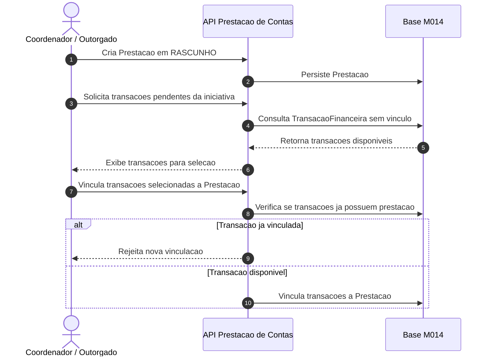

### Fluxo 3.2 - Nota Fiscal de Produto

Nota fiscal de produto e o unico tipo que passa pelo SERPRO. Antes de persistir o documento, a API verifica se a nota ja foi usada. Se a nota ja foi utilizada, for falsa ou for invalida no SERPRO, o uso e impedido. Quando a nota e verdadeira, o SERPRO retorna os dados da nota fiscal e o sistema usa os itens retornados para encaixar as compras nas rubricas do orcamento.

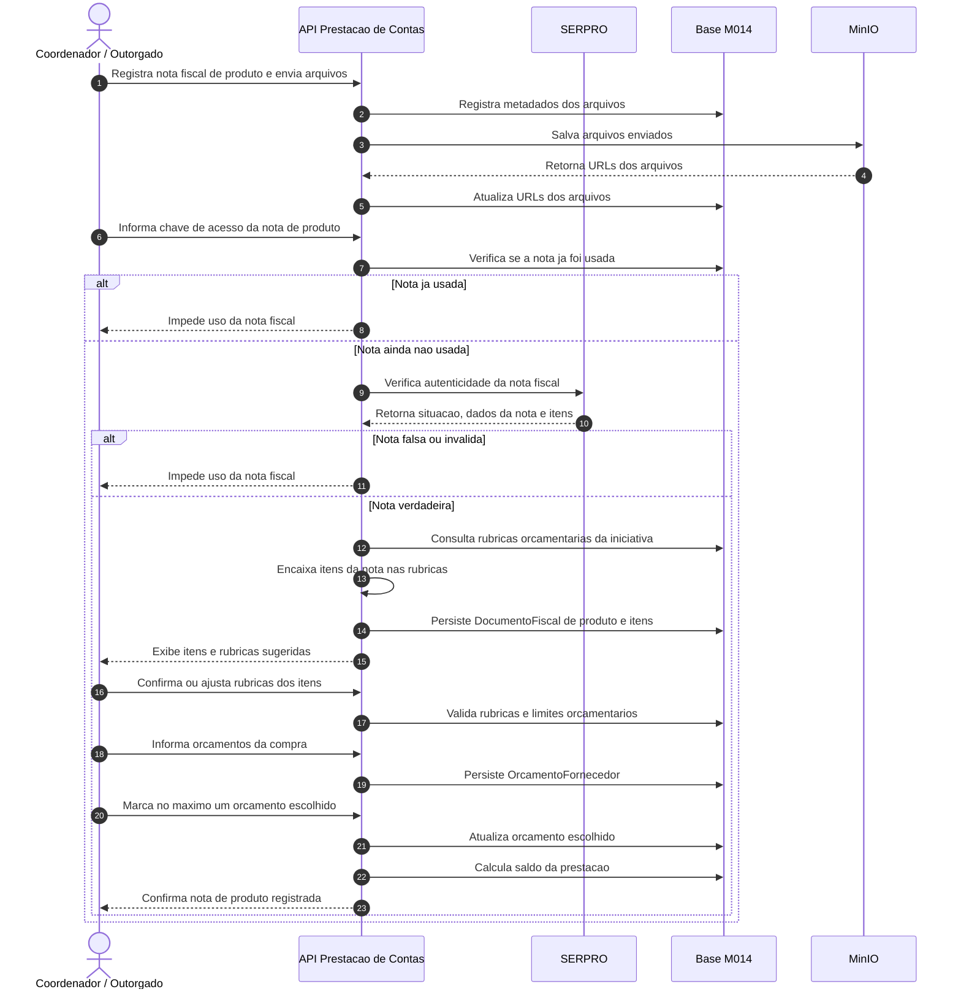

### Fluxo 3.3 - Nota Fiscal de Servico

Nota fiscal de servico, no fluxo atual, nao passa pelo SERPRO. A API usa uma biblioteca interna para validar os dados informados, verifica se a nota ja foi usada e impede novo uso quando houver duplicidade. A validacao por SERPRO para servicos fica prevista como evolucao futura.

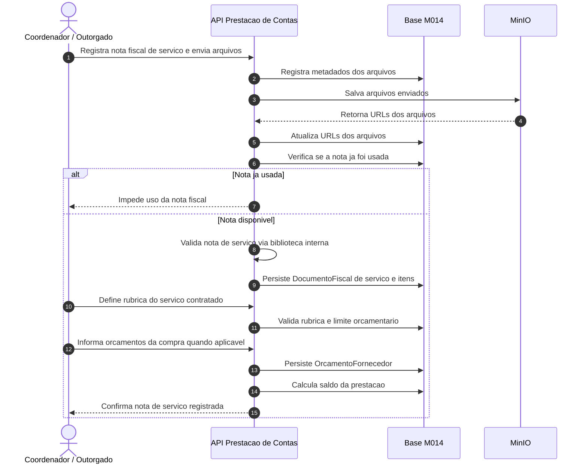

### Fluxo 3.4 - Produto sem Nota Fiscal

Compra de produto sem nota fiscal e um fluxo excepcional. Nao passa pelo SERPRO e exige justificativa formal para ausencia da nota, comprovante alternativo da despesa, rubrica orcamentaria e vinculacao a transacao bancaria. A despesa fica marcada para analise obrigatoria pela Area Tecnica.

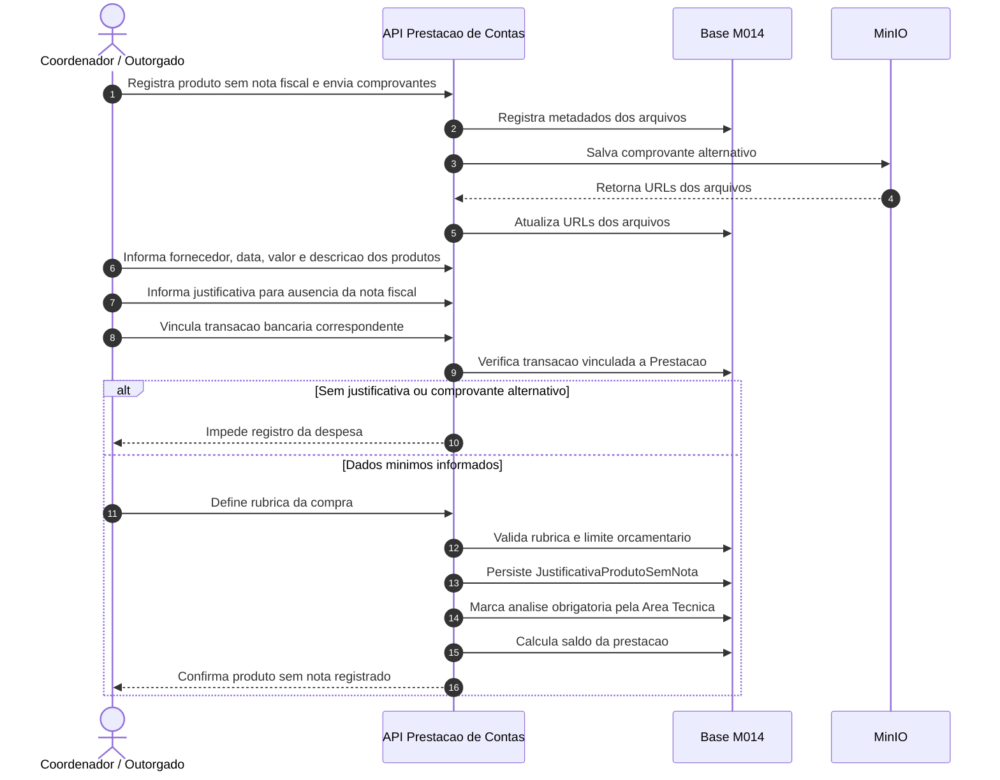

### Fluxo 3.5 - Invoice

Invoice nao passa pelo SERPRO. A API valida internamente os dados da despesa internacional, incluindo moeda e cambio, armazena os arquivos e permite a classificacao em rubrica.

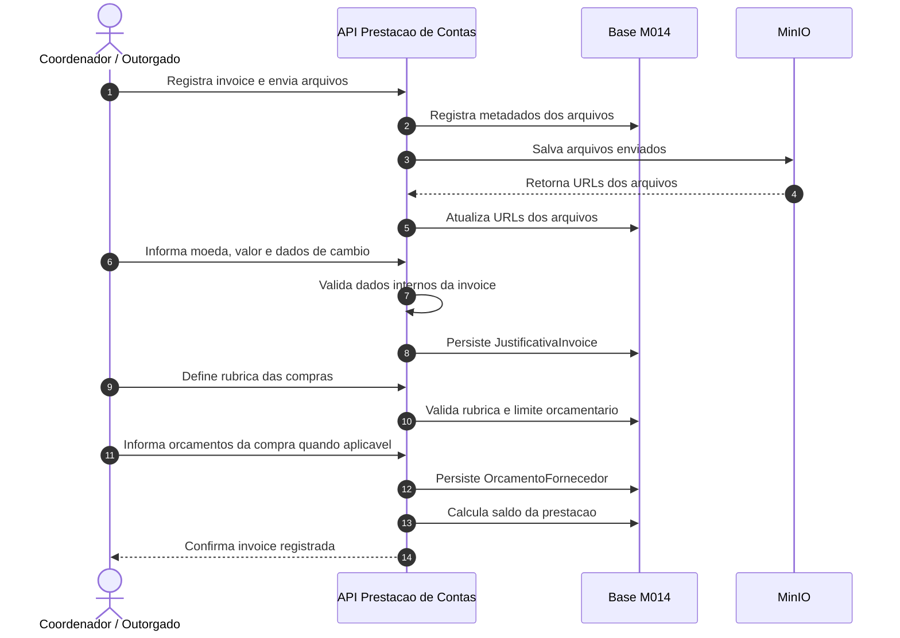

### Fluxo 3.6 - Diarias

Diarias nao passam pelo SERPRO. O Coordenador deve informar a solicitacao de diaria e o PIX do pagamento antes do registro da despesa. A API valida a solicitacao, beneficiario, quantidade, valor da diaria e comprovante PIX, armazena os comprovantes e registra a justificativa.

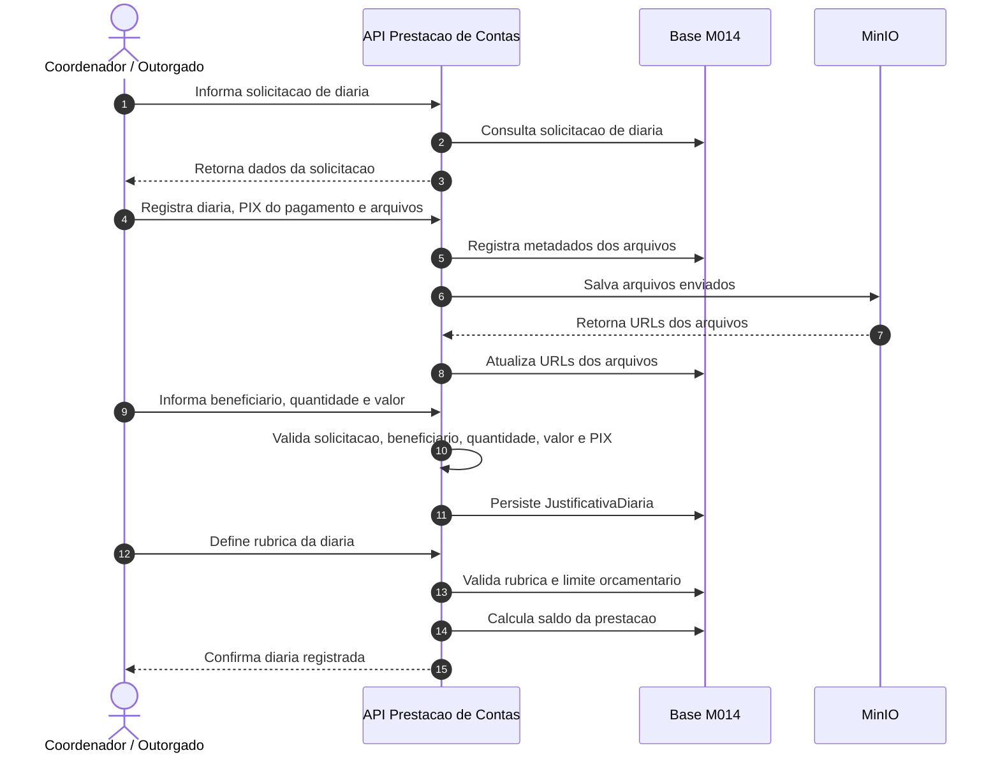

### Fluxo 3.7 - Passagens

Passagens nao passam pelo SERPRO. O Coordenador deve informar os dados da viagem, o PIX do pagamento e o PDF da compra da passagem. A API valida os comprovantes, o PDF da compra, os dados da viagem e o comprovante PIX, armazena os arquivos e registra a despesa na rubrica definida pelo Coordenador ou Outorgado.

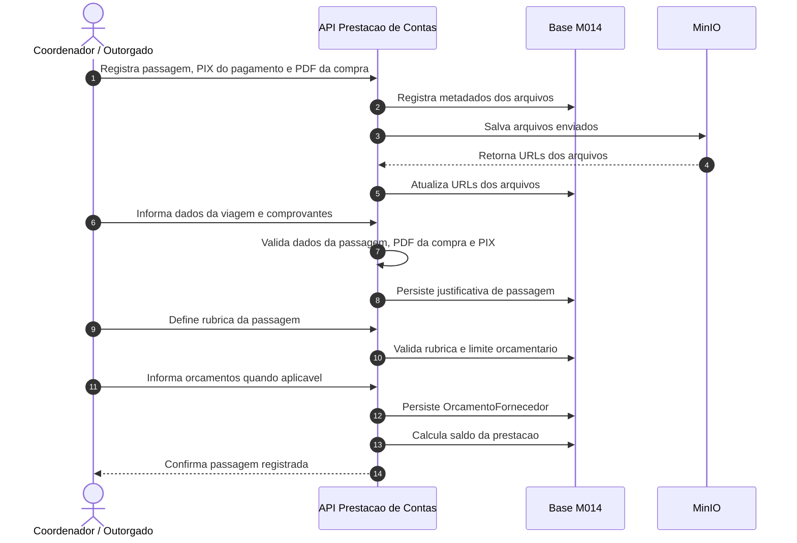

### Atividades da elaboracao

| # | Atividade | Responsavel | Resultado |
|---|-----------|-------------|-----------|
| 1 | Criar Prestacao | Coordenador / Outorgado | `Prestacao` criada em `RASCUNHO`. |
| 2 | Vincular transacoes | Coordenador / Outorgado | Movimentos bancarios associados a prestacao, respeitando RN04. |
| 3 | Registrar nota fiscal de produto | Coordenador / Outorgado / SERPRO | SERPRO retorna dados e itens da nota; o sistema encaixa os itens nas rubricas, e nota falsa, invalida ou ja usada e impedida. |
| 4 | Registrar nota fiscal de servico | Coordenador / Outorgado | Despesa segue por biblioteca interna no fluxo atual; validacao via SERPRO fica prevista como evolucao futura. |
| 5 | Registrar produto sem nota fiscal | Coordenador / Outorgado | Despesa excepcional registrada com justificativa, comprovante alternativo, rubrica e analise obrigatoria pela Area Tecnica. |
| 6 | Registrar invoice | Coordenador / Outorgado | Despesa internacional registrada com moeda, valor e cambio, sem chamada ao SERPRO. |
| 7 | Registrar diaria | Coordenador / Outorgado | Diaria registrada a partir da solicitacao de diaria, com beneficiario, quantidade, valor e PIX do pagamento, sem chamada ao SERPRO. |
| 8 | Registrar passagem | Coordenador / Outorgado | Passagem registrada com dados da viagem, PDF da compra da passagem e PIX do pagamento, sem chamada ao SERPRO. |
| 9 | Enviar arquivos | Coordenador / Outorgado / MinIO | Arquivos comprobatorios armazenados no MinIO e vinculados a despesa. |
| 10 | Definir rubrica | Coordenador / Outorgado | Despesa classificada na rubrica orcamentaria correspondente. |
| 11 | Informar orcamentos | Coordenador / Outorgado | Orcamentos cadastrados quando aplicavel e, quando necessario, um orcamento marcado como escolhido. |
| 12 | Calcular saldo | Modulo M014 | Saldo calculado por `ValorTotalTransacoes - ValorTotalJustificativas`. |

---

## Fluxo 4 - Submissao e Analise da Prestacao

A submissao so pode ocorrer quando a prestacao esta em `RASCUNHO` ou `REVISAO` e possui conciliacao suficiente entre transacoes e justificativas. Ao entrar em `EM_ANALISE`, edicoes e exclusoes no agregado ficam bloqueadas ate a decisao da FAPES.

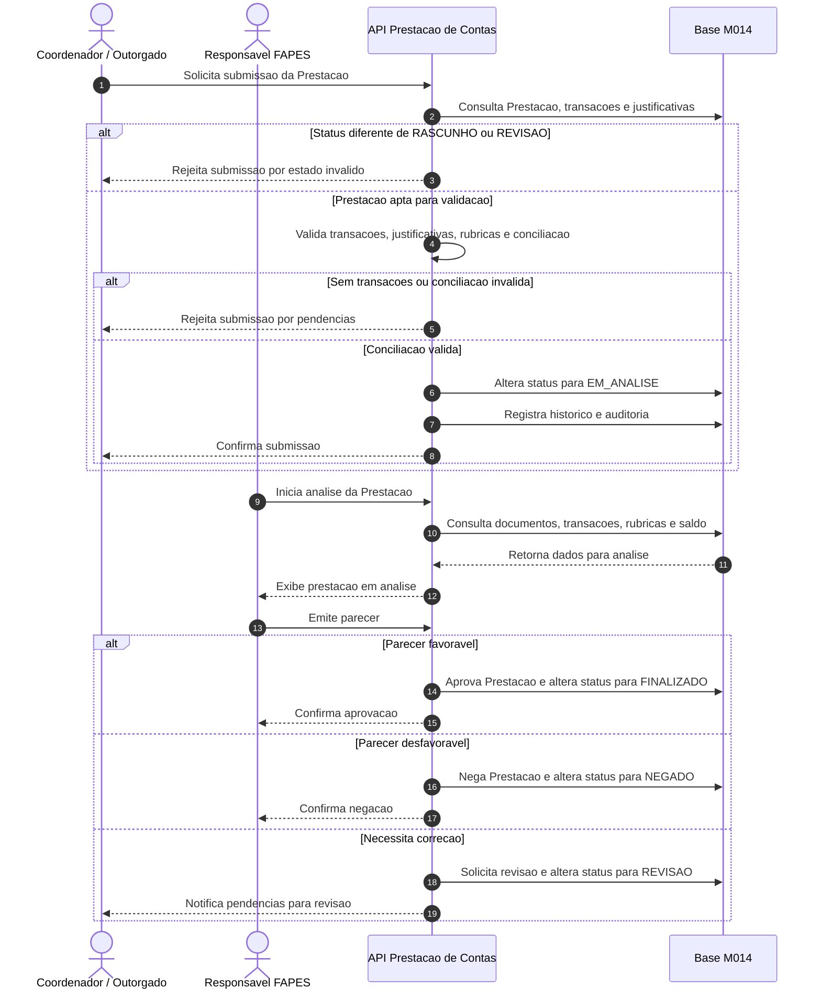

### Atividades da submissao e analise

| # | Atividade | Responsavel | Resultado |
|---|-----------|-------------|-----------|
| 1 | Solicitar submissao | Coordenador / Outorgado | Pedido de envio para analise iniciado. |
| 2 | Validar aptidao | Modulo M014 | Prestacao aceita apenas se estiver em `RASCUNHO` ou `REVISAO` e atender RN01 e RN02. |
| 3 | Bloquear edicoes | Modulo M014 | Alteracoes no agregado bloqueadas em `EM_ANALISE`, conforme RN03. |
| 4 | Analisar documentos | Responsavel FAPES | Verificacao de transacoes, justificativas, rubricas, documentos fiscais e saldo. |
| 5 | Emitir parecer | Responsavel FAPES | Prestacao aprovada, negada ou devolvida para revisao, conforme RN10. |
| 6 | Registrar auditoria | Modulo M014 | Operacoes relevantes registradas em historico, conforme RN09. |

---

## Fluxo 5 - Revisao pelo Coordenador

Quando a FAPES solicita revisao, a prestacao retorna para `REVISAO`. O Coordenador pode ajustar justificativas, documentos, orcamentos, classificacoes e transacoes vinculadas antes de submeter novamente. `FINALIZADO` e `NEGADO` sao estados terminais.

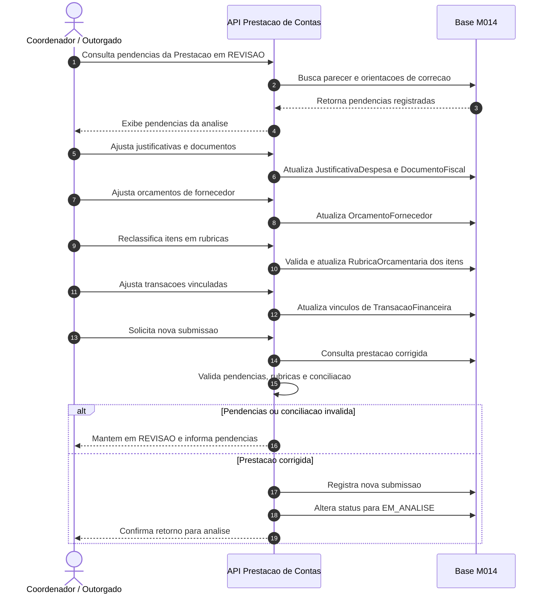

### Atividades da revisao

| # | Atividade | Responsavel | Resultado |
|---|-----------|-------------|-----------|
| 1 | Ler pendencias | Coordenador / Outorgado | Coordenador identifica os pontos devolvidos pela FAPES. |
| 2 | Ajustar prestacao | Coordenador / Outorgado | Justificativas, documentos, orcamentos, rubricas e transacoes corrigidos. |
| 3 | Validar conciliacao | Modulo M014 | Nova versao validada antes da submissao. |
| 4 | Submeter novamente | Coordenador / Outorgado | Prestacao retorna para `EM_ANALISE`. |
| 5 | Bloquear edicoes | Modulo M014 | Agregado protegido durante nova analise. |
