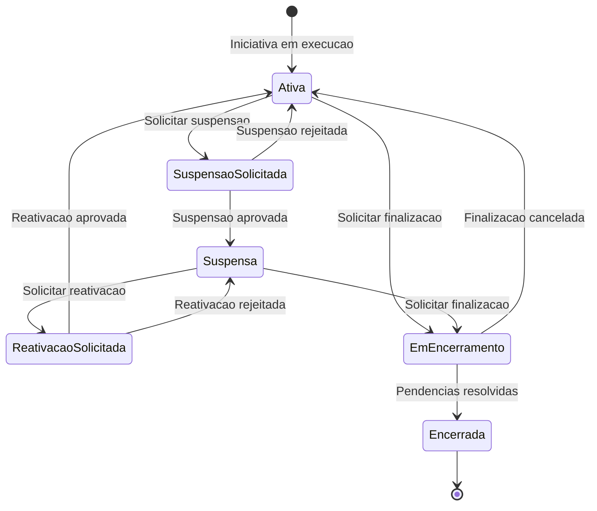
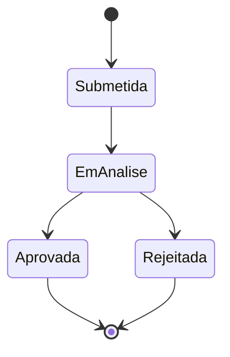
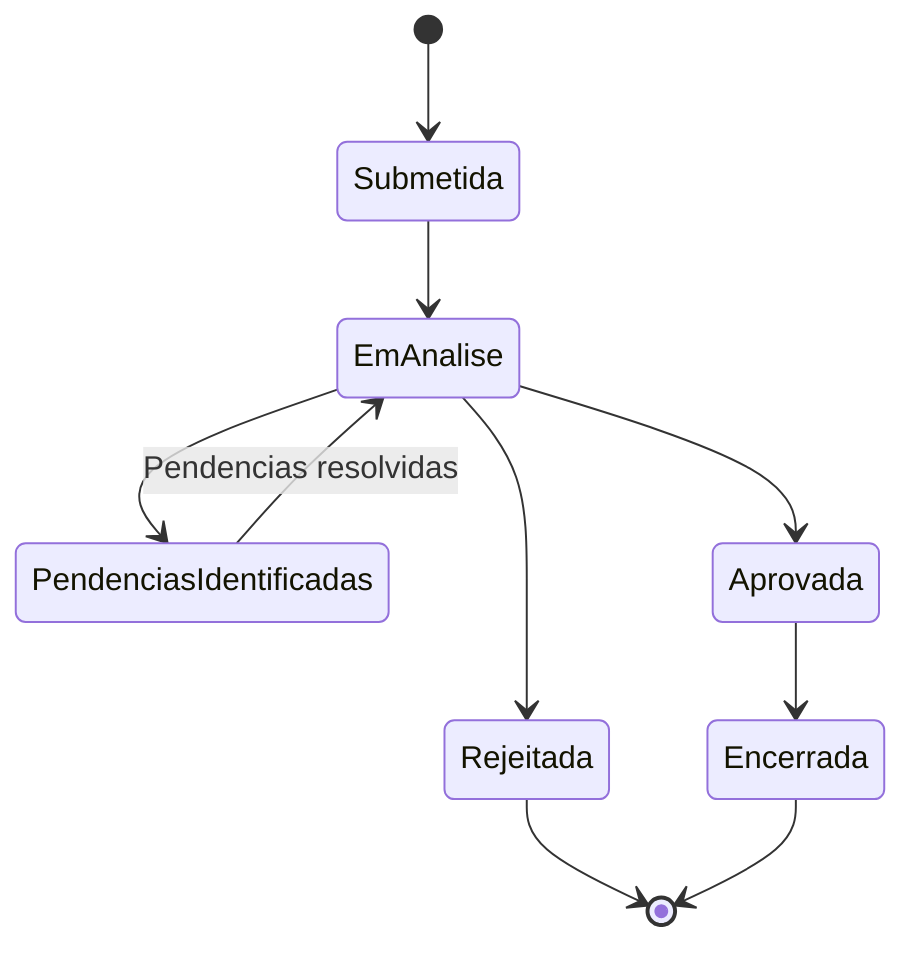

# Modelo Comportamental

Dominio e regras de negocio: ver [README.md](README.md)

## Ciclo de Vida da Iniciativa em Suspensao e Finalizacao

## Ciclo de Vida da Solicitacao de Suspensao

## Ciclo de Vida da Solicitacao de Finalizacao

