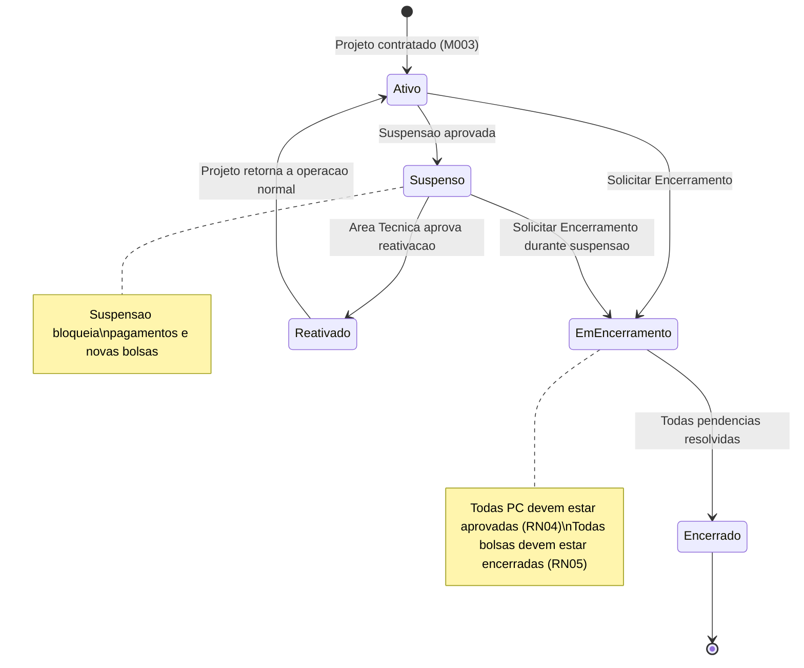
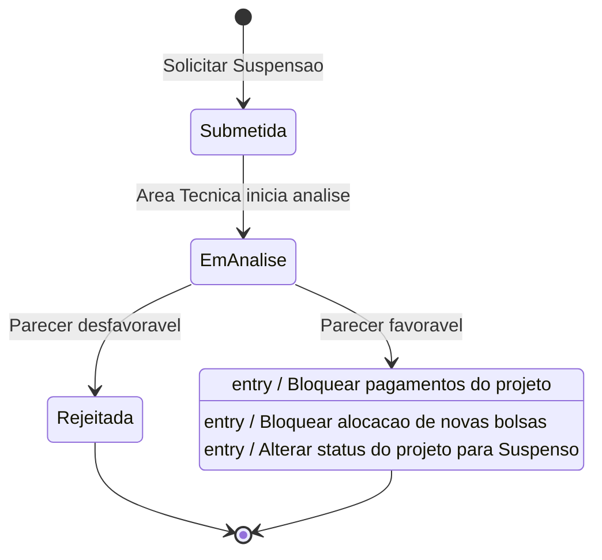
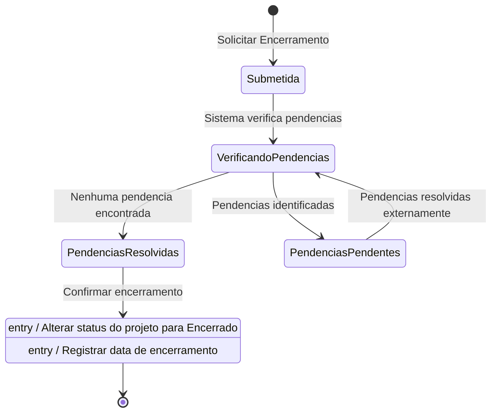

# Modelo Comportamental

Dominio e regras de negocio: ver [README.md](README.md)

### Ciclo de Vida: Projeto (extensao de estados para Suspensao e Finalizacao)

### Ciclo de Vida: SolicitacaoSuspensao

### Ciclo de Vida: SolicitacaoFinalizacao

