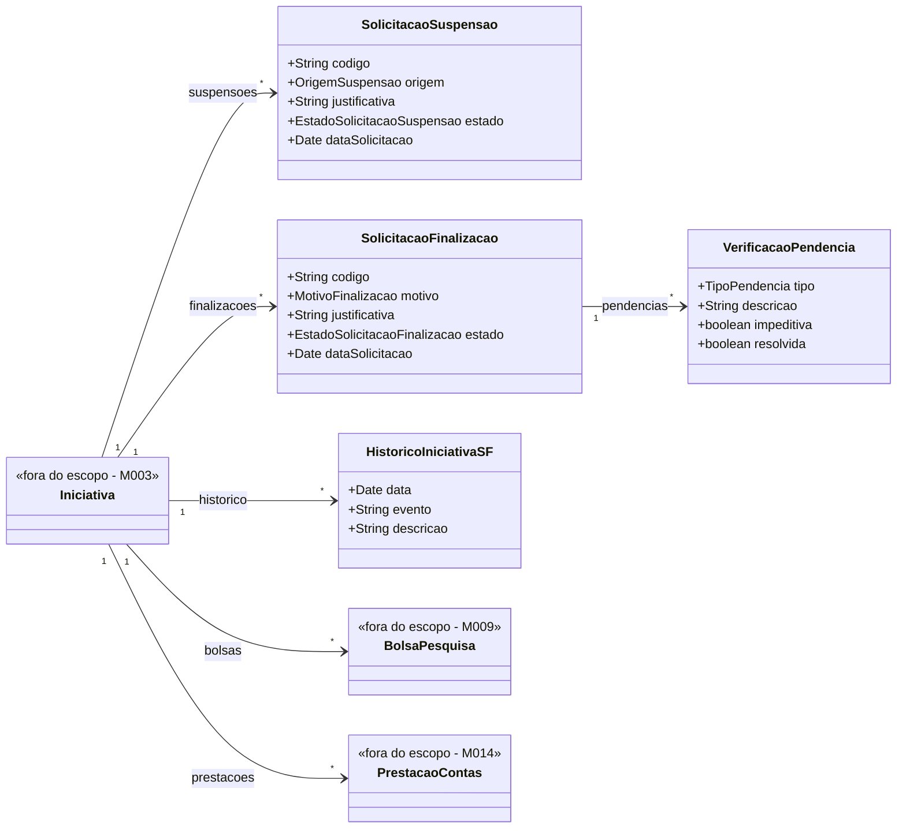

# Modelo Estrutural

Dominio e regras de negocio: ver [README.md](README.md)

## Diagrama de Classes

## Dicionario de Dados

| Classe | Atributo | Definicao | Obrig. | Tipo | Dominio |
|--------|----------|-----------|--------|------|---------|
| **SolicitacaoSuspensao** | codigo | Codigo da solicitacao | Gerado | String | Ex: SS-2026-001 |
| | origem | Origem da suspensao | Sim | OrigemSuspensao | ORTOGADO, AGENCIA_FOMENTO |
| | justificativa | Justificativa da suspensao | Sim | String | |
| | estado | Estado da solicitacao | Gerado | EstadoSolicitacaoSuspensao | SUBMETIDA, EM_ANALISE, APROVADA, REJEITADA |
| | dataSolicitacao | Data da solicitacao | Gerado | Date | |
| **SolicitacaoFinalizacao** | codigo | Codigo da solicitacao | Gerado | String | Ex: SF-2026-001 |
| | motivo | Motivo da finalizacao | Sim | MotivoFinalizacao | CONCLUSAO_NATURAL, DESISTENCIA_ORTOGADO, DETERMINACAO_AGENCIA |
| | justificativa | Justificativa da finalizacao | Sim | String | |
| | estado | Estado da solicitacao | Gerado | EstadoSolicitacaoFinalizacao | SUBMETIDA, EM_ANALISE, PENDENTE, APROVADA, REJEITADA, ENCERRADA |
| | dataSolicitacao | Data da solicitacao | Gerado | Date | |
| **VerificacaoPendencia** | tipo | Tipo de pendencia | Sim | TipoPendencia | BOLSA_ATIVA, PRESTACAO_PENDENTE, PAGAMENTO_PENDENTE |
| | descricao | Descricao da pendencia encontrada | Sim | String | |
| | impeditiva | Indica se bloqueia a finalizacao | Sim | Boolean | true/false |
| | resolvida | Indica se a pendencia foi resolvida | Sim | Boolean | true/false |
| **HistoricoIniciativaSF** | data | Data do evento | Gerado | Date | |
| | evento | Nome do evento | Sim | String | |
| | descricao | Descricao do evento | Nao | String | |

## Notas de Implementacao

**Entidades externas:**
- Iniciativa: gerenciada por M003.
- BolsaPesquisa: gerenciada por M009.
- PrestacaoContas: gerenciada por M014.

**Restricoes estruturais:**
- Toda solicitacao deve estar vinculada a uma iniciativa.
- A finalizacao deve verificar pendencias em M009, M014 e M004.
- Iniciativa encerrada e estado terminal para o fluxo do M015.
