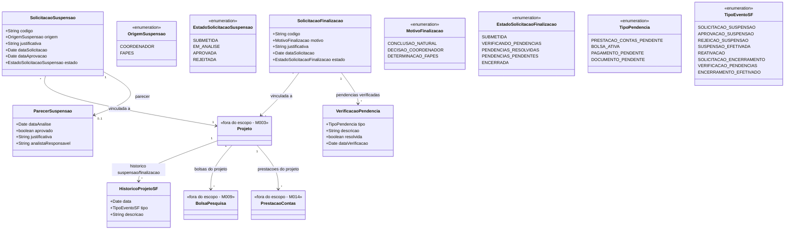

# Modelo Estrutural

Dominio e regras de negocio: ver [README.md](README.md)

### Diagrama de Classes

## Dicionario de Dados

| Classe | Atributo | Definicao | Obrig. | Tipo | Dominio | Tamanho | Unico |
|--------|----------|-----------|--------|------|---------|---------|-------|
| **SolicitacaoSuspensao** | codigo | Codigo de identificacao unica da solicitacao | Gerado | String | Ex: SS-2026-001 | | Sim |
| | origem | Indica se a suspensao foi solicitada pelo coordenador ou pela FAPES | Sim | OrigemSuspensao | Ver enumeracao | | |
| | justificativa | Justificativa para a suspensao | Sim | String | | 2000 | |
| | dataSolicitacao | Data em que a solicitacao foi registrada | Gerado | Date | | | |
| | dataAprovacao | Data em que a suspensao foi aprovada | Cond. | Date | Preenchida ao aprovar | | |
| | estado | Estado atual da solicitacao | Gerado | EstadoSolicitacaoSuspensao | Ver enumeracao | | |
| **SolicitacaoFinalizacao** | codigo | Codigo de identificacao unica da solicitacao de encerramento | Gerado | String | Ex: SF-2026-001 | | Sim |
| | motivo | Motivo do encerramento do projeto | Sim | MotivoFinalizacao | Ver enumeracao | | |
| | justificativa | Justificativa detalhada para o encerramento | Sim | String | | 2000 | |
| | dataSolicitacao | Data em que a solicitacao foi registrada | Gerado | Date | | | |
| | estado | Estado atual da solicitacao de encerramento | Gerado | EstadoSolicitacaoFinalizacao | Ver enumeracao | | |
| **VerificacaoPendencia** | tipo | Tipo de pendencia verificada | Sim | TipoPendencia | Ver enumeracao | | |
| | descricao | Descricao da pendencia encontrada | Sim | String | Ex: PC do periodo 2025-S2 nao submetida | 500 | |
| | resolvida | Indica se a pendencia foi resolvida | Gerado | Boolean | true/false | | |
| | dataVerificacao | Data da verificacao | Gerado | Date | | | |
| **ParecerSuspensao** | dataAnalise | Data em que o parecer foi emitido | Sim | Date | | | |
| | aprovado | Indica se a suspensao foi aprovada | Sim | Boolean | true/false | | |
| | justificativa | Justificativa do parecer | Sim | String | | 1000 | |
| | analistaResponsavel | Nome do analista que emitiu o parecer | Sim | String | | 200 | |
| **HistoricoProjetoSF** | data | Data do evento | Gerado | Date | | | |
| | tipo | Tipo do evento registrado | Sim | TipoEventoSF | Ver enumeracao | | |
| | descricao | Descricao textual do evento | Sim | String | | 500 | |

## Notas de Implementacao

**Entidades externas:**
- Projeto: gerenciado por M002/M003 (Importacao e Gerenciamento de Editais)
- BolsaPesquisa: gerenciada por M009 (Gestao Bolsa Pesquisa)
- PrestacaoContas: gerenciada por M014 (Prestacao de Contas)

**Navegabilidade:**
- Cardinalidade 1: atributo do tipo da classe destino (ex: SolicitacaoSuspensao.projeto: Projeto)
- Cardinalidade N: atributo lista do tipo da classe destino (ex: SolicitacaoFinalizacao.pendencias: List&lt;VerificacaoPendencia&gt;)
