# Modelo - Acao Transversal

[<< Voltar para Acao Transversal](README.md)

Este modelo detalha a parte do M016 responsavel por receber, classificar, repassar, executar e prestar financeiramente a reserva de Acao Transversal.

## Decisao de Modelagem

O Coordenador Outorgado da Acao Transversal **nao** e uma pessoa unica global da FAPES. Ele e uma Pessoa Fisica vinculada a FAPES e designada por um Termo de Outorga para gerir uma reserva, repasse ou conjunto delimitado de recursos de Acao Transversal.

Modelo conceitual:

```text
ReservaAcaoTransversal
  -> OutorgaAcaoTransversal
  -> PessoaFisica vinculada a FAPES
  -> ContaBancariaAcaoTransversal
  -> RepasseAcaoTransversal
```

Essa modelagem permite que:

- uma reserva/parceria tenha um Coordenador Outorgado especifico;
- a mesma pessoa da FAPES seja designada em mais de uma outorga;
- cada designacao mantenha rastreabilidade do TO, periodo, escopo, conta especifica e responsabilidade de prestacao de contas.

## Conta Bancaria vs Conta Contabil

A Acao Transversal possui duas dimensoes financeiras complementares:

| Dimensao | Finalidade | Entidade do modelo |
|----------|------------|--------------------|
| Conta contabil | Classificar contabilmente a natureza da reserva, da receita ou da despesa. | `ContaContabil` |
| Conta bancaria / conta corrente | Receber e movimentar dinheiro quando houver repasse ao Coordenador Outorgado. | `ContaBancariaAcaoTransversal` |

A `ContaBancariaAcaoTransversal` representa a conta especifica indicada pela Resolucao CCAF nº 334/2023: aberta pela FAPES, em nome do Coordenador Outorgado, no BANESTES. Ela nao substitui `ContaContabil`, `FundoFinanceiro` ou `CentroCusto`; ela registra a movimentacao bancaria do recurso outorgado.

Importante: "conta especifica" nao significa uma conta global para toda Acao Transversal, nem obriga automaticamente uma conta por parceria. A cardinalidade correta acompanha o escopo formal da `OutorgaAcaoTransversal`. Uma outorga pode cobrir uma reserva, uma parceria, um conjunto de reservas ou outro agrupamento definido no Termo de Outorga.

## Diagrama de Classes

```mermaid
classDiagram
    direction TB

    class PoliticaAcaoTransversal {
        +String nome
        +String baseLegal
        +Date dataInicioVigencia
        +Date dataFimVigencia
        +boolean ativa
    }

    class FaixaAcaoTransversal {
        +double valorMinimo
        +double valorMaximo
        +double percentual
    }

    class ReservaAcaoTransversal {
        +String aporteFinanceiroOrigemId
        +TipoOrigemReservaAcaoTransversal tipoOrigem
        +double valorBaseCalculo
        +double percentualAplicado
        +double valorReservado
        +double valorExecutado
        +double saldo
        +Date dataCalculo
    }

    class OutorgaAcaoTransversal {
        +String numeroTermo
        +String atoAutorizacao
        +Date dataAssinatura
        +Date vigenciaInicio
        +Date vigenciaFim
        +EstadoOutorgaAcaoTransversal estado
        +String escopoGestao
    }

    class ContaBancariaAcaoTransversal {
        +String banco
        +String agencia
        +String numeroConta
        +String titular
        +String finalidade
        +boolean abertaPelaFapes
        +boolean ativa
    }

    class RepasseAcaoTransversal {
        +double valor
        +Date dataPrevista
        +Date dataRepasse
        +EstadoRepasseAcaoTransversal estado
        +String observacao
    }

    class PlanoAplicacaoAcaoTransversal {
        +Date dataCadastro
        +EstadoPlanoAplicacao estado
    }

    class ItemPlanoAplicacaoAcaoTransversal {
        +double valorPrevisto
        +String justificativa
    }

    class DespesaAcaoTransversal {
        +double valor
        +Date dataDespesa
        +String justificativa
        +EstadoDespesaAcaoTransversal estado
    }

    class PrestacaoFinanceiraAcaoTransversal {
        +Date dataSubmissao
        +Date dataEncerramento
        +EstadoPrestacaoFinanceira estado
        +double valorAprovado
        +double valorGlosado
    }

    class Parceria {
        <<fora do escopo - M010>>
    }

    class PessoaFisica {
        <<fora do escopo - M008>>
    }

    class Documento {
        <<fora do escopo - M008>>
    }

    class Rubrica {
        <<fora do escopo - M008>>
    }

    class ContaContabil {
        <<M016>>
    }

    class FundoFinanceiro {
        <<M016>>
    }

    class CentroCusto {
        <<M016>>
    }

    PoliticaAcaoTransversal "1" --> "*" FaixaAcaoTransversal : faixas
    ReservaAcaoTransversal "*" --> "1" PoliticaAcaoTransversal : regra aplicada
    ReservaAcaoTransversal "*" --> "1" Parceria : origem
    ReservaAcaoTransversal "*" --> "1" ContaContabil : classificadaEm
    ReservaAcaoTransversal "*" --> "1" FundoFinanceiro : vinculadaAoFundo
    ReservaAcaoTransversal "*" --> "1" CentroCusto : vinculadaAoCentro
    ReservaAcaoTransversal "1" --> "0..*" OutorgaAcaoTransversal : outorgas
    OutorgaAcaoTransversal "*" --> "1" PessoaFisica : coordenador outorgado
    OutorgaAcaoTransversal "*" --> "1" Documento : termo de outorga
    OutorgaAcaoTransversal "1" --> "1" ContaBancariaAcaoTransversal : conta especifica BANESTES
    OutorgaAcaoTransversal "1" --> "*" RepasseAcaoTransversal : repasses
    RepasseAcaoTransversal "*" --> "1" ReservaAcaoTransversal : consome reserva
    ReservaAcaoTransversal "1" --> "0..1" PlanoAplicacaoAcaoTransversal : planejada por
    PlanoAplicacaoAcaoTransversal "1" --> "*" ItemPlanoAplicacaoAcaoTransversal : itens
    ItemPlanoAplicacaoAcaoTransversal "*" --> "1" Rubrica : rubrica
    ReservaAcaoTransversal "1" --> "*" DespesaAcaoTransversal : despesas
    DespesaAcaoTransversal "*" --> "0..1" ItemPlanoAplicacaoAcaoTransversal : executa item
    DespesaAcaoTransversal "*" --> "1" Rubrica : rubrica
    DespesaAcaoTransversal "*" --> "1" Documento : comprovante
    PrestacaoFinanceiraAcaoTransversal "1" --> "*" DespesaAcaoTransversal : analisa
```



## Agregados

| Agregado | Entidades internas | Responsabilidade |
|----------|--------------------|------------------|
| `PoliticaAcaoTransversal` | `FaixaAcaoTransversal` | Manter base legal, vigencia e faixas percentuais usadas no calculo. |
| `ReservaAcaoTransversal` | `OutorgaAcaoTransversal`, `RepasseAcaoTransversal`, `PlanoAplicacaoAcaoTransversal`, `DespesaAcaoTransversal`, `PrestacaoFinanceiraAcaoTransversal` | Controlar o ciclo financeiro institucional da reserva recebida do M010. |
| `OutorgaAcaoTransversal` | `ContaBancariaAcaoTransversal`, `RepasseAcaoTransversal` | Rastrear o TO, o coordenador designado, a conta especifica e os repasses realizados. |

## Regras Estruturais

| ID | Regra |
|----|-------|
| RE-AT-01 | Toda `ReservaAcaoTransversal` deve referenciar a Parceria e o AporteFinanceiro de origem no M010. |
| RE-AT-02 | A reserva deve manter snapshot da politica aplicada: base legal, faixa, percentual, valor base e valor reservado. |
| RE-AT-03 | Uma `OutorgaAcaoTransversal` sempre referencia exatamente uma PessoaFisica vinculada a FAPES como Coordenador Outorgado. |
| RE-AT-04 | O Coordenador Outorgado nao e global; sua designacao vale para o escopo definido no Termo de Outorga. |
| RE-AT-05 | Quando houver repasse, a outorga deve possuir uma `ContaBancariaAcaoTransversal` especifica, aberta pela FAPES, em nome do Coordenador Outorgado, no BANESTES. |
| RE-AT-06 | A conta especifica deve ser vinculada ao escopo da outorga/repasse, nao a uma configuracao global fixa. |
| RE-AT-07 | Um `RepasseAcaoTransversal` consome saldo da reserva e nao pode ultrapassar o saldo disponivel. |
| RE-AT-08 | O plano de aplicacao e as despesas so podem usar rubricas permitidas pela politica vigente ou pelo snapshot normativo da reserva. |
| RE-AT-09 | A prestacao financeira da Acao Transversal e institucional e nao substitui a prestacao de contas da iniciativa/projeto no M014. |

## Dicionario Resumido

| Classe | Definicao |
|--------|-----------|
| `PoliticaAcaoTransversal` | Norma que define vigencia, base legal e faixas percentuais da Acao Transversal. |
| `FaixaAcaoTransversal` | Intervalo de valor com percentual aplicavel. |
| `ReservaAcaoTransversal` | Valor reservado a partir de aporte original, aditivo ou ajuste, recebido do M010 e gerido pelo M016. |
| `OutorgaAcaoTransversal` | Termo que designa um servidor FAPES para gerir recurso especifico de Acao Transversal. |
| `ContaBancariaAcaoTransversal` | Conta especifica BANESTES, aberta pela FAPES em nome do Coordenador Outorgado. |
| `RepasseAcaoTransversal` | Credito efetivo ou previsto da reserva para a conta especifica do outorgado. |
| `PlanoAplicacaoAcaoTransversal` | Planejamento de uso da reserva por rubricas permitidas. |
| `DespesaAcaoTransversal` | Despesa institucional executada com recurso da reserva. |
| `PrestacaoFinanceiraAcaoTransversal` | Processo de submissao, analise, glosa, aprovacao e encerramento da prestacao financeira institucional. |
