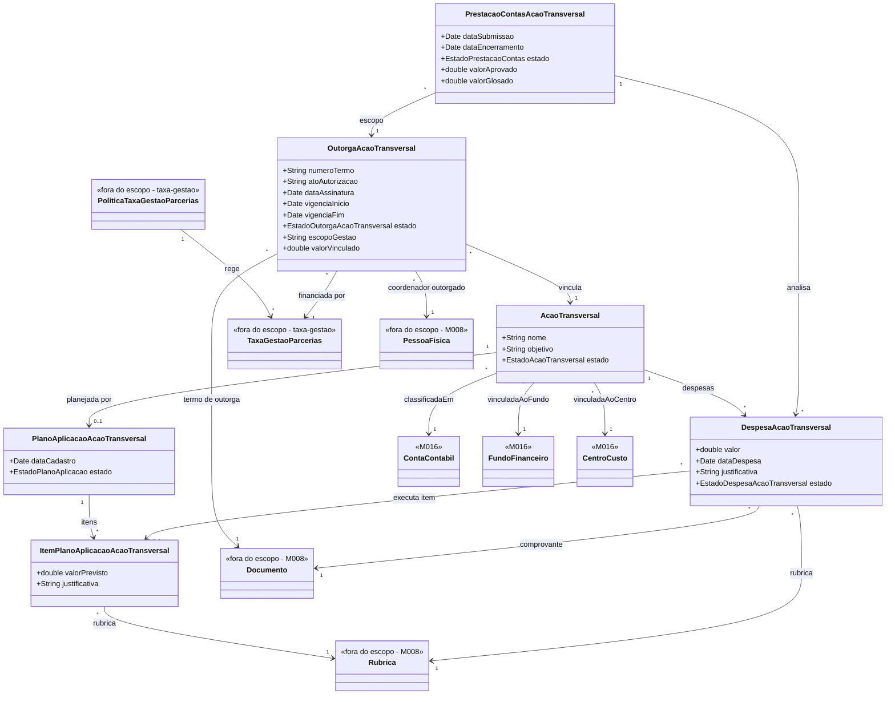

# Modelo - Acao Transversal

[<< Voltar para Acao Transversal](README.md)

Este modelo detalha a parte do M016 responsavel por **executar** os recursos custodiados de Acao Transversal: vincular a taxa de gestao a um projeto institucional, planejar a aplicacao, registrar despesas e prestar contas. O recebimento, a classificacao, o repasse e a politica da taxa **nao** sao modelados aqui; vivem no subdominio [taxa-gestao](../../taxa-gestao/modelo-estrutural.md).

## Decisao de Modelagem

O Coordenador Outorgado da Acao Transversal **nao** e uma pessoa unica global da FAPES. Ele e uma Pessoa Fisica vinculada a FAPES e designada por um Termo de Outorga para gerir um recurso delimitado de Acao Transversal, originado de uma `TaxaGestaoParcerias` ja recebida e repassada pela taxa-gestao.

Modelo conceitual:

```text
TaxaGestaoParcerias (taxa-gestao)
  -> OutorgaAcaoTransversal (link de financiamento, N:N)
  -> AcaoTransversal (projeto institucional interno)
  -> PessoaFisica vinculada a FAPES (coordenador outorgado)
```

Essa modelagem permite que:

- uma taxa de gestao financie uma ou mais Acoes Transversais via outorgas;
- a mesma pessoa da FAPES seja designada em mais de uma outorga;
- cada designacao mantenha rastreabilidade do TO, periodo, escopo, valor vinculado e responsabilidade de prestacao de contas.

## Conta Bancaria vs Conta Contabil

A execucao da Acao Transversal possui duas dimensoes financeiras complementares:

| Dimensao | Finalidade | Entidade do modelo |
|----------|------------|--------------------|
| Conta contabil | Classificar contabilmente a natureza da receita ou da despesa. | `ContaContabil` |
| Conta bancaria / conta corrente | Receber e movimentar dinheiro quando houver repasse da taxa ao Coordenador Outorgado. | `ContaBancaria` (M008) referenciada pela taxa-gestao |

A conta especifica indicada pela Resolucao CCAF nº 334/2023 (aberta pela FAPES, em nome do Coordenador Outorgado, no BANESTES) **nao** e modelada aqui. Ela e a `ContaBancaria` do M008 (`banco = BANESTES`) apontada por `TaxaGestaoParcerias.contaBancariaId` quando a taxa esta no estado `REPASSADA`, conforme [INV-TGP03](../../taxa-gestao/modelo-estrutural.md). A `OutorgaAcaoTransversal` apenas vincula o valor ja custodiado ao projeto; ela nao substitui `ContaContabil`, `FundoFinanceiro` ou `CentroCusto`.

Importante: "conta especifica" nao significa uma conta global para toda Acao Transversal, nem obriga automaticamente uma conta por parceria. A custodia bancaria e responsabilidade da taxa-gestao; a cardinalidade da outorga acompanha o escopo formal do Termo de Outorga.

## Diagrama de Classes



## Agregados

| Agregado | Entidades internas | Responsabilidade |
|----------|--------------------|------------------|
| `AcaoTransversal` | `PlanoAplicacaoAcaoTransversal`, `DespesaAcaoTransversal` | Controlar o ciclo de execucao do projeto institucional financiado pela taxa de gestao. |
| `OutorgaAcaoTransversal` | — | Vincular uma `TaxaGestaoParcerias` (taxa-gestao) a uma `AcaoTransversal`, rastreando TO, coordenador designado, escopo e valor vinculado. |
| `PrestacaoContasAcaoTransversal` | — | Analisar despesas, glosar, aprovar e encerrar a prestacao de contas no escopo da outorga. |

## Regras Estruturais

| ID | Regra |
|----|-------|
| RE-AT-01 | Toda `OutorgaAcaoTransversal` referencia exatamente uma `TaxaGestaoParcerias` (taxa-gestao) e exatamente uma `AcaoTransversal`. O vinculo Taxa<->Acao e N:N atraves das outorgas. |
| RE-AT-02 | A outorga registra `valorVinculado`, o montante da taxa custodiada destinado aquela acao. A soma dos valores vinculados a uma taxa observa [INV-TGP01](../../taxa-gestao/modelo-estrutural.md). |
| RE-AT-03 | Uma `OutorgaAcaoTransversal` sempre referencia exatamente uma PessoaFisica vinculada a FAPES como Coordenador Outorgado. |
| RE-AT-04 | O Coordenador Outorgado nao e global; sua designacao vale para o escopo definido no Termo de Outorga. |
| RE-AT-05 | A conta especifica BANESTES do repasse nao e modelada aqui; ela e a `ContaBancaria` (M008) referenciada por `TaxaGestaoParcerias.contaBancariaId` no estado `REPASSADA`, conforme [INV-TGP03](../../taxa-gestao/modelo-estrutural.md). |
| RE-AT-06 | O escopo da outorga acompanha o Termo de Outorga, nao uma configuracao global fixa. |
| RE-AT-07 | O plano de aplicacao e as despesas so podem usar rubricas permitidas pela politica vigente registrada na taxa-gestao (`PoliticaTaxaGestaoParcerias`). |
| RE-AT-08 | A prestacao de contas da Acao Transversal e institucional e nao substitui a prestacao de contas da iniciativa/projeto no M014. |
| RN-AT-01 | Quando `PrestacaoContasAcaoTransversal` for APROVADA, emite `PrestacaoAcaoTransversalSubmetida` (APROVADA); a taxa-gestao transita a `TaxaGestaoParcerias` para ENCERRADA. |

## Dicionario Resumido

| Classe | Definicao |
|--------|-----------|
| `AcaoTransversal` | Projeto institucional interno da FAPES financiado por recurso custodiado de taxa de gestao. Estados: EM_ELABORACAO -> ATIVA -> EM_PRESTACAO -> ENCERRADA. |
| `OutorgaAcaoTransversal` | Link de financiamento que vincula uma `TaxaGestaoParcerias` a uma `AcaoTransversal` e designa um servidor FAPES para gerir o recurso especifico. |
| `PlanoAplicacaoAcaoTransversal` | Planejamento de uso do recurso por rubricas permitidas. |
| `ItemPlanoAplicacaoAcaoTransversal` | Item do plano, com valor previsto e rubrica. |
| `DespesaAcaoTransversal` | Despesa institucional executada com recurso da acao. |
| `PrestacaoContasAcaoTransversal` | Processo de submissao, analise, glosa, aprovacao e encerramento da prestacao de contas institucional, no escopo da outorga. |
