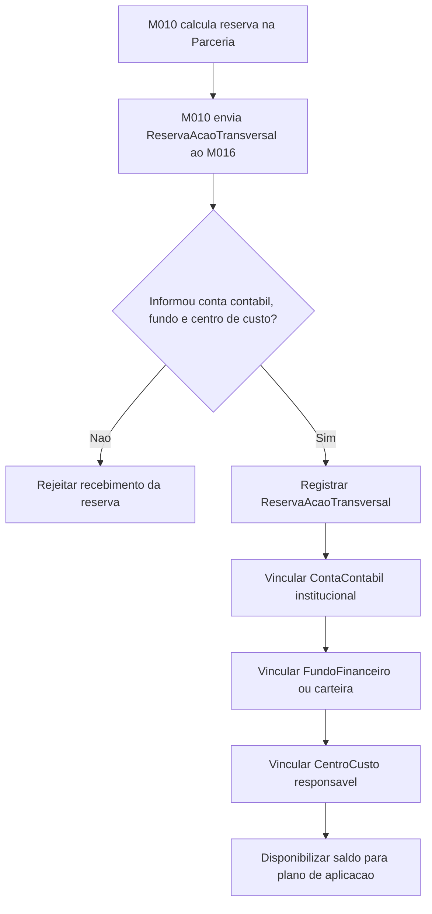
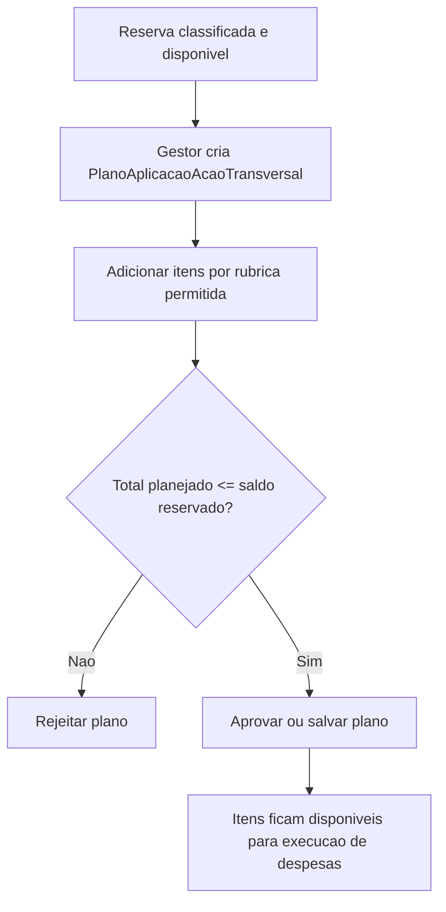
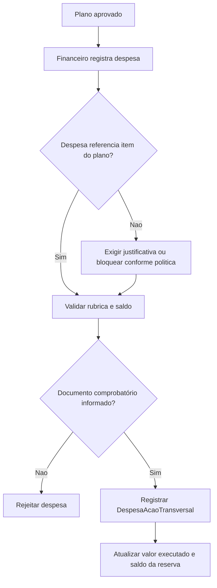
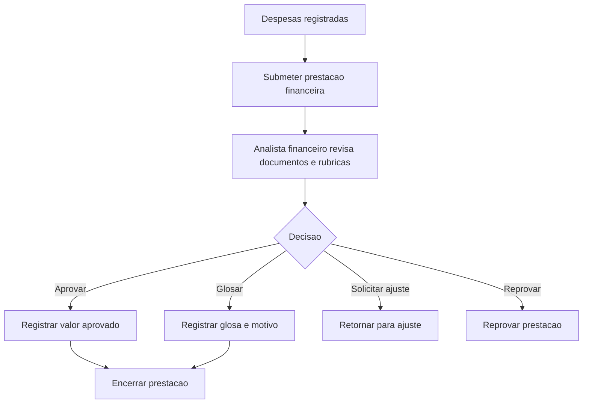

# Processo - Acao Transversal

[<< Voltar ao Subdominio](README.md) | [EPIC-M016-005](epics/EPIC-M016-005.md)

## Visao Geral

A Acao Transversal possui dois momentos financeiros diferentes:

1. **Entrada da reserva**: o valor calculado no M010 entra no M016 como recurso institucional reservado, classificado por conta contabil, fundo financeiro e centro de custo.
2. **Aplicacao da reserva**: o gestor financeiro planeja e executa o uso da reserva por rubricas permitidas.

Portanto, a reserva **nao cai diretamente em uma rubrica unica**. Ela primeiro e reconhecida contabilmente como recurso institucional da agencia. As rubricas aparecem no plano de aplicacao e nos lancamentos de despesa.

---

## Fluxo 1 - Receber e Classificar Reserva

### Atividades

| Passo | Atividade | Responsavel | Resultado |
|-------|-----------|-------------|-----------|
| 1 | Calcular reserva na Parceria | M010 | Reserva calculada sobre aporte original ou aditivo. |
| 2 | Enviar reserva ao M016 | M010 | Payload com parceria, aporte origem, politica, percentual e valor reservado. |
| 3 | Validar classificacao financeira | M016 | Conta contabil, fundo financeiro e centro de custo obrigatorios. |
| 4 | Registrar reserva | M016 | Reserva disponivel para plano de aplicacao. |

## Fluxo 2 - Plano de Aplicacao por Rubrica

### Atividades

| Passo | Atividade | Responsavel | Resultado |
|-------|-----------|-------------|-----------|
| 1 | Selecionar reserva | Gestor financeiro | Reserva com saldo disponivel. |
| 2 | Informar rubricas | Gestor financeiro | Itens do plano com `rubricaId`, valor previsto e justificativa. |
| 3 | Validar limite | M016 | Soma dos itens nao ultrapassa o valor reservado. |
| 4 | Validar rubricas permitidas | M016/M008 | Apenas rubricas habilitadas para Acao Transversal. |

## Fluxo 3 - Execucao de Despesa

### Atividades

| Passo | Atividade | Responsavel | Resultado |
|-------|-----------|-------------|-----------|
| 1 | Registrar despesa | Financeiro | Despesa vinculada a reserva e rubrica. |
| 2 | Vincular documento | Financeiro/M008 | Documento comprobatório associado. |
| 3 | Atualizar saldo | M016 | Valor executado e saldo da reserva recalculados. |
| 4 | Encaminhar para analise | M016 | Despesa fica disponivel para prestacao financeira institucional. |

## Fluxo 4 - Prestacao Financeira Institucional

### Atividades

| Passo | Atividade | Responsavel | Resultado |
|-------|-----------|-------------|-----------|
| 1 | Submeter prestacao | Gestor financeiro | Prestacao enviada para analise. |
| 2 | Analisar documentos | Analista financeiro | Despesas aprovadas, glosadas, ajustadas ou reprovadas. |
| 3 | Consolidar saldos | M016 | Totais aprovado, glosado, executado e saldo pendente. |
| 4 | Encerrar prestacao | Analista financeiro | Prestacao financeira institucional encerrada. |

## Regras de Fronteira

| Regra | Descricao |
|-------|-----------|
| Reserva contabil | A reserva entra em conta contabil/fundo/centro financeiro institucional no M016. |
| Rubrica de despesa | A rubrica e informada no plano de aplicacao e na despesa executada. |
| Sem M014 | A prestacao financeira institucional da Acao Transversal nao cria prestacao de contas de Iniciativa no M014. |
| Sem Programa | O Programa nao recebe nem recalcula a reserva de Acao Transversal. |
