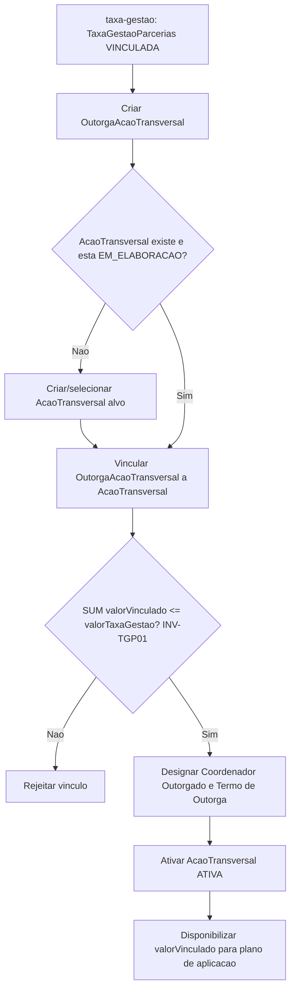
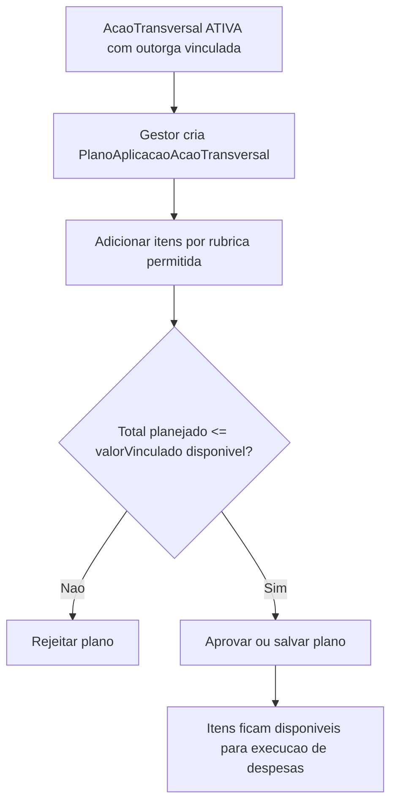
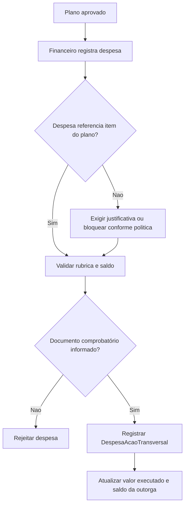
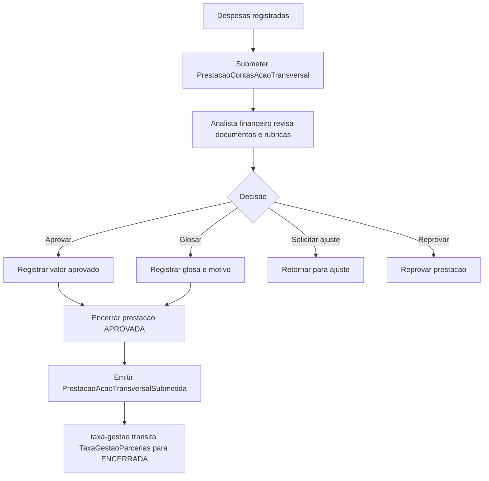

# Processo - Acao Transversal

[<< Voltar ao Subdominio](README.md) | [Epicos](epics/README.md)

## Visao Geral

Este subdominio cobre **apenas a execucao** dos recursos custodiados. O calculo, o recebimento, a classificacao e o repasse da `TaxaGestaoParcerias` sao do subdominio [taxa-gestao](../taxa-gestao/processo.md). A Acao Transversal entra em cena quando a taxa-gestao, no estado VINCULADA, cria a `OutorgaAcaoTransversal`.

A partir do vinculo, a Acao Transversal tem dois momentos:

1. **Vinculo do financiamento**: a taxa-gestao cria a `OutorgaAcaoTransversal` ligando a taxa custodiada a `AcaoTransversal`, que e ativada.
2. **Aplicacao do recurso**: o gestor financeiro planeja e executa o uso do valor custodiado por rubricas permitidas, dentro do escopo da outorga.

Portanto, o recurso custodiado **nao cai diretamente em uma rubrica unica**. As rubricas aparecem no plano de aplicacao e nos lancamentos de despesa.

---

## Fluxo 1 - Vincular Financiamento via Outorga

### Atividades

| Passo | Atividade | Responsavel | Resultado |
|-------|-----------|-------------|-----------|
| 1 | Custodiar e vincular a taxa | taxa-gestao (M016) | `TaxaGestaoParcerias` no estado VINCULADA. |
| 2 | Criar OutorgaAcaoTransversal | taxa-gestao / Acao Transversal | Outorga com `numeroTermo`, `valorVinculado`, `coordenadorOutorgado` e `termoOutorga`. |
| 3 | Validar limite do vinculo | Acao Transversal (M016) | `SUM(valorVinculado) <= TaxaGestaoParcerias.valorTaxaGestao` (INV-TGP01). |
| 4 | Ativar AcaoTransversal | Acao Transversal (M016) | `AcaoTransversal` ATIVA, valor disponivel para plano de aplicacao. |

## Fluxo 2 - Plano de Aplicacao por Rubrica

### Atividades

| Passo | Atividade | Responsavel | Resultado |
|-------|-----------|-------------|-----------|
| 1 | Selecionar outorga/acao | Gestor financeiro | Outorga com `valorVinculado` disponivel. |
| 2 | Informar rubricas | Gestor financeiro | Itens do plano com `rubricaId`, valor previsto e justificativa. |
| 3 | Validar limite | M016 | Soma dos itens nao ultrapassa o `valorVinculado` da outorga. |
| 4 | Validar rubricas permitidas | M016/M008 | Apenas rubricas habilitadas para Acao Transversal. |

## Fluxo 3 - Execucao de Despesa

### Atividades

| Passo | Atividade | Responsavel | Resultado |
|-------|-----------|-------------|-----------|
| 1 | Registrar despesa | Financeiro | Despesa vinculada a outorga e rubrica. |
| 2 | Vincular documento | Financeiro/M008 | Documento comprobatório associado. |
| 3 | Atualizar saldo | M016 | Valor executado e saldo da outorga recalculados. |
| 4 | Encaminhar para analise | M016 | Despesa fica disponivel para prestacao de contas institucional. |

## Fluxo 4 - Prestacao de Contas Institucional

### Atividades

| Passo | Atividade | Responsavel | Resultado |
|-------|-----------|-------------|-----------|
| 1 | Submeter prestacao | Gestor financeiro | `PrestacaoContasAcaoTransversal` enviada para analise (escopo = outorga). |
| 2 | Analisar documentos | Analista financeiro | Despesas aprovadas, glosadas, ajustadas ou reprovadas. |
| 3 | Consolidar saldos | M016 | Totais aprovado, glosado, executado e saldo pendente. |
| 4 | Encerrar prestacao | Analista financeiro | Prestacao APROVADA emite `PrestacaoAcaoTransversalSubmetida`; taxa-gestao encerra a `TaxaGestaoParcerias`. |

## Regras de Fronteira

| Regra | Descricao |
|-------|-----------|
| Custodia na taxa-gestao | O recebimento, a classificacao contabil e o repasse da taxa ocorrem na [taxa-gestao](../taxa-gestao/processo.md), nao aqui. |
| Vinculo via outorga | A Acao Transversal so opera recurso ligado por uma `OutorgaAcaoTransversal` (taxa VINCULADA). |
| Rubrica de despesa | A rubrica e informada no plano de aplicacao e na despesa executada. |
| Sem M014 | A prestacao de contas institucional da Acao Transversal nao cria prestacao de contas de Iniciativa no M014. |
| Sem Programa | O Programa nao recebe nem recalcula a taxa custodiada da Acao Transversal. |
