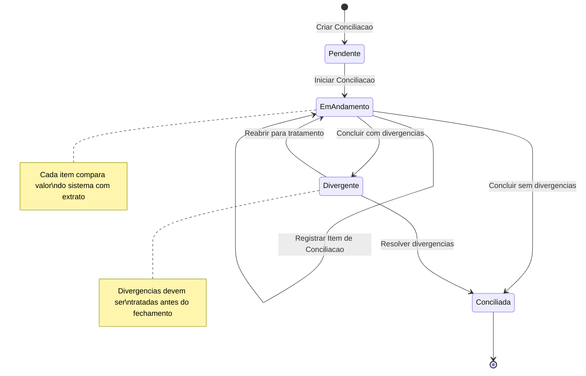
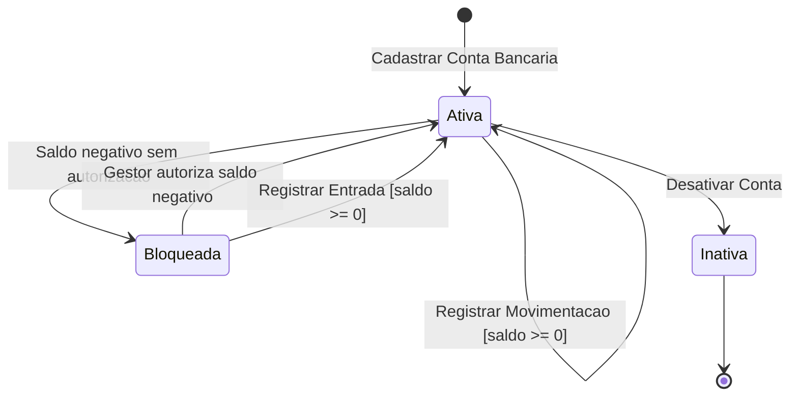
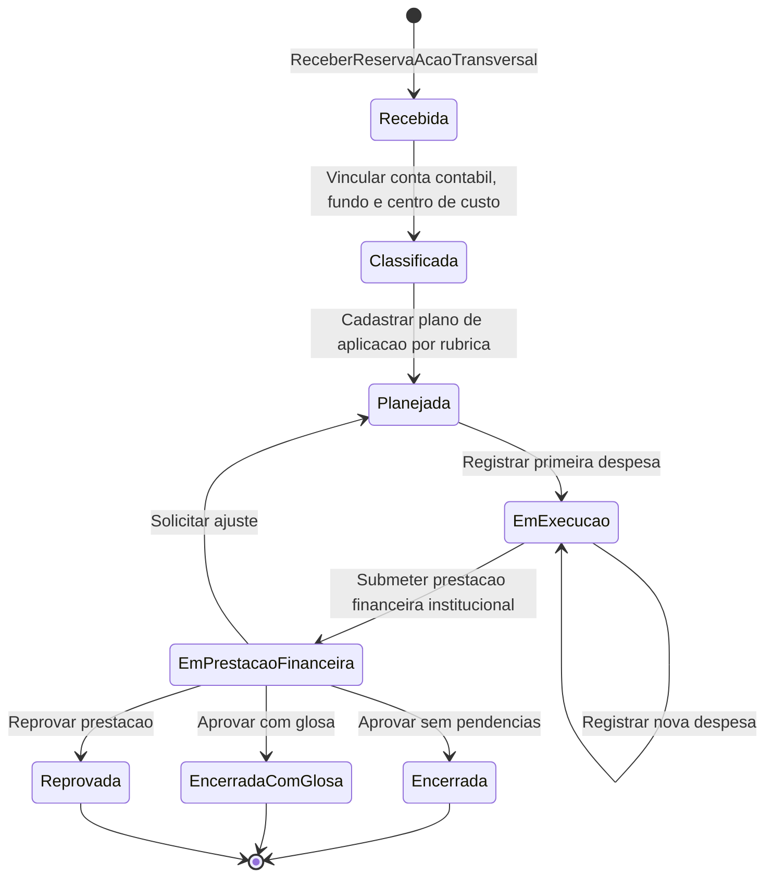
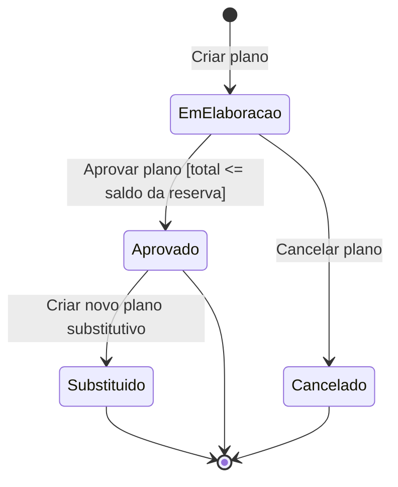

# Modelo Comportamental

Dominio e regras de negocio: ver [README.md](README.md)

### Ciclo de Vida: ConciliacaoBancaria

### Ciclo de Vida: ContaBancaria (Saldo)

### Ciclo de Vida: ReservaAcaoTransversal

### Ciclo de Vida: PlanoAplicacaoAcaoTransversal

