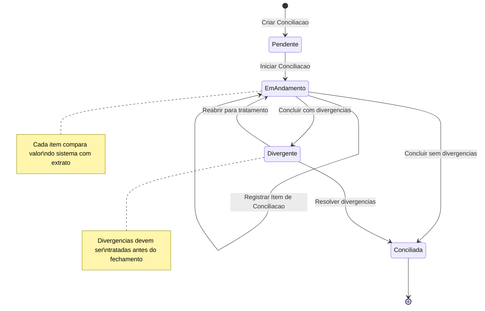
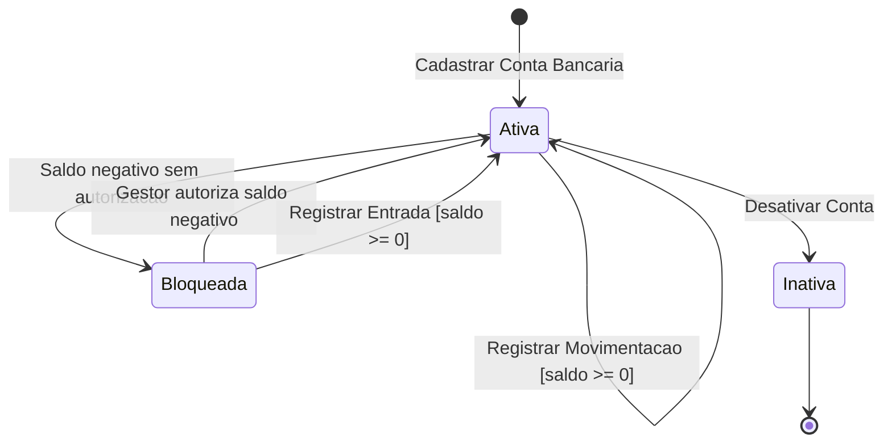

# Modelo Comportamental

Dominio e regras de negocio: ver [README.md](README.md)

> **Subdominios proprios.** O ciclo de vida da `TaxaGestaoParcerias` (CALCULADA -> CLASSIFICADA -> REPASSADA -> VINCULADA -> ENCERRADA) e da `VersaoPoliticaTaxaGestao` esta em [taxa-gestao/modelo-comportamental.md](taxa-gestao/modelo-comportamental.md). O ciclo da `AcaoTransversal`, `PlanoAplicacaoAcaoTransversal`, `DespesaAcaoTransversal` e `PrestacaoContasAcaoTransversal` esta em [acao-transversal/](acao-transversal/modelo/README.md). Este modelo cobre apenas o **nucleo contabil/financeiro** do M016.

### Ciclo de Vida: ConciliacaoBancaria

### Ciclo de Vida: ContaBancaria (Saldo)

> Os ciclos de vida da Taxa de Gestao de Parcerias e da Acao Transversal (incluindo `PlanoAplicacaoAcaoTransversal`) foram movidos para os respectivos subdominios — ver [taxa-gestao/modelo-comportamental.md](taxa-gestao/modelo-comportamental.md) e [acao-transversal/modelo/README.md](acao-transversal/modelo/README.md).
