# Modelo Estrutural

Dominio e regras de negocio: ver [README.md](README.md)

### Diagrama de Classes

```mermaid
classDiagram
    direction TB

    class ContaContabil {
        +String codigo
        +String nome
        +String descricao
        +TipoContaContabil tipo
        +NaturezaConta natureza
        +boolean ativa
    }

    class TipoContaContabil {
        <<enumeration>>
        ATIVO
        PASSIVO
        RECEITA
        DESPESA
        PATRIMONIO_LIQUIDO
    }

    class NaturezaConta {
        <<enumeration>>
        DEVEDORA
        CREDORA
    }

    class AssociacaoConta {
        +TipoAssociacao tipo
        +Date dataAssociacao
    }

    class TipoAssociacao {
        <<enumeration>>
        INICIATIVA
        PROGRAMA
        PARCERIA
    }

    class FundoFinanceiro {
        +String codigo
        +String nome
        +String descricao
        +EstadoFundo estado
    }

    class EstadoFundo {
        <<enumeration>>
        ATIVO
        INATIVO
    }

    class ContaBancaria {
        +String banco
        +String agencia
        +String numeroConta
        +String descricao
        +boolean ativa
    }

    class MovimentacaoFinanceira {
        +String codigo
        +TipoMovimentacaoFinanceira tipo
        +double valor
        +Date dataMovimentacao
        +String descricao
        +String responsavel
        +Date dataRegistro
    }

    class TipoMovimentacaoFinanceira {
        <<enumeration>>
        ENTRADA
        SAIDA
    }

    class ConciliacaoBancaria {
        +String codigo
        +Date dataInicio
        +Date dataFim
        +Date periodoInicio
        +Date periodoFim
        +EstadoConciliacao estado
        +String observacao
    }

    class EstadoConciliacao {
        <<enumeration>>
        PENDENTE
        EM_ANDAMENTO
        CONCILIADA
        DIVERGENTE
    }

    class ItemConciliacao {
        +double valorSistema
        +double valorExtrato
        +double diferenca
        +String observacao
        +boolean conciliado
    }

    class FluxoCaixa {
        +Date periodoInicio
        +Date periodoFim
        +double saldoInicial
        +double totalEntradas
        +double totalSaidas
        +double saldoFinal
    }

    class SaldoConta {
        +double saldoAtual
        +Date dataAtualizacao
    }

    class CentroCusto {
        +String codigo
        +String nome
        +String descricao
        +boolean ativo
    }

    class PoliticaAcaoTransversal {
        +String nome
        +String baseLegal
        +Date dataInicioVigencia
        +Date dataFimVigencia
        +boolean ativa
    }

    class FaixaAcaoTransversal {
        +double valorMinimo
        +double valorMaximo
        +double percentual
    }

    class ReservaAcaoTransversal {
        +String aporteFinanceiroOrigemId
        +TipoOrigemReservaAcaoTransversal tipoOrigem
        +double valorBaseCalculo
        +double percentualAplicado
        +double valorReservado
        +double valorExecutado
        +double saldo
        +Date dataCalculo
    }

    class OutorgaAcaoTransversal {
        +String numeroTermo
        +String atoAutorizacao
        +Date dataAssinatura
        +Date vigenciaInicio
        +Date vigenciaFim
        +EstadoOutorgaAcaoTransversal estado
        +String escopoGestao
    }

    class EstadoOutorgaAcaoTransversal {
        <<enumeration>>
        EM_ELABORACAO
        VIGENTE
        SUSPENSA
        ENCERRADA
        CANCELADA
    }

    class RepasseAcaoTransversal {
        +double valor
        +Date dataPrevista
        +Date dataRepasse
        +EstadoRepasseAcaoTransversal estado
        +String observacao
    }

    class EstadoRepasseAcaoTransversal {
        <<enumeration>>
        PREVISTO
        REPASSADO
        CANCELADO
    }

    class ContaBancariaAcaoTransversal {
        +String banco
        +String agencia
        +String numeroConta
        +String titular
        +String finalidade
        +boolean abertaPelaFapes
        +boolean ativa
    }

    class TipoOrigemReservaAcaoTransversal {
        <<enumeration>>
        APORTE_ORIGINAL
        APORTE_ADITIVO
        AJUSTE
    }

    class PlanoAplicacaoAcaoTransversal {
        +Date dataCadastro
        +EstadoPlanoAplicacao estado
    }

    class ItemPlanoAplicacaoAcaoTransversal {
        +double valorPrevisto
        +String justificativa
    }

    class DespesaAcaoTransversal {
        +double valor
        +Date dataDespesa
        +String justificativa
        +EstadoDespesaAcaoTransversal estado
    }

    class PrestacaoFinanceiraAcaoTransversal {
        +Date dataSubmissao
        +Date dataEncerramento
        +EstadoPrestacaoFinanceira estado
        +double valorAprovado
        +double valorGlosado
    }

    class Iniciativa {
        <<fora do escopo - M003>>
    }

    class Programa {
        <<fora do escopo - M010>>
    }

    class Parceria {
        <<fora do escopo - M010>>
    }

    class Rubrica {
        <<fora do escopo - M008>>
    }

    class Documento {
        <<fora do escopo - M008>>
    }

    class PessoaFisica {
        <<fora do escopo - M008>>
    }

    ContaContabil "1" --> "*" AssociacaoConta : associacoes
    ContaContabil "1" --> "*" ContaContabil : subcontas
    AssociacaoConta "*" --> "0..1" Iniciativa : iniciativa
    AssociacaoConta "*" --> "0..1" Programa : programa
    AssociacaoConta "*" --> "0..1" Parceria : parceria
    FundoFinanceiro "1" --> "*" ContaBancaria : alimentadoPor
    ContaBancaria "*" --> "0..1" Iniciativa : vinculada a
    ContaBancaria "*" --> "0..1" Programa : compartilhada por
    ContaBancaria "*" --> "0..1" Parceria : dedicada a
    ContaBancaria "1" --> "*" MovimentacaoFinanceira : movimentacoes
    ContaBancaria "1" --> "1" SaldoConta : saldo
    ContaBancaria "1" --> "*" ConciliacaoBancaria : conciliacoes
    ConciliacaoBancaria "1" --> "*" ItemConciliacao : itens
    ItemConciliacao "*" --> "0..1" MovimentacaoFinanceira : registro sistema
    MovimentacaoFinanceira "*" --> "1" ContaContabil : classificacao contabil
    FluxoCaixa "*" --> "1" ContaBancaria : conta
    PoliticaAcaoTransversal "1" --> "*" FaixaAcaoTransversal : faixas
    ReservaAcaoTransversal "*" --> "1" PoliticaAcaoTransversal : regra aplicada
    ReservaAcaoTransversal "*" --> "1" Parceria : origem
    ReservaAcaoTransversal "*" --> "1" ContaContabil : classificadaEm
    ReservaAcaoTransversal "*" --> "1" FundoFinanceiro : vinculadaAoFundo
    ReservaAcaoTransversal "*" --> "1" CentroCusto : vinculadaAoCentro
    ReservaAcaoTransversal "1" --> "0..*" OutorgaAcaoTransversal : outorgas
    OutorgaAcaoTransversal "*" --> "1" PessoaFisica : coordenador outorgado
    OutorgaAcaoTransversal "*" --> "1" Documento : termo de outorga
    OutorgaAcaoTransversal "1" --> "1" ContaBancariaAcaoTransversal : conta especifica
    OutorgaAcaoTransversal "1" --> "*" RepasseAcaoTransversal : repasses
    RepasseAcaoTransversal "*" --> "1" ReservaAcaoTransversal : consome reserva
    ReservaAcaoTransversal "1" --> "0..1" PlanoAplicacaoAcaoTransversal : planejada por
    PlanoAplicacaoAcaoTransversal "1" --> "*" ItemPlanoAplicacaoAcaoTransversal : itens
    ItemPlanoAplicacaoAcaoTransversal "*" --> "1" Rubrica : rubrica
    ReservaAcaoTransversal "1" --> "*" DespesaAcaoTransversal : despesas
    DespesaAcaoTransversal "*" --> "0..1" ItemPlanoAplicacaoAcaoTransversal : executaItem
    DespesaAcaoTransversal "*" --> "1" Rubrica : rubrica
    DespesaAcaoTransversal "*" --> "1" Documento : comprovante
    PrestacaoFinanceiraAcaoTransversal "1" --> "*" DespesaAcaoTransversal : analisa
```

## Dicionario de Dados

| Classe | Atributo | Definicao | Obrig. | Tipo | Dominio | Tamanho | Unico |
|--------|----------|-----------|--------|------|---------|---------|-------|
| **ContaContabil** | codigo | Codigo da conta seguindo estrutura do plano de contas do governo | Sim | String | Ex: 1.1.1.01 | 20 | Sim |
| | nome | Nome da conta contabil | Sim | String | Ex: Caixa e Equivalentes | 200 | |
| | descricao | Descricao da finalidade da conta | Sim | String | | 500 | |
| | tipo | Tipo da conta no plano de contas | Sim | TipoContaContabil | Ativo, Passivo, Receita, Despesa, Patrimonio Liquido | | |
| | natureza | Natureza da conta (devedora ou credora) | Sim | NaturezaConta | Devedora, Credora | | |
| | ativa | Indica se a conta esta ativa para lancamentos | Sim | Boolean | true/false | | |
| **AssociacaoConta** | tipo | Tipo da entidade associada a conta | Sim | TipoAssociacao | Iniciativa, Programa, Parceria | | |
| | dataAssociacao | Data em que a associacao foi realizada | Gerado | Date | | | |
| **FundoFinanceiro** | codigo | Codigo de identificacao unico do fundo | Gerado | String | Ex: FF-2026-001 | | Sim |
| | nome | Nome do fundo financeiro | Sim | String | Ex: Fundo de Pesquisa e Inovacao | 300 | |
| | descricao | Descricao da finalidade e origem do fundo | Sim | String | | 1000 | |
| | estado | Estado do fundo | Gerado | EstadoFundo | `ATIVO` / `INATIVO` | | |
| **ContaBancaria** | banco | Nome ou codigo do banco | Sim | String | Ex: Banco do Brasil, Banestes | 100 | |
| | agencia | Numero da agencia bancaria | Sim | String | Ex: 0001 | 10 | |
| | numeroConta | Numero da conta bancaria | Sim | String | Ex: 12345-6 | 20 | Sim |
| | descricao | Descricao da finalidade da conta | Sim | String | | 300 | |
| | ativa | Indica se a conta esta ativa | Sim | Boolean | true/false | | |
| **MovimentacaoFinanceira** | codigo | Codigo de identificacao unica da movimentacao | Gerado | String | Ex: MOV-2026-001 | | Sim |
| | tipo | Tipo da movimentacao (entrada ou saida) | Sim | TipoMovimentacaoFinanceira | Entrada, Saida | | |
| | valor | Valor monetario da movimentacao | Sim | Double | | | |
| | dataMovimentacao | Data efetiva da movimentacao | Sim | Date | | | |
| | descricao | Descricao da movimentacao | Sim | String | | 500 | |
| | responsavel | Usuario que registrou a movimentacao | Gerado | String | | 200 | |
| | dataRegistro | Data e hora do registro no sistema | Gerado | Date | | | |
| **ConciliacaoBancaria** | codigo | Codigo de identificacao da conciliacao | Gerado | String | Ex: CONC-2026-001 | | Sim |
| | dataInicio | Data de inicio da conciliacao | Gerado | Date | | | |
| | dataFim | Data de conclusao da conciliacao | Cond. | Date | Preenchida ao concluir | | |
| | periodoInicio | Inicio do periodo conciliado | Sim | Date | | | |
| | periodoFim | Fim do periodo conciliado | Sim | Date | | | |
| | estado | Estado da conciliacao no ciclo de vida | Gerado | EstadoConciliacao | Pendente, Em Andamento, Conciliada, Divergente | | |
| | observacao | Observacoes gerais sobre a conciliacao | Nao | String | | 1000 | |
| **ItemConciliacao** | valorSistema | Valor registrado no sistema | Sim | Double | | | |
| | valorExtrato | Valor correspondente no extrato bancario | Sim | Double | | | |
| | diferenca | Diferenca entre valor do sistema e valor do extrato | Gerado | Double | | | |
| | observacao | Observacao sobre o item de conciliacao | Nao | String | | 500 | |
| | conciliado | Indica se o item foi conciliado com sucesso | Sim | Boolean | true/false | | |
| **FluxoCaixa** | periodoInicio | Data de inicio do periodo do fluxo | Sim | Date | | | |
| | periodoFim | Data de fim do periodo do fluxo | Sim | Date | | | |
| | saldoInicial | Saldo no inicio do periodo | Gerado | Double | | | |
| | totalEntradas | Total de entradas no periodo | Gerado | Double | | | |
| | totalSaidas | Total de saidas no periodo | Gerado | Double | | | |
| | saldoFinal | Saldo no final do periodo | Gerado | Double | | | |
| **SaldoConta** | saldoAtual | Saldo atual da conta bancaria | Gerado | Double | | | |
| | dataAtualizacao | Data e hora da ultima atualizacao do saldo | Gerado | Date | | | |
| **CentroCusto** | codigo | Codigo do centro de custo institucional | Sim | String | Ex: CC-AT-001 | 50 | Sim |
| | nome | Nome do centro de custo | Sim | String | Ex: Gestao Institucional de Parcerias | 200 | |
| | descricao | Finalidade do centro de custo | Nao | String | | 500 | |
| | ativo | Indica se o centro de custo esta ativo | Sim | Boolean | | | |
| **PoliticaAcaoTransversal** | nome | Nome da politica normativa | Sim | String | Ex: Resolucao CCAF 334/2023 | 200 | |
| | baseLegal | Referencia normativa | Sim | String | | 300 | |
| | dataInicioVigencia | Inicio da vigencia da politica | Sim | Date | | | |
| | dataFimVigencia | Fim da vigencia da politica | Nao | Date | | | |
| | ativa | Indica se a politica pode ser usada pelo M010 | Sim | Boolean | | | |
| **FaixaAcaoTransversal** | valorMinimo | Limite inferior da faixa | Sim | Double | ≥ 0 | | |
| | valorMaximo | Limite superior da faixa; vazio para faixa aberta | Nao | Double | ≥ valorMinimo | | |
| | percentual | Percentual aplicado na faixa | Sim | Double | > 0 | | |
| **ReservaAcaoTransversal** | valorBaseCalculo | Valor bruto usado pelo M010 para calculo | Sim | Double | ≥ 0 | | |
| | aporteFinanceiroOrigemId | Identificador do AporteFinanceiro do M010 que originou a reserva | Sim | String | Aporte original ou aditivo | | |
| | tipoOrigem | Origem da reserva | Sim | TipoOrigemReservaAcaoTransversal | `APORTE_ORIGINAL`, `APORTE_ADITIVO`, `AJUSTE` | | |
| | percentualAplicado | Percentual selecionado pela politica | Sim | Double | > 0 | | |
| | valorReservado | Valor reservado para gestao financeira institucional | Sim | Double | ≥ 0 | | |
| | valorExecutado | Total de despesas registradas contra a reserva | Gerado | Double | ≥ 0 | | |
| | saldo | `valorReservado - valorExecutado` | Gerado | Double | ≥ 0 | | |
| | dataCalculo | Data em que o M010 calculou/enviou a reserva | Sim | Date | | | |
| | contaContabil (relacao) | Conta contabil institucional onde a reserva e reconhecida | Sim | FK → ContaContabil | Ex: Recursos de Acao Transversal | | |
| | fundoFinanceiro (relacao) | Fundo/carteira financeira que concentra a reserva | Sim | FK → FundoFinanceiro | | | |
| | centroCusto (relacao) | Centro de custo responsavel pela gestao institucional da reserva | Sim | FK → CentroCusto | | | |
| **OutorgaAcaoTransversal** | numeroTermo | Numero ou identificador do Termo de Outorga que autoriza a gestao do recurso | Sim | String | | 80 | Sim |
| | atoAutorizacao | Ato/decisao da Diretoria Executiva que autorizou a outorga | Sim | String | | 300 | |
| | dataAssinatura | Data de assinatura do Termo de Outorga | Sim | Date | | | |
| | vigenciaInicio | Inicio da autorizacao de gestao | Sim | Date | | | |
| | vigenciaFim | Fim da autorizacao de gestao | Sim | Date | >= vigenciaInicio | | |
| | estado | Estado da outorga | Gerado | EstadoOutorgaAcaoTransversal | EmElaboracao, Vigente, Suspensa, Encerrada, Cancelada | | |
| | escopoGestao | Texto que delimita o recurso, reserva, parceria ou finalidade abrangida pelo TO | Sim | String | | 1000 | |
| | coordenadorOutorgado (relacao) | Servidor publico vinculado a FAPES autorizado a gerir o recurso | Sim | FK → PessoaFisica (M008) | Deve possuir vinculo ativo com FAPES | | |
| | termoOutorga (relacao) | Documento formal do Termo de Outorga | Sim | FK → Documento (M008) | TipoDocumento = Termo de Outorga | | |
| **ContaBancariaAcaoTransversal** | banco | Banco da conta especifica | Sim | String | BANESTES | 100 | |
| | agencia | Agencia bancaria | Sim | String | | 10 | |
| | numeroConta | Numero da conta especifica | Sim | String | | 20 | Sim |
| | titular | Titular da conta, em nome do Coordenador Outorgado | Sim | String | | 200 | |
| | finalidade | Finalidade da conta especifica de Acao Transversal | Sim | String | | 300 | |
| | abertaPelaFapes | Indica que a conta foi aberta pela FAPES conforme Resolucao CCAF nº 334/2023 | Sim | Boolean | true | | |
| | ativa | Indica se a conta esta ativa para movimentacao | Sim | Boolean | | | |
| **RepasseAcaoTransversal** | valor | Valor repassado ao Coordenador Outorgado | Sim | Double | > 0 e <= saldo disponivel da reserva | | |
| | dataPrevista | Data prevista no cronograma de desembolso | Nao | Date | | | |
| | dataRepasse | Data efetiva do credito em conta especifica | Cond. | Date | Obrigatoria quando estado = Repassado | | |
| | estado | Estado do repasse | Gerado | EstadoRepasseAcaoTransversal | Previsto, Repassado, Cancelado | | |
| | observacao | Observacoes do repasse | Nao | String | | 1000 | |
| **PlanoAplicacaoAcaoTransversal** | dataCadastro | Data do plano | Gerado | Date | | | |
| | estado | Estado do plano | Gerado | EstadoPlanoAplicacao | EmElaboracao, Aprovado, Substituido | | |
| **ItemPlanoAplicacaoAcaoTransversal** | valorPrevisto | Valor previsto para a rubrica | Sim | Double | ≥ 0 | | |
| | justificativa | Justificativa da previsao de uso | Sim | String | | 1000 | |
| **DespesaAcaoTransversal** | valor | Valor da despesa institucional | Sim | Double | ≥ 0 | | |
| | dataDespesa | Data da despesa | Sim | Date | | | |
| | justificativa | Justificativa da despesa | Sim | String | | 1000 | |
| | estado | Estado da despesa | Gerado | EstadoDespesaAcaoTransversal | EmAnalise, Aprovada, Glosada, Reprovada | | |
| | itemPlanoAplicacao (relacao) | Item planejado que a despesa executa | Cond. | FK → ItemPlanoAplicacaoAcaoTransversal | Obrigatorio quando houver plano aprovado | | |
| **PrestacaoFinanceiraAcaoTransversal** | dataSubmissao | Data de envio para analise | Cond. | Date | | | |
| | dataEncerramento | Data de encerramento da analise | Cond. | Date | | | |
| | estado | Estado da prestacao financeira institucional | Gerado | EstadoPrestacaoFinanceira | Rascunho, EmAnalise, Aprovada, AprovadaComGlosa, Reprovada, Encerrada | | |
| | valorAprovado | Total aprovado | Gerado | Double | ≥ 0 | | |
| | valorGlosado | Total glosado | Gerado | Double | ≥ 0 | | |

## Notas de Implementacao

**Entidades externas:**
- Iniciativa: gerenciada por M003 (Gestao de Iniciativas Captadas) como abstracao estrutural de iniciativas apoiadas.
- Programa e Parceria: gerenciados por M010 (Planejamento e Estrategia).
- PessoaFisica, Rubrica e Documento: gerenciados por M008 (Cadastros Corporativos).

**Rubrica x movimentacao financeira:**
- `Rubrica` e referencia externa de classificacao orcamentaria/despesa.
- `MovimentacaoFinanceira` e fato financeiro de entrada ou saida em conta bancaria.
- Uma movimentacao pode ser classificada contabilmente por `ContaContabil` e conciliada com despesas classificadas por rubrica, mas a movimentacao nao deve ser modelada como rubrica.
- Na Acao Transversal, `ItemPlanoAplicacaoAcaoTransversal` e `DespesaAcaoTransversal` referenciam `Rubrica` para planejamento/classificacao; a movimentacao bancária continua sendo registrada separadamente.

**Navegabilidade:**
- Cardinalidade 1: atributo do tipo da classe destino (ex: MovimentacaoFinanceira.contaContabil: ContaContabil)
- Cardinalidade N: atributo lista do tipo da classe destino (ex: ContaBancaria.movimentacoes: List<MovimentacaoFinanceira>)
