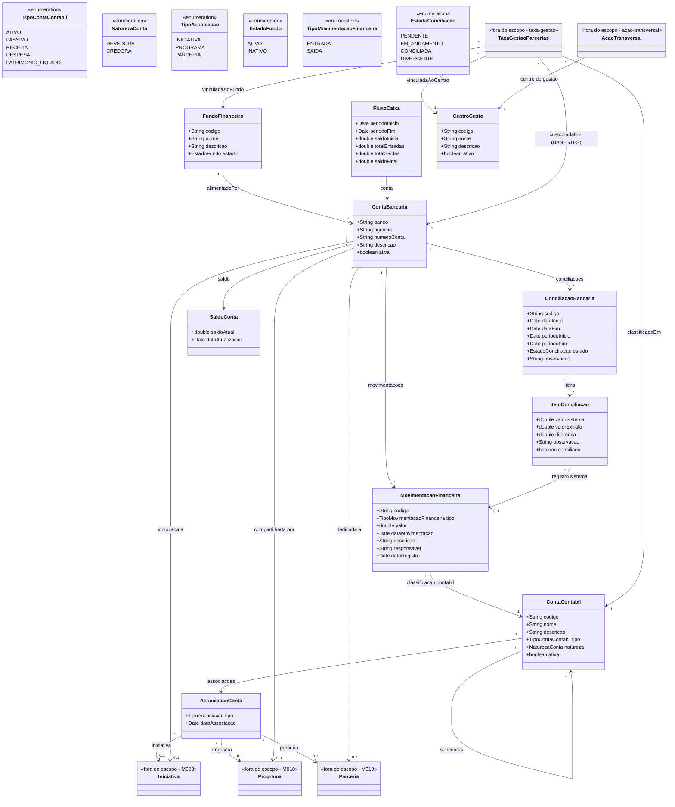

# Modelo Estrutural

Dominio e regras de negocio: ver [README.md](README.md)

> **Subdominios proprios.** A Taxa de Gestao de Parcerias (politica, versoes, faixas, recebimento, classificacao, repasse e custodia) vive em [taxa-gestao/](taxa-gestao/modelo-estrutural.md). A execucao dos recursos custodiados (Acao Transversal: outorga, plano de aplicacao, despesa, prestacao) vive em [acao-transversal/](acao-transversal/modelo/README.md). Este modelo cobre apenas o **nucleo contabil e financeiro** do M016, consumido por ambos.

### Diagrama de Classes

## Dicionario de Dados

| Classe | Atributo | Definicao | Obrig. | Tipo | Dominio | Tamanho | Unico |
|--------|----------|-----------|--------|------|---------|---------|-------|
| **ContaContabil** | codigo | Codigo da conta seguindo estrutura do plano de contas do governo | Sim | String | Ex: 1.1.1.01 | 20 | Sim |
| | nome | Nome da conta contabil | Sim | String | Ex: Caixa e Equivalentes | 200 | |
| | descricao | Descricao da finalidade da conta | Sim | String | | 500 | |
| | tipo | Tipo da conta no plano de contas | Sim | TipoContaContabil | Ativo, Passivo, Receita, Despesa, Patrimonio Liquido | | |
| | natureza | Natureza da conta (devedora ou credora) | Sim | NaturezaConta | Devedora, Credora | | |
| | ativa | Indica se a conta esta ativa para lancamentos | Sim | Boolean | true/false | | |
| **AssociacaoConta** | tipo | Tipo da entidade associada a conta | Sim | TipoAssociacao | Iniciativa, Programa, Parceria | | |
| | dataAssociacao | Data em que a associacao foi realizada | Gerado | Date | | | |
| **FundoFinanceiro** | codigo | Codigo de identificacao unico do fundo | Gerado | String | Ex: FF-2026-001 | | Sim |
| | nome | Nome do fundo financeiro | Sim | String | Ex: Fundo de Pesquisa e Inovacao | 300 | |
| | descricao | Descricao da finalidade e origem do fundo | Sim | String | | 1000 | |
| | estado | Estado do fundo | Gerado | EstadoFundo | `ATIVO` / `INATIVO` | | |
| **ContaBancaria** | banco | Nome ou codigo do banco | Sim | String | Ex: Banco do Brasil, Banestes | 100 | |
| | agencia | Numero da agencia bancaria | Sim | String | Ex: 0001 | 10 | |
| | numeroConta | Numero da conta bancaria | Sim | String | Ex: 12345-6 | 20 | Sim |
| | descricao | Descricao da finalidade da conta | Sim | String | | 300 | |
| | ativa | Indica se a conta esta ativa | Sim | Boolean | true/false | | |
| **MovimentacaoFinanceira** | codigo | Codigo de identificacao unica da movimentacao | Gerado | String | Ex: MOV-2026-001 | | Sim |
| | tipo | Tipo da movimentacao (entrada ou saida) | Sim | TipoMovimentacaoFinanceira | Entrada, Saida | | |
| | valor | Valor monetario da movimentacao | Sim | Double | | | |
| | dataMovimentacao | Data efetiva da movimentacao | Sim | Date | | | |
| | descricao | Descricao da movimentacao | Sim | String | | 500 | |
| | responsavel | Usuario que registrou a movimentacao | Gerado | String | | 200 | |
| | dataRegistro | Data e hora do registro no sistema | Gerado | Date | | | |
| **ConciliacaoBancaria** | codigo | Codigo de identificacao da conciliacao | Gerado | String | Ex: CONC-2026-001 | | Sim |
| | dataInicio | Data de inicio da conciliacao | Gerado | Date | | | |
| | dataFim | Data de conclusao da conciliacao | Cond. | Date | Preenchida ao concluir | | |
| | periodoInicio | Inicio do periodo conciliado | Sim | Date | | | |
| | periodoFim | Fim do periodo conciliado | Sim | Date | | | |
| | estado | Estado da conciliacao no ciclo de vida | Gerado | EstadoConciliacao | Pendente, Em Andamento, Conciliada, Divergente | | |
| | observacao | Observacoes gerais sobre a conciliacao | Nao | String | | 1000 | |
| **ItemConciliacao** | valorSistema | Valor registrado no sistema | Sim | Double | | | |
| | valorExtrato | Valor correspondente no extrato bancario | Sim | Double | | | |
| | diferenca | Diferenca entre valor do sistema e valor do extrato | Gerado | Double | | | |
| | observacao | Observacao sobre o item de conciliacao | Nao | String | | 500 | |
| | conciliado | Indica se o item foi conciliado com sucesso | Sim | Boolean | true/false | | |
| **FluxoCaixa** | periodoInicio | Data de inicio do periodo do fluxo | Sim | Date | | | |
| | periodoFim | Data de fim do periodo do fluxo | Sim | Date | | | |
| | saldoInicial | Saldo no inicio do periodo | Gerado | Double | | | |
| | totalEntradas | Total de entradas no periodo | Gerado | Double | | | |
| | totalSaidas | Total de saidas no periodo | Gerado | Double | | | |
| | saldoFinal | Saldo no final do periodo | Gerado | Double | | | |
| **SaldoConta** | saldoAtual | Saldo atual da conta bancaria | Gerado | Double | | | |
| | dataAtualizacao | Data e hora da ultima atualizacao do saldo | Gerado | Date | | | |
| **CentroCusto** | codigo | Codigo do centro de custo institucional | Sim | String | Ex: CC-AT-001 | 50 | Sim |
| | nome | Nome do centro de custo | Sim | String | Ex: Gestao Institucional de Parcerias | 200 | |
| | descricao | Finalidade do centro de custo | Nao | String | | 500 | |
| | ativo | Indica se o centro de custo esta ativo | Sim | Boolean | | | |

## Modelo dos Subdominios

O modelo da Taxa de Gestao de Parcerias e da Acao Transversal nao vive aqui — cada subdominio tem o seu, com snapshot, estados e invariantes proprios:

| Subdominio | Modelo | Entidades principais |
|------------|--------|----------------------|
| Taxa de Gestao de Parcerias | [taxa-gestao/modelo-estrutural.md](taxa-gestao/modelo-estrutural.md) | `PoliticaTaxaGestaoParcerias`, `VersaoPoliticaTaxaGestao`, `FaixaPercentualTaxaGestao`, `VersaoFaixaPercentual`, `TaxaGestaoParcerias`, `ClassificacaoContabilTGP` |
| Acao Transversal | [acao-transversal/modelo/README.md](acao-transversal/modelo/README.md) | `AcaoTransversal`, `OutorgaAcaoTransversal`, `PlanoAplicacaoAcaoTransversal`, `DespesaAcaoTransversal`, `PrestacaoContasAcaoTransversal` |

Ambos consomem o nucleo contabil deste modelo: `ContaContabil`, `FundoFinanceiro`, `CentroCusto` e `ContaBancaria` (BANESTES para repasse da taxa — INV-TGP03).

## Notas de Implementacao

**Entidades externas:**
- Iniciativa: gerenciada por M003 (Gestao de Iniciativas Captadas) como abstracao estrutural de iniciativas apoiadas.
- Programa e Parceria: gerenciados por M010 (Planejamento e Estrategia).
- PessoaFisica, Rubrica e Documento: gerenciados por M008 (Cadastros Corporativos); usados pelos subdominios taxa-gestao e acao-transversal.

**Rubrica x movimentacao financeira:**
- `Rubrica` e referencia externa de classificacao orcamentaria/despesa.
- `MovimentacaoFinanceira` e fato financeiro de entrada ou saida em conta bancaria.
- Uma movimentacao pode ser classificada contabilmente por `ContaContabil` e conciliada com despesas classificadas por rubrica, mas a movimentacao nao deve ser modelada como rubrica.

**Navegabilidade:**
- Cardinalidade 1: atributo do tipo da classe destino (ex: MovimentacaoFinanceira.contaContabil: ContaContabil)
- Cardinalidade N: atributo lista do tipo da classe destino (ex: ContaBancaria.movimentacoes: List<MovimentacaoFinanceira>)
