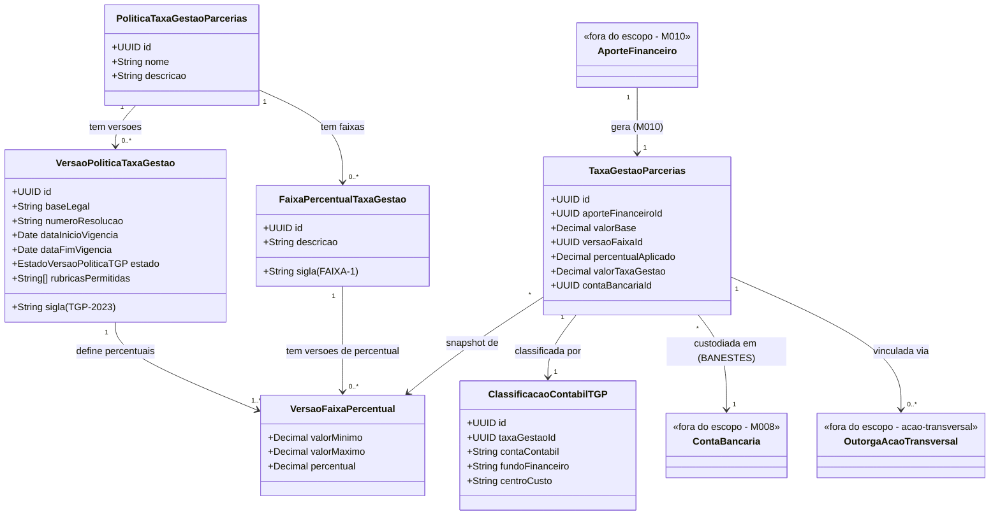

# Modelo Estrutural — Taxa de Gestao de Parcerias

[<< Voltar ao Subdominio](README.md) | [Comportamental](modelo-comportamental.md)

---

## Escopo

Classes, atributos e relacionamentos do subdominio **Taxa de Gestao de Parcerias** (M016). Cobre a politica parametrizavel (master + versoes + faixas), a taxa retida com snapshot imutavel, sua classificacao contabil e a custodia em conta BANESTES.

A taxa e **calculada pelo M010** no registro do `AporteFinanceiro` e recebida aqui via evento. A entidade `AporteFinanceiro` (M010) e `ContaBancaria` (M008) aparecem apenas como fronteira. Fonte canonica: [ontology.yaml](ontology.yaml).

---

## Diagrama de Classes



---

## Modelo de Versioning

Mesmo padrao de `ModalidadeBolsa/VersaoModalidade` do M001: **entidade master estavel + versoes temporalmente delimitadas por Resolucao**. Quando uma nova Resolucao altera percentuais, cria-se nova `VersaoPoliticaTaxaGestao` e encerra-se a anterior. Somente uma versao VIGENTE por vez (INV-TGP04). Taxas ja calculadas mantem snapshot imutavel — sem recalculo retroativo.

```
PoliticaTaxaGestaoParcerias          ← master estavel (sem percentuais, sem vigencia)
│
├── VersaoPoliticaTaxaGestao         ← versao por Resolucao (sigla, baseLegal, vigencia, estado)
│    └── VersaoFaixaPercentual       ← percentual por faixa por versao (→ FaixaPercentualTaxaGestao)
│
└── FaixaPercentualTaxaGestao        ← faixa master estavel (FAIXA-1, FAIXA-2, FAIXA-3)
```

---

## Entidades

### PoliticaTaxaGestaoParcerias (master)

| Atributo | Descricao | Obrigatorio | Tipo | Regra |
|----------|-----------|-------------|------|-------|
| id | Identificador | Sim | UUID | Gerado |
| nome | Nome da politica (ex: Taxa de Gestao de Parcerias FAPES) | Sim | String | |
| descricao | Descricao da politica | Sim | String | |
| versoes | Versoes vigentes e encerradas | Nao | 1:N → VersaoPoliticaTaxaGestao | Somente uma VIGENTE (INV-TGP04) |

### VersaoPoliticaTaxaGestao

| Atributo | Descricao | Obrigatorio | Tipo | Regra |
|----------|-----------|-------------|------|-------|
| id | Identificador | Sim | UUID | Gerado |
| sigla | Sigla unica (ex: TGP-2023, TGP-2024a) | Nao | String | Gerada, unica |
| baseLegal | Base normativa (ex: Resolucao CCAF n. 334/2023) | Sim | String | |
| numeroResolucao | Numero da resolucao | Sim | String | |
| dataInicioVigencia | Inicio da vigencia | Sim | Date | |
| dataFimVigencia | Fim da vigencia; `null` = sem prazo | Nao | Date | Posterior ao inicio (INV-TGP09) |
| estado | VIGENTE \| ENCERRADA \| REVOGADA | Sim | enum | Derivado de datas |
| rubricasPermitidas | Codigos de rubricas autorizadas para despesas das AcoesTransversais | Sim | String[] | |
| faixas | Faixas de percentual desta versao | Sim | 1:N → VersaoFaixaPercentual | >= 1 antes de ativar (INV-TGP11) |

### FaixaPercentualTaxaGestao (master)

| Atributo | Descricao | Obrigatorio | Tipo | Regra |
|----------|-----------|-------------|------|-------|
| id | Identificador | Sim | UUID | Gerado |
| sigla | Ex: FAIXA-1, FAIXA-2, FAIXA-3 | Sim | String | Unica na politica |
| descricao | Ex: "Ate R$ 2.000.000" | Sim | String | |

### VersaoFaixaPercentual

| Atributo | Descricao | Obrigatorio | Tipo | Regra |
|----------|-----------|-------------|------|-------|
| valorMinimo | Limite inferior do aporte (inclusivo) | Sim | Decimal | < valorMaximo (INV-TGP07) |
| valorMaximo | Limite superior (inclusivo); `null` = sem teto | Nao | Decimal | Faixas disjuntas (INV-TGP08) |
| percentual | Percentual aplicavel (ex: 0.05 = 5%) | Sim | Decimal | |
| faixa | Faixa master | Sim | N:1 → FaixaPercentualTaxaGestao | |
| versaoPolitica | Versao a que pertence | Sim | N:1 → VersaoPoliticaTaxaGestao | |

### TaxaGestaoParcerias (snapshot imutavel)

| Atributo | Descricao | Obrigatorio | Tipo | Regra |
|----------|-----------|-------------|------|-------|
| id | Identificador | Sim | UUID | Gerado |
| aporteFinanceiroId | AporteFinanceiro (M010) que originou a taxa; chave de idempotencia | Sim | UUID | Parceria e isAditivo derivam dele |
| valorBase | Valor do aporte usado como base de calculo | Sim | Decimal | > 0 (INV-TGP10); congelado |
| versaoFaixaId | VersaoFaixaPercentual aplicada (imutavel); dela derivam versao da politica, faixa e siglas | Sim | UUID | Imutavel (INV-TGP06) |
| percentualAplicado | Percentual congelado no calculo | Sim | Decimal | Imutavel (INV-TGP05) |
| valorTaxaGestao | Valor retido congelado = `valorBase * percentualAplicado` | Sim | Decimal | AX-TGP01; imutavel (INV-TGP05) |
| contaBancariaId | ContaBancaria BANESTES (M008) no repasse | Nao | UUID | banco = BANESTES (INV-TGP03) |

> **Sem campo de estado.** A `TaxaGestaoParcerias` nao tem maquina de estados. O progresso e **derivado de fatos**: classificada (existe `ClassificacaoContabilTGP`), repassada (`contaBancariaId` preenchido), vinculada (existe `OutorgaAcaoTransversal`), encerrada (prestacao da AcaoTransversal vinculada aprovada).

> **Atributos derivados (nao armazenados):** `parceriaId` e `isAditivo` vem do `aporteFinanceiroId` (AporteFinanceiro do M010); `versaoPoliticaId`, a faixa e as siglas `versaoPoliticaSigla`/`faixaSigla` vem de `versaoFaixaId` (VersaoFaixaPercentual imutavel). O modelo guarda apenas o minimo para congelar o calculo e auditar via referencia imutavel.

### ClassificacaoContabilTGP

| Atributo | Descricao | Obrigatorio | Tipo | Regra |
|----------|-----------|-------------|------|-------|
| id | Identificador | Sim | UUID | Gerado |
| taxaGestaoId | Taxa classificada | Sim | UUID | 1:1 |
| contaContabil | Conta do plano de contas FAPES | Sim | String | Formato a definir |
| fundoFinanceiro | Codigo de fundo | Sim | String | Codigos a definir |
| centroCusto | Centro de custo institucional | Sim | String | Estrutura a definir |

---

## Glossario de Dados

| Termo | Definicao |
|-------|-----------|
| **PoliticaTaxaGestaoParcerias** | Politica master estavel. Nao guarda percentuais nem vigencia — esses ficam nas versoes. |
| **VersaoPoliticaTaxaGestao** | Versao da politica criada por uma Resolucao; tem vigencia (`dataInicioVigencia`/`dataFimVigencia`) e estado. Somente uma VIGENTE por vez (INV-TGP04). |
| **FaixaPercentualTaxaGestao** | Faixa master estavel (FAIXA-1, FAIXA-2, FAIXA-3); sem percentual. |
| **VersaoFaixaPercentual** | Percentual de uma faixa para uma versao da politica. Alvo do snapshot da taxa. |
| **TaxaGestaoParcerias** | Valor retido sobre um `AporteFinanceiro` de uma Parceria. Snapshot imutavel da regra aplicada. |
| **ClassificacaoContabilTGP** | Classificacao da taxa em conta contabil, fundo financeiro e centro de custo. |
| **valorBase** | Valor do aporte usado como base de calculo da taxa. Congelado no momento do aporte. |
| **percentualAplicado** | Percentual da faixa vigente, congelado no calculo (ex: 0.05 = 5%). |
| **valorTaxaGestao** | Valor retido congelado = `valorBase * percentualAplicado`. |
| **snapshot imutavel** | `versaoFaixaId`, `percentualAplicado`, `valorBase` e `valorTaxaGestao` nao mudam apos a criacao (INV-TGP05, INV-TGP06); nova Resolucao nao recalcula taxas antigas (AX-TGP05). |
| **versaoPoliticaId / versaoPoliticaSigla / faixaSigla** | **Derivados** de `versaoFaixaId` (VersaoFaixaPercentual imutavel) — nao armazenados na taxa. |
| **progresso** (TaxaGestaoParcerias) | **Derivado de fatos** (sem campo estado): classificada (tem ClassificacaoContabilTGP), repassada (tem contaBancariaId), vinculada (tem OutorgaAcaoTransversal), encerrada (prestacao da AT aprovada). |
| **isAditivo** | **Derivado** do `AporteFinanceiro` (via `aporteFinanceiroId`) — nao armazenado. |
| **rubricasPermitidas** | Codigos de rubricas autorizadas para despesas das Acoes Transversais na versao da politica. |
| **contaBancariaId** | Conta BANESTES (M008) usada no repasse da taxa (INV-TGP03). |
| **aporteFinanceiroId** | Referencia ao `AporteFinanceiro` (M010) que originou a taxa. A `Parceria` deriva dele. |

---

## Relacionamentos

| De | Relacao | Para | Cardinalidade |
|----|---------|------|---------------|
| PoliticaTaxaGestaoParcerias | tem versoes | VersaoPoliticaTaxaGestao | 1:N (uma VIGENTE — INV-TGP04) |
| PoliticaTaxaGestaoParcerias | tem faixas master | FaixaPercentualTaxaGestao | 1:N |
| VersaoPoliticaTaxaGestao | define percentuais | VersaoFaixaPercentual | 1:N |
| FaixaPercentualTaxaGestao | tem versoes de percentual | VersaoFaixaPercentual | 1:N |
| TaxaGestaoParcerias | snapshot de | VersaoFaixaPercentual | N:1 (imutavel) |
| ClassificacaoContabilTGP | classifica | TaxaGestaoParcerias | 1:1 |
| TaxaGestaoParcerias | custodiada em | `M008/ContaBancaria` (BANESTES) | N:1 |
| `M010/AporteFinanceiro` | gera | TaxaGestaoParcerias | 1:1 |
| TaxaGestaoParcerias | vinculada via | `acao-transversal/OutorgaAcaoTransversal` | N:N |

---

## Calculo da Taxa (AX-TGP01, AX-TGP04)

```
versaoVigente = VersaoPoliticaTaxaGestao WHERE estado = VIGENTE
                  AND dataInicioVigencia <= aporte.dataAporte
                  AND (dataFimVigencia IS NULL OR dataFimVigencia >= aporte.dataAporte)

faixa = versaoVigente.faixas.firstWhere(f =>
          aporte.valorInvestido >= f.valorMinimo
          AND (f.valorMaximo IS NULL OR aporte.valorInvestido <= f.valorMaximo))

TaxaGestaoParcerias.percentualAplicado = faixa.percentual
TaxaGestaoParcerias.valorTaxaGestao    = valorBase * percentualAplicado
```

Percentuais **nunca** sao hardcoded — vem sempre da `VersaoFaixaPercentual` da versao VIGENTE.

---

## Invariantes

| ID | Regra |
|----|-------|
| INV-TGP01 | `SUM(OutorgaAcaoTransversal.valorVinculado) <= TaxaGestaoParcerias.valorTaxaGestao`. |
| INV-TGP03 | ContaBancaria de repasse deve ser BANESTES (Resolucao CCAF 334/2023). |
| INV-TGP04 | Somente uma `VersaoPoliticaTaxaGestao` VIGENTE simultaneamente. |
| INV-TGP05 | `percentualAplicado`, `valorBase` e `valorTaxaGestao` imutaveis apos criacao (versao da faixa via INV-TGP06). |
| INV-TGP06 | `TaxaGestaoParcerias.versaoFaixaId` imutavel apos criacao. |
| INV-TGP07 | `valorMinimo < valorMaximo` OR `valorMaximo IS NULL`. |
| INV-TGP08 | Faixas de uma mesma versao nao podem se sobrepor (ranges disjuntos). |
| INV-TGP09 | `dataInicioVigencia < dataFimVigencia` OR `dataFimVigencia IS NULL`. |
| INV-TGP10 | `TaxaGestaoParcerias.valorBase > 0`. |
| INV-TGP11 | Versao deve ter >= 1 `VersaoFaixaPercentual` antes de VIGENTE. |

---

## Fronteiras

| Contexto | Responsabilidade |
|----------|------------------|
| `M010/parcerias` | Calcula a taxa, emite `TaxaGestaoParceriasCalculada`, bloqueia `valorTaxaGestao` do `saldoAlocavelEmProgramas`. |
| `M008/instituicoes` | Fornece `ContaBancaria` BANESTES (INV-TGP03). |
| `acao-transversal/` | Consome os recursos custodiados via `OutorgaAcaoTransversal` + `AcaoTransversal`. |
