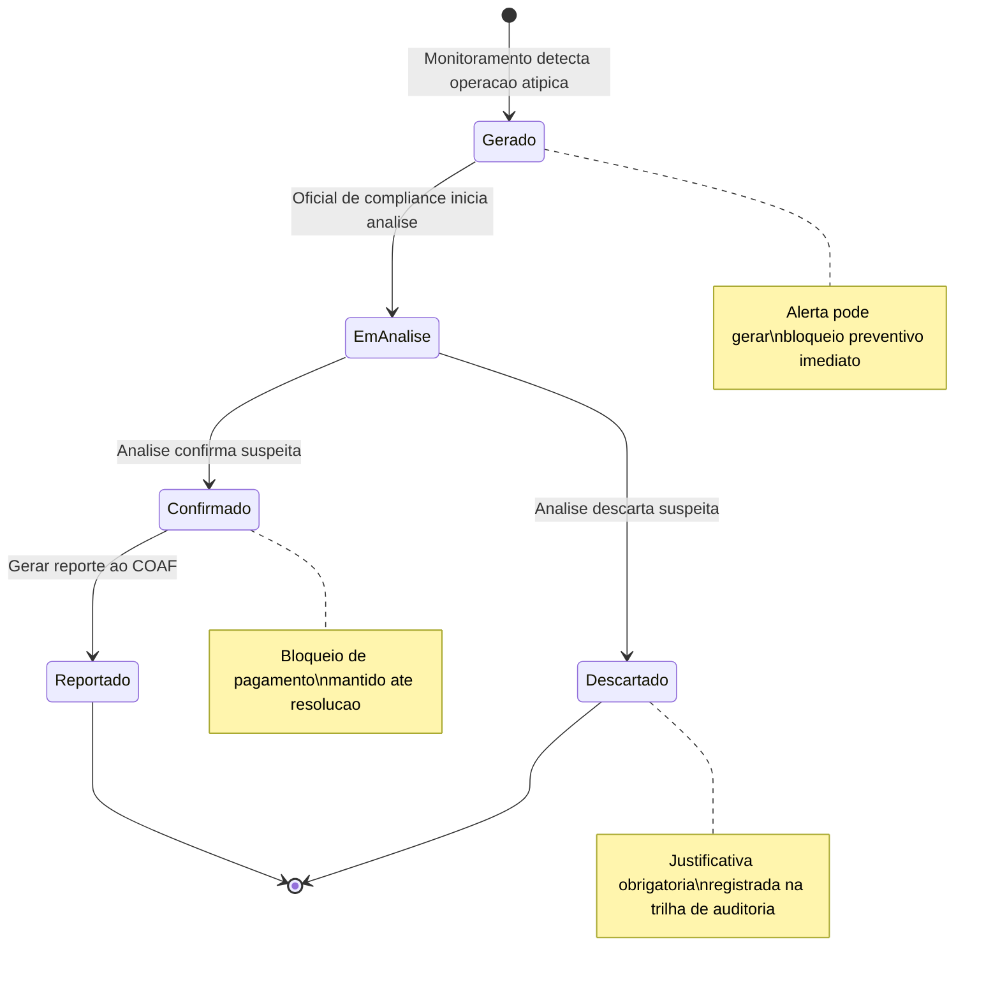
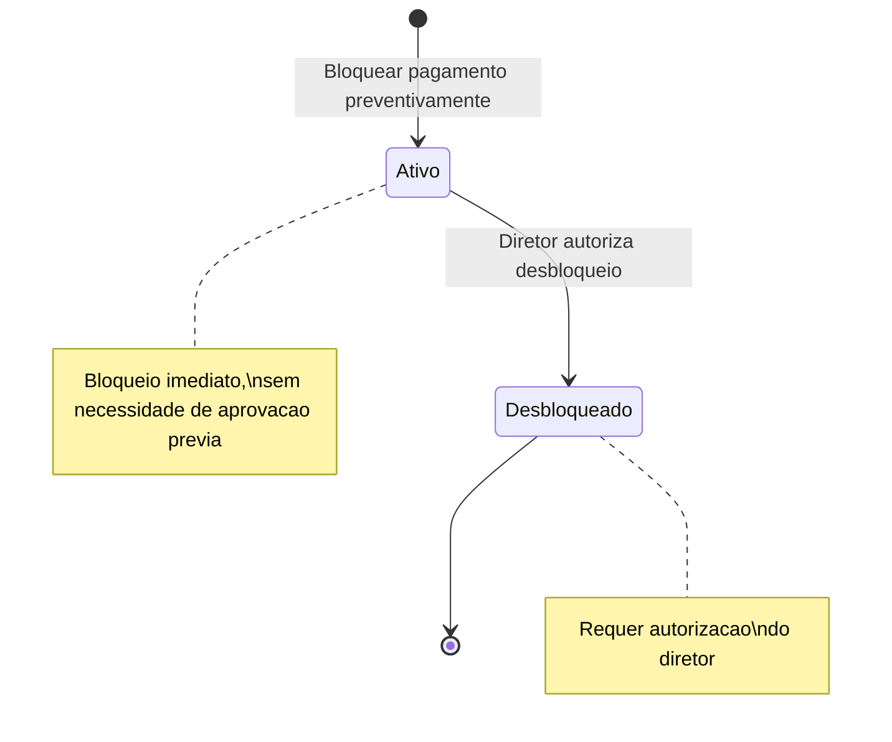
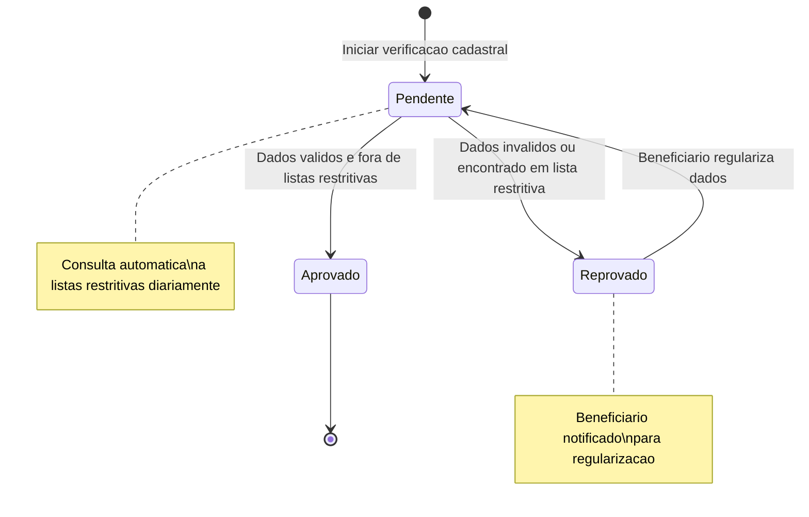

# Modelo Comportamental

Dominio e regras de negocio: ver [README.md](README.md)

### Ciclo de Vida: AlertaPLD

```mermaid
stateDiagram-v2
    [*] --> Gerado : Monitoramento detecta operacao atipica

    Gerado --> EmAnalise : Oficial de compliance inicia analise

    EmAnalise --> Confirmado : Analise confirma suspeita
    EmAnalise --> Descartado : Analise descarta suspeita

    Confirmado --> Reportado : Gerar reporte ao COAF

    Descartado --> [*]
    Reportado --> [*]

    state Gerado : Alerta criado, aguardando analise (prazo 48h)
    state EmAnalise : Oficial de compliance analisando
    state Confirmado : Suspeita confirmada, aguardando reporte
    state Descartado : Suspeita descartada com justificativa
    state Reportado : Reporte enviado ao COAF

    note right of Gerado : Alerta pode gerar\nbloqueio preventivo imediato
    note right of Confirmado : Bloqueio de pagamento\nmantido ate resolucao
    note right of Descartado : Justificativa obrigatoria\nregistrada na trilha de auditoria
```

### Ciclo de Vida: BloqueioPagamento

```mermaid
stateDiagram-v2
    [*] --> Ativo : Bloquear pagamento preventivamente

    Ativo --> Desbloqueado : Diretor autoriza desbloqueio

    Desbloqueado --> [*]

    state Ativo : Pagamento bloqueado, nao pode ser processado
    state Desbloqueado : Bloqueio removido, pagamento liberado

    note right of Ativo : Bloqueio imediato,\nsem necessidade de aprovacao previa
    note right of Desbloqueado : Requer autorizacao\ndo diretor
```

### Ciclo de Vida: VerificacaoKYC

```mermaid
stateDiagram-v2
    [*] --> Pendente : Iniciar verificacao cadastral

    Pendente --> Aprovado : Dados validos e fora de listas restritivas
    Pendente --> Reprovado : Dados invalidos ou encontrado em lista restritiva

    Reprovado --> Pendente : Beneficiario regulariza dados

    Aprovado --> [*]

    state Pendente : Verificacao em andamento
    state Aprovado : Beneficiario apto a receber pagamentos
    state Reprovado : Beneficiario impedido de receber pagamentos

    note right of Pendente : Consulta automatica\na listas restritivas diariamente
    note right of Reprovado : Beneficiario notificado\npara regularizacao
```
